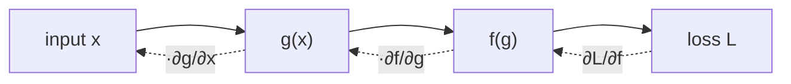

[📖 All chapters](../ai-ml-encyclopedia.html)  &nbsp;|&nbsp;  [← 01 · 🌐 The Landscape of AI](ch01.html)  &nbsp;|&nbsp;  [03 · 🔄 The Machine Learning Process →](ch03.html)

<details class="ig-jump">
<summary>📚 Jump to any chapter</summary>
<p class="ig-era">🌐 Foundations</p>
<ul>
<li><a href="ch01.html">01 &middot; 🌐 The Landscape of AI</a></li>
<li><a href="ch02.html">02 &middot; 🧮 Mathematics for Machine Learning</a></li>
<li><a href="ch03.html">03 &middot; 🔄 The Machine Learning Process</a></li>
<li><a href="ch04.html">04 &middot; 🧹 Data Preprocessing & Feature Engineering</a></li>
</ul>
<p class="ig-era">🧩 Classical Machine Learning</p>
<ul>
<li><a href="ch05.html">05 &middot; 📈 Linear & Logistic Models</a></li>
<li><a href="ch06.html">06 &middot; 📍 Instance-Based & Probabilistic Classifiers</a></li>
<li><a href="ch07.html">07 &middot; 🛡️ Support Vector Machines & Kernels</a></li>
<li><a href="ch08.html">08 &middot; 🌳 Decision Trees & Ensemble Learning</a></li>
<li><a href="ch09.html">09 &middot; 🔮 Clustering & Unsupervised Learning</a></li>
<li><a href="ch10.html">10 &middot; 🗜️ Dimensionality Reduction & Manifold Learning</a></li>
<li><a href="ch11.html">11 &middot; 🎯 Model Evaluation, Validation & Selection</a></li>
</ul>
<p class="ig-era">🎲 Probabilistic & Statistical ML</p>
<ul>
<li><a href="ch12.html">12 &middot; 🎲 Bayesian Machine Learning</a></li>
<li><a href="ch13.html">13 &middot; 🕸️ Probabilistic Graphical Models</a></li>
</ul>
<p class="ig-era">🧠 Deep Learning</p>
<ul>
<li><a href="ch14.html">14 &middot; 🧠 Neural Network Fundamentals</a></li>
<li><a href="ch15.html">15 &middot; ⚙️ Training Deep Neural Networks</a></li>
<li><a href="ch16.html">16 &middot; 🖼️ Convolutional Neural Networks</a></li>
<li><a href="ch17.html">17 &middot; 🔁 Recurrent & Sequence Models</a></li>
<li><a href="ch18.html">18 &middot; ⚡ Attention & Transformers</a></li>
<li><a href="ch19.html">19 &middot; 🪞 Autoencoders & Self-Supervised Learning</a></li>
<li><a href="ch20.html">20 &middot; 🎨 Generative Models: GANs, VAEs & Flows</a></li>
<li><a href="ch21.html">21 &middot; 🌫️ Diffusion Models</a></li>
<li><a href="ch22.html">22 &middot; 🔗 Graph Neural Networks</a></li>
</ul>
<p class="ig-era">🕹️ Reinforcement Learning</p>
<ul>
<li><a href="ch23.html">23 &middot; 🕹️ Reinforcement Learning Foundations</a></li>
<li><a href="ch24.html">24 &middot; 🎰 Model-Free Reinforcement Learning</a></li>
<li><a href="ch25.html">25 &middot; 🤖 Deep Reinforcement Learning</a></li>
<li><a href="ch26.html">26 &middot; ♟️ Multi-Agent RL & Game Theory</a></li>
</ul>
<p class="ig-era">🗣️ Language, Vision & Modalities</p>
<ul>
<li><a href="ch27.html">27 &middot; 👁️ Computer Vision</a></li>
<li><a href="ch28.html">28 &middot; 💬 Natural Language Processing</a></li>
<li><a href="ch29.html">29 &middot; 🔊 Speech & Audio Processing</a></li>
<li><a href="ch30.html">30 &middot; 📚 Large Language Models</a></li>
<li><a href="ch31.html">31 &middot; 🎚️ Prompting, Fine-Tuning & Alignment</a></li>
<li><a href="ch32.html">32 &middot; 🔎 Retrieval-Augmented Generation & Vector Search</a></li>
<li><a href="ch33.html">33 &middot; 🦾 AI Agents & Tool Use</a></li>
<li><a href="ch34.html">34 &middot; 🌈 Multimodal AI</a></li>
</ul>
<p class="ig-era">🛠️ Applied ML Systems</p>
<ul>
<li><a href="ch35.html">35 &middot; 🛒 Recommender Systems</a></li>
<li><a href="ch36.html">36 &middot; ⏳ Time Series Analysis & Forecasting</a></li>
<li><a href="ch37.html">37 &middot; 🚨 Anomaly Detection</a></li>
</ul>
<p class="ig-era">📚 Classical & Symbolic AI</p>
<ul>
<li><a href="ch38.html">38 &middot; 🧭 Search & Problem Solving</a></li>
<li><a href="ch39.html">39 &middot; 📖 Knowledge Representation & Reasoning</a></li>
<li><a href="ch40.html">40 &middot; 🗺️ Planning, Constraint Satisfaction & Game Playing</a></li>
<li><a href="ch41.html">41 &middot; 🧬 Evolutionary Computation & Metaheuristics</a></li>
</ul>
<p class="ig-era">🚀 Production, Responsibility & Frontier</p>
<ul>
<li><a href="ch42.html">42 &middot; 🔧 MLOps & LLMOps</a></li>
<li><a href="ch43.html">43 &middot; 🚀 AI Infrastructure & Efficient Inference</a></li>
<li><a href="ch44.html">44 &middot; 🔍 Explainable AI & Interpretability</a></li>
<li><a href="ch45.html">45 &middot; 🧷 Causal Inference & Causal ML</a></li>
<li><a href="ch46.html">46 &middot; ⚖️ AI Ethics, Fairness, Safety & Governance</a></li>
<li><a href="ch47.html">47 &middot; 🌠 Frontier & Emerging Directions</a></li>
</ul>
</details>

------------------------------------------------------------------------

Machine learning is, at bottom, applied mathematics: a model is a function with knobs, training is an optimization problem, and prediction is arithmetic on numbers we hope generalize. This chapter is the toolkit every later chapter leans on — just enough linear algebra, calculus, probability, and information theory to read a paper, debug a loss, and understand why an algorithm works rather than merely that it does. It sits at the foundation of AI/ML: nothing here is a model, but every model is built from these pieces.

::: {.callout-note appearance="simple"}
🧭 **In context:** Foundations of AI/ML · the shared vocabulary and machinery behind every algorithm in the book · the one key idea: data becomes vectors, models become functions, and learning becomes optimization under uncertainty.
:::

## 2.1 — Vectors, matrices, and tensors

Almost everything in ML starts by turning the world into numbers arranged in a grid. A single example — a customer, an image, a sentence — becomes a **vector**, an ordered list of numbers $\mathbf{x} = [x_1, x_2, \dots, x_n]$ living in $n$-dimensional space $\mathbb{R}^n$. A whole dataset of $m$ examples becomes a **matrix** $X \in \mathbb{R}^{m \times n}$: one row per example, one column per feature. Stack matrices (a batch of color images, each with height, width, and channels) and you get a **tensor**, the general term for an array with any number of axes. Scalars, vectors, and matrices are just tensors with 0, 1, and 2 axes.

The geometric picture is worth holding onto: a vector is an arrow from the origin, and its **dimension** is the number of independent directions you need to describe it. A 768-dimensional embedding is a point in a space we cannot visualize, but the same rules — length, angle, distance — still apply.

Two operations matter constantly. **Element-wise** operations (add two vectors, multiply by a scalar) act position by position. **Broadcasting** is the convention, baked into NumPy and every deep-learning framework, that automatically stretches a smaller array to match a larger one's shape — adding a length-$n$ bias vector to every row of an $m \times n$ matrix, for instance — without copying data.

```python
import numpy as np
X = np.array([[1., 2., 3.],
              [4., 5., 6.]])   # 2 examples, 3 features
b = np.array([10., 20., 30.])  # one bias per feature
print(X + b)                   # broadcast b across both rows
# [[11. 22. 33.]
#  [14. 25. 36.]]
```

The picture below shows the ladder from scalar to tensor — each step adds an axis.

<svg viewBox="0 0 460 110" xmlns="http://www.w3.org/2000/svg" font-size="10">
  <rect x="10" y="45" width="18" height="18" fill="none" stroke="currentColor"/>
  <text x="6" y="80">scalar (0)</text>
  <g stroke="currentColor" fill="none">
    <rect x="110" y="27" width="18" height="18"/>
    <rect x="110" y="45" width="18" height="18"/>
    <rect x="110" y="63" width="18" height="18"/>
  </g>
  <text x="96" y="95">vector (1)</text>
  <g stroke="currentColor" fill="none">
    <rect x="210" y="27" width="18" height="18"/><rect x="228" y="27" width="18" height="18"/><rect x="246" y="27" width="18" height="18"/>
    <rect x="210" y="45" width="18" height="18"/><rect x="228" y="45" width="18" height="18"/><rect x="246" y="45" width="18" height="18"/>
    <rect x="210" y="63" width="18" height="18"/><rect x="228" y="63" width="18" height="18"/><rect x="246" y="63" width="18" height="18"/>
  </g>
  <text x="208" y="95">matrix (2)</text>
  <g stroke="currentColor" fill="none">
    <rect x="350" y="20" width="50" height="50"/>
    <rect x="365" y="35" width="50" height="50"/>
    <line x1="350" y1="20" x2="365" y2="35"/><line x1="400" y1="20" x2="415" y2="35"/>
    <line x1="350" y1="70" x2="365" y2="85"/><line x1="400" y1="70" x2="415" y2="85"/>
  </g>
  <text x="352" y="100">tensor (3+)</text>
</svg>

::: {.callout-tip}
Get in the habit of tracking **shapes**. The vast majority of deep-learning bugs are shape mismatches, and writing the expected shape as a comment next to each line catches them before they become a cryptic stack trace.
:::

## 2.2 — Dot products, matrix multiplication, and norms

The **dot product** is the single most reused operation in ML. For two vectors of equal length it multiplies them position by position and sums: $\mathbf{a} \cdot \mathbf{b} = \sum_i a_i b_i$. Its meaning is geometric: $\mathbf{a} \cdot \mathbf{b} = \lVert\mathbf{a}\rVert\,\lVert\mathbf{b}\rVert\cos\theta$, where $\theta$ is the angle between the vectors. So the dot product measures *alignment* — large and positive when vectors point the same way, zero when they are perpendicular, negative when opposed. A linear model's prediction $\mathbf{w}\cdot\mathbf{x}$ is exactly "how much does this input align with the learned weight direction," and the **cosine similarity** at the heart of vector search is just the dot product after normalizing both vectors to unit length.

**Matrix multiplication** is dot products in bulk. The product $C = AB$ has entry $C_{ij}$ equal to the dot product of row $i$ of $A$ with column $j$ of $B$. This is why the inner dimensions must match — $A \in \mathbb{R}^{m\times k}$ times $B \in \mathbb{R}^{k\times n}$ gives $C \in \mathbb{R}^{m\times n}$ — and why a layer of a neural network, which multiplies a batch of inputs by a weight matrix, is a single matmul that GPUs execute extraordinarily fast.

A **norm** measures the size of a vector. The **L2 (Euclidean) norm** $\lVert\mathbf{x}\rVert_2 = \sqrt{\sum_i x_i^2}$ is ordinary length; the **L1 norm** $\lVert\mathbf{x}\rVert_1 = \sum_i |x_i|$ sums absolute values. They show up everywhere as regularizers — L2 shrinks weights smoothly, L1 drives them to exactly zero (sparsity) — and as distance measures once you apply them to a difference $\mathbf{a}-\mathbf{b}$.

<svg viewBox="0 0 220 140" xmlns="http://www.w3.org/2000/svg" font-size="11">
  <line x1="20" y1="120" x2="200" y2="120" stroke="currentColor" stroke-width="1"/>
  <line x1="20" y1="120" x2="20" y2="10" stroke="currentColor" stroke-width="1"/>
  <line x1="20" y1="120" x2="150" y2="40" stroke="currentColor" stroke-width="2"/>
  <line x1="20" y1="120" x2="120" y2="110" stroke="currentColor" stroke-width="2"/>
  <path d="M 60 120 A 40 40 0 0 0 52 95" fill="none" stroke="currentColor" stroke-width="1"/>
  <text x="155" y="38">a</text>
  <text x="125" y="112">b</text>
  <text x="62" y="100">θ</text>
</svg>

```python
a = np.array([2., 1.]); b = np.array([1., 3.])
dot = a @ b                          # 2*1 + 1*3 = 5
cos = dot / (np.linalg.norm(a) * np.linalg.norm(b))
print(dot, round(cos, 3))            # 5.0  0.707
```

::: {.callout-tip}
When you need *similarity* and the magnitude of the vectors is an artifact (longer documents, brighter images), reach for **cosine similarity**, not the raw dot product — it compares direction alone and ignores length.
:::

## 2.3 — Eigenvectors, eigenvalues, and the SVD

Some directions are special to a matrix. When a matrix $A$ acts on a vector by multiplication, it generally rotates *and* stretches it — but an **eigenvector** $\mathbf{v}$ is a direction that only gets stretched, never rotated: $A\mathbf{v} = \lambda\mathbf{v}$. The scalar $\lambda$ is its **eigenvalue**, the stretch factor along that direction. Eigenvectors are the natural axes of the transformation; they reveal what a matrix "really does" underneath the coordinate system you happened to write it in.

This matters in ML because the **covariance matrix** of a dataset has eigenvectors pointing along the directions of greatest variance, and their eigenvalues say how much variance each captures. That is precisely the machinery of Principal Component Analysis (Chapter 10): keep the few eigenvectors with the largest eigenvalues and you have compressed the data while losing the least information.

The **Singular Value Decomposition (SVD)** generalizes this to *any* matrix, even non-square ones. It factors $A = U\Sigma V^\top$, where $U$ and $V$ are orthogonal (pure rotations) and $\Sigma$ is diagonal with non-negative **singular values** $\sigma_1 \ge \sigma_2 \ge \dots$ on its diagonal. The reading is clean: every linear map is a rotation, then an axis-aligned scaling, then another rotation. Truncating to the top $k$ singular values gives the best possible rank-$k$ approximation of the matrix — the foundation of low-rank compression, latent-factor recommenders, and the LoRA fine-tuning trick (Chapter 31).

| Tool | Works on | Gives you | Typical ML use |
|------|----------|-----------|----------------|
| Eigendecomposition | square (often symmetric) matrices | eigenvectors + eigenvalues | PCA, spectral methods, stability analysis |
| SVD | any $m\times n$ matrix | $U$, singular values, $V$ | low-rank approximation, denoising, latent factors |

```python
A = np.array([[2., 0.],
              [0., 3.]])              # stretches x by 2, y by 3
vals, vecs = np.linalg.eig(A)
print(vals)                           # [2. 3.] — the stretch factors
# the standard axes are already the eigenvectors here
```

::: {.callout-warning}
Eigendecomposition is only guaranteed to behave nicely (real eigenvalues, orthogonal eigenvectors) for **symmetric** matrices. For general matrices, reach for the SVD — it always exists and is numerically stable, whereas a raw eigendecomposition can be neither.
:::

## 2.4 — Derivatives, gradients, and the chain rule

Training a model means asking: if I nudge a parameter, does the error go up or down, and how fast? That sensitivity is a **derivative**. For a single-variable function $f(x)$, the derivative $f'(x) = \frac{df}{dx}$ is the slope of the curve — the rate of change at a point. Formally it is the limit of the rise over the run as the run shrinks to nothing:

$$f'(x) = \lim_{h \to 0} \frac{f(x+h) - f(x)}{h}$$

Models have millions of parameters, so we need the multivariable version. The **gradient** $\nabla f$ collects the **partial derivatives** with respect to every input into one vector: $\nabla f = \left[\frac{\partial f}{\partial x_1}, \dots, \frac{\partial f}{\partial x_n}\right]$. A partial derivative just asks the single-variable question one variable at a time, holding the others fixed. The gradient's defining property is the one to memorize: **the gradient points in the direction of steepest increase** of $f$, and its negative points in the direction of steepest decrease. That single fact is the engine of all of deep learning — to reduce a loss, step against its gradient.

The **chain rule** is how gradients flow through composed functions. If $y = f(g(x))$, then $\frac{dy}{dx} = f'(g(x)) \cdot g'(x)$ — you multiply the local rates of change. The intuition: if $g$ moves twice as fast as $x$ and $f$ moves three times as fast as $g$, then $f$ moves six times as fast as $x$. A neural network is just a deep composition of functions (layer after layer), so its gradient is a long product of per-layer derivatives. Computing that product efficiently, from the output backward, *is* **backpropagation** (Chapters 14–15). Understanding the chain rule is understanding why a network can be trained at all.



The dashed path is the chain rule in action: the gradient of the loss with respect to an early variable is the product of the local derivatives along the way back.

## 2.5 — Gradient descent and optimization

Put the gradient to work and you get the workhorse algorithm of modern ML. **Gradient descent** starts at some guess for the parameters $\theta$ and repeatedly steps downhill:

$$\theta_{t+1} = \theta_t - \eta\,\nabla L(\theta_t)$$

Here $L$ is the loss (how wrong the model is) and $\eta$ is the **learning rate**, the step size. Think of a hiker in fog trying to reach the valley floor: they can't see far, but they can feel which way the ground slopes and take a step that way. Repeat, and they descend.

Three practical variants differ in how much data they use per step:

- **Batch** gradient descent uses the whole dataset for one exact, expensive step.
- **Stochastic** gradient descent (SGD) uses a single random example — noisy but cheap and fast.
- **Mini-batch** SGD, the universal default, uses a small batch (say 32–512 examples), trading a little noise for far better hardware utilization.

The noise of the smaller batches is not purely a cost: it can help the optimizer escape shallow bad spots rather than settling into the first dip it finds.

```python
def gradient_descent(grad_fn, theta, lr=0.1, steps=100):
    for _ in range(steps):
        theta = theta - lr * grad_fn(theta)   # step against the gradient
    return theta

# minimize f(x) = (x-3)^2, whose gradient is 2(x-3); should converge to 3
g = lambda x: 2 * (x - 3)
print(round(gradient_descent(g, theta=0.0), 4))   # ~3.0
```

The learning rate is the parameter you will tune most. Too small and training crawls; too large and the steps overshoot the valley and the loss diverges. Real-world optimizers like **Adam** improve on plain SGD by adapting the effective step size per parameter and adding **momentum** (a running average of past gradients that smooths the path and powers through flat regions), but every one of them is still, at heart, "follow the negative gradient."

::: {.callout-warning}
Gradient descent finds a **local** minimum, not necessarily the global one. For the convex losses of linear and logistic regression there is only one minimum so this is moot, but for deep networks the landscape is riddled with them. In practice good local minima are usually good enough — but never assume your loss has converged to *the* best solution.
:::

## 2.6 — Probability and distributions

Machine learning lives with uncertainty: noisy measurements, ambiguous inputs, predictions that should come with confidence. **Probability** is the language for it. A **random variable** is a quantity whose value is uncertain, and a **distribution** assigns probabilities to its possible values. For discrete outcomes (a coin, a class label) we use a **probability mass function**; for continuous quantities (a height, a pixel intensity) a **probability density function**, which integrates to 1.

A few distributions recur constantly. The **Bernoulli** models a single yes/no event with probability $p$ — exactly what a binary classifier outputs. The **categorical** extends it to $k$ classes and is what a softmax layer produces. The **Gaussian (normal)** distribution, with its bell curve parameterized by mean $\mu$ and variance $\sigma^2$, is the default model for continuous noise and the assumption behind least-squares regression.

Two summaries describe a distribution's shape. The **expectation** (mean) $\mathbb{E}[X] = \sum_x x\,P(x)$ is its center of mass — the long-run average. The **variance** $\mathrm{Var}(X) = \mathbb{E}[(X - \mathbb{E}[X])^2]$ measures spread; its square root, the **standard deviation**, is in the same units as $X$ and is what you usually report.

```python
rng = np.random.default_rng(0)
samples = rng.normal(loc=5.0, scale=2.0, size=100_000)  # Gaussian, mean 5, std 2
print(round(samples.mean(), 2), round(samples.std(), 2))  # ~5.0  ~2.0
```

The **Central Limit Theorem (CLT)** explains why the Gaussian is everywhere: the average of many independent random variables tends toward a Gaussian, regardless of each variable's own distribution. This is why measurement noise, summed from countless small causes, so often looks bell-shaped — and why so much of statistics can assume normality and still work.

::: {.callout-tip}
When a quantity is the sum or average of many small, roughly independent effects, expect it to look Gaussian even if the parts are not. That is the CLT giving you a free modeling assumption — use it, but check it on data with heavy tails, where it breaks.
:::

## 2.7 — Bayes, MLE, and MAP

How should a belief change when evidence arrives? **Bayes' theorem** answers exactly that, and it is one short equation:

$$P(H \mid D) = \frac{P(D \mid H)\,P(H)}{P(D)}$$

Read it as: the **posterior** $P(H\mid D)$ — how much you believe hypothesis $H$ after seeing data $D$ — equals the **likelihood** $P(D\mid H)$ (how well $H$ explains the data) times the **prior** $P(H)$ (what you believed beforehand), normalized by the evidence $P(D)$. The classic gut-check: a test that is 99% accurate for a disease affecting 1 in 10,000 people still yields a mostly-wrong positive, because the tiny prior overwhelms the strong likelihood. Bayes forces you to account for the base rate.

This gives two recipes for fitting a model's parameters $\theta$. **Maximum Likelihood Estimation (MLE)** picks the $\theta$ that makes the observed data most probable — it maximizes $P(D\mid\theta)$ and ignores any prior. **Maximum A Posteriori (MAP)** maximizes the posterior $P(\theta\mid D) \propto P(D\mid\theta)\,P(\theta)$, folding in a prior belief about $\theta$.

The connection to everyday ML is direct and worth internalizing: minimizing squared error *is* MLE under a Gaussian-noise assumption, and adding L2 weight regularization *is* MAP with a Gaussian prior on the weights. So the regularizers of Section 2.2 are not arbitrary penalties — they are priors in disguise. In practice we maximize the **log**-likelihood, since logs turn fragile products of many small probabilities into stable sums, and a sum is far friendlier to a gradient. The fuller treatment lives in Chapter 12.

::: {.callout-warning}
A high-accuracy classifier on a rare class can still be wrong most of the time it fires positive — the base-rate fallacy. Always reason about the **prior** (the class's prevalence), not the likelihood (the test's accuracy) alone.
:::

## 2.8 — Information theory: entropy, cross-entropy, and KL

Information theory measures uncertainty in **bits** and gives us the loss function most classifiers actually train on. The starting point is **entropy**: how surprised should you expect to be by a random variable's outcome?

$$H(p) = -\sum_x p(x)\log p(x)$$

A fair coin has maximal entropy (1 bit — you genuinely cannot predict it); a two-headed coin has zero (no surprise possible). Rare events carry more information than common ones, which is why the $-\log p$ weighting appears: surprise scales with how unlikely an outcome was.

**Cross-entropy** measures the cost of using the wrong distribution. If the truth is $p$ but your model predicts $q$, the cross-entropy $H(p, q) = -\sum_x p(x)\log q(x)$ is the expected surprise you incur. This is *the* loss function for classification: the true label is a one-hot $p$, the model outputs probabilities $q$, and minimizing cross-entropy pushes $q$ toward $p$. Because the true distribution puts all its mass on one class, the loss collapses to $-\log q(\text{correct class})$ — penalize the model by the negative log of the probability it assigned to the right answer.

**KL divergence** is the gap between cross-entropy and the irreducible entropy of $p$ itself:

$$D_{\mathrm{KL}}(p \parallel q) = \sum_x p(x)\log\frac{p(x)}{q(x)} = H(p, q) - H(p)$$

It quantifies how far $q$ is from $p$ as a distribution — always $\ge 0$, and zero only when they match. Since $H(p)$ is fixed by the data, minimizing cross-entropy and minimizing KL are the same optimization. KL is the regularizer in variational autoencoders (Chapter 20), the constraint in policy-gradient RL (Chapter 25), and the objective in model distillation.

```python
def cross_entropy(p, q, eps=1e-12):
    q = np.clip(q, eps, 1.0)              # avoid log(0)
    return -np.sum(p * np.log(q))

p = np.array([0., 1., 0.])               # true class = index 1
print(round(cross_entropy(p, [0.1, 0.8, 0.1]), 3))   # 0.223 — confident & right
print(round(cross_entropy(p, [0.4, 0.3, 0.3]), 3))   # 1.204 — unsure, higher loss
```

::: {.callout-warning}
KL divergence is **not** a distance: $D_{\mathrm{KL}}(p\parallel q) \neq D_{\mathrm{KL}}(q\parallel p)$ in general. The order matters and encodes a real modeling choice — "mean-seeking" versus "mode-seeking" behavior — so never assume you can swap the arguments.
:::

## 2.9 — Key takeaways

- **Data is tensors, models are functions, learning is optimization under uncertainty** — that triad is the whole chapter in one line.
- The **dot product** measures alignment and underlies linear models, similarity search, and every matmul in a neural net; **norms** measure size and double as regularizers and distances.
- **Eigenvectors/SVD** expose a matrix's natural axes and enable low-rank compression (PCA, LoRA, latent factors).
- The **gradient** points uphill; **gradient descent** steps against it, and the **chain rule** carries gradients through deep compositions (backpropagation).
- The **learning rate** is the knob that most often decides whether training converges, crawls, or diverges.
- **Bayes** updates belief with evidence; **MLE** ignores the prior, **MAP** includes it — and squared-error/L2-regularization are these in disguise under Gaussian assumptions.
- **Cross-entropy** is the standard classification loss; minimizing it equals minimizing **KL divergence** from the true distribution, since entropy is fixed.

## 2.10 — See also

- **Chapter 03 — The Machine Learning Process** — how these pieces assemble into a train/validate/test workflow.
- **Chapter 05 — Linear & Logistic Models** — the first models built directly from dot products, gradients, and MLE.
- **Chapter 10 — Dimensionality Reduction & Manifold Learning** — eigenvectors and SVD applied as PCA.
- **Chapter 12 — Bayesian Machine Learning** — priors, posteriors, MLE/MAP developed in full.
- **Chapter 14 — Neural Network Fundamentals** and **Chapter 15 — Training Deep Neural Networks** — the chain rule scaled up into backpropagation and modern optimizers.

------------------------------------------------------------------------

[📖 All chapters](../ai-ml-encyclopedia.html)  &nbsp;|&nbsp;  [← 01 · 🌐 The Landscape of AI](ch01.html)  &nbsp;|&nbsp;  [03 · 🔄 The Machine Learning Process →](ch03.html)
