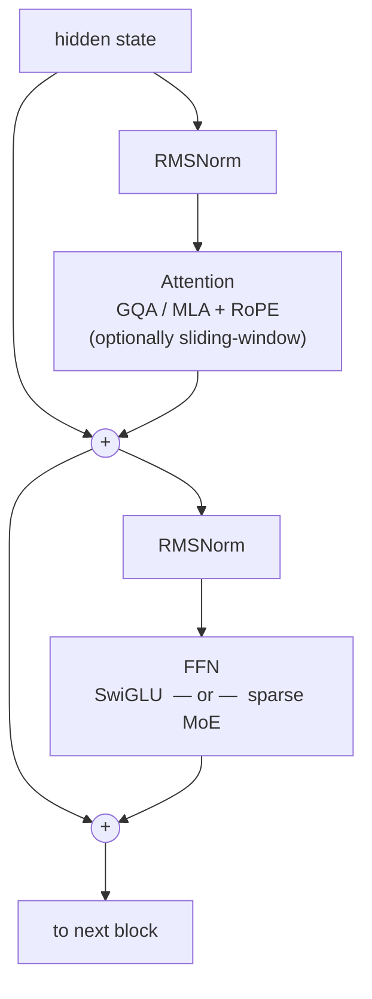

[📖 All chapters](../ai-ml-encyclopedia.html)  &nbsp;|&nbsp;  [← 22 · ⏳ Time Series & Forecasting](ch22.html)  &nbsp;|&nbsp;  [24 · 🌈 Multimodal AI →](ch24.html)

<details class="ig-jump">
<summary>📚 Jump to any chapter</summary>
<p class="ig-era">🧮 Mathematical Foundations</p>
<ul>
<li><a href="ch01.html">01 &middot; 🧮 Linear Algebra</a></li>
<li><a href="ch02.html">02 &middot; ∂ Calculus & Differentiation</a></li>
<li><a href="ch03.html">03 &middot; 📉 Optimization</a></li>
<li><a href="ch04.html">04 &middot; 🎲 Probability & Statistics</a></li>
</ul>
<p class="ig-era">🧭 The ML Workflow</p>
<ul>
<li><a href="ch05.html">05 &middot; 🌐 AI, ML & the Learning Process</a></li>
<li><a href="ch06.html">06 &middot; 🧹 Data Preprocessing</a></li>
<li><a href="ch07.html">07 &middot; 🗜️ Dimensionality Reduction</a></li>
</ul>
<p class="ig-era">🧩 Classical Machine Learning</p>
<ul>
<li><a href="ch08.html">08 &middot; 📈 Regression</a></li>
<li><a href="ch09.html">09 &middot; 📐 Classification Algorithms</a></li>
<li><a href="ch10.html">10 &middot; 🌳 Ensemble Methods</a></li>
<li><a href="ch11.html">11 &middot; 🔮 Clustering & Unsupervised Learning</a></li>
<li><a href="ch12.html">12 &middot; 🎯 Model Evaluation & Tuning</a></li>
</ul>
<p class="ig-era">🎲 Probabilistic Models</p>
<ul>
<li><a href="ch13.html">13 &middot; 🕸️ Probabilistic Graphical Models</a></li>
</ul>
<p class="ig-era">🧠 Deep Learning</p>
<ul>
<li><a href="ch14.html">14 &middot; 🧠 Neural Networks (Core)</a></li>
<li><a href="ch15.html">15 &middot; 🖼️ Convolutional Neural Networks</a></li>
<li><a href="ch16.html">16 &middot; 🔁 Recurrent & Sequence Models</a></li>
<li><a href="ch17.html">17 &middot; ⚡ Attention & Transformers</a></li>
<li><a href="ch18.html">18 &middot; 🎨 Generative Models</a></li>
</ul>
<p class="ig-era">🗣️ Applied AI: Vision, Language, Audio & Time</p>
<ul>
<li><a href="ch19.html">19 &middot; 👁️ Computer Vision</a></li>
<li><a href="ch20.html">20 &middot; 💬 Natural Language Processing</a></li>
<li><a href="ch21.html">21 &middot; 🔊 Speech & Audio Processing</a></li>
<li><a href="ch22.html">22 &middot; ⏳ Time Series & Forecasting</a></li>
<li><a href="ch23.html">23 &middot; 📚 Large Language Models</a></li>
<li><a href="ch24.html">24 &middot; 🌈 Multimodal AI</a></li>
</ul>
<p class="ig-era">🕹️ Reinforcement Learning</p>
<ul>
<li><a href="ch25.html">25 &middot; 🕹️ Reinforcement Learning</a></li>
</ul>
<p class="ig-era">🛠️ Applied ML Systems & Industries</p>
<ul>
<li><a href="ch26.html">26 &middot; 🛒 Recommender Systems</a></li>
<li><a href="ch27.html">27 &middot; 🚨 Anomaly & Fraud Detection</a></li>
<li><a href="ch28.html">28 &middot; 🏦 ML Across Industries</a></li>
</ul>
<p class="ig-era">🚀 Production, Tooling & Infrastructure</p>
<ul>
<li><a href="ch29.html">29 &middot; 🔧 MLOps & Deployment</a></li>
<li><a href="ch30.html">30 &middot; 🚀 AI Infrastructure & Efficient Inference</a></li>
<li><a href="ch31.html">31 &middot; 🧰 Tools & Frameworks</a></li>
</ul>
<p class="ig-era">📚 Classical & Symbolic AI</p>
<ul>
<li><a href="ch32.html">32 &middot; 🧭 Search & Problem Solving</a></li>
<li><a href="ch33.html">33 &middot; 📖 Knowledge Representation & Reasoning</a></li>
<li><a href="ch34.html">34 &middot; 🗺️ Planning, Constraint Satisfaction & Game Playing</a></li>
<li><a href="ch35.html">35 &middot; 🧬 Evolutionary Computation & Metaheuristics</a></li>
</ul>
<p class="ig-era">⚖️ Responsible AI & Frontier</p>
<ul>
<li><a href="ch36.html">36 &middot; 🔍 Explainable AI & Interpretability</a></li>
<li><a href="ch37.html">37 &middot; 🧷 Causal Inference</a></li>
<li><a href="ch38.html">38 &middot; ⚖️ AI Ethics, Fairness & Safety</a></li>
<li><a href="ch39.html">39 &middot; 🌠 Frontier & Emerging Directions</a></li>
</ul>
<p class="ig-era">🎓 Advanced & Specialized Topics</p>
<ul>
<li><a href="ch40.html">40 &middot; 🔗 Graph Machine Learning</a></li>
<li><a href="ch41.html">41 &middot; 🤖 Robotics & Autonomy</a></li>
<li><a href="ch42.html">42 &middot; 📐 Learning Theory</a></li>
<li><a href="ch43.html">43 &middot; 🔎 Information Retrieval & Data Mining</a></li>
<li><a href="ch44.html">44 &middot; 🏗️ LLM Systems: Building LLMs from Scratch</a></li>
</ul>
<p class="ig-era">🎚️ Post-Training & Fine-Tuning</p>
<ul>
<li><a href="ch45.html">45 &middot; 🎚️ Post-Training I — Transfer, Fine-Tuning & PEFT</a></li>
<li><a href="ch46.html">46 &middot; 🏅 Post-Training II — Alignment & Evaluation</a></li>
</ul>
<p class="ig-era">🚢 Model Serving & Deployment</p>
<ul>
<li><a href="ch47.html">47 &middot; 🚢 Model Serving & Deployment in Production</a></li>
</ul>
</details>

------------------------------------------------------------------------

Large Language Models (LLMs) are neural networks trained on enormous text corpora to predict the next token, and in doing so they absorb a startling amount of grammar, facts, reasoning patterns, and style. They are the engine behind ChatGPT, Claude, Gemini, and the wave of AI assistants — and they are, at heart, a single architecture (the Transformer) scaled up and wrapped in a pipeline of pretraining, fine-tuning, alignment, retrieval, and inference tricks. This chapter is the practitioner's map of that whole stack: what an LLM is, how it is built, and how it is deployed.

::: {.callout-note appearance="simple"}
🧭 **In context:** Applied AI, built on the Transformer (Ch. 17) · used for text generation, reasoning, coding, agents, and conversational assistants · the one key idea: *scale a next-token predictor far enough and general-purpose language ability emerges, then steer it with fine-tuning, prompting, retrieval, and alignment.*
:::

> 💡 **Remember this:** an LLM is just one architecture — a decoder-only Transformer trained to predict the next token — scaled up and then steered by a pipeline of pretraining, fine-tuning, prompting, retrieval, and alignment.

## 23.1 — Transformer-based LLMs

An **LLM** is a [Transformer](ch17.html) (Chapter 17) with billions of parameters, trained on trillions of tokens. The architecture barely changes from the textbook Transformer; what changes is *scale* and *which half of the encoder-decoder you keep*. To understand any LLM, it helps to hold three ideas at once: the **shape** of the network (which attention pattern it uses), the **units** it reads and writes (tokens), and the **law** that governs how good it gets as you grow it (scaling).

**Decoder-only (GPT-style) vs encoder-only (BERT-style).** The original Transformer had an encoder (reads the whole input at once, bidirectional) and a decoder (generates left-to-right, causal). Modern LLMs split along this seam:

- A **decoder-only** model (GPT, Llama, Claude, Mistral) uses **causal attention**: each token can attend only to tokens *before* it. This makes it a natural *generator* — feed it a prefix, it predicts the next token, append, repeat. Almost all chat and generation LLMs are decoder-only.
- An **encoder-only** model (BERT, RoBERTa) uses **bidirectional attention**: every token sees every other token. It cannot generate fluently, but it produces excellent *representations* for classification, retrieval, and embeddings. It is trained by **masked language modeling** (hide 15% of tokens, predict them) — the embeddings it produces power most [classification](ch09.html) and [retrieval](ch43.html) pipelines.

```{mermaid}
flowchart LR
  subgraph Encoder["Encoder-only (BERT)"]
    direction TB
    E1["The [MASK] sat"] --> E2["bidirectional<br/>attention"] --> E3["fill: cat"]
  end
  subgraph Decoder["Decoder-only (GPT)"]
    direction TB
    D1["The cat sat on"] --> D2["causal<br/>attention"] --> D3["next: the"]
  end
```

The geometric difference is the **attention mask** — which token-to-token connections are allowed. In the bidirectional case the whole grid is filled (everyone sees everyone). In the causal case only the lower triangle survives: token $i$ may look at tokens $1\ldots i$ but never at the future it is trying to predict. That single triangular constraint is what lets a decoder be trained on every position at once yet still be honest about what it could have known at generation time.

<svg viewBox="0 0 520 230" xmlns="http://www.w3.org/2000/svg" font-family="sans-serif" font-size="11">
  <text x="90" y="16" text-anchor="middle" font-weight="bold">Bidirectional (BERT)</text>
  <text x="380" y="16" text-anchor="middle" font-weight="bold">Causal (GPT)</text>
  <!-- bidirectional grid: all filled -->
  <g transform="translate(40,30)">
    <g>
      <rect x="0" y="0" width="28" height="28" fill="#7da7d9" stroke="#fff"/>
      <rect x="28" y="0" width="28" height="28" fill="#7da7d9" stroke="#fff"/>
      <rect x="56" y="0" width="28" height="28" fill="#7da7d9" stroke="#fff"/>
      <rect x="84" y="0" width="28" height="28" fill="#7da7d9" stroke="#fff"/>
      <rect x="0" y="28" width="28" height="28" fill="#7da7d9" stroke="#fff"/>
      <rect x="28" y="28" width="28" height="28" fill="#7da7d9" stroke="#fff"/>
      <rect x="56" y="28" width="28" height="28" fill="#7da7d9" stroke="#fff"/>
      <rect x="84" y="28" width="28" height="28" fill="#7da7d9" stroke="#fff"/>
      <rect x="0" y="56" width="28" height="28" fill="#7da7d9" stroke="#fff"/>
      <rect x="28" y="56" width="28" height="28" fill="#7da7d9" stroke="#fff"/>
      <rect x="56" y="56" width="28" height="28" fill="#7da7d9" stroke="#fff"/>
      <rect x="84" y="56" width="28" height="28" fill="#7da7d9" stroke="#fff"/>
      <rect x="0" y="84" width="28" height="28" fill="#7da7d9" stroke="#fff"/>
      <rect x="28" y="84" width="28" height="28" fill="#7da7d9" stroke="#fff"/>
      <rect x="56" y="84" width="28" height="28" fill="#7da7d9" stroke="#fff"/>
      <rect x="84" y="84" width="28" height="28" fill="#7da7d9" stroke="#fff"/>
    </g>
  </g>
  <!-- causal grid: lower triangle filled -->
  <g transform="translate(330,30)">
    <rect x="0" y="0" width="28" height="28" fill="#d97d7d" stroke="#fff"/>
    <rect x="28" y="0" width="28" height="28" fill="#eee" stroke="#fff"/>
    <rect x="56" y="0" width="28" height="28" fill="#eee" stroke="#fff"/>
    <rect x="84" y="0" width="28" height="28" fill="#eee" stroke="#fff"/>
    <rect x="0" y="28" width="28" height="28" fill="#d97d7d" stroke="#fff"/>
    <rect x="28" y="28" width="28" height="28" fill="#d97d7d" stroke="#fff"/>
    <rect x="56" y="28" width="28" height="28" fill="#eee" stroke="#fff"/>
    <rect x="84" y="28" width="28" height="28" fill="#eee" stroke="#fff"/>
    <rect x="0" y="56" width="28" height="28" fill="#d97d7d" stroke="#fff"/>
    <rect x="28" y="56" width="28" height="28" fill="#d97d7d" stroke="#fff"/>
    <rect x="56" y="56" width="28" height="28" fill="#d97d7d" stroke="#fff"/>
    <rect x="84" y="56" width="28" height="28" fill="#eee" stroke="#fff"/>
    <rect x="0" y="84" width="28" height="28" fill="#d97d7d" stroke="#fff"/>
    <rect x="28" y="84" width="28" height="28" fill="#d97d7d" stroke="#fff"/>
    <rect x="56" y="84" width="28" height="28" fill="#d97d7d" stroke="#fff"/>
    <rect x="84" y="84" width="28" height="28" fill="#d97d7d" stroke="#fff"/>
  </g>
  <text x="90" y="155" text-anchor="middle" fill="#555">every token sees every token</text>
  <text x="380" y="155" text-anchor="middle" fill="#555">token i sees only ≤ i</text>
</svg>

**Tokenization and token economics.** LLMs do not read characters or words — they read **tokens**, sub-word chunks produced by an algorithm like **Byte-Pair Encoding (BPE)** (the [tokenization lineage lives in NLP](ch20.html)). BPE starts from individual bytes and greedily merges the most frequent adjacent pair, building a vocabulary of common fragments. The word "tokenization" might split into `token` + `ization`; a rare word like "Riyadh" might become `Ri` + `yad` + `h`. Common words become a single token; rare words shatter into several. As a rule of thumb, **1 token ≈ 4 characters ≈ 0.75 English words**.

This matters for money and limits. APIs bill per token (input and output separately), and the **context window** — how much the model can attend to at once — is measured in tokens (4K for old GPT-3, up to 200K–1M for current frontier models). A 500-word email is roughly 650 tokens; a 300-page book is roughly 120K tokens. So "can the model read my whole codebase?" and "how much will this prompt cost?" are the same question asked twice — both answers are token counts.

A decoder LLM generates one token at a time: it reads the tokens so far, predicts the next, appends it, and repeats. The little animation below shows that loop — a new token lights up and joins the sequence, then the cursor moves on.

<style>
@keyframes c23-gen-tok { 0%,12% { opacity:0; transform:translateY(-6px) scale(0.7);} 22%,100% { opacity:1; transform:translateY(0) scale(1);} }
@keyframes c23-gen-caret { 0%,100% { opacity:0.3;} 50% { opacity:1;} }
.c23-gen rect { fill:rgba(99,102,241,0.22); stroke:currentColor; }
.c23-gen text { fill:currentColor; }
.c23-gt1{ animation:c23-gen-tok 5s ease-in-out infinite; }
.c23-gt2{ animation:c23-gen-tok 5s ease-in-out 1.1s infinite; }
.c23-gt3{ animation:c23-gen-tok 5s ease-in-out 2.2s infinite; }
.c23-gt4{ animation:c23-gen-tok 5s ease-in-out 3.3s infinite; }
@media (prefers-reduced-motion: reduce){ .c23-gen *{ animation:none !important; opacity:1 !important; } }
</style>
<svg class="c23-gen" viewBox="0 0 520 90" xmlns="http://www.w3.org/2000/svg" font-family="sans-serif" font-size="13">
  <g>
    <rect x="10"  y="30" width="46" height="30" rx="5"/><text x="33"  y="50" text-anchor="middle">The</text>
    <rect x="62"  y="30" width="46" height="30" rx="5"/><text x="85"  y="50" text-anchor="middle">cat</text>
    <rect x="114" y="30" width="46" height="30" rx="5"/><text x="137" y="50" text-anchor="middle">sat</text>
  </g>
  <g>
    <rect class="c23-gt1" x="178" y="30" width="50" height="30" rx="5"/><text class="c23-gt1" x="203" y="50" text-anchor="middle">on</text>
    <rect class="c23-gt2" x="234" y="30" width="50" height="30" rx="5"/><text class="c23-gt2" x="259" y="50" text-anchor="middle">the</text>
    <rect class="c23-gt3" x="290" y="30" width="50" height="30" rx="5"/><text class="c23-gt3" x="315" y="50" text-anchor="middle">mat</text>
    <rect class="c23-gt4" x="346" y="30" width="40" height="30" rx="5"/><text class="c23-gt4" x="366" y="50" text-anchor="middle">.</text>
  </g>
  <text x="396" y="50" font-weight="bold" style="animation:c23-gen-caret 0.9s steps(1) infinite">▌</text>
  <text x="10" y="80" font-size="11" opacity="0.7">prompt</text>
  <text x="178" y="80" font-size="11" opacity="0.7">model generates, one token at a time →</text>
</svg>

The little code below is the entire idea of BPE in a dozen lines: count adjacent symbol pairs, merge the most frequent, repeat. Run it on a toy corpus and watch the vocabulary grow fragment by fragment.

```python
# Tiny BPE merge, from scratch — the core idea in ~12 lines
from collections import Counter
corpus = ["l o w </w>", "l o w e r </w>", "n e w e s t </w>", "w i d e s t </w>"]
def merges(corpus, n):
    for _ in range(n):
        pairs = Counter()
        for word in corpus:
            sym = word.split()
            for a, b in zip(sym, sym[1:]):  # count adjacent pairs
                pairs[(a, b)] += 1
        best = max(pairs, key=pairs.get)    # most frequent pair
        bigram = " ".join(best); joined = "".join(best)
        corpus = [w.replace(bigram, joined) for w in corpus]
        print("merge:", best)
    return corpus
merges(corpus, 3)
# merge: ('e','s')  -> 'es'   appears in newest, widest
# merge: ('es','t') -> 'est'
# merge: ('l','o')  -> 'lo'
```

**Scaling laws, emergent abilities, in-context learning.** Empirically, LLM loss falls as a smooth **power law** in three quantities — parameters $N$, data $D$, and compute $C$. A power law means a *straight line on a log-log plot*: double the model and the loss drops by a fixed fraction, again and again, with no cliff and no plateau in the practical range. The clean form for the parameter term is:

$$L(N) \approx L_\infty + \left(\frac{N_c}{N}\right)^{\alpha}, \qquad \alpha \approx 0.07$$

**In words:** the model's loss is a floor it can never beat (the entropy of language) plus an extra penalty that keeps shrinking — by a fixed *percentage* — every time you multiply the model's size.
**Also written:** $\;L(N) - L_\infty \approx N_c^{\alpha}\,N^{-\alpha}$, i.e. $\log\!\big(L(N)-L_\infty\big) \approx \alpha\log N_c - \alpha\log N$ — a straight line of slope $-\alpha$ on a log-log plot.

Here $L_\infty$ is the irreducible loss (the entropy of language itself), and the second term is the avoidable error that shrinks as $N$ grows. The **Chinchilla** result refined this: for a fixed compute budget you should scale parameters and tokens *together* (roughly 20 tokens per parameter), not just make the model bigger. A model that is huge but undertrained wastes its compute; balance beats raw size.

**Emergent abilities** are capabilities — multi-step arithmetic, instruction following, word unscrambling — that are near-random at small scale then jump sharply once the model crosses some size threshold, as if a switch flipped. Some of that sharpness is real and some is an artifact of all-or-nothing metrics (a smoother metric reveals a smoother climb), but either way, big models can do things small ones simply cannot. **In-context learning** is the headline emergent skill: the model learns a task *from examples in the prompt*, with no weight updates at all (Section 23.3). The weights are frozen; the "learning" happens entirely in the forward pass as the model conditions on what it just read.

The chart below sketches the two ideas side by side: the smooth power-law fall of loss, and the sudden hockey-stick of an emergent skill.

<svg viewBox="0 0 560 220" xmlns="http://www.w3.org/2000/svg" font-family="sans-serif" font-size="11">
  <!-- left: smooth power law -->
  <text x="130" y="16" text-anchor="middle" font-weight="bold">Loss: smooth power law</text>
  <line x1="40" y1="180" x2="240" y2="180" stroke="#333"/>
  <line x1="40" y1="40" x2="40" y2="180" stroke="#333"/>
  <text x="140" y="205" text-anchor="middle" fill="#555">log model size →</text>
  <text x="30" y="110" text-anchor="middle" fill="#555" transform="rotate(-90 30 110)">loss →</text>
  <path d="M50 60 Q120 150 230 168" fill="none" stroke="#3b7dd8" stroke-width="2.5"/>
  <!-- right: emergent jump -->
  <text x="430" y="16" text-anchor="middle" font-weight="bold">Emergent skill: sharp jump</text>
  <line x1="330" y1="180" x2="530" y2="180" stroke="#333"/>
  <line x1="330" y1="40" x2="330" y2="180" stroke="#333"/>
  <text x="430" y="205" text-anchor="middle" fill="#555">model size →</text>
  <text x="320" y="110" text-anchor="middle" fill="#555" transform="rotate(-90 320 110)">accuracy →</text>
  <path d="M340 170 L420 168 Q450 165 460 90 L470 60 L525 50" fill="none" stroke="#d86b3b" stroke-width="2.5"/>
  <text x="415" y="160" fill="#999" font-size="10">~random</text>
  <text x="478" y="44" fill="#999" font-size="10">ability appears</text>
</svg>

**Model families.** A rough taxonomy of what is out there, organized by how you get it (open weights you can download and run yourself vs API-only) and what it is good at:

| Family | Type | Open weights? | Note |
|---|---|---|---|
| GPT (OpenAI) | decoder | no | GPT-4o, o-series reasoning models |
| Claude (Anthropic) | decoder | no | long context, strong tool use / coding |
| Gemini (Google) | decoder, multimodal | no | native multimodal, very long context |
| Llama (Meta) | decoder | yes | the open-weight workhorse |
| Mistral / Mixtral | decoder, MoE | yes | mixture-of-experts efficiency |
| Qwen, DeepSeek | decoder | yes | strong open reasoning models |
| BERT / RoBERTa | encoder | yes | embeddings, classification, retrieval |

::: {.callout-tip}
**Rule of thumb:** if the task is *generate or converse*, reach for a decoder-only model. If it is *classify, score, or embed at scale*, a small encoder (BERT-family) is faster, cheaper, and often more accurate than asking a giant generative model to do a labeling job.
:::


## 23.2 — Sparse Mixture-of-Experts (MoE)

A dense transformer pays for every parameter on every token: each token flows through the *whole* feed-forward block. That couples capacity to compute — making the model "know more" means making every token cost more. Sparse Mixture-of-Experts breaks that coupling. The idea is simple: replace the single feed-forward block with *many* feed-forward blocks (the **experts**), plus a tiny **router** that, for each token, picks only a handful of experts to actually run. A token might pass through 2 of 8 experts. The other six sit idle for that token.

The payoff is the whole point of MoE: **total parameters scale with the number of experts, but the FLOPs spent per token stay fixed at the top-k you run.** You can hold a model with hundreds of billions of parameters while each token only "feels" a few billion. That is what *sparse* means here — sparse in which experts activate, not sparse in the weights themselves.

A concrete count makes the decoupling vivid. **Mixtral 8×7B** has 8 experts and routes top-2: its FFN weights total about 47B parameters, but any single token only flows through 2 of the 8 experts, so it pays the compute of roughly a **13B** dense model. You store 47B, you compute 13B — and if you bumped the expert count to 32 (top-2 unchanged), parameters would grow toward ~180B while the per-token cost barely moved. Capacity rides the expert count; speed rides the top-k.

**The router.** The router is just a small learned linear layer $W_g$ followed by a softmax over the $N$ experts. For a token's hidden vector $x$ it produces a score per expert, keeps the top-$k$, and uses those (renormalized) scores as mixing weights:

$$g = \text{softmax}(W_g\, x), \qquad \mathcal{T} = \text{top-}k(g), \qquad y = \sum_{i \in \mathcal{T}} g_i \, E_i(x)$$

**In words:** score every expert for this token, keep the few that scored highest, run only those, and blend their outputs in proportion to their scores.
**Also written:** $\;y = \sum_{i=1}^{N} m_i\, g_i\, E_i(x)$ where $m_i = 1$ if $i \in \text{top-}k(g)$ and $0$ otherwise — a hard binary mask zeroing out every non-selected expert.

Only the experts in $\mathcal{T}$ are evaluated; the output is their **weighted sum**, weighted by how strongly the router chose each one.

<svg viewBox="0 0 640 220" xmlns="http://www.w3.org/2000/svg" font-family="sans-serif" font-size="13">
  <rect x="20" y="92" width="70" height="36" rx="6" fill="rgba(99,102,241,0.25)" stroke="currentColor"/>
  <text x="55" y="115" text-anchor="middle" fill="currentColor">token x</text>
  <rect x="130" y="86" width="80" height="48" rx="6" fill="rgba(245,158,11,0.3)" stroke="currentColor"/>
  <text x="170" y="106" text-anchor="middle" fill="currentColor">router</text>
  <text x="170" y="122" text-anchor="middle" fill="currentColor" font-size="11">softmax</text>
  <line x1="90" y1="110" x2="130" y2="110" stroke="currentColor"/>
  <!-- experts -->
  <g stroke="currentColor">
    <rect x="270" y="10"  width="90" height="30" rx="5" fill="rgba(34,197,94,0.35)"/>
    <rect x="270" y="50"  width="90" height="30" rx="5" fill="rgba(120,120,120,0.15)"/>
    <rect x="270" y="90"  width="90" height="30" rx="5" fill="rgba(34,197,94,0.35)"/>
    <rect x="270" y="130" width="90" height="30" rx="5" fill="rgba(120,120,120,0.15)"/>
    <rect x="270" y="170" width="90" height="30" rx="5" fill="rgba(120,120,120,0.15)"/>
  </g>
  <text x="315" y="30"  text-anchor="middle" fill="currentColor">E1  ✓</text>
  <text x="315" y="70"  text-anchor="middle" fill="currentColor">E2</text>
  <text x="315" y="110" text-anchor="middle" fill="currentColor">E3  ✓</text>
  <text x="315" y="150" text-anchor="middle" fill="currentColor">E4</text>
  <text x="315" y="190" text-anchor="middle" fill="currentColor">E5 … EN</text>
  <g stroke="currentColor" fill="none">
    <path d="M210 104 C 240 60, 250 30, 270 25" stroke-width="2"/>
    <path d="M210 112 C 240 110, 250 105, 270 105" stroke-width="2"/>
    <path d="M210 116 C 240 70, 250 65, 270 65" stroke-dasharray="3 3" opacity="0.4"/>
    <path d="M210 120 C 240 140, 250 145, 270 145" stroke-dasharray="3 3" opacity="0.4"/>
  </g>
  <!-- weighted sum -->
  <circle cx="450" cy="80" r="22" fill="rgba(99,102,241,0.25)" stroke="currentColor"/>
  <text x="450" y="85" text-anchor="middle" fill="currentColor" font-size="18">Σ</text>
  <line x1="360" y1="25"  x2="430" y2="72" stroke="currentColor"/>
  <line x1="360" y1="105" x2="430" y2="90" stroke="currentColor"/>
  <text x="395" y="40" fill="currentColor" font-size="11">g₁</text>
  <text x="395" y="112" fill="currentColor" font-size="11">g₃</text>
  <rect x="520" y="62" width="90" height="36" rx="6" fill="rgba(34,197,94,0.3)" stroke="currentColor"/>
  <text x="565" y="85" text-anchor="middle" fill="currentColor">output y</text>
  <line x1="472" y1="80" x2="520" y2="80" stroke="currentColor"/>
</svg>

The router in code is only a few lines — a gating projection, softmax, and a top-k gather:

```python
import torch, torch.nn.functional as F

def route(x, W_g, k):                  # x: [tokens, d_model]
    logits = x @ W_g                   # [tokens, n_experts]
    probs  = F.softmax(logits, dim=-1)
    topw, topi = probs.topk(k, dim=-1) # weights + indices of chosen experts
    topw = topw / topw.sum(-1, keepdim=True)   # renormalize over the k kept
    return topi, topw                  # then: y = Σ topw_j * E[topi_j](x)
```

**Load balancing — the failure mode.** Left alone, the router cheats. A few experts that happen to start slightly better get chosen more, train more, get better, get chosen even more — a rich-get-richer collapse where most experts are dead weight and the live ones become a bottleneck. The standard fix is an **auxiliary load-balancing loss** added during training: it penalizes the model when the fraction of tokens routed to each expert drifts away from uniform, gently pushing traffic to spread out. Implementations also impose an **expert capacity** — a per-expert token budget per batch; tokens overflowing a full expert are dropped (skipped) or sent to the next choice, which keeps the computation rectangular and hardware-friendly.

**Modern refinements.** Two ideas now dominate. *Fine-grained experts* slice the FFN into many smaller experts so the router composes from a richer palette and each token's top-k mixture is more expressive for the same active FLOPs. *Shared experts* (the DeepSeek-MoE design) keep one or more experts that **every** token always uses, capturing common knowledge, while the routed experts specialize — this also relieves the balancing pressure. Sparse MoE is now mainstream in open models: **Mixtral** (8 experts, top-2), **DeepSeek-V3** (fine-grained + shared experts), **Qwen3-MoE**, and **GPT-OSS** all use it. For *where* the experts physically live across GPUs (expert parallelism, all-to-all routing), see [AI Infrastructure & Efficient Inference](ch30.html) (Ch 30).

## 23.3 — Anatomy of a modern LLM

Today's frontier open models are all the same animal: a **decoder-only transformer**, a stack of identical blocks, each with an attention sublayer and a feed-forward sublayer wrapped in residual connections. What changed between the 2017 original and a 2024–2025 model is not the skeleton but the *parts bolted into it* — each one swapped because the old part was either unstable, slow, or memory-hungry at scale. Here are the parts that define a modern block, and why each won.

**Pre-norm + RMSNorm.** The original transformer normalized *after* each sublayer (post-norm), which makes deep stacks fragile to train. Modern models use **pre-norm**: normalize the input *before* the sublayer and add the clean residual back, so gradients have an unobstructed path down the stack and training stays stable without warmup gymnastics. The normalizer itself shrank too — **RMSNorm** replaces LayerNorm, dropping the mean-centering and bias and just rescaling by the root-mean-square. Fewer operations, essentially the same quality.

**RoPE for position.** Position is injected by **Rotary Position Embeddings** — rotating the query/key vectors by an angle proportional to their position, so attention scores depend on *relative* distance. This is the de-facto standard and is what makes context-length extension tricks possible. [Covered in depth in Attention & Transformers](ch17.html).

**GQA / MQA — shrinking the KV cache.** At inference, every past token's keys and values are cached so they aren't recomputed. With full multi-head attention that KV cache is enormous and becomes the real memory bottleneck for long contexts. **Multi-Query Attention (MQA)** shares a single K/V head across all query heads; **Grouped-Query Attention (GQA)** is the practical middle ground — several query heads share each K/V head — cutting cache size manyfold with negligible quality loss. DeepSeek pushes further with **Multi-head Latent Attention (MLA)**, which stores a compressed low-rank latent for K/V and reconstructs on the fly, shrinking the cache even more. The memory math and serving impact live in Ch 30.

**SwiGLU feed-forward.** The old FFN was two linear layers with a ReLU or GELU between them. Modern blocks use **SwiGLU**: a *gated* unit where one projection is passed through a SiLU/Swish activation and multiplied elementwise by a second, parallel projection before the output projection. The gate lets the network modulate information flow per-channel, and at matched parameter budgets it consistently beats the plain MLP — so it's now the default.

**MoE feed-forward and local attention.** Two scaling levers stack on top. The FFN can be replaced by a **sparse MoE block** (§23.2) to grow capacity without growing per-token compute. And for long context, some models alternate **sliding-window / local attention** layers — each token attends only to the last $W$ tokens (Mistral, Gemma) — which bounds the attention cost and KV cache per layer while global information still propagates across stacked layers.

Putting it together, one modern decoder block looks like this:



The lesson is that these are interchangeable Lego bricks. Recent open models pick different combinations of the same parts:

| Model | Attention | FFN | Norm | Position |
|---|---|---|---|---|
| Llama 3 | GQA | Dense SwiGLU | RMSNorm (pre-norm) | RoPE |
| Mistral 7B | GQA + sliding-window | Dense SwiGLU | RMSNorm (pre-norm) | RoPE |
| Mixtral | GQA + sliding-window | Sparse MoE (top-2) | RMSNorm (pre-norm) | RoPE |
| DeepSeek-V3 | MLA | Sparse MoE (shared + fine-grained) | RMSNorm (pre-norm) | RoPE |
| Qwen3-MoE | GQA | Sparse MoE | RMSNorm (pre-norm) | RoPE |
| Gemma 3 | GQA + interleaved local/global | Dense gated (GeGLU) | RMSNorm | RoPE |
| GPT-OSS | GQA | Sparse MoE | RMSNorm (pre-norm) | RoPE |

Read the table left to right and the pattern is unmistakable: the frame (pre-norm RMSNorm, RoPE, residuals) is shared by everyone, and the design choices reduce to two questions — *how do I cheapen attention's KV cache* (GQA, sliding-window, MLA) and *how do I add FFN capacity without adding per-token compute* (dense SwiGLU vs. sparse MoE).

## 23.4 — Pretraining & Fine-tuning

An LLM is built in stages, and the bulk of its knowledge comes from the first, unsupervised one. Think of it as raising a generalist and then giving it a job: pretraining grows a mind that has read the internet, and fine-tuning teaches that mind to be useful and well-behaved.

**Self-supervised next-token pretraining.** During **pretraining** the model sees raw text and learns one objective: predict the next token. There are no human labels — the label of each position *is* the next word in the text, which is why it is called **self-supervised** (the data labels itself). The loss is [**cross-entropy**](ch04.html) averaged over every position:

$$\mathcal{L} = -\frac{1}{T}\sum_{t=1}^{T} \log p_\theta(x_t \mid x_{<t})$$

**In words:** average, over every position in the text, how *surprised* the model was by the word that actually came next — and try to make that surprise small.
**Also written:** $\;\mathcal{L} = -\frac{1}{T}\log p_\theta(x_1,\dots,x_T) = \frac{1}{T}\sum_t \text{CE}\big(x_t,\, p_\theta(\cdot\mid x_{<t})\big)$ — the per-token cross-entropy, whose exponential $e^{\mathcal{L}}$ is the model's **perplexity**.

Read this literally: at each position the model puts a probability on the token that actually came next, and the loss is the average negative log of those probabilities. Guess the true next token with high probability and the loss is near zero; be surprised by it and you pay a large penalty. Minimizing this over trillions of tokens forces the model to internalize grammar, facts, and reasoning patterns, because predicting the next word well *requires* understanding the preceding words — to finish "The capital of France is ___" you must actually know the answer. This stage costs millions of dollars in GPU time and is done once.

Training is just rolling this loss downhill. The doodle below shows the picture every practitioner carries in their head: a ball easing down the loss curve toward the floor it can never quite reach (the irreducible entropy $L_\infty$).

<style>
@keyframes c23-loss-roll {
  0%   { offset-distance: 4%; }
  85%  { offset-distance: 95%; }
  100% { offset-distance: 95%; }
}
.c23-ball { offset-path: path('M50 40 C 130 50, 150 150, 470 162'); animation: c23-loss-roll 5s cubic-bezier(.55,.1,.7,1) infinite; }
@media (prefers-reduced-motion: reduce){ .c23-ball{ animation:none; offset-distance:95%; } }
</style>
<svg viewBox="0 0 520 210" xmlns="http://www.w3.org/2000/svg" font-family="sans-serif" font-size="11">
  <line x1="40" y1="180" x2="490" y2="180" stroke="currentColor" opacity="0.5"/>
  <line x1="40" y1="20" x2="40" y2="180" stroke="currentColor" opacity="0.5"/>
  <text x="265" y="202" text-anchor="middle" fill="currentColor">training steps →</text>
  <text x="26" y="100" text-anchor="middle" fill="currentColor" transform="rotate(-90 26 100)">loss →</text>
  <line x1="40" y1="170" x2="490" y2="170" stroke="#22c55e" stroke-width="2" stroke-dasharray="6 4"/>
  <text x="430" y="164" fill="#22c55e" font-size="10">floor  L∞</text>
  <path d="M50 40 C 130 50, 150 150, 470 162" fill="none" stroke="#6366f1" stroke-width="2.5"/>
  <circle class="c23-ball" r="8" fill="#f59e0b" stroke="currentColor"/>
</svg>

**Full fine-tuning vs PEFT (LoRA, QLoRA).** Pretraining gives a raw "base model" that completes text but does not reliably follow instructions. **Fine-tuning** adapts it to a task or a style. **Full fine-tuning** updates all parameters — accurate but expensive (you must store optimizer state for billions of weights) and it produces a full copy of the model per task, which is a storage and serving nightmare if you have many tasks.

**PEFT** (Parameter-Efficient Fine-Tuning) freezes the base model and trains a tiny number of new parameters instead. The dominant method is **LoRA** (Low-Rank Adaptation). The insight is that the *change* a fine-tune makes to a weight matrix is usually low-rank — it can be captured by a thin product. So instead of updating a weight matrix $W \in \mathbb{R}^{d\times d}$, you freeze it and learn a low-rank correction $\Delta W = BA$, where $A \in \mathbb{R}^{r\times d}$ and $B \in \mathbb{R}^{d\times r}$ with rank $r \ll d$ (often 8–64). The forward pass becomes:

$$h = Wx + \frac{\alpha}{r}\,BAx$$

**In words:** keep the big pretrained weight exactly as it is, and add a small, scaled side-correction built from two thin matrices that are the only thing you actually train.
**Also written:** $\;h = (W + \tfrac{\alpha}{r}BA)\,x = W'x$ with $W' = W + \Delta W$, $\Delta W = \tfrac{\alpha}{r}BA$ a rank-$r$ update — the two forms are identical, but the left one never *materializes* the merged $W'$ during training.

The frozen $W$ does the heavy lifting; the small $BA$ nudges it toward your task. For $d=4096$ and $r=8$, the full matrix has about 16.8M parameters but the LoRA adapter has only $2 \cdot 4096 \cdot 8 \approx 65$K — a **256× reduction** in trainable weights. **QLoRA** goes one step further: it quantizes the frozen base model to 4-bit (the **NF4** format) so even a 65B model fits on a single GPU, then trains LoRA adapters on top in full precision. The base is cheap to store; the adapter is cheap to train; quality stays close to a full fine-tune.

```{mermaid}
flowchart LR
  X["input x"] --> W["frozen W<br/>(4096×4096)"]
  X --> A["A (r×d)<br/>trainable"] --> B["B (d×r)<br/>trainable"]
  W --> S(("+"))
  B --> S
  S --> H["output h"]
  style W fill:#cfe3f7
  style A fill:#d6f5d6
  style B fill:#d6f5d6
```

```python
import numpy as np
d, r = 4096, 8
W = np.random.randn(d, d) * 0.01     # frozen, NOT trained
A = np.random.randn(r, d) * 0.01     # trainable, small
B = np.zeros((d, r))                 # init 0 -> adapter starts as no-op
def forward(x, alpha=16):
    return W @ x + (alpha / r) * (B @ (A @ x))
print("full params:", W.size, " LoRA params:", A.size + B.size)
# full params: 16777216  LoRA params: 65536   (~256x fewer to train)
```

Note the detail that $B$ is initialized to zeros: at step zero the adapter contributes nothing, so the fine-tune *starts* as an exact copy of the base model and only departs from it as training nudges $B$ away from zero. That is why LoRA training is stable — it can only improve on the base, never start from a random mangling of it.

In practice you never wire LoRA by hand — the Hugging Face **PEFT** library bolts adapters onto any model in a few lines, and **bitsandbytes** supplies the 4-bit NF4 base for QLoRA:

```python
# QLoRA fine-tune with Hugging Face: 4-bit frozen base + LoRA adapters
from transformers import AutoModelForCausalLM, BitsAndBytesConfig
from peft import LoraConfig, get_peft_model

bnb = BitsAndBytesConfig(load_in_4bit=True, bnb_4bit_quant_type="nf4",
                         bnb_4bit_compute_dtype="bfloat16")
base = AutoModelForCausalLM.from_pretrained("meta-llama/Llama-3.1-8B",
                                            quantization_config=bnb, device_map="auto")
lora = LoraConfig(r=8, lora_alpha=16, target_modules=["q_proj", "v_proj"],
                  lora_dropout=0.05, task_type="CAUSAL_LM")
model = get_peft_model(base, lora)
model.print_trainable_parameters()
# trainable params: 3.4M || all params: 8.03B || trainable%: 0.04
# -> then hand `model` to transformers.Trainer / trl.SFTTrainer as usual
```

The 0.04% trainable line is the whole pitch: an 8B model adapts by touching a few million weights, and the resulting adapter is a ~10 MB file you can swap per task over one shared frozen base.

**Instruction tuning / SFT.** After pretraining, the base model is taught to *follow instructions* via **Supervised Fine-Tuning (SFT)**, also called **instruction tuning**. You collect a dataset of `(instruction, ideal response)` pairs — "Summarize this article: … → …" — and fine-tune (often with LoRA) on them. This is still next-token prediction, but the *content* of the training data changes what the model learns: now it learns the *format* of being a helpful assistant — answering the question rather than continuing it, producing a complete response, adopting a helpful register. SFT is the bridge from a raw text-completer to a usable chatbot; alignment (Section 23.5) then polishes *how well* it behaves.

```{mermaid}
flowchart LR
  A["Raw text<br/>(trillions of tokens)"] -->|self-supervised<br/>next-token| B["Base model"]
  B -->|SFT on<br/>instruction→response| C["Instruct model"]
  C -->|RLHF / DPO<br/>preferences| D["Aligned chat model"]
```

::: {.callout-warning}
**Common mistake:** reaching for full fine-tuning by default. It is rarely necessary. For most adaptation tasks, LoRA/QLoRA matches full fine-tuning quality at a fraction of the cost and memory, and lets you keep many swappable adapters over one shared base model. And before fine-tuning at all, try prompting and RAG — they are far cheaper, need no training run, and are often enough on their own.
:::

## 23.5 — Prompt Engineering & In-Context Learning

**Prompt engineering** is the craft of writing the input text so the model produces what you want — without touching its weights. It works because of **in-context learning**: the model conditions its next-token distribution on *everything* in the prompt, so examples and instructions placed there effectively *reprogram* its behavior for that one call. The prompt is not a search box; it is a short, disposable program written in plain language.

**Zero-shot vs few-shot.** In **zero-shot** prompting you simply state the task: "Classify the sentiment: 'The food was cold.'" In **few-shot** prompting you include a handful of labeled examples first, so the model infers the pattern by analogy:

```
Review: "Loved it!"          Sentiment: positive
Review: "Total waste."       Sentiment: negative
Review: "The food was cold." Sentiment:        <- model completes: negative
```

Few-shot reliably beats zero-shot on format-sensitive or ambiguous tasks because the examples pin down two things at once: the *task* ("you are labeling sentiment") and the exact *output format* (one lowercase word, nothing else). The model is a pattern-completer, so showing it the pattern is the most direct instruction you can give.

**Chain-of-thought (CoT).** For reasoning problems, asking the model to "think step by step" before answering dramatically improves accuracy. The reason is mechanical, not mystical: each generated token is a slice of computation the model can read back, so writing out intermediate steps gives it *scratch space* it otherwise lacks. A model forced to answer in one token must do all the reasoning invisibly inside a single forward pass; a model allowed to narrate can offload sub-results to the page and build on them.

```
Q: A shop has 23 apples, sells 7, buys 12 more. How many now?
A: Let's think step by step.
   Start with 23. Sell 7 -> 23 - 7 = 16. Buy 12 -> 16 + 12 = 28.
   The answer is 28.
```

Without CoT the model must compute the whole arithmetic in one shot and often slips; with CoT it decomposes the problem, and each correct step makes the next one easier.

```{mermaid}
flowchart TB
  Q["Question"] --> Z["Direct answer<br/>(1 forward pass<br/>to do all reasoning)"] --> ZW["often wrong on<br/>multi-step problems"]
  Q --> C["'Think step by step'<br/>generate intermediate steps"] --> CA["each step conditions<br/>the next → right answer"]
  style ZW fill:#f7d6d6
  style CA fill:#d6f5d6
```

**Structured output.** Production systems need machine-readable answers, not prose. You enforce this by instructing the model to emit JSON — "Respond ONLY with valid JSON: `{\"sentiment\": ..., \"confidence\": ...}`" — optionally backed by a few-shot JSON example, and increasingly via **constrained decoding** or **function calling** (Section 23.6) where the runtime *guarantees* the output matches a schema by masking out any token that would break it. Two rules carry most of the weight: give a precise schema with an example, and always validate the result and retry on a parse failure rather than trusting it blindly.

::: {.callout-tip}
**Rule of thumb:** before fine-tuning or building anything custom, climb the cheap ladder — zero-shot → few-shot → chain-of-thought → RAG. Each rung adds capability with zero training and zero new infrastructure. Most "we need a custom model" problems dissolve at the few-shot or RAG rung.
:::

## 23.6 — Retrieval-Augmented Generation (RAG)

An LLM only knows what was in its training data, frozen at its cutoff date, and it cannot tell you where a fact came from. **Retrieval-Augmented Generation (RAG)** fixes both at once by fetching relevant documents at query time and pasting them into the prompt, so the model answers *from supplied context* rather than from parametric memory. This is how you give an LLM your private docs, today's data, and citations — without retraining it.

**Embeddings and vector databases.** The core trick is **semantic search**: finding text by *meaning* rather than keyword. An **embedding model** maps each chunk of text to a vector such that similar meanings land near each other in space. To find relevant chunks for a query, you embed the query and retrieve the document vectors that point in the most similar direction, measured by **cosine similarity**:

$$\text{sim}(q, d) = \frac{q \cdot d}{\lVert q\rVert\,\lVert d\rVert}$$

**In words:** ignore how long the two vectors are and measure only whether they point the same way — same direction means same meaning.
**Also written:** $\;\text{sim}(q,d) = \hat q \cdot \hat d = \cos\theta$, where $\hat q = q/\lVert q\rVert$ and $\hat d = d/\lVert d\rVert$ are the unit-normalized vectors; on normalized vectors, ranking by cosine is the same as ranking by Euclidean distance.

Cosine similarity is just the cosine of the angle between two vectors: $1$ means same direction (same meaning), $0$ means unrelated, $-1$ means opposite. "What is Saudi Arabia's capital?" and "Riyadh is the capital of Saudi Arabia" share almost no keywords with the query phrasing, yet their embeddings point nearly the same way — which is exactly why semantic search beats keyword matching here. A **vector database** (FAISS, Pinecone, Chroma, pgvector) stores millions of these vectors and answers nearest-neighbor queries in milliseconds using an approximate index such as HNSW.

The little diagram below shows the geometric intuition: the query arrow lands near the two Saudi-Arabia documents and far from the Paris one.

<svg viewBox="0 0 360 240" xmlns="http://www.w3.org/2000/svg" font-family="sans-serif" font-size="11">
  <line x1="40" y1="200" x2="330" y2="200" stroke="#ccc"/>
  <line x1="40" y1="200" x2="40" y2="20" stroke="#ccc"/>
  <!-- doc vectors -->
  <line x1="40" y1="200" x2="250" y2="70" stroke="#3b7dd8" stroke-width="2"/>
  <line x1="40" y1="200" x2="270" y2="95" stroke="#3b7dd8" stroke-width="2"/>
  <line x1="40" y1="200" x2="120" y2="55" stroke="#bbb" stroke-width="2"/>
  <!-- query vector -->
  <line x1="40" y1="200" x2="262" y2="80" stroke="#d86b3b" stroke-width="3" stroke-dasharray="5 3"/>
  <text x="256" y="64" fill="#3b7dd8">"capital is Riyadh"</text>
  <text x="276" y="108" fill="#3b7dd8">"currency riyal"</text>
  <text x="124" y="48" fill="#999">"Eiffel Tower, Paris"</text>
  <text x="200" y="150" fill="#d86b3b" font-weight="bold">query →</text>
  <text x="150" y="228" text-anchor="middle" fill="#555">nearby angle = similar meaning</text>
</svg>

**The ingest → retrieve → generate pipeline.** RAG has two phases. *Offline ingest:* split documents into chunks, embed each one, and store the vectors in the database — this is done once, ahead of time. *Online query:* embed the incoming question, retrieve the top-$k$ nearest chunks, stuff them into the prompt as context, and let the LLM generate a grounded answer.

```{mermaid}
flowchart LR
  subgraph Ingest["Ingest (offline)"]
    D["Documents"] --> CH["Chunk"] --> EM1["Embed"] --> VDB[("Vector DB")]
  end
  subgraph Query["Query (online)"]
    Q["User question"] --> EM2["Embed query"] --> R["Retrieve top-k<br/>by cosine sim"]
    VDB --> R
    R --> P["Prompt:<br/>context + question"] --> LLM["LLM"] --> ANS["Grounded answer<br/>+ citations"]
  end
```

```python
import numpy as np
# tiny RAG retrieval: 3 stored chunks, 1 query
def embed(text):                       # toy: real models output 384-1536 dims
    np.random.seed(abs(hash(text)) % 2**32); return np.random.randn(8)
docs = ["Riyadh is the capital of Saudi Arabia.",
        "The Eiffel Tower is in Paris.",
        "Saudi Arabia's currency is the riyal."]
DB = np.array([embed(d) for d in docs])
def retrieve(query, k=2):
    q = embed(query)
    sims = DB @ q / (np.linalg.norm(DB, axis=1) * np.linalg.norm(q))
    return [docs[i] for i in sims.argsort()[::-1][:k]]
# retrieve("What is Saudi Arabia's capital?") -> the two Saudi chunks
```

The real thing swaps the toy `embed` for a trained sentence-embedding model and the brute-force scan for a FAISS index:

```python
# Production-flavored retrieval: sentence-transformers + FAISS
from sentence_transformers import SentenceTransformer
import faiss, numpy as np

enc = SentenceTransformer("all-MiniLM-L6-v2")     # 384-dim embeddings
docs = ["Riyadh is the capital of Saudi Arabia.",
        "The Eiffel Tower is in Paris.",
        "Saudi Arabia's currency is the riyal."]
E = enc.encode(docs, normalize_embeddings=True)   # unit vectors -> dot = cosine
index = faiss.IndexFlatIP(E.shape[1]); index.add(E)   # inner-product index

q = enc.encode(["What is Saudi Arabia's capital?"], normalize_embeddings=True)
scores, ids = index.search(q, k=2)                # millisecond nearest-neighbor
print([docs[i] for i in ids[0]])                  # -> the two Saudi chunks
```

RAG's failure modes are worth naming because they are where real systems break. If the retriever misses the right chunk, the model cannot answer correctly (and may hallucinate to fill the gap). If chunks are too large you burn context and dilute the signal; too small and you slice sentences apart and lose meaning. The usual levers are good **chunking** (split on semantic boundaries with a little overlap), a strong **embedding model**, and a **reranker** — a second, more careful model that re-scores the top candidates so the very best chunk lands at the top of the prompt.

::: {.callout-warning}
**Common mistake:** assuming RAG "removes hallucinations." It only grounds the model in *what you retrieved*. Garbage or irrelevant retrieval still yields confident wrong answers — and a model can ignore the context entirely and answer from memory. Always instruct it to answer only from the provided context and to say "I don't know" otherwise, and surface the citations so users can verify for themselves.
:::

## 23.7 — RLHF & Alignment

An SFT model is helpful but not yet *aligned* — left alone it may be verbose, evasive, sycophantic, or unsafe. **Alignment** tunes the model to human preferences about *how* it should respond, not just *what* a valid response looks like. The classic recipe is **RLHF**, Reinforcement Learning from Human Feedback. The key shift from SFT is the kind of signal: SFT learns from *demonstrations* (here is a good answer), while alignment learns from *comparisons* (this answer is better than that one), which is far easier for humans to provide reliably.

**Reward model + PPO.** RLHF has three steps. First, collect human **preference data**: show annotators two responses to the same prompt and have them pick the better one. Second, train a **reward model** $r_\phi(x, y)$ — a network that takes a prompt and a response and outputs a single scalar "goodness" score — on these comparisons using the Bradley-Terry loss, which simply pushes the preferred response $y_w$ to score higher than the rejected one $y_l$:

$$\mathcal{L}_{RM} = -\log \sigma\big(r_\phi(x, y_w) - r_\phi(x, y_l)\big)$$

**In words:** train the scorer so the answer humans liked gets a higher number than the one they rejected — the more confidently it ranks them right, the smaller the loss.
**Also written:** $\;\mathcal{L}_{RM} = -\log \dfrac{e^{r_\phi(x,y_w)}}{e^{r_\phi(x,y_w)}+e^{r_\phi(x,y_l)}}$ — the Bradley–Terry probability that $y_w$ beats $y_l$, i.e. a 2-class softmax / logistic loss on the score gap.

When the preferred response already scores higher, the difference inside $\sigma$ is large and positive, $\sigma \to 1$, and the loss is near zero; when the model has it backwards, the loss is large and gradients flip the ranking. Third, use [reinforcement learning](ch25.html) — specifically **PPO** (Proximal Policy Optimization, Chapter 25) — to update the LLM so it generates responses the reward model scores highly, with a **KL penalty** that keeps the model from drifting too far from the SFT starting point and "gaming" the reward with degenerate text:

$$\max_\theta\ \mathbb{E}\big[r_\phi(x,y)\big] - \beta\,\mathrm{KL}\big(\pi_\theta \,\Vert\, \pi_{\text{SFT}}\big)$$

**In words:** push the model to write answers the reward model loves, but punish it for drifting too far from the trustworthy SFT model it started as.
**Also written:** $\;\max_\theta\, \mathbb{E}_{x,\,y\sim\pi_\theta}\!\big[r_\phi(x,y) - \beta\log\tfrac{\pi_\theta(y\mid x)}{\pi_{\text{SFT}}(y\mid x)}\big]$ — folding the KL into the expectation makes it a per-sample *KL-shaped reward* $r_\phi - \beta\log(\pi_\theta/\pi_{\text{SFT}})$.

The first term says *get a higher reward*; the second term, the KL leash, says *but stay recognizably like the model we trusted*. Without that leash, optimizers happily discover gibberish that the reward model mistakenly loves.

```{mermaid}
flowchart TB
  P["Prompts"] --> G["SFT model<br/>generates 2 responses"]
  G --> H["Humans pick<br/>the better one"]
  H --> RM["Train reward<br/>model r(x,y)"]
  RM --> PPO["PPO: optimize policy<br/>to maximize reward<br/>− β·KL(π ‖ π_SFT)"]
  PPO --> A["Aligned model"]
```

**DPO and the preference family.** RLHF is fiddly — training and stabilizing a separate reward model *and* running PPO is genuinely hard engineering. **DPO** (Direct Preference Optimization) is the popular simplification. Its mathematical insight is that the optimal RLHF policy has a closed form in terms of the reward, so you can algebraically eliminate the reward model entirely and optimize the policy *directly* on the preference pairs with a single classification-style loss:

$$\mathcal{L}_{DPO} = -\log \sigma\!\left(\beta \log \frac{\pi_\theta(y_w|x)}{\pi_{\text{ref}}(y_w|x)} - \beta \log \frac{\pi_\theta(y_l|x)}{\pi_{\text{ref}}(y_l|x)}\right)$$

**In words:** make the model raise the good answer and lower the bad one — each judged by *how much it moved* away from the frozen reference, not by its raw probability.
**Also written:** $\;\mathcal{L}_{DPO} = -\log\sigma\big(\hat r_\theta(x,y_w) - \hat r_\theta(x,y_l)\big)$ with the *implicit reward* $\hat r_\theta(x,y) = \beta\log\tfrac{\pi_\theta(y\mid x)}{\pi_{\text{ref}}(y\mid x)}$ — exactly the reward-model loss above, but with the policy's own log-ratio standing in for $r_\phi$.

In words: raise the model's probability on preferred responses and lower it on rejected ones, each measured *relative to* a frozen reference model so the policy cannot wander off. No reward model, no RL loop, no reward-hacking to babysit — just a stable supervised-style objective on pairs. That is why much of the open-source world moved to DPO; it gives comparable quality with a fraction of the moving parts. The broader **preference-optimization family** includes IPO, KTO, ORPO, and **RLAIF**, where an *AI* rather than a human provides the preference labels (as in Constitutional AI), trading some human judgment for enormous scale.

The table lines up the three training stages so the progression is clear:

| Stage | Signal | What it teaches | Cost |
|---|---|---|---|
| Pretraining | raw text | grammar, facts, reasoning | huge, once |
| SFT / instruction tuning | demonstrations | follow instructions, assistant format | moderate |
| RLHF / DPO | preferences (A vs B) | tone, honesty, harmlessness | moderate, fiddly (RLHF) / simpler (DPO) |

::: {.callout-tip}
**Intuition:** SFT teaches the model *what a good answer looks like* from positive examples; preference tuning (RLHF/DPO) teaches it *which of two answers is better* — capturing subtle qualities like honesty, harmlessness, and tone that are hard to demonstrate from scratch but easy to compare side by side.
:::

## 23.8 — Agents & Tool Use

A bare LLM can only emit text. An **agent** wraps the LLM in a loop that lets it *act* — call tools, read the results, and decide what to do next — turning a passive text predictor into something that can search the web, run code, query databases, and complete multi-step tasks. The model is still just predicting tokens; the loop is what turns those tokens into actions in the world and feeds the consequences back.

**The agent loop.** The pattern (often called **ReAct**: Reason + Act) is a cycle: the model **thinks**, chooses an **action** (a tool call), the system **executes** it and returns an **observation**, and the loop repeats until the model decides it has enough to give a final answer. Each turn the model sees the full history — its earlier thoughts and every observation — so it can course-correct.

```{mermaid}
flowchart LR
  U["User goal"] --> T["LLM: reason"]
  T --> D{"Tool<br/>needed?"}
  D -->|yes| AC["Emit tool call<br/>(name + args)"]
  AC --> EX["Runtime executes tool"]
  EX --> OB["Observation"]
  OB --> T
  D -->|no| FIN["Final answer"]
```

**Function calling.** The mechanism underneath is **function calling** (a.k.a. tool use). You give the model a schema of available tools — each with a name, a description, and JSON-typed arguments — and instead of prose the model emits a structured request like `{"tool": "get_weather", "args": {"city": "Riyadh"}}`. Your code runs the real function and feeds the result back into the conversation. The model has been fine-tuned to produce these calls reliably *and* to judge *when* a tool is actually warranted versus when it can just answer.

```python
tools = [{"name": "get_weather",
          "description": "Current weather for a city",
          "parameters": {"city": "string"}}]
# 1. model sees tools + "Weather in Riyadh?" -> emits:
call = {"tool": "get_weather", "args": {"city": "Riyadh"}}
# 2. your code executes the real API:
def get_weather(city): return {"temp_c": 41, "sky": "clear"}
obs = get_weather(**call["args"])          # {'temp_c': 41, 'sky': 'clear'}
# 3. feed obs back; model replies: "It's 41 °C and clear in Riyadh."
```

**MCP.** The **Model Context Protocol (MCP)** is an open standard (introduced by Anthropic) that standardizes *how* tools, data sources, and prompts are exposed to LLMs. Without it, every integration is bespoke glue: N models times M tools means N×M one-off connectors. With MCP, a tool provider runs an **MCP server** once, and any MCP-compatible client (the host LLM app) can discover and call its tools, read its resources, and use its prompts. It is, loosely, "USB-C for LLM tools" — one protocol so any model can plug into any tool, turning an N×M mess into N+M.

**Memory.** Agents need state that outlives the context window. **Short-term memory** is just the running conversation kept in the prompt — fast but bounded by the window. **Long-term memory** is typically a vector store (RAG over past interactions) that the agent reads from and writes to, so it can recall a fact from last week without carrying the whole history in context. The agent decides what is worth remembering and retrieves it on demand, the same retrieve-then-condition trick as RAG (Section 23.4) pointed at its own history.

**Multi-agent systems.** For complex work you can compose *several* agents with specialized roles — a planner that decomposes the task, workers (researcher, coder, critic) that each own a sub-task, and an orchestrator that routes between them. This mirrors how a human team works: division of labor plus an independent reviewer often beats one monolithic agent trying to hold everything in its head. The cost is more tokens, more latency, and more coordination complexity, so reach for it only when a single agent visibly struggles.

```{mermaid}
flowchart TB
  O["Orchestrator"] --> PL["Planner<br/>(decompose task)"]
  PL --> R1["Researcher"]
  PL --> R2["Coder"]
  PL --> R3["Critic / reviewer"]
  R1 --> O
  R2 --> O
  R3 --> O
  O --> F["Final result"]
```

::: {.callout-warning}
**Common mistake:** giving an agent powerful tools (shell access, file writes, money movement) without guardrails. Models make mistakes, and they can be **prompt-injected** through the very tool outputs they read — a malicious web page can carry instructions the agent then follows. Keep tools least-privilege, require human confirmation for irreversible actions, validate every tool argument before executing it, and cap the loop length so a confused agent cannot spin forever burning tokens.
:::

## 23.9 — Inference

Training is a one-time cost; **inference** — actually running the model to generate text — is the recurring one, and at scale it dominates the production budget. Every technique in this section exists to cut one of three things: latency (time to the answer), memory (how big a model and context you can fit), or cost per token.

**KV cache.** Generation is autoregressive: to produce token $t+1$ the model attends over all previous tokens. Done naively, every step re-encodes the entire prefix from scratch — total work scales like $O(T^2)$, almost all of it redundant. The **KV cache** fixes this by storing the **keys** and **values** that each layer already computed for past tokens, so a new token only computes attention against the cache rather than recomputing everything. That turns per-step cost from "re-process the whole prefix" into "process one new token," dropping generation from $O(T^2)$ toward $O(T)$. It is the single most important inference optimization — and its memory footprint (which grows with sequence length × layers × heads) is the main thing that limits how long a context you can actually serve.

```{mermaid}
flowchart LR
  subgraph NoCache["Without KV cache"]
    A1["step t: re-encode<br/>tokens 1..t  (O(t²))"]
  end
  subgraph Cache["With KV cache"]
    B1["step t: encode only<br/>token t, attend to<br/>cached K,V (O(t))"]
  end
```

Visually: the past keys/values sit in the cache (already computed, never touched again), and each new step only computes one fresh column and a single attention sweep over the cache. The animation shows that one new cell lighting up per step.

<style>
@keyframes c23-kv-new { 0%,8% { fill:rgba(245,158,11,0.55);} 30%,100% { fill:rgba(99,102,241,0.22);} }
@keyframes c23-kv-sweep { 0%,8% { opacity:0;} 14% { opacity:1;} 30%,100% { opacity:0;} }
.c23-kv rect { stroke:currentColor; }
.c23-cached { fill:rgba(99,102,241,0.22); }
.c23-n1{ animation:c23-kv-new 4.4s ease-out infinite; }
.c23-n2{ animation:c23-kv-new 4.4s ease-out 1.1s infinite; }
.c23-n3{ animation:c23-kv-new 4.4s ease-out 2.2s infinite; }
.c23-n4{ animation:c23-kv-new 4.4s ease-out 3.3s infinite; }
.c23-s1{ animation:c23-kv-sweep 4.4s ease-out infinite; }
.c23-s2{ animation:c23-kv-sweep 4.4s ease-out 1.1s infinite; }
.c23-s3{ animation:c23-kv-sweep 4.4s ease-out 2.2s infinite; }
.c23-s4{ animation:c23-kv-sweep 4.4s ease-out 3.3s infinite; }
@media (prefers-reduced-motion: reduce){ .c23-kv *{ animation:none !important; } }
</style>
<svg class="c23-kv" viewBox="0 0 480 120" xmlns="http://www.w3.org/2000/svg" font-family="sans-serif" font-size="11">
  <text x="240" y="16" text-anchor="middle" fill="currentColor" font-weight="bold">cached K,V grow by one column per step</text>
  <g>
    <rect class="c23-cached" x="40"  y="34" width="34" height="34" rx="4"/>
    <rect class="c23-cached" x="80"  y="34" width="34" height="34" rx="4"/>
    <rect class="c23-cached" x="120" y="34" width="34" height="34" rx="4"/>
    <rect class="c23-n1" x="166" y="34" width="34" height="34" rx="4"/>
    <rect class="c23-n2" x="206" y="34" width="34" height="34" rx="4"/>
    <rect class="c23-n3" x="246" y="34" width="34" height="34" rx="4"/>
    <rect class="c23-n4" x="286" y="34" width="34" height="34" rx="4"/>
  </g>
  <!-- attention sweep arcs from new token back over the cache -->
  <path class="c23-s1" d="M183 72 q-70 26 -140 0" fill="none" stroke="#f59e0b" stroke-width="2"/>
  <path class="c23-s2" d="M223 72 q-90 30 -180 0" fill="none" stroke="#f59e0b" stroke-width="2"/>
  <path class="c23-s3" d="M263 72 q-110 32 -220 0" fill="none" stroke="#f59e0b" stroke-width="2"/>
  <path class="c23-s4" d="M303 72 q-130 34 -260 0" fill="none" stroke="#f59e0b" stroke-width="2"/>
  <text x="40" y="106" fill="currentColor" opacity="0.7" font-size="10">cached (reused, O(1) each)</text>
  <text x="300" y="106" fill="currentColor" opacity="0.7" font-size="10">new token: one sweep over cache</text>
</svg>

**Quantization.** Model weights are normally stored as 16-bit floats. **Quantization** stores them in fewer bits — **int8**, 4-bit **NF4**, or calibrated methods like **GPTQ** and **AWQ** — roughly halving or quartering memory and speeding up the memory-bound parts of inference, usually with only a small quality loss. GPTQ and AWQ are *post-training* methods that calibrate the rounding to protect the weights that matter most to the output; NF4 is the 4-bit format behind QLoRA (Section 23.2). The savings are concrete: a 70B model in fp16 needs about 140 GB, but in 4-bit it fits in roughly 40 GB — the difference between needing a small cluster and running on a single GPU.

| Precision | Bits | 70B model size | Quality |
|---|---|---|---|
| fp16 | 16 | ~140 GB | baseline |
| int8 | 8 | ~70 GB | near-lossless |
| GPTQ/AWQ 4-bit | 4 | ~40 GB | small drop |
| NF4 (QLoRA) | 4 | ~40 GB | small drop |

**Decoding strategies.** At each step the model outputs a probability over the whole vocabulary; the **decoding strategy** is the rule that picks the next token from that distribution, and it controls the whole feel of the output. **Greedy** always takes the argmax — deterministic but prone to dull, repetitive loops. **Temperature** $T$ reshapes the distribution before sampling, $p_i \propto \exp(z_i / T)$: $T<1$ sharpens it toward the top choice (safer, more focused), $T>1$ flattens it (more varied, more creative, more risk of nonsense).

**In words:** divide every logit by $T$ before the softmax — a small $T$ exaggerates the gaps so the favorite dominates, a large $T$ squashes the gaps so long-shots get a real chance.
**Also written:** $\;p_i = \dfrac{e^{z_i/T}}{\sum_j e^{z_j/T}}$; as $T\to 0$ this becomes a hard $\arg\max$ (greedy), and as $T\to\infty$ it becomes the uniform distribution.

**Top-k** restricts sampling to the $k$ highest-probability tokens; **top-p (nucleus)** samples from the smallest set of tokens whose cumulative probability exceeds $p$, which adapts the cutoff to the model's confidence — narrow when the model is sure, wide when it is hesitating.

```python
import numpy as np
def softmax(z, T=1.0):
    e = np.exp((z - z.max()) / T); return e / e.sum()
logits = np.array([3.0, 2.0, 1.0, 0.1])
print("greedy ->", logits.argmax())            # always token 0
def top_p(probs, p=0.9):
    idx = probs.argsort()[::-1]                 # high to low
    keep = idx[np.cumsum(probs[idx]) <= p]
    keep = keep if len(keep) else idx[:1]       # always keep top-1
    masked = np.zeros_like(probs); masked[keep] = probs[keep]
    return masked / masked.sum()                # renormalized nucleus
print(top_p(softmax(logits), 0.9))
```

With a real model you do not implement any of this — the framework exposes every knob as a generation argument:

```python
# Hugging Face: the same decoding knobs as generate() kwargs
from transformers import AutoModelForCausalLM, AutoTokenizer
tok = AutoTokenizer.from_pretrained("meta-llama/Llama-3.1-8B-Instruct")
model = AutoModelForCausalLM.from_pretrained("meta-llama/Llama-3.1-8B-Instruct",
                                             device_map="auto")
ids = tok("Explain attention in one sentence:", return_tensors="pt").to(model.device)
out = model.generate(**ids, max_new_tokens=60,
                     do_sample=True, temperature=0.7, top_p=0.9, top_k=50)
print(tok.decode(out[0], skip_special_tokens=True))
# do_sample=False -> greedy; temperature=0 is the deterministic limit.
```

The diagram below shows how temperature reshapes the same logits before sampling — low temperature concentrates mass on the front-runner, high temperature spreads it around.

<svg viewBox="0 0 520 200" xmlns="http://www.w3.org/2000/svg" font-family="sans-serif" font-size="11">
  <text x="110" y="16" text-anchor="middle" font-weight="bold">T = 0.5 (sharp)</text>
  <text x="410" y="16" text-anchor="middle" font-weight="bold">T = 1.5 (flat)</text>
  <!-- low T bars -->
  <g transform="translate(40,30)">
    <rect x="0" y="20" width="30" height="120" fill="#3b7dd8"/>
    <rect x="40" y="90" width="30" height="50" fill="#3b7dd8"/>
    <rect x="80" y="120" width="30" height="20" fill="#3b7dd8"/>
    <rect x="120" y="133" width="30" height="7" fill="#3b7dd8"/>
    <line x1="-5" y1="140" x2="160" y2="140" stroke="#333"/>
  </g>
  <!-- high T bars -->
  <g transform="translate(340,30)">
    <rect x="0" y="60" width="30" height="80" fill="#d86b3b"/>
    <rect x="40" y="78" width="30" height="62" fill="#d86b3b"/>
    <rect x="80" y="92" width="30" height="48" fill="#d86b3b"/>
    <rect x="120" y="104" width="30" height="36" fill="#d86b3b"/>
    <line x1="-5" y1="140" x2="160" y2="140" stroke="#333"/>
  </g>
  <text x="110" y="190" text-anchor="middle" fill="#555">mass on top token</text>
  <text x="410" y="190" text-anchor="middle" fill="#555">mass spread out</text>
</svg>

**Batching and vLLM.** A GPU serving one request at a time is mostly idle, because generating a single token barely uses its parallel hardware. **Batching** runs many requests together to saturate the GPU. The catch is that requests in a batch finish at different times; **continuous batching** (a.k.a. in-flight batching) swaps a finished sequence out and slots a new one in mid-flight, instead of stalling the whole batch until its slowest member is done. **vLLM** is the popular open serving engine that pairs continuous batching with **PagedAttention** — it manages the KV cache in non-contiguous "pages" the way an OS manages virtual memory, eliminating the cache fragmentation that otherwise wastes most of the GPU's memory. Together they raise throughput by a large factor over naive serving.

Standing up a quantized, continuously-batched server is a few lines — vLLM handles the KV cache, paging, and batching for you:

```python
# vLLM: continuous batching + PagedAttention + 4-bit, all on by default
from vllm import LLM, SamplingParams
llm = LLM(model="meta-llama/Llama-3.1-8B-Instruct", quantization="awq",
          gpu_memory_utilization=0.9)          # AWQ 4-bit weights
params = SamplingParams(temperature=0.7, top_p=0.9, max_tokens=128)
# pass a whole list; vLLM batches them across the GPU automatically
outs = llm.generate(["Capital of Saudi Arabia?", "Write a haiku about GPUs."], params)
for o in outs: print(o.outputs[0].text)
# In prod you'd run `vllm serve ...` to expose an OpenAI-compatible HTTP endpoint.
```

**Speculative decoding.** Generation is *sequential* — token $t+1$ waits for token $t$ — and each step is memory-bound, so the GPU is mostly idle moving weights around. **Speculative decoding** hides that latency by guessing ahead. A small, cheap **draft model** rapidly proposes the next $k$ tokens; the big **target model** then checks all $k$ in a *single* parallel forward pass and keeps the longest prefix it agrees with, rejecting from the first disagreement. Because verifying $k$ tokens at once costs about the same as generating one, every accepted guess is nearly free — typically a 2–3× speedup with **no change to the output distribution** (the accept/reject rule is mathematically exact, so the result is identical to plain sampling from the target).

The intuition is a fast intern drafting sentences and a senior editor who can scan a whole paragraph at a glance: when the intern is right the editor just nods (cheap), and only rewrites from the first mistake.

$$\text{accept token } t \text{ with prob } \min\!\left(1, \frac{p_{\text{target}}(t)}{q_{\text{draft}}(t)}\right)$$

**In words:** trust the draft's token whenever the big model likes it at least as much as the draft did; otherwise resample that one position from the corrected distribution.
**Also written:** the kept run is the longest prefix surviving independent accept tests; on the first rejection you sample from the residual $\max(0,\,p_{\text{target}}-q_{\text{draft}})$ renormalized — guaranteeing the stream is distributed exactly as $p_{\text{target}}$.

```{mermaid}
flowchart LR
  D["Draft model<br/>proposes k tokens<br/>(fast, cheap)"] --> V["Target model<br/>verifies all k<br/>in 1 parallel pass"]
  V -->|prefix accepted| K["keep good tokens<br/>(≈ free)"]
  V -->|first mismatch| RS["resample 1 token<br/>from corrected dist"]
  K --> D
  RS --> D
```

Variants drop the separate draft model: **Medusa** adds extra prediction heads to the target itself, and **EAGLE** drafts in feature space — both avoid hosting a second model. vLLM and TensorRT-LLM ship speculative decoding as a config flag.

::: {.callout-tip}
**Rule of thumb:** for self-hosted serving, the default stack is *4-bit (or int8) quantization to fit memory + vLLM for continuous batching + the KV cache (on by default)*, with *speculative decoding* layered on when latency matters. That stack typically delivers an order-of-magnitude better throughput-per-dollar than naive single-request fp16 generation, with negligible quality loss.
:::


## 23.10 — Hallucination, calibration, and uncertainty

An LLM will state a wrong fact with the exact same fluent confidence it states a right one — there is no built-in "I'm not sure" tremor in its voice. A **hallucination** is output that is fluent and plausible but factually wrong or unsupported: a fabricated citation, a non-existent API method, a confidently invented date. This is not a bug bolted on by accident; it is a direct consequence of how the model is trained, which is why it is worth understanding mechanically rather than treating as random noise.

**Why it happens.** The pretraining objective rewards the *most probable continuation*, not the *true* one — and a smooth, confident-sounding sentence is usually high-probability whether or not it is correct. The model has no internal database it looks facts up in; it has a compressed statistical sketch of its training data, and when the sketch is thin (rare entities, recent events, precise numbers) it interpolates a plausible-looking answer. Worse, alignment can *amplify* this: if human raters reward confident, helpful-sounding answers and penalize "I don't know," preference tuning teaches the model that *guessing beats abstaining*. The model is, in effect, optimized to always take the exam rather than leave a blank.

```{mermaid}
flowchart TB
  P["Pretraining:<br/>predict probable token,<br/>not true token"] --> H["Fluent guess fills<br/>knowledge gaps"]
  A["Alignment:<br/>raters reward confident,<br/>helpful answers"] --> H
  H --> O["Hallucination:<br/>confident + wrong"]
  style O fill:rgba(236,72,153,0.3)
```

**Calibration.** A model is **calibrated** when its stated (or implied) confidence matches its actual accuracy — among all the times it is "90% sure," it should be right about 90% of the time. Base pretrained models are often surprisingly well-calibrated; *alignment frequently breaks this*, pushing the model toward overconfidence because confident answers score better in preference data. You measure the gap with **Expected Calibration Error (ECE)** — bin predictions by confidence and average the gap between confidence and accuracy in each bin:

$$\text{ECE} = \sum_{b=1}^{B} \frac{|S_b|}{n}\,\big|\,\text{acc}(S_b) - \text{conf}(S_b)\,\big|$$

**In words:** sort answers into confidence buckets, and in each bucket measure how far the model's average confidence drifts from how often it was actually right; average those gaps, weighted by bucket size.
**Also written:** $\;\text{ECE} = \mathbb{E}_{\text{conf}}\big[\,|\,\mathbb{P}(\text{correct}\mid \text{conf}) - \text{conf}\,|\,\big]$ — the expected absolute gap between confidence and accuracy; perfect calibration is $\text{ECE}=0$, where a reliability plot lies exactly on the diagonal.

<svg viewBox="0 0 300 230" xmlns="http://www.w3.org/2000/svg" font-family="sans-serif" font-size="11">
  <line x1="40" y1="190" x2="270" y2="190" stroke="currentColor"/>
  <line x1="40" y1="20" x2="40" y2="190" stroke="currentColor"/>
  <text x="155" y="218" text-anchor="middle" fill="currentColor">stated confidence →</text>
  <text x="22" y="105" text-anchor="middle" fill="currentColor" transform="rotate(-90 22 105)">actual accuracy →</text>
  <!-- diagonal = perfect calibration -->
  <line x1="40" y1="190" x2="270" y2="20" stroke="#22c55e" stroke-width="2" stroke-dasharray="5 4"/>
  <text x="200" y="55" fill="#22c55e" font-size="10">perfect</text>
  <!-- overconfident curve (below diagonal) -->
  <path d="M40 190 Q160 160 270 80" fill="none" stroke="#ec4899" stroke-width="2.5"/>
  <text x="150" y="180" fill="#ec4899" font-size="10">overconfident (typical after alignment)</text>
</svg>

**Detection and mitigation.** Several practical signals expose shaky answers. **Self-consistency** (sample several times — if the answers scatter, the model is unsure) doubles as a confidence estimate, not just an accuracy boost. **Semantic entropy** clusters multiple sampled answers by meaning and measures the spread: low spread = confident, high spread = likely hallucinating. The blunt instruments still work best in production: **RAG** (§23.6) grounds the model in retrieved text so it quotes rather than invents; **explicit "say I don't know" instructions** raise abstention; and **post-hoc verification** (a second call, or a tool, that checks claims against a source) catches what the first pass missed.

```python
# Self-consistency as a cheap hallucination flag: do the samples agree?
from collections import Counter
samples = ["Riyadh", "Riyadh", "Riyadh", "Jeddah", "Riyadh"]   # 5 sampled answers
top, count = Counter(samples).most_common(1)[0]
agreement = count / len(samples)
print(f"answer={top}  agreement={agreement:.0%}")   # 80% -> fairly confident
# low agreement (e.g. 5 different answers) => treat as low-confidence / verify
assert 0 <= agreement <= 1
```

::: {.callout-warning}
**Common mistake:** trusting a model's *verbalized* confidence ("I am 95% certain"). Aligned models are often badly overconfident, and a stated percentage is itself just another generated token, not a measured probability. Calibrate against held-out data, or use sampling-based agreement as your real confidence signal — never the model's own self-assessment at face value.
:::


## 23.11 — Direct Preference Optimization and the post-training stack

The previous sections covered RLHF: train a reward model on human preferences, then use PPO to push the policy toward high-reward outputs. It works, but it is a Rube Goldberg machine. You train a separate reward model, keep four models in memory at once (policy, reference, reward, value), and run an on-policy RL loop that is famously twitchy — a slightly wrong KL coefficient and the model collapses into repeating "Thank you for your question!" forever. The natural question is whether all that machinery is actually necessary just to teach a model that humans prefer answer A over answer B.

**Direct Preference Optimization (DPO)** says no. The key insight is a piece of algebra: the optimal policy under the RLHF objective has a *closed-form* relationship to the reward. RLHF maximizes expected reward minus a KL penalty that keeps the policy near a reference model $\pi_{\text{ref}}$. The solution to that constrained problem is

$$\pi^*(y\mid x) = \frac{1}{Z(x)}\,\pi_{\text{ref}}(y\mid x)\,\exp\!\Big(\tfrac{1}{\beta} r(x,y)\Big).$$

**In words:** the best possible aligned model is just the reference model with each answer's probability tilted up or down by how much reward that answer earns.
**Also written:** $\;\pi^*(y\mid x) \propto \pi_{\text{ref}}(y\mid x)\,e^{r(x,y)/\beta}$ — a Boltzmann/softmax reweighting of the reference, with temperature $\beta$ and normalizer $Z(x)=\sum_y \pi_{\text{ref}}(y\mid x)e^{r(x,y)/\beta}$.

Now flip that equation around to read the reward *off* the policy: $r(x,y) = \beta \log \frac{\pi(y\mid x)}{\pi_{\text{ref}}(y\mid x)} + \beta \log Z(x)$. In plain terms — a response's reward is just *how much more likely the policy makes it than the reference did*, plus one ugly term $Z(x)$ that nobody can compute. The saving grace: $Z(x)$ depends only on the prompt, so it is identical for the good and bad responses to that prompt — and the moment you *subtract* the two rewards to compare them, $Z(x)$ cancels and disappears. What's left is an ordinary classification loss on preference pairs:

$$\mathcal{L}_{\text{DPO}} = -\log \sigma\!\Big(\beta \log \tfrac{\pi_\theta(y_w\mid x)}{\pi_{\text{ref}}(y_w\mid x)} - \beta \log \tfrac{\pi_\theta(y_l\mid x)}{\pi_{\text{ref}}(y_l\mid x)}\Big).$$

The reward model has vanished. It is *implicit* — the policy's own log-probability ratio against the frozen reference *is* the reward. No reward model to train, no rollouts to sample, no value network. Just supervised learning on a static dataset of (prompt, chosen, rejected) triples, with the reference model along for the ride to compute the ratios.

::: {.callout-tip}
The intuition behind the loss: $\log \frac{\pi_\theta(y_w)}{\pi_{\text{ref}}(y_w)}$ is how much *more* likely the trained model makes the good answer relative to where it started. DPO simply pushes the gap between the good answer's lift and the bad answer's lift to be positive — raise $y_w$, lower $y_l$. The $\beta$ knob controls how far the policy is allowed to drift from the reference; small $\beta$ permits big moves, large $\beta$ keeps it conservative.
:::

### A worked example

Take one preference pair and walk the loss through. Suppose under the reference model the two responses have token log-probabilities (summed over the response) of $\log\pi_{\text{ref}}(y_w) = -5.0$ and $\log\pi_{\text{ref}}(y_l) = -4.0$ — the reference actually finds the *rejected* answer slightly more likely, which is exactly the mistake we want to fix. After a step of training the policy gives $\log\pi_\theta(y_w) = -4.5$ and $\log\pi_\theta(y_l) = -5.0$. With $\beta = 0.1$:

```python
import math
def dpo_loss(lp_w, lp_l, ref_w, ref_l, beta=0.1):
    # log-ratio = how much policy lifted each response vs reference
    margin = beta*((lp_w - ref_w) - (lp_l - ref_l))   # implicit reward gap
    return -math.log(1/(1+math.exp(-margin))), margin  # -log sigmoid

loss, margin = dpo_loss(-4.5, -5.0, -5.0, -4.0)
print(f"reward margin={margin:.3f}  loss={loss:.3f}")
# implicit reward(y_w)=0.1*(-4.5 - -5.0)= +0.05 ; reward(y_l)=0.1*(-5.0 - -4.0)= -0.10
# margin = 0.15 ; loss = 0.621  -> below log2≈0.693, so y_w now correctly preferred
assert margin > 0   # check: chosen now out-ranks rejected
```

The reference preferred $y_l$ (its implicit reward gap started negative), but the trained policy has flipped the ranking: the implicit reward of $y_w$ is now $+0.05$ versus $-0.10$ for $y_l$, a positive margin, and the loss has dropped below the $\log 2 \approx 0.693$ break-even point. No reward model was ever instantiated — the numbers $\pi_\theta$ and $\pi_{\text{ref}}$ produce *are* the reward.

In real code this whole loss, the reference-model bookkeeping, and the training loop are one `DPOTrainer` call in Hugging Face **TRL** — you supply only a dataset of `prompt / chosen / rejected` triples:

```python
# DPO alignment with TRL — no reward model, no RL loop
from trl import DPOTrainer, DPOConfig
from datasets import Dataset

prefs = Dataset.from_dict({
    "prompt":   ["Explain gravity to a child."],
    "chosen":   ["Gravity is what pulls things down toward the ground."],
    "rejected": ["Gravity is a tensor field obeying Einstein's equations."],
})
cfg = DPOConfig(beta=0.1, output_dir="dpo-out", per_device_train_batch_size=2)
trainer = DPOTrainer(model=model, ref_model=None,  # ref_model=None -> frozen copy of model
                     args=cfg, train_dataset=prefs, processing_class=tok)
trainer.train()   # optimizes exactly the L_DPO loss above
```

### The preference-optimization family

DPO opened a floodgate. Once you see preference tuning as a loss on log-ratios, you can redesign the loss. Each variant fixes a specific weakness:

| Method | What it changes | Why |
|---|---|---|
| **DPO** | $-\log\sigma$ on the implicit-reward margin | Removes the reward model; baseline. |
| **IPO** | Replaces log-sigmoid with a squared loss toward a target margin | DPO can overfit to deterministic preferences and push $y_l$ to zero probability; IPO regularizes against this. |
| **KTO** | Drops *pairs* entirely; uses single thumbs-up / thumbs-down labels with a prospect-theory value function | Pairwise data is expensive; binary "good/bad" feedback is what you actually collect in production. |
| **ORPO** | Folds preference into the SFT loss via an odds-ratio penalty; **no reference model** | Collapses SFT + alignment into one stage; saves the memory of the frozen reference. |
| **SimPO** | Uses length-normalized average log-prob as the reward; **no reference model** | The reference-free reward matches what's used at decoding (avg token logprob), and length normalization fights DPO's tendency to ramble. |

The trend is clear: shed components. DPO killed the reward model and the RL loop; ORPO and SimPO kill the reference model too. Less to hold in memory, fewer moving parts, fewer ways to diverge.

### Where each fits the pipeline

Modern post-training is a sequence of stages, and these methods are *complements*, not rivals — most pipelines chain them.

```{mermaid}
flowchart LR
    A[Pretrained base] --> B[SFT<br/>imitate good answers]
    B --> C{Preference stage}
    C -->|cheap, stable,<br/>offline data| D[DPO / IPO / KTO<br/>ORPO / SimPO]
    C -->|max quality,<br/>online signal| E[RLHF: reward model + PPO/GRPO]
    D --> F[Aligned model]
    E --> F
    F -.->|harder tasks:<br/>verifiable reward| G[RL for reasoning<br/>see 23.12]
```

The practical decision rule: **start with DPO**. It is the default first-line alignment method now precisely because it is supervised, reproducible, and runs on a fixed dataset you can inspect and version. Reach for full RLHF with PPO (or GRPO) when you need the last few points of quality, when you have a live stream of fresh human feedback, or when the reward is something you can *check* rather than merely prefer — math correctness, passing unit tests, tool-call success — which is exactly the regime the next section is about.

::: {.callout-warning}
DPO is offline and on a *fixed* dataset, so it can only re-rank responses that already appear in your preference pairs; it never explores new outputs the way PPO rollouts do. If your chosen/rejected pairs were generated by a weak model, DPO faithfully learns that weak model's ceiling. It also silently rewards verbosity — longer responses accumulate more (negative) log-prob terms in ways that bias the margin — which is the specific bug SimPO's length normalization was built to kill. Always log average response length during DPO training; a creeping upward trend is the canary.
:::

## 23.12 — Test-time compute and reasoning models

Every method so far spends its effort at *training* time and then answers in a single forward pass. But humans do not solve a hard integral or a logic puzzle in one glance — we scribble, backtrack, check. The insight behind reasoning models is that **spending more computation at inference time**, not just at training time, buys accuracy, and that this is often a better trade than making the model bigger.

### Chain-of-thought and self-consistency

The simplest lever is **chain-of-thought (CoT)**: prompt the model to "think step by step" so it emits intermediate reasoning tokens before the final answer. Those tokens are not decoration — they are scratch space. Each generated step conditions the next, so the model is effectively using its own output as working memory, turning a problem it cannot solve in one step into a sequence of steps it can.

CoT produces *one* reasoning path, and any single path can wander into an error. **Self-consistency** fixes this by sampling many paths at nonzero temperature and taking a *majority vote* over the final answers. Different reasoning routes that converge on the same answer are more likely to be right; a one-off arithmetic slip in one path gets outvoted.

```python
from collections import Counter
# 5 sampled chains-of-thought, each ending in a boxed answer
answers = ["42", "42", "37", "42", "37"]   # extracted final answers
vote = Counter(answers).most_common(1)[0]
print(f"self-consistency answer: {vote[0]}  ({vote[1]}/5 paths agreed)")
# -> 42 (3/5). Two paths slipped to 37; the majority corrects them.
```

### Best-of-n and verifier reranking

Majority vote treats every path equally. If you have a way to *score* candidate answers, you can do better: sample $n$ responses and pick the best one. This is **best-of-$n$**, and the scorer is a **verifier** — a separate model (or rule) trained to judge whether a solution is correct. For domains with a ground-truth check (does the code pass the tests? does the proof type-check?) the verifier is exact and best-of-$n$ is extremely effective. For fuzzier domains it is a learned reward model doing the reranking.

```{mermaid}
flowchart LR
    P[Prompt] --> G[Sample n candidate solutions]
    G --> C1[candidate 1]
    G --> C2[candidate 2]
    G --> C3[...]
    G --> Cn[candidate n]
    C1 --> V[Verifier scores each]
    C2 --> V
    C3 --> V
    Cn --> V
    V --> R[Return highest-scoring]
```

### Process vs outcome reward

How should the verifier be trained? Two philosophies, and the distinction matters.

An **Outcome Reward Model (ORM)** scores only the *final answer* — right or wrong. It is cheap to label (you just need the gold answer) but it gives no signal about *where* a long derivation went off the rails, and it can reward a correct answer reached by faulty luck.

A **Process Reward Model (PRM)** scores *each intermediate step*. It catches the first wrong move in a chain, gives much denser feedback, and lets you prune bad branches early in a tree search. The cost is labeling: someone (or another model) must annotate step-by-step correctness, which is far more expensive.

| | Outcome RM | Process RM |
|---|---|---|
| Scores | Final answer only | Every reasoning step |
| Label cost | Low (gold answer) | High (per-step annotation) |
| Signal density | Sparse | Dense |
| Catches *where* it failed | No | Yes |
| Best for | Quick reranking | Tree search, hard multi-step proofs |

### RL-trained reasoning models (o1 / R1-style)

CoT, self-consistency, and best-of-$n$ all bolt extra compute *on top of* a fixed model at inference. The newest generation goes further: it uses **reinforcement learning to train the model to reason** in the first place. Models in the o1 / DeepSeek-R1 family are optimized — typically with a verifiable, outcome-based reward on math and code, using RL algorithms like GRPO — to generate long internal chains of thought before committing to an answer. The training signal is simply "did you get the verifiable answer right," and the model *discovers on its own* that producing longer, self-checking reasoning traces raises its reward.

What emerges is striking: these models spontaneously learn to backtrack ("wait, let me reconsider"), verify intermediate results, and try alternative approaches — behaviors nobody hand-coded. The reasoning happens in a long "thinking" segment that may be hidden from the user, and crucially the model *chooses how long to think* based on difficulty.

```{mermaid}
flowchart LR
    Q[Question] --> T["Long internal reasoning<br/>(self-check, backtrack, retry)"]
    T --> T
    T --> A[Final answer]
    style T fill:#1a3a5a,stroke:#4a90d9,color:#fff
```

The headline result is the **test-time scaling law**: accuracy rises smoothly as you let the model emit more thinking tokens. The same weights get steadily smarter the longer they are allowed to deliberate. This reframes the whole economics of LLMs — you can buy capability with inference compute, not just by paying for a bigger pretraining run.

::: {.callout-warning}
Test-time compute is not free, and the curve bends. Doubling the thinking budget rarely doubles accuracy; returns diminish, and on easy questions long reasoning *wastes* tokens (and money, and latency) for no gain — sometimes it even talks itself out of a correct first instinct ("overthinking"). Reasoning traces can also be plausible-sounding but unfaithful: the stated chain is not always the true cause of the answer, so do not treat a confident-looking derivation as an audit trail. Match the thinking budget to problem difficulty rather than cranking it to the maximum by default.
:::

## 23.13 — Evaluating LLMs and agents

Training a model is only half the job; knowing whether it is actually good — and not merely good at *looking* good on your test — is the other half, and it is harder than it sounds. Evaluation is where most LLM projects quietly go wrong, because the failure modes are subtle and the metrics are easy to game.

### Benchmarks and the contamination problem

The field runs on **benchmarks**: fixed datasets with known answers — MMLU for broad knowledge, GSM8K for grade-school math, HumanEval for code, and harder successors like GPQA and competition math. You score the model, you compare to others, you get a number. The trouble is that these benchmarks are *public*, and modern models are pretrained on scrapes of the entire internet. If the test questions and answers leaked into the training data — **data contamination** — the model can score well by *memorization* rather than ability, and your benchmark number is fiction.

::: {.callout-warning}
Contamination is the single most common way an LLM evaluation lies to you. A model that "solves" a benchmark may have simply read the answer key during pretraining. Defenses: prefer *held-out* or freshly-created test sets the model could not have seen, use benchmarks with private test splits, paraphrase or perturb questions and check whether scores collapse (a memorizing model is brittle to rewording), and watch for suspiciously high performance on old benchmarks paired with poor performance on new ones probing the same skill.
:::

### LLM-as-judge and its biases

For open-ended outputs — "write a helpful email," "summarize this" — there is no gold answer to match against. The now-standard shortcut is **LLM-as-judge**: prompt a strong model (often GPT-4-class) to score or compare responses. It is fast, cheap relative to human raters, and correlates reasonably with human preference. But the judge is itself a fallible model with measurable, systematic biases:

| Bias | What it is | Mitigation |
|---|---|---|
| **Position** | Prefers whichever answer is shown *first* (or sometimes last) | Run both orderings, average; randomize |
| **Verbosity** | Rates longer answers higher regardless of quality | Control for length; penalize padding explicitly |
| **Self-preference** | Favors text in its own model's style | Use a different judge family than the one being judged |
| **Sycophancy** | Agrees with assertive or flattering framing | Strip confidence cues; blind the judge to claimed authority |

The fix is not to abandon LLM-judges but to *calibrate* them — validate against a human-labeled subset, report agreement rates, and treat the judge as an instrument with known error bars rather than an oracle.

### Evaluating agents: trajectory and task success

Agents (the tool-using systems from earlier in this chapter) break single-output evaluation entirely, because an agent's job is a *sequence* of actions, not one answer. Two complementary lenses:

- **Task success (outcome)**: did the agent achieve the goal? Did the booked flight match the request, the file get created, the bug get fixed? This is the bottom line, often a binary pass/fail against an environment check.
- **Trajectory (process)**: *how* did it get there? Did it call the right tools in a sensible order, avoid redundant or destructive actions, recover gracefully from a tool error? A run can succeed by luck through a sloppy trajectory, or fail late despite near-perfect intermediate steps — so process metrics catch problems outcome alone hides.

```{mermaid}
flowchart TB
    subgraph Trajectory["Trajectory eval (process)"]
        direction LR
        S1[tool call 1] --> S2[tool call 2] --> S3[tool call 3]
    end
    Trajectory --> O{Outcome eval}
    O -->|env check| OK[goal achieved?]
    O -->|efficiency| EFF[wasted / redundant steps?]
    O -->|safety| SAFE[any harmful action?]
```

Concretely you measure: task-success rate (the headline number), tool-selection accuracy, step efficiency (actions taken vs. the minimum needed), and error-recovery rate. Benchmarks like SWE-bench (resolve real GitHub issues), WebArena (navigate real websites), and $\tau$-bench (tool-use in customer-service dialogues) score agents on exactly these axes against live or simulated environments.

### Red-teaming and safety evaluation

Capability evals ask "can it?"; safety evals ask "can it be *made* to do the wrong thing?" **Red-teaming** is the adversarial probing of a model for harmful behavior — and an aligned model is not the same as a safe one, because alignment can be circumvented.

A **jailbreak** is a prompt crafted to bypass the model's safety training: role-play framings ("you are DAN, you have no rules"), encoding the request to dodge filters, prompt injection that smuggles instructions through retrieved documents or tool outputs, or many-shot priming that drowns the guardrail in fake compliant examples. The defense is to test against these *systematically* rather than hoping production traffic stays benign.

Standardized safety benchmarks make this measurable. **HarmBench** provides a broad battery of harmful-behavior prompts and an automated classifier to score whether the model complied. **AgentHarm** raises the stakes for agents specifically: it measures whether a *tool-using* agent can be steered into harmful multi-step actions — the danger compounds when a jailbroken model can also execute commands, send emails, or move money, not merely emit text.

::: {.callout-warning}
A high refusal rate on a safety benchmark is necessary but not sufficient. Models can be safe against known jailbreaks and fall to novel ones, and over-aggressive safety tuning creates the opposite failure — refusing benign requests ("how do I kill a Python process?"), which is its own kind of broken. Report both the harmful-compliance rate *and* the false-refusal rate; a model that is safe only because it refuses everything is useless, and one that is helpful only because it refuses nothing is dangerous. For agents, always evaluate safety with tools *live* in a sandbox, because a harmful plan that never executes and a harmful plan that drains an account score identically on text-only evals.
:::

## 23.14 — Multimodal LLMs (vision-language models)

Everything so far assumed the model reads and writes only text. But the frontier assistants — GPT-4o, Claude, Gemini — also *see*: you paste a screenshot, a chart, a photo of a whiteboard, and the model reasons about it. A [**multimodal LLM**](ch24.html) (often a **vision-language model**, VLM) is, at heart, the same decoder-only transformer, fed extra tokens that come from an image instead of from text.

The intuition is a translator at a border. The language model only speaks "token"; an image speaks pixels. So you hire a **vision encoder** to translate the picture into a handful of token-shaped vectors, and from then on the LLM treats them like any other tokens in the prompt — attending over the photo and the question together in one sequence.

Concretely there are three pieces:

- A **vision encoder** (usually a Vision Transformer, often the image half of a **CLIP** model — see [Computer Vision](ch19.html)) cuts the image into patches and turns each into a vector — *visual tokens*.
- A small **projector** (a linear layer or tiny MLP) maps those visual vectors into the LLM's text-embedding space, so they live in the same room as word embeddings. This is the cheap part most fine-tunes train.
- The **frozen (or lightly tuned) LLM** then attends over the concatenated sequence `[visual tokens] + [text tokens]` exactly as if the picture were a paragraph it had read.

```{mermaid}
flowchart LR
  IMG["🖼️ image"] --> VE["Vision encoder<br/>(ViT / CLIP)"] --> VT["visual tokens"]
  VT --> PR["Projector<br/>(→ LLM embedding space)"]
  TXT["'What is in this chart?'"] --> TT["text tokens"]
  PR --> CAT["concatenate"]
  TT --> CAT
  CAT --> LLM["Decoder-only LLM"] --> OUT["text answer"]
```

This "encoder + projector + LLM" recipe (popularized by **LLaVA**, and the shape of Qwen-VL, InternVL, and friends) is why multimodality was added so fast: you reuse a pretrained image encoder *and* a pretrained LLM, and mostly just train the bridge between them on image-text pairs. The same idea generalizes — swap the vision encoder for an audio encoder and you get speech-in models; add an image *decoder* on the output side and the model can generate pictures too. Models that natively interleave many modalities in *both* directions are called **any-to-any**.

A tiny worked sense of the token economics: a 512×512 image split into 16×16 patches is $32\times32 = 1024$ patches, so a single photo can cost on the order of a thousand tokens in your context window — which is why "send 20 high-res images" fills a context budget fast, and why models down-sample or tile large images.

```python
# A VLM in a few lines with Hugging Face — image + text in, text out
from transformers import AutoProcessor, AutoModelForImageTextToText
from PIL import Image

proc = AutoProcessor.from_pretrained("llava-hf/llava-1.5-7b-hf")
model = AutoModelForImageTextToText.from_pretrained("llava-hf/llava-1.5-7b-hf",
                                                    device_map="auto")
msgs = [{"role": "user", "content": [
            {"type": "image"},
            {"type": "text", "text": "What's happening in this picture?"}]}]
prompt = proc.apply_chat_template(msgs, add_generation_prompt=True)
inputs = proc(images=Image.open("photo.jpg"), text=prompt, return_tensors="pt").to(model.device)
out = model.generate(**inputs, max_new_tokens=80)
print(proc.decode(out[0], skip_special_tokens=True))
```

::: {.callout-tip}
**Rule of thumb:** for a vision task, first ask whether a *generative* VLM is even needed. Pure classification or retrieval over images is often better served by a plain **CLIP** embedding + nearest-neighbor — the same "small encoder beats giant generator for labeling" lesson from §23.1, now in pixels. Reach for a full VLM when the task needs *reasoning or free-form description* about the image, not just a label.
:::

## 23.15 — Long context and context engineering

Frontier models advertise 200K–1M-token context windows, but a window is not the same as *using* it well. Two separate problems hide here: **can** the model technically attend that far (an architecture/positional question), and **does** it actually pay attention to the middle of a long input (a behavioral question). Treating "huge context window" as "just dump everything in" is the most common — and most expensive — mistake in applied LLM work.

**Extending the window: positional extrapolation.** A model trained on 4K tokens has never seen position 100,000, and RoPE (§23.3) encodes position as a rotation angle — feed it angles far outside the training range and attention degrades. The fix is **RoPE scaling**: stretch or interpolate the rotation frequencies so positions the model *did* see now cover a longer range. **Position interpolation** linearly squeezes new positions into the trained range; **NTK-aware** and **YaRN** scaling do this more cleverly per-frequency, and a short fine-tune on long documents locks it in. This is how a model pretrained at 8K is cheaply extended to 128K.

**Lost in the middle.** Even when a model *can* read 100K tokens, it does not read them evenly. Empirically, accuracy is highest for facts near the **beginning** and **end** of the context and sags for facts buried in the **middle** — a U-shaped attention profile nicknamed *lost-in-the-middle*. The everyday analogy is skimming a long memo: you remember the opening and the last paragraph and your eyes glaze over page 14.

<svg viewBox="0 0 420 200" xmlns="http://www.w3.org/2000/svg" font-family="sans-serif" font-size="11">
  <line x1="40" y1="160" x2="390" y2="160" stroke="currentColor"/>
  <line x1="40" y1="30" x2="40" y2="160" stroke="currentColor"/>
  <text x="215" y="190" text-anchor="middle" fill="currentColor">position of the fact in the context →</text>
  <text x="30" y="95" text-anchor="middle" fill="currentColor" transform="rotate(-90 30 95)">accuracy →</text>
  <!-- U-shaped curve -->
  <path d="M55 50 Q150 175 215 150 Q280 175 375 55" fill="none" stroke="#f59e0b" stroke-width="3"/>
  <text x="70" y="44" fill="currentColor" font-size="10">start: high</text>
  <text x="215" y="172" text-anchor="middle" fill="currentColor" font-size="10">middle: sags</text>
  <text x="330" y="48" fill="currentColor" font-size="10">end: high</text>
</svg>

The practical consequence: in a RAG prompt, put the *most relevant* retrieved chunk near the top or bottom, not in the middle of a wall of context, and prefer a few highly-relevant chunks over a giant low-signal dump.

**Context engineering.** Because attention cost grows with sequence length and quality sags in the middle, *what you put in the window* matters as much as how big it is. **Context engineering** is the discipline of curating that window: retrieve and rank only what's needed (RAG, §23.6), **compress or summarize** older turns instead of carrying them verbatim, and use **prompt caching** — reusing the KV cache of a fixed prefix (a long system prompt or document) across many calls so you pay to encode it once. The lazy-but-correct instinct holds: the cheapest token is the one you never put in the context.

::: {.callout-warning}
**Common mistake:** equating a bigger context window with better answers. A longer prompt is slower (attention and KV-cache cost rise with length), more expensive (you pay per input token), and can actually *lower* accuracy by burying the key fact in the middle and adding distractors the model may latch onto. Retrieve-and-rank beats stuff-everything almost every time.
:::

## 23.16 — Quick reference

| Term / formula | Meaning in one line | When / why it matters |
|---|---|---|
| Decoder-only (causal) | Each token attends only to earlier tokens; generates left-to-right | Default for all chat/generation LLMs |
| Encoder-only (BERT) | Bidirectional attention; great representations, can't generate | Embeddings, classification, retrieval at scale |
| Token (~4 chars) | Sub-word unit (BPE) the model actually reads/writes | Drives API cost and context-window limits |
| Scaling law $L(N)\approx L_\infty+(N_c/N)^\alpha$ | Loss falls as a power law in params/data/compute | Predicts payoff of scaling; Chinchilla = scale params & tokens together (~20:1) |
| Sparse MoE $y=\sum_{i\in\mathcal{T}}g_iE_i(x)$ | Route each token to top-$k$ of $N$ experts | Grow total params while per-token FLOPs stay fixed |
| GQA / MQA / MLA | Share or compress K/V heads to shrink the KV cache | Cuts inference memory for long contexts |
| SwiGLU | Gated feed-forward (SiLU gate × linear) | Beats plain MLP at matched params; modern default FFN |
| Next-token loss $-\frac1T\sum\log p_\theta(x_t\mid x_{<t})$ | Average surprise at the true next token (perplexity $=e^{\mathcal L}$) | The single pretraining objective |
| LoRA $h=Wx+\tfrac{\alpha}{r}BAx$ | Freeze $W$, train thin low-rank $BA$ | ~256× fewer trainable weights; swappable adapters |
| QLoRA | 4-bit (NF4) frozen base + LoRA on top | Fine-tune a 65B model on one GPU |
| SFT / instruction tuning | Supervised fine-tune on (instruction, response) pairs | Turns a base completer into an assistant |
| RLHF (reward model + PPO − β·KL) | Optimize toward human-preferred outputs, leashed to SFT | Aligns tone/honesty/harmlessness; max quality, fiddly |
| DPO $-\log\sigma(\beta\Delta\log\tfrac{\pi_\theta}{\pi_{\text{ref}}})$ | Preference alignment with no reward model, no RL loop | Default first-line alignment; stable, offline |
| Cosine similarity $\hat q\cdot\hat d$ | Direction-only match between query and doc vectors | Core of RAG semantic retrieval |
| RAG | Retrieve relevant chunks, paste into prompt, then generate | Fresh, citable, private-data answers without retraining |
| KV cache ($O(T^2)\to O(T)$) | Store past keys/values so each step encodes one new token | Biggest inference speedup; limits servable context length |
| Quantization (int8 / NF4 / GPTQ / AWQ) | Store weights in fewer bits | Halve–quarter memory; fit big models on small hardware |
| Temperature $p_i\propto e^{z_i/T}$ | Reshape logits before sampling | $T<1$ focused, $T>1$ creative; with top-k / top-p |
| Speculative decoding | Draft model proposes, target verifies $k$ in parallel | 2–3× faster, output distribution unchanged |
| Test-time compute (CoT, best-of-$n$, o1/R1) | Spend more inference compute to reason | Buys accuracy without a bigger pretraining run |
| Calibration / ECE | Gap between stated confidence and actual accuracy | Alignment often breaks it; never trust verbalized confidence |

## 23.17 — Key takeaways

- An **LLM is a scaled-up Transformer**; almost all generative/chat models are **decoder-only** (causal attention, generates left-to-right), while **encoder-only** (BERT) models use bidirectional attention and excel at embeddings and classification.
- Models read **tokens** (~4 chars each); token counts drive both **cost** and the **context window**. **Scaling laws** say quality improves as a smooth power law in parameters, data, and compute — and Chinchilla says scale them *together* (~20 tokens/param).
- The build pipeline is **self-supervised next-token pretraining → SFT/instruction tuning → preference alignment (RLHF or DPO)**. **LoRA/QLoRA** make adaptation cheap by training tiny low-rank adapters over a frozen (often 4-bit) base.
- **Prompting** reprograms behavior with no training: zero-/few-shot, **chain-of-thought** for reasoning (it buys the model scratch space), and schema-constrained **structured output**. Climb this cheap ladder before fine-tuning.
- **RAG** grounds answers in retrieved documents via embeddings + a vector DB (ingest → retrieve → generate), giving fresh, citable, private-data answers — but it is only as good as its retrieval.
- **Alignment** tunes *how* the model responds via comparisons, not demonstrations: RLHF (reward model + PPO + KL leash) or the simpler, reward-model-free **DPO** and its preference-tuning cousins.
- **Agents** wrap the LLM in a reason→act→observe loop using **function calling**, standardized by **MCP**, with vector-store long-term memory and optional multi-agent roles — and the tools must be guarded against mistakes and prompt injection.
- **Inference** is the recurring cost: the **KV cache** ($O(T^2)\to O(T)$), **quantization** (int8/NF4/GPTQ/AWQ), **decoding strategies** (greedy/temperature/top-k/top-p), **speculative decoding** (a draft model proposes, the target verifies in parallel — 2–3× faster, identical output), and **continuous batching via vLLM/PagedAttention**.
- **Hallucinations** are confident wrong outputs — a direct result of optimizing for *probable* not *true* continuations, often worsened by alignment. Watch **calibration** (ECE), and lean on **RAG**, **self-consistency / semantic entropy**, abstention, and **post-hoc verification**; never trust a model's *verbalized* confidence.
- **Multimodal LLMs** bolt a **vision encoder + projector** onto the same decoder, turning images into tokens the LLM attends over (LLaVA-style); for pure image labeling, a CLIP embedding still beats a full VLM.
- **Long context** is two problems: *extending* the window (RoPE scaling — PI/NTK/YaRN) and *using* it well (the **lost-in-the-middle** sag). **Context engineering** — retrieve, rank, compress, cache — beats stuffing everything in.

## 23.18 — See also

- **Attention & Transformers** — the architecture every LLM is built on (attention, masks, positional encoding).
- **Natural Language Processing** — tokenization lineage, embeddings, and the language tasks LLMs subsume.
- **Generative Models** — the broader family of generative modeling that text generation belongs to.
- **Reinforcement Learning** — PPO and the RL machinery behind RLHF.
- **Multimodal AI** — extending LLMs to images, audio, and video.
- **AI Infrastructure & Efficient Inference** — quantization, KV-cache management, and serving at scale, in depth.
- **MLOps & Deployment** — putting LLM systems (RAG, agents) into reliable production.
- **AI Ethics, Fairness & Safety** — alignment, evaluation, and the risks of capable models.

------------------------------------------------------------------------

::: {.callout-note appearance="simple"}
**↪ The thread continues → [Chapter 24 · 🌈 Multimodal AI](ch24.html)**

An LLM speaks one language: text. Let it also see, hear, and watch — fusing modalities into one model — and you reach multimodal AI.
:::

------------------------------------------------------------------------

[📖 All chapters](../ai-ml-encyclopedia.html)  &nbsp;|&nbsp;  [← 22 · ⏳ Time Series & Forecasting](ch22.html)  &nbsp;|&nbsp;  [24 · 🌈 Multimodal AI →](ch24.html)
