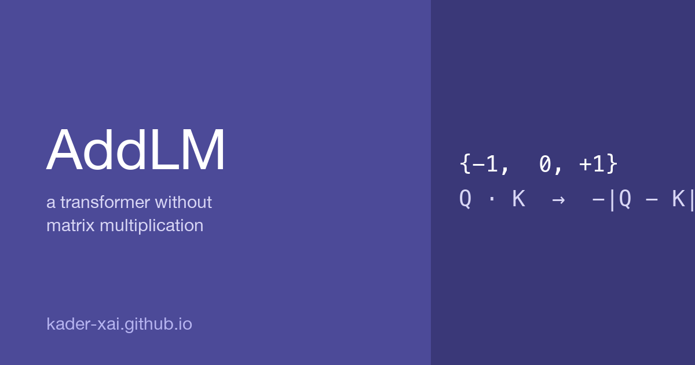

{fig-align="center" width="100%"}

The standard transformer spends roughly 99% of its compute on matrix multiplication. I wanted to see what happens if you remove every multiplication. The answer, at 25 M parameters, surprised me: the multiplication-free version wins.

## The idea

Two simple replacements turn a standard transformer into **AddLM**:

1. **Ternary weights.** Every weight is forced to be one of `{−1, 0, +1}` (1.6 bits per weight). Training uses a straight-through estimator with a latent float copy; on the forward pass, weights are snapped to ternary. This is the BitNet-1.58 recipe ([Ma et al. 2024](https://arxiv.org/abs/2402.17764)).
2. **Tropical attention.** The score `Q · K^T / √d` is replaced with `−Σ |q_i − k_i|` (negative L1 distance). Combined with top-k routing — keep only the 16 highest scores per query, softmax over those — this removes the `Q K^T` matmul completely.

I also swapped the FFN activation from GELU to ReLU (`max(x, 0)`) so the whole forward pass uses only `+`, `−`, `max`, and sign-flips. No real-valued multiplications anywhere.

The contribution here isn't the ternary recipe — BitNet established that. It's stacking ternary weights with tropical attention and running the empirical battery to see what actually happens.

## The setup

I trained on Karpathy's tinyshakespeare (1.1 M chars, char-level, vocab = 65), identical hyperparameters across every run: AdamW, lr = 3e-4, block = 128, batch = 32, seed = 1337. Hardware: an A100 on Colab. Four notebooks reproducing every run are on GitHub.

## What happened

| Model size | Float baseline (val loss) | AddLM (val loss) | Gap |
|---|---:|---:|---:|
| 0.82 M params, 2 k steps  | 1.88 | 2.11 | +13.0% |
| 4.8 M params, 5 k steps   | 1.56 | 1.63 | +4.4% |
| **25 M params, 4 k steps** | **1.68** | **1.60** | **−4.3%** ✓ |

The gap closes with scale and then flips. At 25 M parameters AddLM produces a lower validation loss than the matched float transformer.

## Why it wins at 25 M

The float baseline overfit hard. Train loss collapsed from 1.39 → 0.97 while val loss climbed from 1.55 → 1.68 — classic memorization. AddLM's train loss only reached 1.37 because three-value weights physically can't memorize fine details. The constraint acts as a strong regularizer.

So AddLM kept generalizing while float curved upward. The win at 25 M isn't because the multiplication-free algebra is *better* in some absolute sense — it's because the constraint forces the model to learn coarser, more generalizable structure on a dataset where the float model has enough capacity to memorize.

::: {.callout-note}
This is consistent with the BitNet literature, which has reported analogous effects at much larger scale. The novel observation here is that you get the same dynamic *combined with* multiplication-free attention.
:::

## Which change costs what

Ablation at 4.8 M params, 2 500 steps:

| Variant | Weights | Attention | Val loss | Cost vs Float |
|---|---|---|---:|---:|
| Float baseline | float | softmax `Q K^T` | 1.595 | — |
| Tropical-only | float | `−L1` top-k | 1.626 | **+0.031** |
| Ternary-only | ternary | softmax `Q K^T` | 1.726 | +0.131 |
| Full AddLM | ternary | `−L1` top-k | 1.776 | +0.181 |

Operationally interesting: **dropping multiplication from attention scoring is almost free.** Tropical attention costs +0.031 val loss; ternary weights alone cost +0.131. Almost all of AddLM's training-loss cost is in the weight constraint, not the attention rewrite.

That's a useful signal for anyone building low-bit accelerator silicon — the attention rewrite is essentially a free architectural win, separable from the weight quantization question.

## Top-k sensitivity

| top-k | Val loss |
|---:|---:|
| 4  | 1.945 |
| 8  | 1.921 |
| 16 | 1.919 |
| 32 | 1.915 |

Diminishing returns past k = 8. AddLM attention can be aggressively sparse — every query only really needs eight keys.

## Sample output

From the 4.8 M-param AddLM after 5 000 steps, prompted with `ROMEO:`:

```
ROMEO:
Now thy bridle?
STANLEY:
He mad!
What be to take Our my childans barnit her wise,
And are that ane away, my fears a wizon
```

Recognizable Shakespeare structure. Real character names. Real-ish English words. Same broad quality as the float baseline's output at this scale, with weights restricted to three values and no real-valued multiplication anywhere in the forward pass.

## What this doesn't show

A few things I want to be straight about:

- **No real wall-clock speedup yet.** PyTorch is still routing this through matmul kernels with weights *constrained* to ternary. The algebra is mathematically multiplication-free but capturing the speedup needs a custom CUDA or Triton kernel that performs the ternary forward pass with signed adds only.
- **One small dataset.** Char-level tinyshakespeare. The regularization advantage at 25 M may not transfer identically to larger corpora or to BPE tokenization.
- **Embeddings and the final unembedding head are still float.** Quantizing them is straightforward future work but not done here.
- **Short context (T = 128).** Top-k routing should pay off most at long context, where dense softmax over thousands of positions becomes expensive. Not exercised here.

## What I want to try next

- **50–100 M parameters.** Does the AddLM lead widen, or does it cap out near 25 M? The crossover at 25 M suggests yes.
- **A real ternary Triton kernel.** Does the predicted 10–30× inference speedup actually materialize once we stop pretending these are float matmuls?
- **Long context (T = 4 096).** The regime where top-k routing should crush dense softmax on raw compute.
- **Tokenized text (BPE) and a non-Shakespeare corpus.** Does the regularization advantage survive on Wikipedia, code, conversational data?

---

Code, notebooks, and full training logs: [github.com/kader-xai/addlm](https://github.com/kader-xai/addlm)

## Related

- 🔗 Project page: [AddLM on this site](../../projects/2026-addlm/)
- 📦 Related project: [Data Science Roadmap](../../projects/2025-data-science-roadmap/) — Modules 23–25 walk through the math and PyTorch primitives that AddLM is built on
