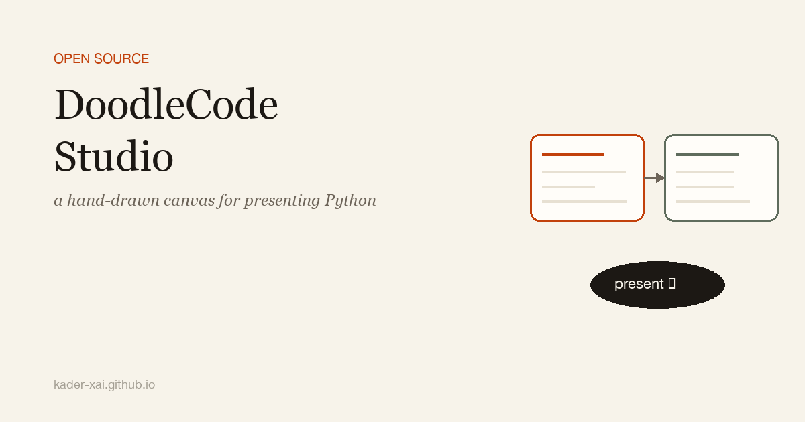

{fig-align="center" width="100%"}

Every time I tried to present Python code live — at a meetup, in a workshop, on a screen-share — I hit the same wall.

A Jupyter notebook is a great place to *work* but a terrible place to *present*. Everything is vertical. You scroll past the cell you just ran to get to the explanation. There's no room for a sentence beside the code that says *"this is the part that matters."* When you want to switch from "let me run this" to "let me draw on it for a second," you can't.

The alternative is to copy code into Keynote or Reveal.js. Now the slides look good but nothing runs. So you live-demo from a separate VS Code window, alt-tab, lose the audience, alt-tab back.

I ended up building the thing I wanted in between. It's called **[DoodleCode Studio](https://github.com/kader-xai/doodlecode-studio)** and v1.3.4 is out today.

## The idea

A canvas — not a notebook. Each Python cell is a hand-drawn card on a 2D surface you can pan and zoom. Cells connect with arrows so the execution order is visible. Each card has its own coloured callout bubble for the explanation, written by me, sitting beside the code rather than below it.

When I'm presenting, I press the arrow key and the camera flies to the next card. Pen and highlighter are one keystroke away. The code is real Python running on a real Jupyter kernel — `pip install` works, `matplotlib` renders inline, errors are caught. None of it is a screenshot.

The result is one tool I can use to *write* the talk *and* deliver it. No more "slide deck, then switch to VS Code, then switch back."

## How it works under the hood

There are two design choices I want to flag because they're load-bearing.

**The kernel is real.** The backend is FastAPI talking to `jupyter_client` and `ipykernel`. Each session gets its own kernel from a pool, keyed by `session_id`. When you run a cell, it goes through the same machinery as a regular Jupyter notebook — same protocol, same stream handling, same display hooks. That means anything that works in Jupyter works here: rich repr, inline matplotlib, `IPython.display`, `%pip install`. The doodle layer is just UI — the execution layer is unmodified Jupyter.

**The file format is plain `.py`.** This was the contract I refused to break: a DoodleCode notebook is a single Python file. Git diffs are readable. You can `cat` it. You can edit it in VS Code without losing anything. The canvas state lives in comment directives that round-trip byte-stable.

Here's what a simple two-card notebook actually looks like on disk:

```python
# %% color=mint title="Print + Arithmetic"
# @explain: The simplest possible Python — print + math.
print("Hello from DoodleCode!")
a, b = 7, 5
print("a * b =", a * b)
```

The `# %%` line is the cell header (this is the same convention VS Code's Python extension uses, so the file is also a normal "Jupyter-percent" script). `color=mint` and `title=...` are canvas metadata. `# @explain:` is the callout bubble. There can be more than one per cell.

Markdown cells with embedded images work the same way:

```python
# %% [markdown] color=peach title="Markdown + Images"
# # Markdown can carry images
# 
# Combine with bullets, code spans, headings in the same card.
```

Images bigger than a URL get embedded as data URLs inside the comment block. Everything is one file. No sidecar JSON, no `.ipynb`, no metadata directory.

I lost a weekend before I locked this contract in, and I've been glad for it ever since. Refactoring the canvas state model became safe once I could diff the saved output of two refactors and verify they were identical bytes.

## What presenting actually feels like

Three tools live in the toolbar: **Cursor**, **Hand**, **Move**. Cursor selects and edits. Hand pans the canvas. Move drags cards around. Switching is a single keypress.

**Presenter mode** is the one that mattered most. Enter full-screen, the chrome auto-hides, and the arrow keys step you through cards in execution order. Two annotation tools layer on top of the canvas while you're presenting:

- **Pen** (red, fades after ~1.4s) — for pointing at a specific token or line while you're talking.
- **Highlighter** (yellow, fades after ~4s) — for circling a result that just got printed.

Both clear themselves. You don't have to remember to wipe the canvas between slides — the marks are ephemeral by design.

There's an **Auto-Space mode** for actual presentations: each cell snaps to a fixed slide-height so when the screen is projected, one card fills one viewport. No more cards spilling off the edge of a beamer.

Dark mode is tuned to the same Excalidraw-inspired palette as light mode — high enough contrast for a meetup projector that's washed out by hall lighting. Four font themes ship in the box (Doodle, Professional, Serif, Mono); I pick Doodle for casual talks, Mono when I'm presenting to an engineering audience that wants the code to feel like an editor.

## A few engineering decisions worth mentioning

**Single port for production.** Running a `./start.sh` builds the React frontend with Vite once, then serves the static bundle *and* the FastAPI routes off `http://localhost:8000`. No `npm run dev` for end users. No CORS dance. Contributors who want hot reload can use `./start.sh --dev` and get the dual-server setup automatically.

This sounds boring. It's the single biggest difference between "people clone it once and forget" and "people actually try the project." Two-server local dev is a tax on anyone who isn't already familiar with React.

**AudioContext mixing was a dead end I'm glad I cut.** Early on I tried adding talk-recording — capture the audio from the mic, mix it with whatever the kernel was outputting, save to disk. Sample-rate negotiation across browsers turned out to be the kind of problem that eats a month and produces a feature people don't really want. I pulled the whole branch. The project shipped weeks earlier because of it.

**Cell-chain reconnection on delete.** Cards are connected by arrows in execution order. Delete card 3 from a chain `1 → 2 → 3 → 4 → 5` and the chain immediately becomes `1 → 2 → 4 → 5`. The UI never enters an inconsistent state where an arrow points at nothing. Took two iterations to get right; worth it because the canvas now feels solid under heavy editing.

## What the quality bar looks like

Every PR runs:

- `ruff` clean on Python
- 94 backend pytest pass
- TypeScript strict typecheck clean
- 40 frontend vitest pass
- Vite production build succeeds

I sit on the PR until all five pass. Not because the project is mission-critical — it's a hobby — but because the cost of fixing a regression months later is way higher than the cost of catching it in CI today.

## What's next

A few things on the near-term list:

- **Cell folding** for long code cells, so you can present a function header and expand the body only when you need to.
- **A real .doodle export** that bundles the `.py` plus the rendered outputs as a single artefact, for sending a finished talk to someone who doesn't want to install anything.
- **Multi-author callouts** — sometimes two people are presenting and want to claim their respective bubbles.

The file format will stay backwards-compatible. That's the one contract that doesn't move.

## Try it

```bash
git clone https://github.com/kader-xai/doodlecode-studio.git
cd doodlecode-studio
./start.sh
```

Then open `http://localhost:8000`. The first run takes ~30 seconds to build the UI; subsequent runs are instant.

- **Repo:** [github.com/kader-xai/doodlecode-studio](https://github.com/kader-xai/doodlecode-studio) — a star if you find it useful means a lot.
- **YouTube walkthrough:** [youtu.be/PleOlbOs7tA](https://youtu.be/PleOlbOs7tA)
- **Meetup:** I'll be demoing this at the [Machine Learning Group Riyadh](https://www.meetup.com/machine-learning-group-riyadh).
- **Follow along:** [LinkedIn](https://linkedin.com/in/kader-xai) · [GitHub](https://github.com/kader-xai)

MIT-licensed, Co-AI Developed, built in the open. If you've got opinions on the file format or feature requests, the issues tab is the right place.
