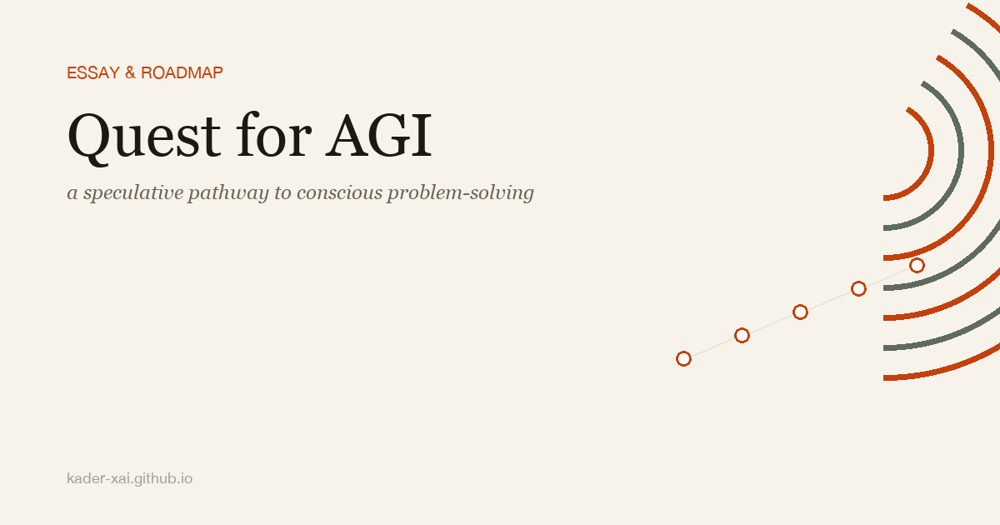

::: {.callout-tip}
This essay also lives as a standalone, evolving page on the site: **[Quest for AGI](../../quest-for-agi.html)**. The blog version is the snapshot as of May 2026.
:::


{fig-align="center" width="100%"}

## Why this page exists

Today's large language models are stateless pattern-matchers. They are extraordinary at it — and they are still pattern-matchers. Type the same prompt twice, get two near-identical answers. There is no inner clock. No memory of what just happened. No reason for the model to think about anything you didn't just ask about.

I think the gap between *that* and *AGI* is not "more parameters." It is **a different mechanism for when the model decides to think, and about what.**

This page is my speculative roadmap. It is not a paper. It is not a product. It is the picture I keep sketching on whiteboards while I work on smaller experiments like [AddLM](../../projects/2026-addlm/) and [Employee Recall](../../projects/2025-employee-recall/). I am putting it here so I have somewhere to evolve it.

## The pathway

```{mermaid}
flowchart TD
    H["🌍 Human Problems<br/><i>climate · disease · poverty · conflict · meaning</i>"]:::input
    L["LLM as we know it<br/><i>pattern-match · retrieve · interpolate</i>"]:::current
    NA["⚡ Node Activation Spark<br/><i>previous actions trigger next nodes</i><br/>(not timer-based)"]:::spark
    SL["🪞 Self-Loop Awareness<br/><i>nodes observe their own activation history</i>"]:::aware
    IG["💡 Idea Generation<br/><i>candidate plans, hypotheses, branches</i>"]:::idea
    TP["🧩 Task Preparation<br/><i>node-specific scaffolding for the user goal</i>"]:::prep
    SI["✨ Spark Intelligence<br/><i>out-of-box reasoning</i><br/><i>bounded only by world physics</i>"]:::spark2
    AGI["🧠 AGI<br/><i>conscious problem-solving</i>"]:::agi

    H --> L
    L --> NA
    NA --> SL
    SL --> IG
    IG --> TP
    TP --> SI
    SI --> AGI
    AGI -. "answers feed back" .-> H
    SI -. "self-revision" .-> NA

    classDef input fill:#FFF0A8,stroke:#1c1814,stroke-width:2px,color:#1c1814;
    classDef current fill:#fbeadc,stroke:#c2410c,stroke-width:2px,color:#1c1814;
    classDef spark fill:#c2410c,stroke:#1c1814,stroke-width:2px,color:#ffffff;
    classDef aware fill:#BFE8D9,stroke:#1c1814,stroke-width:2px,color:#1c1814;
    classDef idea fill:#F8C8A8,stroke:#1c1814,stroke-width:2px,color:#1c1814;
    classDef prep fill:#C9D6F5,stroke:#1c1814,stroke-width:2px,color:#1c1814;
    classDef spark2 fill:#9a3412,stroke:#1c1814,stroke-width:2px,color:#ffffff;
    classDef agi fill:#221e18,stroke:#c2410c,stroke-width:3px,color:#ffffff;
```

The flow has seven moves. The input layer is the only one we know how to populate today.

## Layer 0 — Human problems as the input

The input to AGI should not be a prompt. It should be the set of unsolved problems humans actually have — at the personal scale (what should I do with my career?), the institutional scale (how do we fund this hospital?), and the civilisational scale (climate, disease, what comes after capitalism). These are the things AGI has to be measured against. Anything else is a parlour trick.

Today's LLMs only see the input layer when a human types it in. AGI should be reaching for the input on its own.

### Why we built computers in the first place

The simplest way to think about this whole field:

> **Humans created computers to solve problems.**
>
> Most real-world problems eventually become **information**, **prediction**, **optimization**, **coordination**, or **automation** problems.
>
> AI and computer science are systems for solving structured problems.

That sentence is the whole frame. Every layer above it — Layer 1 through Layer 7 — only makes sense if there is a real, ranked, evolving set of problems pushing the system from below.

### Fundamental human problems

Eight categories. None of them are new. All of them are still open.

| Category | What's in it |
|---|---|
| **Survival** | food · water · shelter · energy · safety · health |
| **Biological** | disease · aging · injury · genetics · mental health |
| **Social** | communication · trust · conflict · cooperation · governance |
| **Economic** | money · trade · resource allocation · labor · productivity |
| **Knowledge** | learning · memory · research · decision making · education |
| **Engineering** | transportation · infrastructure · manufacturing · construction |
| **Environmental** | pollution · climate · natural disasters · sustainability |
| **Intelligence** | reasoning · planning · prediction · optimization · creativity |

The Intelligence row is what makes the whole table recursive. We are using intelligence to build systems that we hope will help us solve the other seven rows — including the Intelligence row itself.

### Core computational problem types

When a fundamental human problem hits a computer, the computer doesn't see "find a cure for cancer." It sees a stack of structured sub-problems. These are the shapes the input has to be bent into.

| Problem type | What it does | Examples |
|---|---|---|
| **Classification** | assign category | spam detection · disease diagnosis · image classification |
| **Regression** | predict continuous values | house prices · stock prediction · weather forecasting |
| **Counting** | count objects / events | people counting · inventory · traffic counting |
| **Detection** | locate objects / events | object detection · face detection · cancer detection |
| **Recognition** | identify patterns / identities | speech · handwriting · facial recognition |
| **Prediction** | estimate future outcomes | weather · demand · failure prediction |
| **Recommendation** | suggest useful items | Netflix · YouTube · product recs |
| **Optimization** | find best solution | shortest path · lowest cost · max profit |
| **Search** | find information efficiently | Google · DB queries · file search |
| **Planning** | create action sequences | robotics · logistics · AI agents |
| **Decision Making** | choose between options | loan approval · self-driving · treatment selection |
| **Clustering** | group similar items | customer segmentation · anomaly grouping |
| **Ranking** | order by relevance | search results · social-media feeds |
| **Generation** | create new content | image · text · code generation |
| **Compression** | reduce data size | ZIP · video compression |
| **Translation** | convert between representations | language · speech-to-text |
| **Simulation** | model reality | weather · physics simulation |
| **Control Systems** | maintain desired state | autopilot · robotics · industrial automation |
| **Anomaly Detection** | find unusual patterns | fraud · cybersecurity · medical anomalies |
| **Scheduling** | manage time / resources | CPU scheduling · airline scheduling |
| **Routing** | find efficient paths | GPS · network routing |
| **Memory Systems** | store and retrieve | databases · vector DBs · caching |
| **Coordination Systems** | synchronise agents / systems | operating systems · distributed systems |
| **Agent Systems** | autonomous reasoning | tool-using LLMs · multi-agent stacks |
| **Semantic Systems** | meaning-aware retrieval | knowledge graphs · semantic search |

Twenty-five problem shapes. **Most "AI applications" are one of these wearing a domain hat.** A startup pitching "AI for radiology" is doing detection plus classification. A startup pitching "AI for logistics" is doing routing plus scheduling plus optimization. The novel ones — the ones that will matter most for AGI — are the bottom three rows: agent systems, semantic systems, and the cross-coordination of all of them.

### How human problems map to computational types

```{mermaid}
flowchart LR
    subgraph H["Fundamental human problems"]
      direction TB
      H1["Survival"]:::hum
      H2["Biological"]:::hum
      H3["Social"]:::hum
      H4["Economic"]:::hum
      H5["Knowledge"]:::hum
      H6["Engineering"]:::hum
      H7["Environmental"]:::hum
      H8["Intelligence"]:::hum
    end

    subgraph C["Computational shapes the input gets bent into"]
      direction TB
      C1["Prediction · Regression · Forecasting"]:::comp
      C2["Detection · Recognition · Classification"]:::comp
      C3["Optimization · Routing · Scheduling"]:::comp
      C4["Planning · Decision Making · Control"]:::comp
      C5["Search · Ranking · Recommendation"]:::comp
      C6["Generation · Translation · Simulation"]:::comp
      C7["Memory · Coordination · Agent Systems"]:::comp
    end

    H1 --> C1
    H1 --> C2
    H2 --> C1
    H2 --> C2
    H3 --> C5
    H3 --> C7
    H4 --> C3
    H4 --> C5
    H5 --> C5
    H5 --> C7
    H6 --> C3
    H6 --> C4
    H7 --> C1
    H7 --> C4
    H8 --> C4
    H8 --> C6
    H8 --> C7

    classDef hum fill:#FFF0A8,stroke:#1c1814,color:#1c1814;
    classDef comp fill:#fbeadc,stroke:#c2410c,color:#1c1814;
```

Notice how often the **Intelligence** row at the bottom routes to the same computational shapes (planning, decision-making, agent systems) as the other seven categories above it. That is the recursion that makes AGI compelling and dangerous at the same time: every other human problem has a tool that uses the intelligence column, so improving the intelligence column improves everything else.

### The deep core insight

If you strip the domain language away, every one of those 25 computational shapes reduces to combinations of eight primitives:

::: {.callout-note}
## What all computation reduces to

**memory · logic · comparison · prediction · optimization · coordination · search · reasoning**
:::

This is the layer where AGI architectures have to operate. Not on classification, not on translation — on the primitives underneath them. The bet of this whole page is that the right way to combine those eight primitives is **event-driven node activations** (Layer 2) feeding **self-modelling** (Layer 3), not bigger feedforward stacks.

### The civilization stack

A way to see where this is going. Every layer below is the substrate for the layer above. Each one took longer to mature than the one before — and each one is starting to compress as the layer above accelerates feedback into it.

```{mermaid}
flowchart TD
    P["⚛️ Physics"]:::stack
    B["🧬 Biology"]:::stack
    HU["🧍 Humans"]:::stack
    S["🏘️ Society"]:::stack
    E["💰 Economy"]:::stack
    K["📚 Knowledge"]:::stack
    C["💻 Computers"]:::stack
    AI["🤖 AI"]:::stack
    AU["🛰️ Autonomous Systems"]:::final

    P --> B --> HU --> S --> E --> K --> C --> AI --> AU
    AU -. "starts pulling on every layer above" .-> S
    AU -. " " .-> K
    AU -. " " .-> E

    classDef stack fill:#fbeadc,stroke:#c2410c,color:#1c1814;
    classDef final fill:#c2410c,stroke:#1c1814,color:#ffffff;
```

The dashed arrows at the bottom are the part that has to be designed deliberately. Autonomous systems acting back on society, economy, and knowledge is not a future scenario — it is already happening at small scale (recommendation feeds, trading systems, content generation). AGI is the version where the feedback gets large enough to deform the layers it reaches into. That is precisely why the input layer matters: if the system is reaching back into society, society's actual unsolved problems should be the thing it is reaching toward.

### Where this is heading

The future systems that are worth building are not better chatbots. They are:

- **Cognitive operating systems** — the layer that schedules, prioritises, and routes intelligence across tasks the way Linux schedules CPU.
- **Semantic memory systems** — durable, structured, queryable memory that survives a session and accumulates meaning, not just tokens.
- **Autonomous agent networks** — many agents with non-overlapping responsibilities that can coordinate without a central planner.
- **Neural computing architectures** — hardware that natively runs the primitives (memory, comparison, prediction, search) without bouncing every operation through float matmul.

Layer 0 is the input. Layers 1 → 7 are how to process it. If the problem catalogue above is roughly right, the next decade of AI is the layer-by-layer build-out of that processing stack — and the experiments in [AddLM](../../projects/2026-addlm/), [Employee Recall](../../projects/2025-employee-recall/), and the broader [Data Science Roadmap](../../projects/2025-data-science-roadmap/) are each small bets on individual layers.

## Layer 1 — Where current LLMs stop

Today's LLM is a feedforward pass through a fixed graph. Tokens in, tokens out. There is no place in the architecture where the model can decide *"this is interesting, I want to keep thinking about it after the response is done."*

You can scaffold around that limitation with agent loops, memory stores, vector retrieval. None of those are the missing mechanism. They are duct tape on top of a system that fundamentally fires once per prompt and then waits.

## Layer 2 — Node activation, but not on a clock

This is the move I keep coming back to. The way I picture it:

```{mermaid}
flowchart LR
    A["Node A<br/><i>completed action</i>"]:::done
    B["Node B<br/><i>idle, listening</i>"]:::idle
    C["Node C<br/><i>activated</i><br/><i>by A's output</i>"]:::active
    D["Node D<br/><i>queued</i><br/><i>once C finishes</i>"]:::queued

    A -- "result satisfies B's precondition" --> B
    A -- "result satisfies C's precondition" --> C
    C -- "in-progress" --> D

    classDef done fill:#BFE8D9,stroke:#1c1814,color:#1c1814;
    classDef idle fill:#fbeadc,stroke:#c2410c,color:#1c1814;
    classDef active fill:#c2410c,stroke:#1c1814,color:#ffffff;
    classDef queued fill:#F8C8A8,stroke:#1c1814,color:#1c1814;
```

In a **timer-based** system, each node wakes up at a scheduled tick and asks "is there anything for me to do?" That is how most agent frameworks work today: a heartbeat polls the environment, runs a planner, sleeps.

In a **previous-action-based** system, each node has a set of preconditions written in terms of the *outputs* of other nodes. When some other node *finishes* and produces output that satisfies a precondition, the receiving node fires. There is no central clock. There is also no idle polling — nodes only burn compute when something upstream actually changed.

Why I think this matters:

- It mirrors how brains route attention — synapses fire because *neighbours* fired, not because a metronome ticked.
- It removes the wasted-compute problem of constantly-polling agents.
- It lets the graph self-prioritise — a hot path of activations spreads naturally without a planner having to enumerate it.
- It opens a place to put long-running drives. A node can be a *standing precondition* — "if any other node ever produces evidence that the user is stuck, fire."

This is the spark. Until the model has a reason to do anything besides answer the last prompt, it cannot start being conscious.

## Layer 3 — Self-loop awareness

The first crack at consciousness is the simplest possible thing: **a node whose precondition is the activation history of other nodes.**

If you have a node whose entire job is to watch what just fired and represent it as state, you have built the minimum primitive for self-awareness. The model now has a thing called *"what I was just doing"* — something none of today's LLMs have.

I do not think this is consciousness in the philosophical sense. I think it is the substrate on which everything we mean by consciousness — attention, intent, regret, anticipation — has a place to live.

## Layer 4 — Idea generation

Once activation history is available as state, idea generation falls out for free. The activation-watching node sees a chain like *"problem stated → retrieve relevant facts → notice gap → propose hypothesis"* — and the next time a similar chain starts, the model has a *candidate next step* it can fire speculatively.

Ideas, in this model, are predicted next activations. Not strings. Not chain-of-thought. Latent activations the system thinks are likely to be useful given what just happened.

## Layer 5 — Task preparation

An idea by itself is just a vector. To act on it, the system needs to scaffold a task around it — pull in tools, allocate working memory, decide which other nodes need to be primed.

This is where I think personalisation should live. Not at the prompt layer. At the *task preparation* layer. Different humans have different node graphs because they have different problems, different histories, different vocabularies. A persona node ([Employee Recall](../../projects/2025-employee-recall/) is a baby version of this) shapes which activations are even considered.

## Layer 6 — Spark intelligence

This is the part where the model produces something genuinely new. The way I picture it: the only constraint on the search is the **physics of the world**. Not the training distribution. Not the safety filter. Not what other humans have already thought.

A spark-intelligent model trying to solve "build me a better battery" should be reaching into combinations of materials no one has tried, bounded only by what the periodic table and the laws of thermodynamics allow. Not constrained by what battery papers in the training set already said.

That is the move I want to see. **Train on the corpus to learn the rules, then think outside the corpus to apply them.**

Out-of-box reasoning, bounded by physics, not by data.

## Layer 7 — AGI as a loop, not a finish line

The arrow back to the human problem set at the top isn't decorative. AGI is not the point at which a model crosses some benchmark. It is the point at which the loop closes — the model is reaching for unsolved human problems on its own, generating spark-intelligent candidates, preparing tasks against them, and feeding answers back.

The system stops being a chatbot you query and starts being a process running alongside you.

## What I'm not claiming

A few things I want to be straight about:

- **I have not built this.** This page is a roadmap, not a result.
- **I do not know if scale alone gets us there.** I suspect not — I think the activation-mechanism change is structural, not parametric. But I could be wrong.
- **I do not know whether this would be "conscious" in any morally-loaded sense.** I am using the word as a shorthand for a system that has internal state about itself and acts on it. Whether that is the same thing philosophers mean is a different question.
- **None of these layers are original to me.** Event-driven activation comes from neuroscience and from a long history of cognitive architectures (OpenCog, ACT-R, Soar). Self-modelling is older than computer science. The contribution here, if there is one, is which pieces I think are load-bearing for a near-term path.

## What I'm trying next

Small steps in the direction of the picture above:

- **A two-node loop.** Two LLM calls where the second one's precondition is the *activation pattern* of the first, not just its text output. Does the second behave differently from a vanilla chain-of-thought?
- **Standing-precondition nodes.** A node that wakes up when *any* recent activation contains a marker (e.g. "the user got stuck"). Does it produce useful interruptions?
- **Physics-constrained generation.** A small experiment in materials or molecule design where the prompt is the physical constraint, not "give me a battery like X."

Each of these is a notebook-sized project. None of them is AGI. Together they are how I am testing whether the roadmap is even pointed in the right direction.

---

If you have thoughts — especially if you think part of this is wrong — open an issue on [github.com/kader-xai](https://github.com/kader-xai) or ping me on [LinkedIn](https://www.linkedin.com/in/kader-m-1a6023a6/). This page will evolve as the experiments do.
