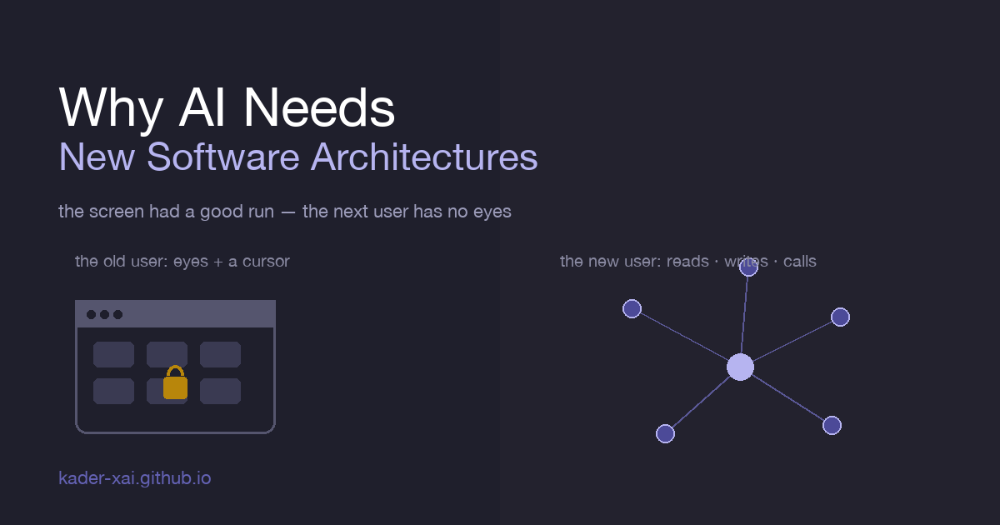
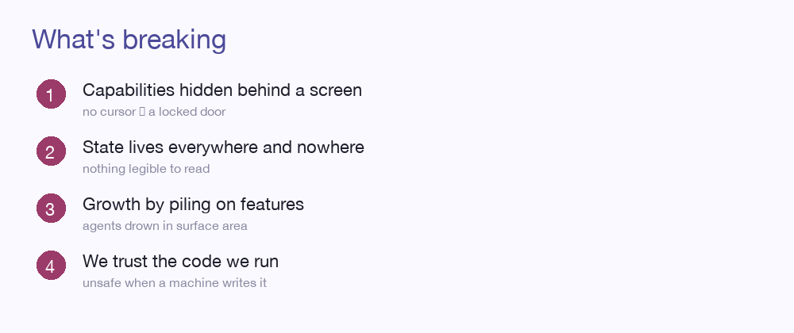
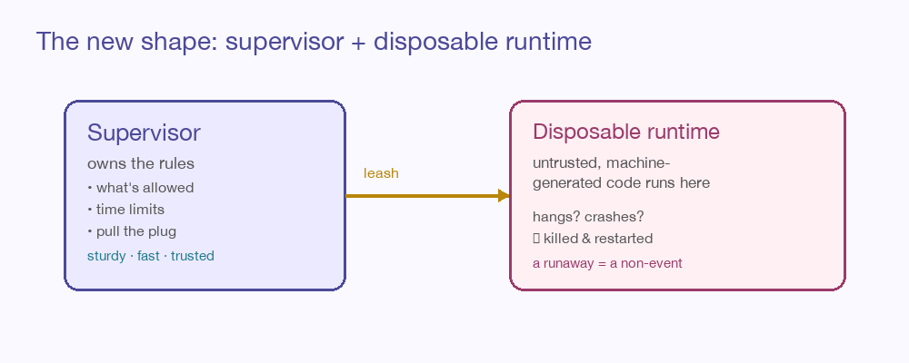

{fig-align="center" width="100%"}

I didn't set out to have an opinion about software architecture. I just kept hitting the same wall. Every time I asked an AI to do something real with my tools — not chat about it, actually do it — there was a moment where it got stuck, and the place it got stuck was always the same kind of place. Not a smart-enough problem. A shape problem. The software was the wrong shape for the thing now trying to use it.

That's the whole essay in one line: the software we have was built for a user who is quietly leaving the building, and the new user has a completely different body. The old user had eyes and hands. The new one has neither. It reads, it writes, it calls. And almost everything we've built assumes the old body.

Let me lay out what's actually breaking, and then the better thing that's growing in its place — because this is, genuinely, a change for the good.

## What's wrong with the architecture we have

{fig-align="center" width="100%"}

### 1. Everything important is hidden behind a screen

For four decades the "interface" was the screen. The capability — export this, run that, send this — only existed at the end of a path a human could see and walk: find the menu, open the panel, click the button. The power was real, but it was reachable only by someone standing in front of it with a cursor.

An AI has no cursor. To it, a beautiful interface is a locked door with no handle. We didn't build software with no capabilities. We built software whose capabilities are only addressable by looking, and the new user can't look.

### 2. The state lives everywhere and nowhere

Ask a normal app a simple question — "what is the user actually working on right now?" — and there's no single place that answers. The truth is smeared across a database, a config file, some browser storage, and whatever happens to be on screen at this instant. A human doesn't notice, because the human is the integration layer; they hold it together in their head.

A machine can't do that. It can only reason about what it can read. If the real state of your software is only legible from inside the running app, by a person watching it, then to an AI your software has no readable state at all. It's flying blind through your most important information.

### 3. We grow by piling on features, not by getting the foundations right

Traditional software grows the way a city grows without zoning: every new thing someone might want becomes another button, another dialog, another special case. The surface area balloons. For a human this is annoying but survivable — you ignore the 90% you don't use. For a machine it's quicksand: it has to understand all of it just to find the 10% that matters, and most of its effort goes into navigating your accumulated history instead of doing the work.

We optimized for "anticipate every feature." That instinct, it turns out, produces exactly the software an agent drowns in.

### 4. We trust the code we run

Here's the deep one. Almost all software assumes the code it executes was written carefully, by a person, who tested it. So we run it close to the core — in the same process, with the same privileges, sharing the same memory as the thing keeping the system alive. One bad line and everything falls over, but that's rare, because a careful human wrote it.

Now flip the author. The code is being generated, at speed, by a machine that has never run it before. Some of it will loop forever. Some will crash. Some will do something nobody intended. An architecture built on trusting the author is structurally unsafe the moment the author is a generator. We're pouring a firehose of unverified code into a foundation poured for a careful typist.

## How it's changing — for the good

None of this is a tragedy. It's a renovation. And the new architecture isn't just "AI-compatible" — it's genuinely cleaner, safer, and more honest than what it replaces. Four shifts, mirroring the four problems.

### 1. Capabilities become things you can name, not just see

The first shift is the biggest: software is moving from "click the button" to "name the verb." Instead of hiding a capability behind pixels, you expose it as a thing with a name and a described shape — so anyone, human or machine, can ask the system "what can you do, and how do I ask?" and get a real answer back.

This sounds small. It's the whole game. Once your capabilities can introduce themselves, the user — any kind of user — stops guessing and starts composing. The interface becomes language, and language is the one interface both humans and machines already share.

### 2. State becomes one legible artifact

The second shift is treating the state of your software as something you can write down in one place and read back whole. One artifact that *is* the work — not a runtime you have to be inside to understand.

When state is legible like that, extraordinary things get easy: a machine can read the entire situation in one pass, change it, hand it to another machine, or reconstruct it from scratch. You stop needing a human as the glue, because the system can finally see itself.

### 3. We build foundations and let composition do the rest

The third shift is humility about features. Instead of trying to anticipate every destination a user might want, you ship a small set of solid, orthogonal pieces — and let the user combine them into things you never imagined.

This is the inversion that matters: the framework becomes the product, not the app. You stop asking "what feature should I build next?" and start asking "what is the smallest set of pieces that can be recombined into anything?" Get that right and your software does things you never designed — because you stopped building destinations and started building roads.

### 4. The runtime gets supervised, and the dangerous part gets disposable

{fig-align="center" width="100%"}

The fourth shift is the safety one, and it's the most architecturally interesting. The new pattern splits the system in two: a small, trustworthy supervisor that owns the rules — what's allowed, how long it can run, when to pull the plug — and a disposable runtime where the untrusted, machine-generated code actually executes.

The key move: the language the machine writes in is no longer the language that keeps the system alive. The risky interpreter runs on a leash held by a sturdier, faster core. If a generated program hangs or misbehaves, the supervisor kills it and starts another, and the system never blinks. A runaway generation goes from "catastrophe" to "non-event." That's not a patch — that's a different shape, and it's the right one for a world where machines write the code.

## Why this is good news

It would be easy to read all of this as loss — the comfortable patterns breaking, everything needing a rewrite. I think it's the opposite.

Every one of these shifts makes software better even for humans. Capabilities that can describe themselves are easier to learn. State you can write down in one file is easier to back up, share, and trust. Systems built from a few strong pieces are easier to reason about than ones built from a thousand special cases. And a runtime that assumes code can fail — and contains the failure — is just good engineering that we excused ourselves from because a careful human was usually at the keyboard.

AI didn't introduce these as new virtues. It removed our excuse for ignoring them. The machine is simply the user that can't tolerate the shortcuts we got away with for forty years, and in forcing us to fix them, it's dragging software toward the shape it probably should have had all along.

The screen had a good, long run. But the next user of your software doesn't have eyes. The architecture that serves it well turns out to serve everyone better. That's the part worth getting excited about.
