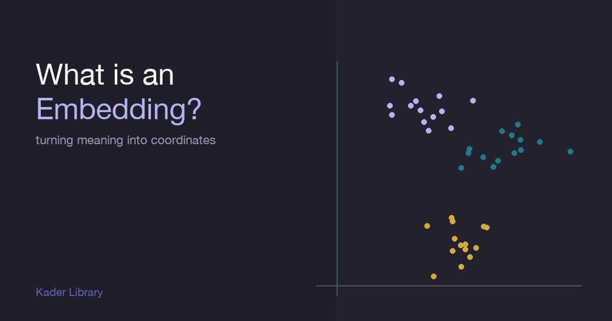

::: {.explainer-body}

{.xpl-fig}

::: {.xpl-lead}
A computer can't compare two words the way you do. It has no sense of "king and queen feel related." So we give it one — we turn every word into a list of numbers, place it as a point in space, and arrange that space so things that mean similar things land near each other. That list of numbers is an embedding.
:::

## The short version

An **embedding** is a vector — a fixed-length list of numbers — that represents a piece of data (a word, a sentence, an image, a user) as a *point in space*. The whole trick is that the space is arranged so **distance means similarity**: close points are alike, far points are not.

::: {.xpl-key}
**Key idea:** An embedding turns "what does this mean?" into "where does this sit?" — and once meaning is a location, similarity is just distance.
:::

## Why we can't just use the words

Computers store the word *cat* as a number (an ID), and *dog* as another. But those IDs are arbitrary — ID 4821 isn't "closer" to ID 4822 in any meaningful way. There's no math you can do on raw word-IDs that respects meaning.

Embeddings fix this. Instead of one arbitrary ID, each word gets a few hundred numbers, *learned* so that the geometry carries meaning. Now `cat` and `dog` end up near each other, while `cat` and `bulldozer` end up far apart — and that's something a machine can actually compute with.

## Distance is the whole point

Once words are points, you measure similarity with the **dot product** or **cosine similarity** — the same vector operations you already know. Try it: drag the two vectors and watch how "aligned" they are. Two embeddings pointing the same way = similar meaning.

::: {.xpl-try}

:::

The famous example: take the embedding for *king*, subtract *man*, add *woman* — and you land almost exactly on *queen*. Meaning became arithmetic.

## Where embeddings come from

Nobody hand-writes these numbers. A model **learns** them by reading enormous amounts of text and nudging each word's vector based on the company it keeps — words that appear in similar contexts get pulled together. Word2Vec and GloVe did this for single words; modern transformer models produce *contextual* embeddings, where the same word gets a different vector depending on the sentence around it.

::: {.callout-tip}
The dimension count (e.g. 384, 768, 1536) is just how many numbers each point has. More dimensions = more room to separate fine distinctions, at the cost of compute and memory.
:::

## Why it matters

Embeddings are the quiet engine under most of modern AI:

- **Search & RAG** — find documents whose embedding is closest to your question's embedding.
- **Recommenders** — users and items as nearby points; recommend what's close.
- **Clustering & dedup** — group by proximity in embedding space.
- **LLMs** — the very first thing a transformer does is embed your tokens before any reasoning happens.

If you understand embeddings, you understand the layer where raw data becomes something a model can think about.

## Going deeper

- [Word2Vec (Mikolov et al., 2013)](https://arxiv.org/abs/1301.3781)
- [The Illustrated Word2Vec — Jay Alammar](https://jalammar.github.io/illustrated-word2vec/)

::: {.xpl-nav}
[← Back to Library](../../kader-library.html)
[All explainers →](../../kader-library.html)
:::

:::
