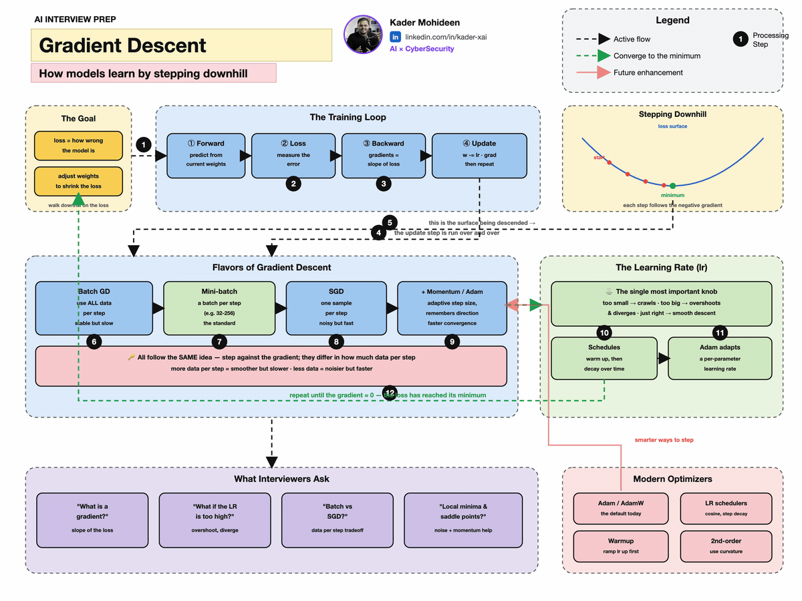
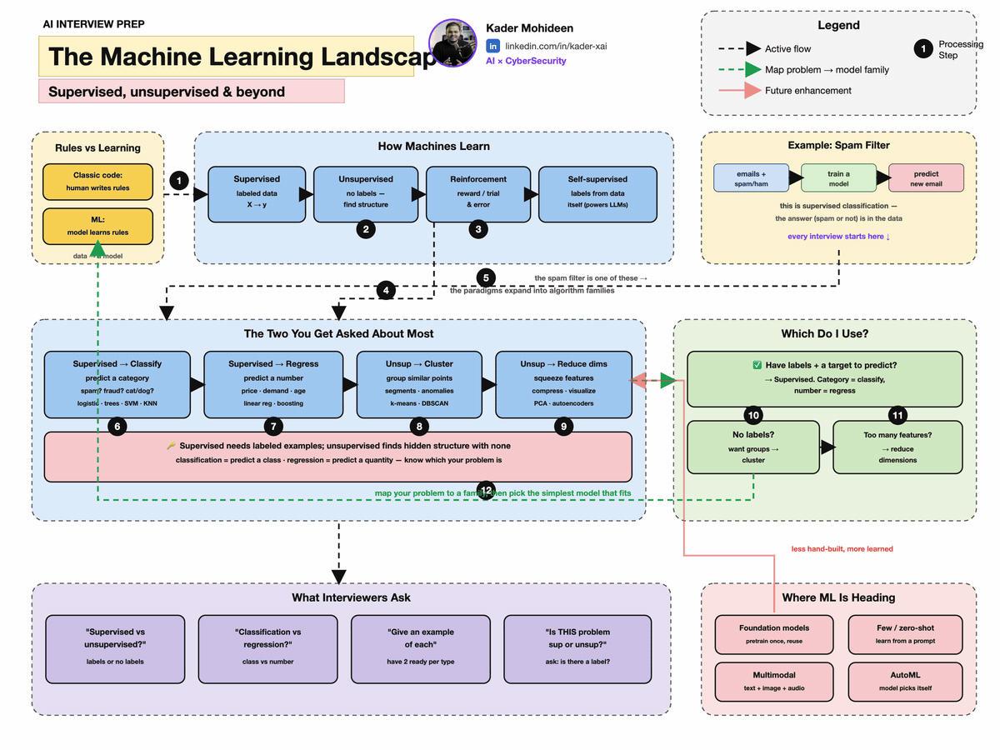
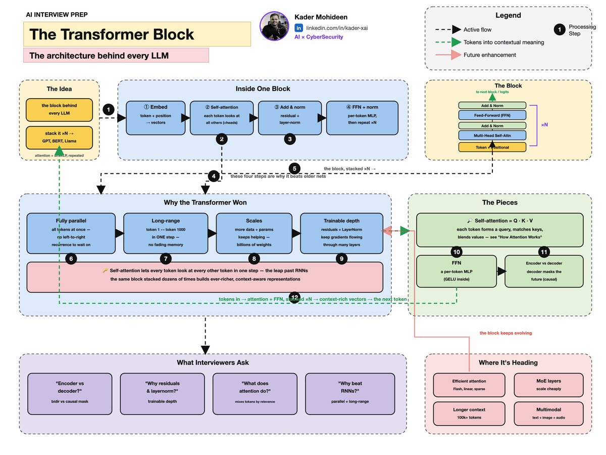
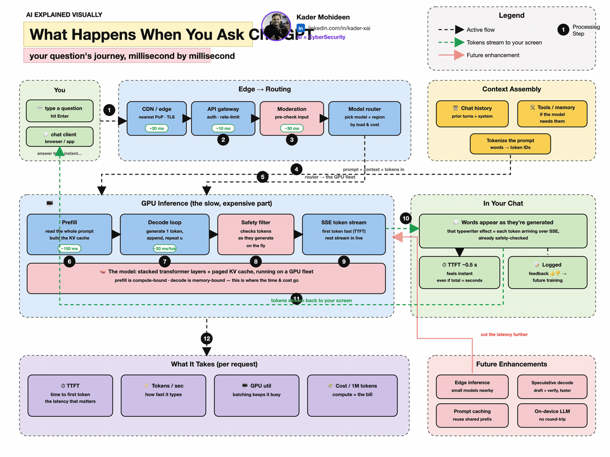
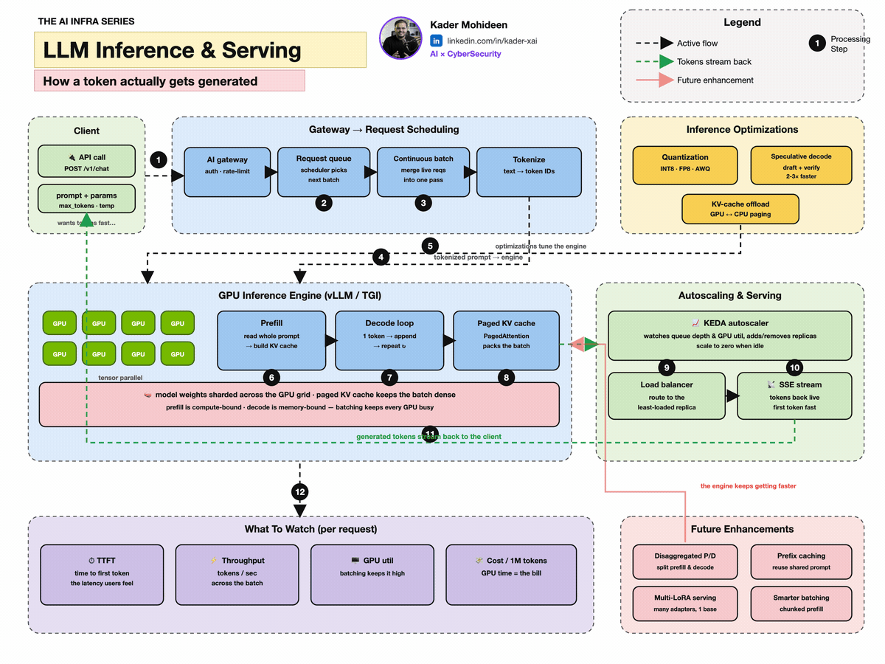
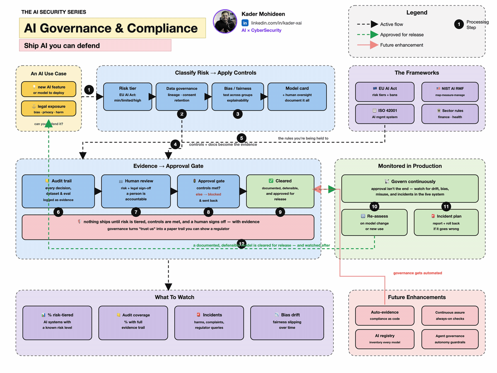
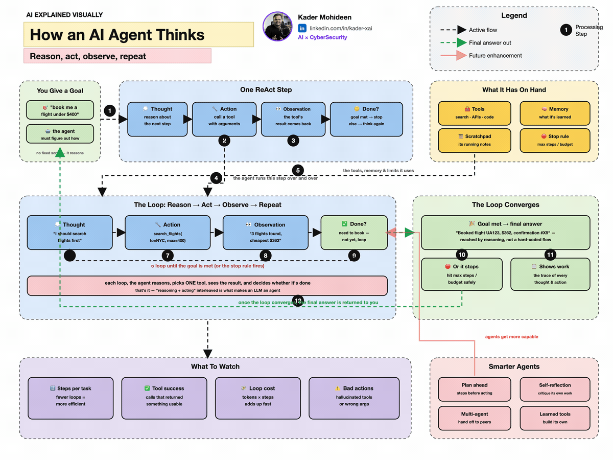

```{=html}
<main class="fac-page" id="full-ai-course">
  <section class="fac-hero" aria-labelledby="fac-title">
    <div class="fac-hero-copy">
      <p class="fac-eyebrow"><span aria-hidden="true">✦</span> One field. One connected learning path.</p>
      <h1 id="fac-title">Full AI Course</h1>
      <p class="fac-lede">Learn the whole story of AI in simple English: the mathematics underneath it, the code that makes it real, and the modern systems that turn models into agents.</p>
      <div class="fac-hero-actions">
        <a class="fac-button fac-button-primary" href="#personalize">Build my learning path</a>
        <a class="fac-button fac-button-secondary" href="#course-map">Explore all 50 lessons</a>
      </div>
      <ul class="fac-proof" aria-label="Course features">
        <li><strong>47</strong> core chapters</li>
        <li><strong>3</strong> frontier capstones</li>
        <li><strong>100s</strong> of visuals and demos</li>
      </ul>
    </div>
    <div class="fac-hero-visual" aria-label="The course connects mathematics, models, knowledge, and agents">
      <div class="fac-orbit fac-orbit-one" aria-hidden="true"></div>
      <div class="fac-orbit fac-orbit-two" aria-hidden="true"></div>
      <div class="fac-core">
        <span class="fac-core-mark">AI</span>
        <small>understand → build → deploy</small>
      </div>
      <div class="fac-node fac-node-math"><span>∑</span> Math</div>
      <div class="fac-node fac-node-code"><span>&lt;/&gt;</span> PyTorch</div>
      <div class="fac-node fac-node-graph"><span>⬡</span> Graphs</div>
      <div class="fac-node fac-node-agent"><span>◎</span> Agents</div>
    </div>
  </section>

  <section class="fac-strip" aria-label="How every technical idea is taught">
    <div><span>01</span><strong>Plain English</strong><small>Build the mental picture first</small></div>
    <div><span>02</span><strong>Visual model</strong><small>See the idea move and connect</small></div>
    <div><span>03</span><strong>Mathematics</strong><small>Read every symbol in words</small></div>
    <div><span>04</span><strong>PyTorch</strong><small>Turn the formula into working code</small></div>
  </section>

  <section class="fac-section fac-personalizer" id="personalize" aria-labelledby="personalize-title">
    <div class="fac-section-heading">
      <p class="fac-kicker">Your course, not a generic syllabus</p>
      <h2 id="personalize-title">Tell the course how you want to learn</h2>
      <p>Choose three things. Your answers stay in this browser and shape the recommended order, pace, and next lesson.</p>
    </div>

    <form class="fac-profile" data-fac-profile>
      <fieldset>
        <legend>1. Where are you starting?</legend>
        <label><input type="radio" name="fac-level" value="new" checked><span><b>New to AI</b><small>Start with intuition and foundations</small></span></label>
        <label><input type="radio" name="fac-level" value="some"><span><b>I know the basics</b><small>Move faster through familiar ideas</small></span></label>
        <label><input type="radio" name="fac-level" value="builder"><span><b>I already build</b><small>Prioritize systems and advanced topics</small></span></label>
      </fieldset>
      <fieldset>
        <legend>2. What is your main goal?</legend>
        <label><input type="radio" name="fac-goal" value="understand" checked><span><b>Understand the field</b><small>A complete, connected mental model</small></span></label>
        <label><input type="radio" name="fac-goal" value="models"><span><b>Build models</b><small>Math, PyTorch, training, and evaluation</small></span></label>
        <label><input type="radio" name="fac-goal" value="agents"><span><b>Build AI agents</b><small>LLMs, tools, memory, graphs, and orchestration</small></span></label>
        <label><input type="radio" name="fac-goal" value="production"><span><b>Deploy AI</b><small>MLOps, serving, safety, and cost</small></span></label>
      </fieldset>
      <fieldset>
        <legend>3. How much time per session?</legend>
        <label><input type="radio" name="fac-pace" value="15"><span><b>15 minutes</b><small>One idea and one visual</small></span></label>
        <label><input type="radio" name="fac-pace" value="30" checked><span><b>30 minutes</b><small>Concept, formula, and code</small></span></label>
        <label><input type="radio" name="fac-pace" value="60"><span><b>60 minutes</b><small>Full lesson plus exploration</small></span></label>
      </fieldset>
      <button class="fac-button fac-button-primary" type="submit">Create my path</button>
    </form>

    <div class="fac-recommendation" data-fac-recommendation hidden aria-live="polite">
      <div>
        <p class="fac-kicker">Your recommended route</p>
        <h3 data-fac-plan-title>Foundation-first explorer</h3>
        <p data-fac-plan-copy></p>
        <div class="fac-plan-meta">
          <span data-fac-session></span>
          <span data-fac-estimate></span>
          <span>Saved on this device</span>
        </div>
      </div>
      <a class="fac-button fac-button-primary" data-fac-continue href="ai-ml-encyclopedia/ch01.html">Start lesson 1</a>
    </div>
  </section>

  <section class="fac-section fac-progress-section" aria-labelledby="progress-title">
    <div class="fac-section-heading fac-heading-row">
      <div>
        <p class="fac-kicker">A course that remembers</p>
        <h2 id="progress-title">Your progress</h2>
      </div>
      <button class="fac-text-button" type="button" data-fac-reset>Reset course data</button>
    </div>
    <div class="fac-progress-card">
      <div class="fac-progress-copy">
        <strong><span data-fac-complete-count>0</span> of 50 lessons complete</strong>
        <span data-fac-progress-message>Personalize your route to begin.</span>
      </div>
      <div class="fac-progress-track" role="progressbar" aria-valuemin="0" aria-valuemax="50" aria-valuenow="0" data-fac-progressbar>
        <span data-fac-progress-fill></span>
      </div>
      <a class="fac-button fac-button-secondary" data-fac-continue-secondary href="#personalize">Choose my path</a>
    </div>
  </section>

  <section class="fac-section" id="course-map" aria-labelledby="map-title">
    <div class="fac-section-heading fac-heading-row">
      <div>
        <p class="fac-kicker">The complete map</p>
        <h2 id="map-title">Eight connected stages, 50 lessons</h2>
        <p>Follow the complete sequence or let your profile move the most useful stages to the front. Nothing is locked.</p>
      </div>
      <div class="fac-legend" aria-label="Lesson status legend"><span><i class="fac-dot fac-dot-recommended"></i>Recommended now</span><span><i class="fac-dot fac-dot-complete"></i>Complete</span></div>
    </div>

    <div class="fac-module-grid" data-fac-modules>
      <article class="fac-module" data-module-id="foundations" data-chapters="ch01,ch02,ch03,ch04,ch05">
        <div class="fac-module-top"><span class="fac-module-number">Stage 01</span><span class="fac-module-count">5 lessons</span></div>
        <h3>Mathematical foundations</h3>
        <p>Vectors, calculus, optimization, probability, and the learning process—explained as tools, not obstacles.</p>
        
        <details><summary>See lessons</summary><div class="fac-lesson-list">
          <a class="fac-lesson-link" data-lesson-id="ch01" href="ai-ml-encyclopedia/ch01.html"><span>01</span>Linear algebra</a>
          <a class="fac-lesson-link" data-lesson-id="ch02" href="ai-ml-encyclopedia/ch02.html"><span>02</span>Calculus & differentiation</a>
          <a class="fac-lesson-link" data-lesson-id="ch03" href="ai-ml-encyclopedia/ch03.html"><span>03</span>Optimization</a>
          <a class="fac-lesson-link" data-lesson-id="ch04" href="ai-ml-encyclopedia/ch04.html"><span>04</span>Probability & statistics</a>
          <a class="fac-lesson-link" data-lesson-id="ch05" href="ai-ml-encyclopedia/ch05.html"><span>05</span>AI, ML & learning</a>
        </div></details>
      </article>

      <article class="fac-module" data-module-id="classical" data-chapters="ch06,ch07,ch08,ch09,ch10,ch11,ch12,ch13">
        <div class="fac-module-top"><span class="fac-module-number">Stage 02</span><span class="fac-module-count">8 lessons</span></div>
        <h3>Classical machine learning</h3>
        <p>Prepare data, train reliable models, measure them honestly, and understand structured uncertainty.</p>
        
        <details><summary>See lessons</summary><div class="fac-lesson-list">
          <a class="fac-lesson-link" data-lesson-id="ch06" href="ai-ml-encyclopedia/ch06.html"><span>06</span>Data preprocessing</a>
          <a class="fac-lesson-link" data-lesson-id="ch07" href="ai-ml-encyclopedia/ch07.html"><span>07</span>Dimensionality reduction</a>
          <a class="fac-lesson-link" data-lesson-id="ch08" href="ai-ml-encyclopedia/ch08.html"><span>08</span>Regression</a>
          <a class="fac-lesson-link" data-lesson-id="ch09" href="ai-ml-encyclopedia/ch09.html"><span>09</span>Classification</a>
          <a class="fac-lesson-link" data-lesson-id="ch10" href="ai-ml-encyclopedia/ch10.html"><span>10</span>Ensembles</a>
          <a class="fac-lesson-link" data-lesson-id="ch11" href="ai-ml-encyclopedia/ch11.html"><span>11</span>Clustering</a>
          <a class="fac-lesson-link" data-lesson-id="ch12" href="ai-ml-encyclopedia/ch12.html"><span>12</span>Evaluation & tuning</a>
          <a class="fac-lesson-link" data-lesson-id="ch13" href="ai-ml-encyclopedia/ch13.html"><span>13</span>Probabilistic graphs</a>
        </div></details>
      </article>

      <article class="fac-module" data-module-id="deep" data-chapters="ch14,ch15,ch16,ch17,ch18">
        <div class="fac-module-top"><span class="fac-module-number">Stage 03</span><span class="fac-module-count">5 lessons</span></div>
        <h3>Deep learning</h3>
        <p>Neurons, backpropagation, CNNs, sequences, attention, transformers, and generative models in PyTorch.</p>
        
        <details><summary>See lessons</summary><div class="fac-lesson-list">
          <a class="fac-lesson-link" data-lesson-id="ch14" href="ai-ml-encyclopedia/ch14.html"><span>14</span>Neural networks</a>
          <a class="fac-lesson-link" data-lesson-id="ch15" href="ai-ml-encyclopedia/ch15.html"><span>15</span>Convolutional networks</a>
          <a class="fac-lesson-link" data-lesson-id="ch16" href="ai-ml-encyclopedia/ch16.html"><span>16</span>Sequence models</a>
          <a class="fac-lesson-link" data-lesson-id="ch17" href="ai-ml-encyclopedia/ch17.html"><span>17</span>Attention & transformers</a>
          <a class="fac-lesson-link" data-lesson-id="ch18" href="ai-ml-encyclopedia/ch18.html"><span>18</span>Generative models</a>
        </div></details>
      </article>

      <article class="fac-module" data-module-id="applied" data-chapters="ch19,ch20,ch21,ch22,ch23,ch24,ch25,ch26,ch27,ch28">
        <div class="fac-module-top"><span class="fac-module-number">Stage 04</span><span class="fac-module-count">10 lessons</span></div>
        <h3>Applied AI</h3>
        <p>Vision, language, audio, time series, LLMs, multimodal AI, reinforcement learning, and real-world systems.</p>
        
        <details><summary>See lessons</summary><div class="fac-lesson-list fac-lesson-list-two">
          <a class="fac-lesson-link" data-lesson-id="ch19" href="ai-ml-encyclopedia/ch19.html"><span>19</span>Computer vision</a>
          <a class="fac-lesson-link" data-lesson-id="ch20" href="ai-ml-encyclopedia/ch20.html"><span>20</span>Natural language</a>
          <a class="fac-lesson-link" data-lesson-id="ch21" href="ai-ml-encyclopedia/ch21.html"><span>21</span>Speech & audio</a>
          <a class="fac-lesson-link" data-lesson-id="ch22" href="ai-ml-encyclopedia/ch22.html"><span>22</span>Time series</a>
          <a class="fac-lesson-link" data-lesson-id="ch23" href="ai-ml-encyclopedia/ch23.html"><span>23</span>Large language models</a>
          <a class="fac-lesson-link" data-lesson-id="ch24" href="ai-ml-encyclopedia/ch24.html"><span>24</span>Multimodal AI</a>
          <a class="fac-lesson-link" data-lesson-id="ch25" href="ai-ml-encyclopedia/ch25.html"><span>25</span>Reinforcement learning</a>
          <a class="fac-lesson-link" data-lesson-id="ch26" href="ai-ml-encyclopedia/ch26.html"><span>26</span>Recommenders</a>
          <a class="fac-lesson-link" data-lesson-id="ch27" href="ai-ml-encyclopedia/ch27.html"><span>27</span>Anomaly & fraud</a>
          <a class="fac-lesson-link" data-lesson-id="ch28" href="ai-ml-encyclopedia/ch28.html"><span>28</span>AI across industries</a>
        </div></details>
      </article>

      <article class="fac-module" data-module-id="production" data-chapters="ch29,ch30,ch31">
        <div class="fac-module-top"><span class="fac-module-number">Stage 05</span><span class="fac-module-count">3 lessons</span></div>
        <h3>Production & infrastructure</h3>
        <p>Deploy, monitor, scale, optimize, and govern real AI systems instead of stopping at a notebook.</p>
        
        <details><summary>See lessons</summary><div class="fac-lesson-list">
          <a class="fac-lesson-link" data-lesson-id="ch29" href="ai-ml-encyclopedia/ch29.html"><span>29</span>MLOps & deployment</a>
          <a class="fac-lesson-link" data-lesson-id="ch30" href="ai-ml-encyclopedia/ch30.html"><span>30</span>AI infrastructure</a>
          <a class="fac-lesson-link" data-lesson-id="ch31" href="ai-ml-encyclopedia/ch31.html"><span>31</span>Tools & frameworks</a>
        </div></details>
      </article>

      <article class="fac-module" data-module-id="reasoning" data-chapters="ch32,ch33,ch34,ch35,ch36,ch37,ch38">
        <div class="fac-module-top"><span class="fac-module-number">Stage 06</span><span class="fac-module-count">7 lessons</span></div>
        <h3>Reasoning, knowledge & safety</h3>
        <p>Search, logic, planning, ontologies, causal thinking, interpretability, ethics, fairness, and safety.</p>
        
        <details><summary>See lessons</summary><div class="fac-lesson-list">
          <a class="fac-lesson-link" data-lesson-id="ch32" href="ai-ml-encyclopedia/ch32.html"><span>32</span>Search & problem solving</a>
          <a class="fac-lesson-link" data-lesson-id="ch33" href="ai-ml-encyclopedia/ch33.html"><span>33</span>Knowledge representation</a>
          <a class="fac-lesson-link" data-lesson-id="ch34" href="ai-ml-encyclopedia/ch34.html"><span>34</span>Planning & constraints</a>
          <a class="fac-lesson-link" data-lesson-id="ch35" href="ai-ml-encyclopedia/ch35.html"><span>35</span>Evolutionary methods</a>
          <a class="fac-lesson-link" data-lesson-id="ch36" href="ai-ml-encyclopedia/ch36.html"><span>36</span>Explainable AI</a>
          <a class="fac-lesson-link" data-lesson-id="ch37" href="ai-ml-encyclopedia/ch37.html"><span>37</span>Causal inference</a>
          <a class="fac-lesson-link" data-lesson-id="ch38" href="ai-ml-encyclopedia/ch38.html"><span>38</span>Ethics, fairness & safety</a>
        </div></details>
      </article>

      <article class="fac-module" data-module-id="frontier-core" data-chapters="ch39,ch40,ch41,ch42,ch43,ch44">
        <div class="fac-module-top"><span class="fac-module-number">Stage 07</span><span class="fac-module-count">6 lessons</span></div>
        <h3>Graphs, robotics & frontier systems</h3>
        <p>Graph neural networks, knowledge graphs, robotics, learning theory, retrieval, and building LLMs from scratch.</p>
        
        <details><summary>See lessons</summary><div class="fac-lesson-list">
          <a class="fac-lesson-link" data-lesson-id="ch39" href="ai-ml-encyclopedia/ch39.html"><span>39</span>Emerging directions</a>
          <a class="fac-lesson-link" data-lesson-id="ch40" href="ai-ml-encyclopedia/ch40.html"><span>40</span>Graph machine learning</a>
          <a class="fac-lesson-link" data-lesson-id="ch41" href="ai-ml-encyclopedia/ch41.html"><span>41</span>Robotics & autonomy</a>
          <a class="fac-lesson-link" data-lesson-id="ch42" href="ai-ml-encyclopedia/ch42.html"><span>42</span>Learning theory</a>
          <a class="fac-lesson-link" data-lesson-id="ch43" href="ai-ml-encyclopedia/ch43.html"><span>43</span>Information retrieval</a>
          <a class="fac-lesson-link" data-lesson-id="ch44" href="ai-ml-encyclopedia/ch44.html"><span>44</span>Build LLMs from scratch</a>
        </div></details>
      </article>

      <article class="fac-module" data-module-id="capstone" data-chapters="ch45,ch46,ch47,agents,graphs,frontier">
        <div class="fac-module-top"><span class="fac-module-number">Stage 08</span><span class="fac-module-count">6 lessons</span></div>
        <h3>Post-training & modern AI capstones</h3>
        <p>Fine-tune, align, serve, and connect models into safe agentic and knowledge-grounded systems.</p>
        
        <details open><summary>See lessons</summary><div class="fac-lesson-list">
          <a class="fac-lesson-link" data-lesson-id="ch45" href="ai-ml-encyclopedia/ch45.html"><span>45</span>Fine-tuning & PEFT</a>
          <a class="fac-lesson-link" data-lesson-id="ch46" href="ai-ml-encyclopedia/ch46.html"><span>46</span>Alignment & evaluation</a>
          <a class="fac-lesson-link" data-lesson-id="ch47" href="ai-ml-encyclopedia/ch47.html"><span>47</span>Serving in production</a>
          <a class="fac-lesson-link fac-lesson-new" data-lesson-id="agents" href="full-ai-course/agents.html"><span>48</span>AI agents & orchestration <em>New</em></a>
          <a class="fac-lesson-link fac-lesson-new" data-lesson-id="graphs" href="full-ai-course/graphs-ontologies.html"><span>49</span>Graphs, ontologies & GraphRAG <em>New</em></a>
          <a class="fac-lesson-link fac-lesson-new" data-lesson-id="frontier" href="full-ai-course/frontier.html"><span>50</span>Frontier watch: what is next <em>New</em></a>
        </div></details>
      </article>
    </div>
  </section>

  <section class="fac-section fac-pairing" aria-labelledby="pairing-title">
    <div class="fac-section-heading">
      <p class="fac-kicker">One idea, four representations</p>
      <h2 id="pairing-title">The formula is never left floating</h2>
      <p>Every important equation is translated into ordinary language, a picture, and executable code. Here is the core of one neuron.</p>
    </div>
    <div class="fac-pair-grid">
      <article><span class="fac-pair-label">Plain English</span><h3>Score, shift, then squash</h3><p>Multiply each input by its importance, add them, add a bias, then squeeze the result into a useful range.</p></article>
      <article><span class="fac-pair-label">Mathematics</span><div class="fac-formula" aria-label="y equals sigma of W x plus b">\(y = \sigma(Wx + b)\)</div><p><b>W</b> holds learned weights, <b>x</b> is the input, <b>b</b> shifts the decision, and <b>σ</b> adds non-linearity.</p></article>
      <article class="fac-code-card"><span class="fac-pair-label">PyTorch</span><pre><code>import torch

layer = torch.nn.Linear(3, 1)
x = torch.tensor([[0.8, 0.2, 0.5]])
y = torch.sigmoid(layer(x))
print(y)</code></pre></article>
      <article><span class="fac-pair-label">Why it matters</span><h3>Stack this idea</h3><p>One neuron makes a small decision. Millions or billions of these operations, connected in layers, create modern deep-learning models.</p></article>
    </div>
  </section>

  <section class="fac-section fac-modern" aria-labelledby="modern-title">
    <div class="fac-section-heading">
      <p class="fac-kicker">Beyond the standard ML syllabus</p>
      <h2 id="modern-title">Modern topics, connected to their foundations</h2>
    </div>
    <div class="fac-modern-grid">
      <a href="full-ai-course/agents.html"><span>01</span><h3>Tool-using agents</h3><p>Planning, memory, tools, handoffs, guardrails, MCP, A2A, and evaluation.</p></a>
      <a href="full-ai-course/graphs-ontologies.html"><span>02</span><h3>Graphs & ontologies</h3><p>Triples, schemas, GNNs, knowledge graphs, GraphRAG, and grounded reasoning.</p></a>
      <a href="ai-ml-encyclopedia/ch39.html"><span>03</span><h3>Reasoning & world models</h3><p>Test-time compute, model-based agents, embodied AI, and continual learning.</p></a>
      <a href="full-ai-course/frontier.html"><span>04</span><h3>Frontier watch</h3><p>A dated, evidence-linked view of what is becoming practical—and what remains uncertain.</p></a>
    </div>
  </section>

  <section class="fac-cta" aria-labelledby="cta-title">
    <div><p class="fac-kicker">Start small. Keep the whole map.</p><h2 id="cta-title">Your next lesson is the only one that matters today.</h2></div>
    <a class="fac-button fac-button-primary" data-fac-final-cta href="#personalize">Create my learning path</a>
  </section>
</main>
```
