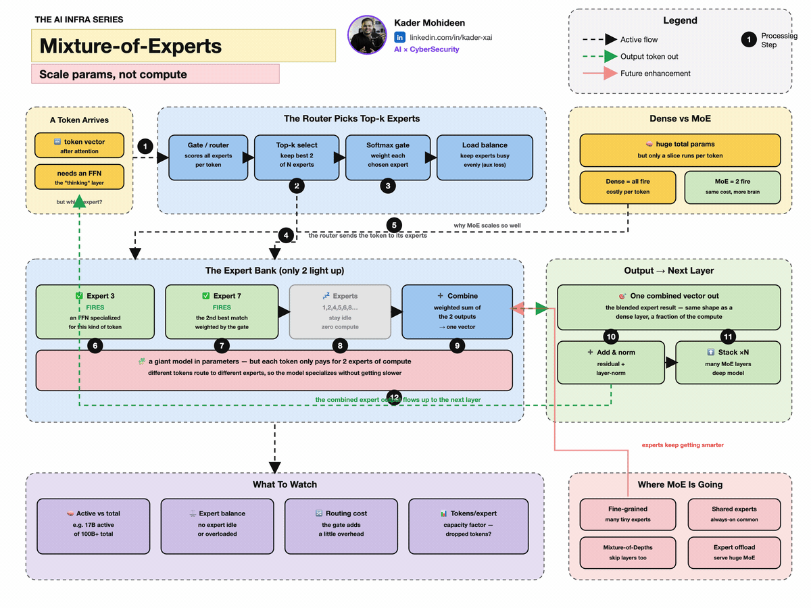

[← Full AI Course](../full-ai-course.html) &nbsp;·&nbsp; [← Graphs, Ontologies & GraphRAG](graphs-ontologies.html)

{fig-alt="Animated mixture-of-experts model routing tokens to specialized expert networks" .fac-capstone-cover}

> **Snapshot date: August 2026.** “Frontier” pages age quickly. This capstone separates what is already useful, what is improving quickly, and what remains an open research or product claim. Follow the linked primary documentation and papers for current details.

## 1. The three-horizon view

### Practical now

- **Tool-using agents** with explicit tools, approvals, guardrails, and traces.
- **Multimodal models** that work across text, images, audio, and video.
- **Retrieval and GraphRAG** for grounding answers in private or changing evidence.
- **Parameter-efficient adaptation** such as LoRA and quantization-aware deployment.
- **Open connection protocols** such as MCP for capabilities and A2A for agent interoperability.

### Improving quickly

- **Test-time compute** that spends more inference effort on harder problems.
- **Durable agent workflows** that resume after interruptions and wait for human approval.
- **Smaller specialist models and routers** that use the expensive model only when needed.
- **World models** that predict how an environment may change after an action.
- **Embodied and spatial AI** connecting perception, planning, and physical action.
- **Neurosymbolic systems** combining learned representations with explicit rules and structured knowledge.

### Still uncertain

- Fully autonomous systems that can be trusted with broad, long-running goals.
- A universally accepted definition or test for artificial general intelligence.
- Reliable self-improvement without human-created data, feedback, or external verification.
- Perfect factuality from model scaling alone.
- Safe replacement of accountable human decision-makers in high-stakes settings.

::: {.callout-warning appearance="simple"}
The word **agentic** does not prove autonomy, reliability, or intelligence. Ask what the system can observe, which actions it can take, who approves them, how failures are detected, and how the run is audited.
:::

## 2. Test-time compute: thinking longer when it helps

Traditional scaling spends more compute during training. **Test-time scaling** spends more compute while solving a particular problem: generate several candidate solutions, search a reasoning tree, verify intermediate steps, or let a model revise its answer.

One simple version is majority voting across independently generated answers:

$$\hat y=\arg\max_y\sum_{i=1}^{N}\mathbf{1}[y_i=y]$$

**In words:** generate $N$ candidate answers, count how often each answer appears, and choose the most common.

```python
import torch

# Five sampled reasoning runs returned class IDs.
answers = torch.tensor([2, 2, 1, 2, 1])
votes = torch.bincount(answers)
final_answer = votes.argmax()

print("votes:", votes.tolist())
print("selected class:", final_answer.item())  # 2
```

More inference compute is not automatically better. Repeating a shared misconception can make the wrong answer more confident, and extra tokens increase latency and cost. A current research overview, [Test-Time Scaling in Reasoning LLMs](https://arxiv.org/abs/2608.04001), distinguishes multiple inference regimes and emphasizes budgeted, reproducible evaluation.

## 3. Routers and mixtures of experts

Not every input needs every parameter. A **Mixture of Experts (MoE)** model learns a router that sends each token to a small subset of specialist networks.

$$y=\sum_{i\in\operatorname{TopK}(g(x))}p_i(x)E_i(x)$$

**In words:** the router $g$ scores the experts, keeps the best $K$, and blends their outputs using routing weights $p_i$.

```python
import torch

router_logits = torch.tensor([2.4, 0.2, 1.7, -0.1])
weights = torch.softmax(router_logits, dim=0)
top_weights, top_experts = torch.topk(weights, k=2)
top_weights = top_weights / top_weights.sum()

print("experts:", top_experts.tolist())
print("normalized weights:", top_weights.tolist())
```

The same routing idea appears at the system level: a cheap model handles simple requests; a larger reasoning model receives the difficult ones; a deterministic tool handles exact calculation.

## 4. Protocols are becoming part of the AI stack

Modern AI systems need standard ways to connect:

- **MCP** standardizes how an AI application discovers and uses prompts, resources, and tools through a host–client–server architecture. See the [official MCP architecture](https://modelcontextprotocol.io/specification/2025-06-18/architecture).
- **A2A** standardizes discovery, messaging, artifacts, and task management between independent agent systems. See the [official A2A specification](https://a2a-protocol.org/v0.3.0/specification/).

Protocols reduce one kind of integration friction. They do not remove the need for authentication, authorization, consent, least privilege, output validation, or observability.

## 5. World models and embodied AI

A world model tries to predict what happens next:

$$\hat s_{t+1}=f_\theta(s_t,a_t)$$

**In words:** from the current state $s_t$ and an action $a_t$, predict the next state. An agent can compare possible actions inside the learned model before risking them in the real environment.

```python
import torch

class TinyWorldModel(torch.nn.Module):
    def __init__(self, state_dim, action_dim):
        super().__init__()
        self.transition = torch.nn.Sequential(
            torch.nn.Linear(state_dim + action_dim, 32),
            torch.nn.ReLU(),
            torch.nn.Linear(32, state_dim)
        )

    def forward(self, state, action):
        return self.transition(torch.cat([state, action], dim=-1))
```

The hard part is not writing this network. It is learning a model accurate enough that planning inside it helps rather than amplifies prediction error. Physical systems also face safety, sensing error, changing environments, and the gap between simulation and reality.

## 6. Grounding is moving from “nice to have” to architecture

Larger context windows do not solve every knowledge problem. Modern systems combine several forms of grounding:

| Grounding layer | What it contributes |
|---|---|
| Retrieval | Current source passages |
| Knowledge graph | Entities and relationships |
| Ontology | Shared types, rules, and constraints |
| Tools | Exact or live external operations |
| Verification model or code | Independent checks |
| Human approval | Accountability for consequential action |

Microsoft’s current [GraphRAG documentation](https://microsoft.github.io/graphrag/index/overview/) describes a pipeline that extracts entities, relationships, and claims, detects graph communities, creates summaries, and embeds text. This is one concrete example of combining unstructured language with explicit structure.

## 7. The frontier evaluation problem

Benchmark gains can disappear when the task, prompt, tool, or scoring rule changes. For emerging systems, evaluate at three levels:

1. **Capability** — can the model solve a controlled task?
2. **System behavior** — can the full workflow solve it with tools, failures, latency, and cost?
3. **Operational value** — does it improve the real process without unacceptable risk?

A useful frontier scorecard:

| Dimension | Ask |
|---|---|
| Accuracy | Is the result correct on representative cases? |
| Grounding | Can every important claim be traced to evidence? |
| Robustness | What happens when a tool fails or context is malicious? |
| Autonomy boundary | Which actions require approval? |
| Cost and latency | Is the gain worth the extra inference? |
| Drift | How quickly do prompts, models, protocols, and data change? |
| Accountability | Who owns a harmful or incorrect action? |

## 8. How to keep this page current

For every “new AI” announcement, record:

- the claim and the date;
- whether the evidence is a paper, product demo, benchmark, or production case;
- the baseline and evaluation conditions;
- the required compute, data, and human supervision;
- the failure cases and security boundary;
- what changed in the underlying mechanism—not only the product name.

The most durable learning strategy is to keep returning to the same foundations: probability, optimization, representations, search, feedback, and systems constraints. New architectures rearrange these pieces; they rarely escape them.

::: {.callout-note appearance="simple"}
**Continue exploring:** [Emerging Directions](../ai-ml-encyclopedia/ch39.html), [Graph Machine Learning](../ai-ml-encyclopedia/ch40.html), [Robotics & Autonomy](../ai-ml-encyclopedia/ch41.html), [LLM Systems](../ai-ml-encyclopedia/ch44.html), and [Alignment & Evaluation](../ai-ml-encyclopedia/ch46.html).
:::

[← Graphs, Ontologies & GraphRAG](graphs-ontologies.html) &nbsp;·&nbsp; [Return to the Full AI Course](../full-ai-course.html)
