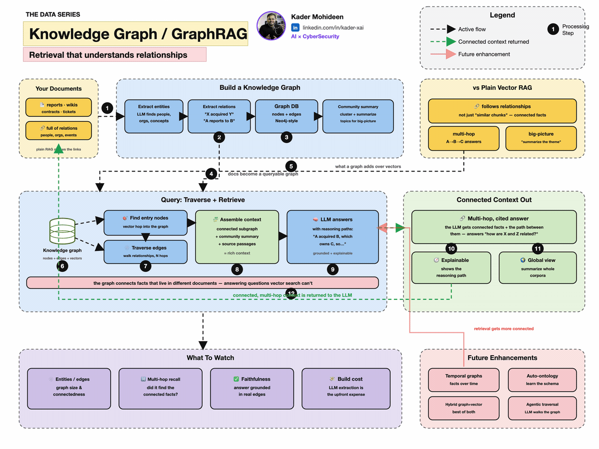

[← Full AI Course](../full-ai-course.html) &nbsp;·&nbsp; [← AI Agents](agents.html) &nbsp;·&nbsp; [Next: Frontier Watch →](frontier.html)

{fig-alt="Animated knowledge graph showing connected entities for GraphRAG" .fac-capstone-cover}

A table is excellent when every row has the same shape. A **graph** is better when the connections are part of the meaning: people know people, devices talk to services, hotels sit in districts, and documents mention organizations.

This capstone separates four related ideas that are often blended together.

| Idea | What it provides | Simplest mental picture |
|---|---|---|
| Graph | Nodes and edges | Things connected to things |
| Knowledge graph | Meaningful entities and relationships | Facts stored as a network |
| Ontology | Shared types, properties, and rules | The grammar of the knowledge |
| GraphRAG | Graph-based context for an LLM | Retrieve connected evidence before answering |

## 1. Start with a triple

A knowledge graph can be built from simple **subject–predicate–object** triples:

```text
(Hotel_A, located_in, Riyadh)
(Hotel_A, has_control, CCTV)
(CCTV, mitigates, Physical_Intrusion)
(Physical_Intrusion, is_a, Security_Risk)
```

The nodes are entities such as `Hotel_A` and `CCTV`. The labeled edges—`located_in`, `has_control`, and `mitigates`—state what the relationships mean.

An **ontology** adds a shared contract:

- `Hotel` is a type of `Property`.
- `has_control` connects a `Property` to a `Security_Control`.
- every `CCTV` is a `Security_Control`.
- `mitigates` connects a control to a risk.

Now a reasoner can infer that `Hotel_A` is a `Property` and that its CCTV is a security control, even if those two facts were not written directly.

::: {.callout-tip appearance="simple"}
**Graph = connections. Knowledge graph = meaningful facts. Ontology = agreed vocabulary and rules.** You can have a graph without an ontology, but an ontology makes independently created data easier to combine and reason over.
:::

## 2. Graphs as matrices

For three nodes, an **adjacency matrix** $A$ records which pairs are connected:

$$
A=\begin{bmatrix}
0 & 1 & 1\\
1 & 0 & 0\\
1 & 0 & 0
\end{bmatrix}
$$

Row 1 says node 1 connects to nodes 2 and 3. A zero means no direct edge. This matrix representation lets standard linear algebra operate on a graph.

```python
import torch

A = torch.tensor([
    [0., 1., 1.],
    [1., 0., 0.],
    [1., 0., 0.]
])

degree = A.sum(dim=1)
print(degree)  # tensor([2., 1., 1.])
```

The **degree** is simply the number of neighbors. In directed or weighted graphs the same idea extends to incoming, outgoing, or weighted connections.

## 3. A graph neural network in one formula

A Graph Convolutional Network lets each node update its representation from its neighbors:

$$H^{(l+1)}=\sigma\left(\hat D^{-1/2}\hat A\hat D^{-1/2}H^{(l)}W^{(l)}\right)$$

Read it from right to left:

1. $H^{(l)}$ contains the current feature vector for every node.
2. $W^{(l)}$ learns which feature combinations matter.
3. $\hat A=A+I$ adds a self-connection so each node keeps its own information.
4. $\hat D^{-1/2}$ normalizes for nodes with many neighbors.
5. $\sigma$ adds a non-linear activation.

The same layer written directly in PyTorch:

```python
import torch

# 3 nodes, each with 2 input features
H = torch.tensor([
    [1.0, 0.2],
    [0.1, 1.0],
    [0.8, 0.4]
])
A = torch.tensor([
    [0., 1., 1.],
    [1., 0., 0.],
    [1., 0., 0.]
])
W = torch.tensor([
    [0.7, -0.2],
    [0.3,  0.8]
])

A_hat = A + torch.eye(A.shape[0])
degree = A_hat.sum(dim=1)
D_inv_sqrt = torch.diag(degree.pow(-0.5))
A_norm = D_inv_sqrt @ A_hat @ D_inv_sqrt

H_next = torch.relu(A_norm @ H @ W)
print(H_next)
```

This is **message passing**: transform each node’s information, send it along the edges, aggregate what arrives, and update the node.

## 4. Ontologies in RDF and OWL

The Semantic Web stack provides standard ways to express graph facts and schemas:

- **RDF** represents triples.
- **RDFS** adds basic classes, properties, domains, and ranges.
- **OWL** adds richer logical statements and constraints.
- **SPARQL** queries RDF graphs.

A tiny example in Turtle syntax:

```turtle
@prefix ex: <https://example.org/> .
@prefix rdfs: <http://www.w3.org/2000/01/rdf-schema#> .

ex:Hotel rdfs:subClassOf ex:Property .
ex:CCTV rdfs:subClassOf ex:SecurityControl .
ex:Hotel_A a ex:Hotel ;
    ex:hasControl ex:Camera_7 .
ex:Camera_7 a ex:CCTV .
```

Because `Hotel` is a subclass of `Property`, a reasoner can infer:

```text
Hotel_A is a Property
```

The strength of an ontology is not that it adds more text. It adds **shared meaning that software can check**.

## 5. Embeddings and symbolic meaning are complementary

An embedding maps an item into a learned vector. It is good at **similarity**: “these two passages feel related.” An ontology is good at **explicit meaning and rules**: “a hotel is a property, and every property must have an owner.”

| Embeddings | Ontologies |
|---|---|
| Fuzzy similarity | Explicit semantics |
| Learned from data | Designed or curated |
| Tolerant of wording differences | Supports rules and consistency checks |
| Can be difficult to explain | Human-readable relationships |

Modern systems combine them: vectors retrieve semantically similar evidence; graphs connect entities; ontologies constrain the vocabulary; an LLM turns the retrieved evidence into an answer.

## 6. What GraphRAG changes

Basic RAG usually retrieves text chunks whose vectors are close to the question. This is strong for local questions, but it can miss answers that require connecting distant facts.

GraphRAG first extracts **entities, relationships, and claims**, builds communities in the graph, and prepares summaries. At question time it can retrieve around a specific entity or reason over broader community summaries. Microsoft’s current [GraphRAG overview](https://microsoft.github.io/graphrag/index/overview/) describes this indexing pipeline, and the [query documentation](https://microsoft.github.io/graphrag/query/overview/) separates local, global, DRIFT, and basic search modes.

```{=html}
<div class="fac-pipeline" role="img" aria-label="GraphRAG pipeline from documents to entities and relationships to communities to retrieved evidence to grounded answer">
  <span>Documents</span><i>→</i><span>Entities + relations</span><i>→</i><span>Communities</span><i>→</i><span>Evidence</span><i>→</i><span>Answer</span>
</div>
```

GraphRAG is not automatically better for every question. Its indexing can cost more, extracted graphs can contain mistakes, and simple vector search may be faster and sufficient for direct fact lookup.

## 7. A hybrid retrieval score

A practical retriever can combine vector similarity with graph distance:

$$\text{score}(d,q)=\alpha\,\cos(e_d,e_q)+(1-\alpha)\frac{1}{1+\operatorname{dist}_{G}(d,q)}$$

**In words:** reward semantic similarity between document and question embeddings, then add a graph bonus for evidence close to the relevant entity.

```python
import torch
import torch.nn.functional as F

query = torch.tensor([[0.9, 0.1, 0.4]])
documents = torch.tensor([
    [0.8, 0.2, 0.5],
    [0.2, 0.9, 0.1],
    [0.6, 0.1, 0.7]
])
graph_distance = torch.tensor([1., 0., 3.])

semantic = F.cosine_similarity(documents, query.expand_as(documents))
graph_bonus = 1 / (1 + graph_distance)
alpha = 0.75
score = alpha * semantic + (1 - alpha) * graph_bonus

print(score)
print("best document:", score.argmax().item())
```

The weights must be tuned on real questions. A beautiful formula is not a substitute for evaluation.

## 8. Common failure modes

- **Entity duplication** — “Kader Mohideen,” “Kader M.,” and “Kader” become three nodes.
- **Wrong edge direction** — `controls` is stored as `controlled_by`.
- **Schema drift** — different teams invent overlapping relationship names.
- **Hallucinated relationships** — the extraction model adds a plausible but unsupported edge.
- **Stale facts** — a correct relationship changes over time.
- **Graph explosion** — everything connects to everything, so retrieval becomes noise.
- **False authority** — the graph looks structured, so users assume every fact is true.

Preserve provenance for every extracted claim: source document, location, extraction time, and confidence. The graph should make evidence easier to inspect, not hide it.

## 9. When to use what

| Need | Good starting point |
|---|---|
| Find passages similar to a question | Vector RAG |
| Answer questions about relationships | Knowledge graph |
| Enforce shared types and business rules | Ontology |
| Learn from network structure | Graph neural network |
| Connect distant facts across a corpus | GraphRAG |
| Small, clean, relational dataset | SQL may be enough |

::: {.callout-note appearance="simple"}
**Continue the course:** deepen the pieces in [Linear Algebra](../ai-ml-encyclopedia/ch01.html), [Probabilistic Graphical Models](../ai-ml-encyclopedia/ch13.html), [Knowledge Representation & Reasoning](../ai-ml-encyclopedia/ch33.html), [Graph Machine Learning](../ai-ml-encyclopedia/ch40.html), and [Information Retrieval](../ai-ml-encyclopedia/ch43.html).
:::

[← AI Agents](agents.html) &nbsp;·&nbsp; [Course map](../full-ai-course.html) &nbsp;·&nbsp; [Next capstone: Frontier Watch →](frontier.html)
