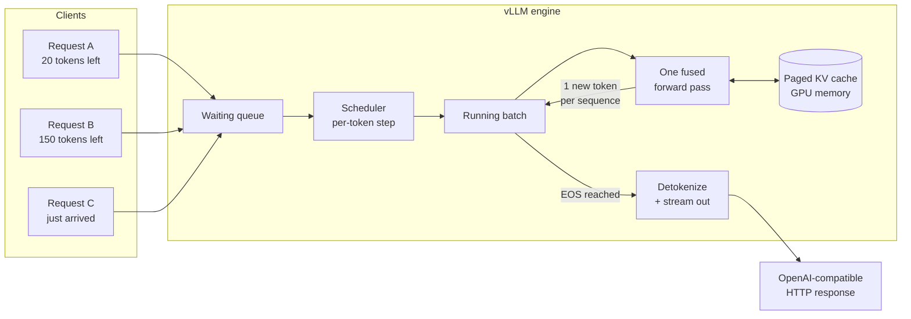
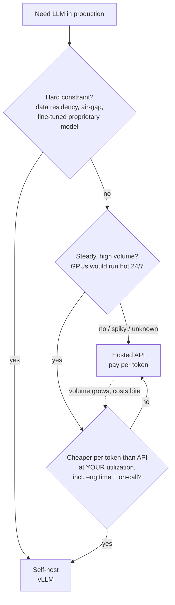

[🏠 🚢 Course home](index.html)  &nbsp;|&nbsp;  [← Day 06](day06.html)  &nbsp;|&nbsp;  [Day 08 →](day08.html)  &nbsp;|&nbsp;  [📚 All mini-courses](../../mini-courses.html)

------------------------------------------------------------------------

# Day 7 — Serving LLMs: vLLM in Practice

Yesterday you wrapped the churn model in FastAPI and it worked beautifully: load a pickle once at startup, run `predict_proba` in a few milliseconds, return JSON. Today we hit the case where that recipe collapses. Our product team wants a new endpoint — `/explain` — that turns a churn prediction into a plain-English explanation a support agent can read to a customer. That means serving a large language model, and an LLM is not "a bigger sklearn model." It's an autoregressive generator whose cost, memory behavior, and batching semantics are so different that a whole class of specialized servers exists for it. Today you'll stand up **vLLM**, the de-facto open-source standard, talk to it through the OpenAI-compatible API, understand *why* it's fast (continuous batching + PagedAttention), and learn the two knobs that trade throughput against latency. We'll close with the question every team should ask first: should you be self-hosting at all?

::: {.callout-note appearance="simple"}
🎯 **Today you will:** launch an open model with `vllm serve`, call it from Python via the OpenAI client (including streaming), wire an LLM explanation endpoint into the Day 6 churn service, tune `--max-num-seqs` and `--gpu-memory-utilization` with a real benchmark, and run a quantized model on a small GPU
:::

## Why the Day 6 recipe fails for LLMs

The three-line recap:

1. **One request ≠ one forward pass.** A churn prediction is a single matrix multiply; an LLM generates a 300-token answer with 300 *sequential* forward passes — you can't parallelize across a request's own tokens.
2. **Requests have wildly different, unknowable durations.** One user asks for a one-word answer, another for an essay. Static batching (wait, group, run, return) makes short requests wait for the longest one in the batch.
3. **The KV cache eats your GPU.** Every in-flight request holds gigabytes of attention state that grows token by token; naive allocation fragments memory and caps your concurrency long before compute does.

Let's put numbers on point 3, because it drives everything else today. During generation, the model caches the key and value vectors of every past token in every layer (see the encyclopedia's *Transformers* and *Model Serving* chapters for the theory). Per token, that costs:

$$
\text{KV bytes per token} = 2 \times n_{layers} \times n_{kv\_heads} \times d_{head} \times \text{bytes per param}
$$

For a Llama-3-8B-class model in fp16 ($n_{layers}=32$, $n_{kv\_heads}=8$, $d_{head}=128$, 2 bytes), that's $2 \times 32 \times 8 \times 128 \times 2 = 131{,}072$ bytes — **128 KB per token**. A single 8K-context conversation holds ~1 GB of cache. Forty concurrent users? Do the math and weep. A server that allocates each request's maximum context up front — which is what naive HuggingFace `generate()` serving effectively does — runs out of memory at a handful of concurrent requests while the GPU's compute units sit idle.

vLLM attacks exactly this: it schedules requests *token by token* (continuous batching) and allocates KV cache in small pages on demand (PagedAttention). Same model, same weights, typically 5–20× more throughput than a naive server.



The key detail in that diagram: the scheduler re-forms the batch **at every generation step**. When request A finishes its 20 remaining tokens, its slot — and its KV pages — are immediately handed to request C. Nobody waits for B's essay.

## Launching a model with `vllm serve`

vLLM ships a production HTTP server out of the box. No FastAPI wrapper needed — this is one of the rare cases where you should *not* build the server yourself, because the value is in the engine loop, and the bundled server is already OpenAI-compatible.

Install (needs Linux + an NVIDIA GPU; we'll deal with "I only have a laptop" in the quantization section and the task):

```bash
pip install vllm
```

Then serve a small open model. We'll use Qwen2.5-1.5B-Instruct — good quality for its size, fits in ~6 GB of VRAM, downloads fast:

```bash
vllm serve Qwen/Qwen2.5-1.5B-Instruct \
  --max-model-len 4096 \
  --gpu-memory-utilization 0.90 \
  --port 8001
```

Walk through the flags, because each encodes a real decision:

- **`Qwen/Qwen2.5-1.5B-Instruct`** — a HuggingFace repo ID. vLLM downloads weights on first launch (set `HF_HOME` to control the cache directory; in Docker you'll mount it as a volume, exactly like the model artifact volume from Day 5).
- **`--max-model-len 4096`** — the maximum context (prompt + generation) per request. This is a *capacity contract*: shorter max length ⇒ smaller worst-case KV footprint per sequence ⇒ more concurrent sequences fit. Don't default to the model's native 32K if your prompts are 500 tokens; you'd be reserving profile space you never use.
- **`--gpu-memory-utilization 0.90`** — vLLM pre-allocates this fraction of total VRAM at startup: weights first, and **everything left over becomes KV cache pages**. More on tuning this below.
- **`--port 8001`** — our churn API from Day 6 already owns 8000.

Startup logs are worth reading once, carefully. Look for this line:

```
INFO ... # GPU blocks: 21472, # CPU blocks: 4681
INFO ... Maximum concurrency for 4096 tokens per request: 83.87x
```

That's vLLM telling you its KV budget: 21,472 blocks × 16 tokens/block ≈ 343K tokens of cache. Divided by your 4096 max-model-len, ~84 worst-case-sized requests can be resident at once. This one log line answers "how many concurrent users can I take?" better than any load test guess.

Sanity check the server — it speaks the OpenAI REST API:

```bash
curl -s http://localhost:8001/v1/models | python -m json.tool
```

```json
{
    "object": "list",
    "data": [
        {
            "id": "Qwen/Qwen2.5-1.5B-Instruct",
            "object": "model",
            ...
        }
    ]
}
```

## Talking to it from Python: the OpenAI-compatible API

Because vLLM implements the OpenAI API surface, the client is the standard `openai` package pointed at your own box. This is a deliberate ecosystem convention, and it's the reason "when NOT to self-host" (last section) is a cheap decision to reverse: the calling code is identical either way.

```python
# explain_client.py
from openai import OpenAI

client = OpenAI(
    base_url="http://localhost:8001/v1",
    api_key="not-needed",  # vLLM ignores it unless you pass --api-key at launch
)

resp = client.chat.completions.create(
    model="Qwen/Qwen2.5-1.5B-Instruct",
    messages=[
        {"role": "system", "content": "You are a concise assistant for customer-support agents."},
        {"role": "user", "content": "In one sentence, why do telecom customers on month-to-month contracts churn more?"},
    ],
    max_tokens=80,
    temperature=0.2,
)
print(resp.choices[0].message.content)
```

```
Month-to-month customers face no switching cost or contract penalty, so any
price increase or service issue can immediately push them to a competitor.
```

Two parameters deserve a note. `max_tokens` is your latency ceiling — generation time is roughly linear in output tokens, so an unbounded `max_tokens` means unbounded p99 latency. Set it. `temperature=0.2` keeps explanations consistent between calls; for a support tool you want reliability, not creativity.

For anything user-facing, **stream**. Time-to-first-token (TTFT) for a short prompt is tens of milliseconds; the full 80-token answer might take 1–2 seconds. Streaming makes the difference between "instant" and "sluggish" perceived latency:

```python
stream = client.chat.completions.create(
    model="Qwen/Qwen2.5-1.5B-Instruct",
    messages=[{"role": "user", "content": "List three churn-risk warning signs."}],
    max_tokens=120,
    temperature=0.2,
    stream=True,
)
for chunk in stream:
    delta = chunk.choices[0].delta.content
    if delta:
        print(delta, end="", flush=True)
print()
```

Now the payoff: wire this into the Day 6 churn service. The architecture is two processes — the churn API stays a lean CPU service; vLLM runs as its own GPU service. Never load an LLM inside your FastAPI workers: it would couple your API's memory footprint and restart time to a multi-gigabyte model, and Day 5 taught us one concern per container.

```python
# app/explain.py -- add to the Day 6 FastAPI app
import os
from fastapi import APIRouter
from openai import AsyncOpenAI
from pydantic import BaseModel

router = APIRouter()

llm = AsyncOpenAI(
    base_url=os.environ.get("LLM_BASE_URL", "http://localhost:8001/v1"),
    api_key="not-needed",
)
LLM_MODEL = os.environ.get("LLM_MODEL", "Qwen/Qwen2.5-1.5B-Instruct")

class ExplainRequest(BaseModel):
    churn_probability: float
    top_features: dict[str, float]  # feature -> value, from the Day 6 prediction

class ExplainResponse(BaseModel):
    explanation: str

@router.post("/explain", response_model=ExplainResponse)
async def explain(req: ExplainRequest) -> ExplainResponse:
    feature_lines = "\n".join(f"- {k}: {v}" for k, v in req.top_features.items())
    resp = await llm.chat.completions.create(
        model=LLM_MODEL,
        messages=[
            {"role": "system",
             "content": "You write 2-sentence churn-risk explanations for support agents. "
                        "Plain English, no jargon, no probabilities repeated back."},
            {"role": "user",
             "content": f"Churn probability: {req.churn_probability:.0%}\n"
                        f"Key customer attributes:\n{feature_lines}"},
        ],
        max_tokens=100,
        temperature=0.2,
    )
    return ExplainResponse(explanation=resp.choices[0].message.content.strip())
```

Methodology notes on this block:

- **`AsyncOpenAI`, not `OpenAI`.** The Day 6 endpoints are `async def`. A synchronous LLM call taking 1–2 seconds would block the event loop and freeze *every* concurrent request on that worker — including plain `/predict` calls that have nothing to do with the LLM. This is the single most common way people break a FastAPI service when adding LLM calls.
- **Endpoint URL from the environment.** Same twelve-factor pattern as the model path in Day 5: the container image doesn't change between "vLLM on localhost" and "vLLM on a GPU node across the network" — only `LLM_BASE_URL` does. It's also your escape hatch: point it at `https://api.openai.com/v1` (plus a real key) and you've swapped self-hosted for hosted with zero code changes.
- **The prompt is structured data, not prose.** We feed the model the same features the classifier used, so the explanation is grounded in the actual prediction inputs rather than hallucinated generalities.

## Under the hood: continuous batching and PagedAttention

You don't need vLLM's internals to use it, but you need the mental model to *tune* it — otherwise the knobs in the next section are cargo-cult flags.

**Continuous batching** (also called in-flight or iteration-level batching): instead of batching whole *requests*, vLLM batches *generation steps*. Each engine step, it takes every running sequence, runs one fused forward pass producing one new token for each, then re-checks the queue: finished sequences leave, waiting sequences join, immediately. GPU utilization stays high even with ragged, unpredictable request lengths — the pathology in recap point 2 disappears by construction.

**PagedAttention** solves recap point 3 the way operating systems solved RAM fragmentation fifty years ago: virtual memory. Instead of reserving one contiguous KV region per request sized for the worst case, vLLM chops the cache into fixed-size **blocks** (16 tokens each by default) and hands them to sequences on demand, tracked through a block table — a page table for attention. A sequence that generates 50 tokens occupies ⌈50/16⌉ = 4 blocks, not a 4096-token reservation. Internal fragmentation drops from "most of the GPU" to "at most 15 tokens per sequence," which is why that startup log could promise ~84-way concurrency.

<svg viewBox="0 0 720 340" xmlns="http://www.w3.org/2000/svg" font-family="sans-serif" font-size="13">
  <text x="20" y="28" fill="currentColor" font-weight="bold">Naive contiguous KV allocation</text>
  <rect x="20" y="40" width="330" height="40" rx="4" fill="none" stroke="currentColor" stroke-opacity="0.5"/>
  <rect x="20" y="40" width="70" height="40" rx="4" fill="#6366f1" fill-opacity="0.55"/>
  <text x="30" y="65" fill="currentColor">used</text>
  <text x="150" y="65" fill="currentColor" opacity="0.65">reserved for max_len — wasted</text>
  <text x="360" y="65" fill="currentColor" opacity="0.8">← Request A</text>

  <rect x="20" y="95" width="330" height="40" rx="4" fill="none" stroke="currentColor" stroke-opacity="0.5"/>
  <rect x="20" y="95" width="180" height="40" rx="4" fill="#f59e0b" fill-opacity="0.55"/>
  <text x="30" y="120" fill="currentColor">used</text>
  <text x="230" y="120" fill="currentColor" opacity="0.65">wasted</text>
  <text x="360" y="120" fill="currentColor" opacity="0.8">← Request B</text>
  <text x="20" y="165" fill="currentColor" opacity="0.85">2 requests fill the GPU; most bytes hold nothing.</text>

  <text x="20" y="210" fill="currentColor" font-weight="bold">PagedAttention: block pool + block tables</text>
  <g>
    <rect x="20"  y="225" width="42" height="34" rx="4" fill="#6366f1" fill-opacity="0.55" stroke="currentColor" stroke-opacity="0.4"/>
    <rect x="66"  y="225" width="42" height="34" rx="4" fill="#f59e0b" fill-opacity="0.55" stroke="currentColor" stroke-opacity="0.4"/>
    <rect x="112" y="225" width="42" height="34" rx="4" fill="#6366f1" fill-opacity="0.55" stroke="currentColor" stroke-opacity="0.4"/>
    <rect x="158" y="225" width="42" height="34" rx="4" fill="#22c55e" fill-opacity="0.55" stroke="currentColor" stroke-opacity="0.4"/>
    <rect x="204" y="225" width="42" height="34" rx="4" fill="#f59e0b" fill-opacity="0.55" stroke="currentColor" stroke-opacity="0.4"/>
    <rect x="250" y="225" width="42" height="34" rx="4" fill="#ec4899" fill-opacity="0.55" stroke="currentColor" stroke-opacity="0.4"/>
    <rect x="296" y="225" width="42" height="34" rx="4" fill="#22c55e" fill-opacity="0.55" stroke="currentColor" stroke-opacity="0.4"/>
    <rect x="342" y="225" width="42" height="34" rx="4" fill="none" stroke="currentColor" stroke-opacity="0.4" stroke-dasharray="4 3"/>
    <rect x="388" y="225" width="42" height="34" rx="4" fill="none" stroke="currentColor" stroke-opacity="0.4" stroke-dasharray="4 3"/>
    <text x="435" y="247" fill="currentColor" opacity="0.7">free blocks</text>
  </g>
  <text x="20" y="285" fill="currentColor"><tspan fill="#6366f1" font-weight="bold">■</tspan> req A   <tspan fill="#f59e0b" font-weight="bold">■</tspan> req B   <tspan fill="#22c55e" font-weight="bold">■</tspan> req C   <tspan fill="#ec4899" font-weight="bold">■</tspan> req D — blocks need not be contiguous</text>
  <text x="20" y="315" fill="currentColor" opacity="0.85">Block table maps each sequence's logical positions → physical blocks. Waste ≤ 15 tokens/seq.</text>
</svg>

One bonus you get for free: **prefix caching**. Because blocks are addressable units, identical prompt prefixes (like our fixed system prompt in `/explain`) can share physical blocks across requests — vLLM enables this automatically, so your system prompt is computed once, not once per request.

## The two knobs: throughput vs latency

Almost all vLLM tuning reduces to a supply/demand pair:

| Flag | Controls | Raise it when | Cost of raising |
|------|----------|---------------|-----------------|
| `--gpu-memory-utilization` | Supply: fraction of VRAM for weights + KV pool (default 0.9) | You see "waiting" sequences / preemption warnings and have headroom | OOM risk if other processes share the GPU |
| `--max-num-seqs` | Demand: max sequences in one engine step (default ~256) | Throughput-oriented batch workloads | Each step does more work ⇒ higher inter-token latency for everyone |
| `--max-model-len` | Per-sequence worst case | You actually need long contexts | Bigger worst-case KV per seq ⇒ fewer concurrent seqs |

The fundamental trade: **bigger batches amortize weight-loading and raise tokens/sec for the fleet, but every sequence in a big batch waits on a heavier forward step, so per-user inter-token latency rises.** A chat product cares about TTFT and smooth streaming ⇒ cap `--max-num-seqs` lower (say 32–64). An offline batch job (score a million support tickets overnight) cares only about total tokens/hour ⇒ let it rip.

Don't guess — measure. Here's a minimal async benchmark you can point at your own server:

```python
# bench.py -- crude but honest: TTFT + throughput under concurrency
import asyncio, time
from openai import AsyncOpenAI

client = AsyncOpenAI(base_url="http://localhost:8001/v1", api_key="x")
MODEL = "Qwen/Qwen2.5-1.5B-Instruct"

async def one_request(i: int) -> tuple[float, float, int]:
    t0 = time.perf_counter()
    ttft, n_tokens = None, 0
    stream = await client.chat.completions.create(
        model=MODEL,
        messages=[{"role": "user", "content": f"Write {50+i%20} words about customer retention."}],
        max_tokens=150, temperature=0.7, stream=True,
    )
    async for chunk in stream:
        if chunk.choices[0].delta.content:
            if ttft is None:
                ttft = time.perf_counter() - t0
            n_tokens += 1
    return ttft, time.perf_counter() - t0, n_tokens

async def main(concurrency: int = 32):
    t0 = time.perf_counter()
    results = await asyncio.gather(*(one_request(i) for i in range(concurrency)))
    wall = time.perf_counter() - t0
    ttfts = sorted(r[0] for r in results)
    total_tokens = sum(r[2] for r in results)
    print(f"concurrency={concurrency}  wall={wall:.1f}s")
    print(f"TTFT p50={ttfts[len(ttfts)//2]*1000:.0f}ms  p95={ttfts[int(len(ttfts)*0.95)]*1000:.0f}ms")
    print(f"throughput={total_tokens/wall:.0f} tok/s aggregate")

if __name__ == "__main__":
    asyncio.run(main())
```

Typical shape of results on a single mid-range GPU (yours will differ — that's the point of measuring):

```
concurrency=8    wall=4.2s   TTFT p50=45ms   p95=80ms    throughput=~290 tok/s
concurrency=64   wall=9.8s   TTFT p50=120ms  p95=310ms   throughput=~980 tok/s
concurrency=256  wall=31s    TTFT p50=1400ms p95=6200ms  throughput=~1200 tok/s
```

Read the pattern: aggregate throughput climbs then saturates, while tail latency degrades continuously. Somewhere on that curve is *your* operating point, defined by your latency SLO — the same SLO thinking you'll formalize in Day 9's monitoring. If p95 TTFT blows past your budget before throughput saturates, cap `--max-num-seqs` at the concurrency where it didn't. One warning sign to watch in server logs: `Sequence group ... is preempted` means the KV pool is over-subscribed and vLLM is evicting-and-recomputing sequences — throughput craters. Fix by raising `--gpu-memory-utilization`, lowering `--max-model-len`, or lowering `--max-num-seqs`.

## Quantized models: more model per gigabyte

Everything so far assumed fp16/bf16 weights: 2 bytes per parameter, so an 8B model needs ~16 GB before any KV cache. Quantization stores weights in 4 or 8 bits, cutting that 2–4×. For serving, the popular formats are **AWQ** and **GPTQ** (4-bit, pre-quantized checkpoints on the Hub) and **FP8** (on Hopper/Ada GPUs). Quality loss for a good 4-bit AWQ checkpoint is usually small — but "usually" is doing work in that sentence; always eval on *your* task, which is exactly what the evaluation harness you built in Days 2–3 is for.

Serving a quantized model is a checkpoint swap, not a code change:

```bash
vllm serve Qwen/Qwen2.5-7B-Instruct-AWQ \
  --max-model-len 4096 \
  --gpu-memory-utilization 0.90 \
  --port 8001
```

vLLM reads the quantization config from the checkpoint and picks the right kernels automatically. The strategic move this enables: on a 16 GB GPU you can serve a *7B model in 4-bit* (~4.5 GB weights, ~11 GB left for KV cache) instead of a *1.5B model in fp16*. For most quality-sensitive tasks, **a bigger quantized model beats a smaller full-precision one** — and the leftover VRAM becomes KV cache, i.e., concurrency.

Two caveats worth internalizing:

- Quantization shrinks **weights**, not KV cache — the 128 KB/token math from section 1 is unchanged (unless you also enable `--kv-cache-dtype fp8`, which is its own quality/eval decision).
- 4-bit kernels help most when **memory-bandwidth-bound** (small batches, latency-oriented serving). At huge batch sizes you become compute-bound and the speedup shrinks. Again: benchmark with `bench.py`, don't extrapolate from blog posts.

No GPU at all? For local development, the pattern survives: run [Ollama or llama.cpp's server] on your laptop — both expose the same OpenAI-compatible API, so `LLM_BASE_URL` is once more the only thing that changes. Develop against a local 1B model, deploy against vLLM on a GPU node.

## When NOT to self-host

The most important decision predates every flag above. Self-hosting an LLM means owning GPU procurement, capacity planning, model upgrades, CUDA driver archaeology, and a 24/7 pager for a service whose failure mode is "the GPU node died." A hosted API (Anthropic, OpenAI, or a hosted-open-weights provider) makes all of that someone else's job and bills you per token.



Rules of thumb:

- **Spiky or low traffic ⇒ hosted API.** A GPU you pay for 24/7 but use 4 hours a day is 6× more expensive than its benchmark price suggests. Token pricing converts fixed cost to variable cost, which is exactly what you want while demand is uncertain.
- **The cost crossover needs *your* utilization, not the GPU's spec sheet** — and the denominator must include the engineer-weeks that today's lesson compressed into an afternoon, plus who wakes up when it pages.
- **Self-hosting wins on hard constraints**, not vibes: data that can't leave your network, a fine-tuned model no provider hosts, latency floors that rule out a WAN hop, or genuinely huge steady volume.
- **Frontier-model quality is not self-hostable.** If the task needs the best available model, the decision is made for you.

And the tactical takeaway of the whole day: because vLLM speaks the OpenAI API, this is a **reversible** decision. Our `/explain` endpoint switches between self-hosted Qwen and a hosted frontier model by changing two environment variables. Build the abstraction boundary (which the ecosystem already built for you), start with whichever side is cheaper *today*, and let Day 9's cost and latency dashboards tell you when to cross over.

## 🧪 Your task

Add an offline batch job to the churn project: given a CSV of the 50 highest-risk customers (from Day 6's `/predict`), generate a one-sentence retention-offer suggestion for each — **without going through HTTP**. Use vLLM's offline Python API (`from vllm import LLM, SamplingParams`), which drives the same engine in-process and is the right tool for batch jobs (no server, no ports, maximal throughput). Write the results to `suggestions.csv`. Time the whole run and compute tokens/sec.

*Hint:* `LLM.chat()` accepts a **list of conversations** and batches them through continuous batching automatically — one call, not a loop of 50 calls. Build one `SamplingParams(max_tokens=60, temperature=0.3)` and pass it once. If you're GPU-less, do the same exercise against a local Ollama server with `AsyncOpenAI` + `asyncio.gather` — the batching then happens server-side.

<details><summary>Solution</summary>

```python
# batch_suggest.py
import time
import pandas as pd
from vllm import LLM, SamplingParams

# 1. Load the high-risk cohort (produced on Day 6)
df = pd.read_csv("high_risk_customers.csv")  # columns: customer_id, churn_prob, contract, tenure, monthly_charges

# 2. Build one conversation per customer
SYSTEM = ("You suggest ONE concrete retention offer for a telecom customer, "
          "in a single sentence. Be specific to the customer's situation.")

conversations = [
    [
        {"role": "system", "content": SYSTEM},
        {"role": "user", "content": (
            f"Churn probability: {row.churn_prob:.0%}. "
            f"Contract: {row.contract}. Tenure: {row.tenure} months. "
            f"Monthly charges: ${row.monthly_charges:.0f}."
        )},
    ]
    for row in df.itertuples()
]

# 3. One engine, one sampling config, ONE batched call
llm = LLM(
    model="Qwen/Qwen2.5-1.5B-Instruct",
    max_model_len=2048,          # short prompts -> small KV worst case -> big batches
    gpu_memory_utilization=0.90,
)
params = SamplingParams(max_tokens=60, temperature=0.3)

t0 = time.perf_counter()
outputs = llm.chat(conversations, params)   # continuous batching handles all 50
elapsed = time.perf_counter() - t0

# 4. Collect + save. Outputs come back in input order.
df["suggestion"] = [o.outputs[0].text.strip() for o in outputs]
df.to_csv("suggestions.csv", index=False)

total_tokens = sum(len(o.outputs[0].token_ids) for o in outputs)
print(f"{len(df)} suggestions in {elapsed:.1f}s "
      f"({total_tokens/elapsed:.0f} generated tok/s)")

# smoke check: every row got a non-empty, single-ish sentence
assert df["suggestion"].str.len().gt(10).all()
print(df[["customer_id", "suggestion"]].head(3).to_string(index=False))
```

Expected shape of output:

```
50 suggestions in 6.8s (410 generated tok/s)
customer_id                                              suggestion
       7590  Offer a 12-month contract with a 20% discount ...
       5575  Waive one month of charges if they commit to a ...
       3668  Bundle a loyalty discount that lowers their $8 ...
```

Why one `llm.chat(conversations, ...)` call matters: a Python loop of 50 sequential `generate` calls serializes the requests and would take roughly 10–20× longer. Handing all 50 conversations to the engine at once lets continuous batching keep every step's batch full — the same mechanism that served concurrent HTTP users now serves your batch job.

</details>

## Key takeaways

- LLM serving breaks the Day 6 recipe because generation is sequential per request, request lengths are unpredictable, and the KV cache (~100+ KB/token for 8B-class models) dominates GPU memory.
- **Continuous batching** re-forms the batch every token; **PagedAttention** allocates KV cache in 16-token pages via block tables — together they're vLLM's 5–20× over naive serving.
- `vllm serve <hf-repo>` gives you a production OpenAI-compatible server; the standard `openai` client with a custom `base_url` is the entire integration, and `AsyncOpenAI` is mandatory inside async FastAPI handlers.
- Tune with two knobs: `--gpu-memory-utilization` sets KV supply, `--max-num-seqs` caps batch demand; bigger batches raise fleet throughput but degrade per-user latency — pick the operating point with a benchmark against your SLO, and treat preemption warnings as a red flag.
- 4-bit AWQ/GPTQ checkpoints shrink weights (not KV) 4×; a bigger quantized model usually beats a smaller fp16 one — but eval on your task.
- Default to a hosted API for spiky/low volume; self-host for data constraints, custom models, or high steady utilization — and since both sides speak the same API, the choice is two env vars, not a rewrite.

Tomorrow we stop deploying by hand: CI/CD for ML — pipelines that test, build, and ship the churn service (and catch a bad model before it ships) on every push.

------------------------------------------------------------------------

[🏠 🚢 Course home](index.html)  &nbsp;|&nbsp;  [← Day 06](day06.html)  &nbsp;|&nbsp;  [Day 08 →](day08.html)  &nbsp;|&nbsp;  [📚 All mini-courses](../../mini-courses.html)
