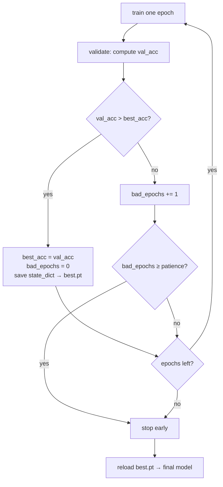

[🏠 🔥 Course home](index.html)  &nbsp;|&nbsp;  [← Lesson 06](lesson06.html)  &nbsp;|&nbsp;  [Lesson 08 →](lesson08.html)  &nbsp;|&nbsp;  [📚 All mini-courses](../../mini-courses.html)

------------------------------------------------------------------------

# Lesson 7 — Training Deeper Networks: Stability & Regularization

In the previous lesson you built a CNN and watched it learn CIFAR-10 — and if you trained it long enough, you also watched it *overfit*: training loss marching happily downward while validation accuracy stalled or slid backwards. That gap is the central enemy of Lesson 7. In this lesson we take the Lesson-6 network and bolt on the full modern stabilization kit: BatchNorm and Dropout in the right places, decoupled weight decay via AdamW, learning-rate schedules (including the one-cycle policy that can cut your training time in half), gradient clipping, and an early-stopping + checkpointing harness that always keeps the *best* weights, not the *last* ones. We'll also make every run reproducible, because you can't compare two training curves if neither of them can be re-run. By the end, the same architecture that plateaued around ~73% in the previous lesson will comfortably clear 85% — and you'll know exactly which ingredient bought you which points.

::: {.callout-note appearance="simple"}
🎯 **In this lesson you will:** seed every source of randomness for reproducible runs, rebuild the Lesson-6 CNN with correctly placed BatchNorm and Dropout, train it with AdamW + a OneCycle schedule + gradient clipping, implement early stopping with best-checkpoint saving, and compare baseline vs. upgraded learning curves side by side.
:::

## Reproducibility first: pinning down the randomness

Before we compare *anything*, we need two runs of the same code to produce the same numbers. Randomness in a PyTorch training run comes from at least four places: Python's `random`, NumPy, PyTorch's CPU RNG, and PyTorch's CUDA RNG(s). Data augmentation, weight init, dropout masks, and DataLoader shuffling all draw from these. Seed them all, once, at the top:

```python
import random
import numpy as np
import torch

def set_seed(seed: int = 42) -> None:
    random.seed(seed)                    # Python stdlib (some torchvision transforms use it)
    np.random.seed(seed)                 # NumPy (many datasets/augs use it)
    torch.manual_seed(seed)              # CPU RNG *and* seeds the default CUDA RNG
    torch.cuda.manual_seed_all(seed)     # every GPU, if you have several

set_seed(42)
```

`torch.manual_seed` alone covers most of PyTorch, but the Python and NumPy seeds matter because parts of the data pipeline live outside PyTorch. Two more knobs control *algorithmic* determinism on GPU:

```python
# Option A — fast (default-ish): let cuDNN benchmark and pick the fastest conv kernels.
torch.backends.cudnn.benchmark = True

# Option B — bit-exact reproducible, slightly slower:
# torch.backends.cudnn.deterministic = True
# torch.backends.cudnn.benchmark = False
```

The trap: `cudnn.benchmark = True` auto-tunes convolution algorithms per input shape, and some of the winning kernels are non-deterministic. For a course where we compare curves, seeding the RNGs is enough — run-to-run noise from cuDNN is tiny compared to the effects we're measuring. Flip to Option B when you need to reproduce a bug exactly.

One last leak: DataLoader workers. Each worker process gets its own RNG state, so with `num_workers > 0` your augmentations differ between runs unless you pin them too:

```python
def seed_worker(worker_id: int) -> None:
    worker_seed = torch.initial_seed() % 2**32
    np.random.seed(worker_seed)
    random.seed(worker_seed)

g = torch.Generator()
g.manual_seed(42)
# pass worker_init_fn=seed_worker, generator=g to DataLoader
```

`torch.initial_seed()` inside a worker returns a seed already derived from the main process seed plus the worker id — we just forward it to NumPy and `random`, which PyTorch doesn't do for us.

## The upgraded CNN: where BatchNorm and Dropout actually go

Here's the standard, battle-tested ordering inside a conv block, and the reasoning behind it:

<svg viewBox="0 0 720 150" xmlns="http://www.w3.org/2000/svg" font-family="sans-serif" font-size="13">
  <defs>
    <marker id="arr" markerWidth="8" markerHeight="8" refX="7" refY="4" orient="auto">
      <path d="M0,0 L8,4 L0,8 z" fill="currentColor"/>
    </marker>
  </defs>
  <rect x="10" y="45" width="100" height="44" rx="8" fill="#6366f1" fill-opacity="0.35" stroke="currentColor"/>
  <text x="60" y="63" text-anchor="middle" fill="currentColor">Conv2d</text>
  <text x="60" y="80" text-anchor="middle" fill="currentColor" font-size="10">bias=False</text>
  <rect x="150" y="45" width="110" height="44" rx="8" fill="#22c55e" fill-opacity="0.35" stroke="currentColor"/>
  <text x="205" y="63" text-anchor="middle" fill="currentColor">BatchNorm2d</text>
  <text x="205" y="80" text-anchor="middle" fill="currentColor" font-size="10">re-centers activations</text>
  <rect x="300" y="45" width="90" height="44" rx="8" fill="#f59e0b" fill-opacity="0.35" stroke="currentColor"/>
  <text x="345" y="63" text-anchor="middle" fill="currentColor">ReLU</text>
  <text x="345" y="80" text-anchor="middle" fill="currentColor" font-size="10">nonlinearity</text>
  <rect x="430" y="45" width="110" height="44" rx="8" fill="#38bdf8" fill-opacity="0.35" stroke="currentColor"/>
  <text x="485" y="63" text-anchor="middle" fill="currentColor">MaxPool2d</text>
  <text x="485" y="80" text-anchor="middle" fill="currentColor" font-size="10">downsample ×2</text>
  <rect x="580" y="45" width="110" height="44" rx="8" fill="#ec4899" fill-opacity="0.35" stroke="currentColor"/>
  <text x="635" y="63" text-anchor="middle" fill="currentColor">Dropout2d</text>
  <text x="635" y="80" text-anchor="middle" fill="currentColor" font-size="10">whole-channel drop</text>
  <line x1="110" y1="67" x2="148" y2="67" stroke="currentColor" stroke-width="1.5" marker-end="url(#arr)"/>
  <line x1="260" y1="67" x2="298" y2="67" stroke="currentColor" stroke-width="1.5" marker-end="url(#arr)"/>
  <line x1="390" y1="67" x2="428" y2="67" stroke="currentColor" stroke-width="1.5" marker-end="url(#arr)"/>
  <line x1="540" y1="67" x2="578" y2="67" stroke="currentColor" stroke-width="1.5" marker-end="url(#arr)"/>
  <text x="360" y="20" text-anchor="middle" fill="currentColor" font-size="14" font-weight="bold">Conv → BN → ReLU → (Pool) → Dropout</text>
  <text x="360" y="130" text-anchor="middle" fill="currentColor" font-size="11" opacity="0.75">BN immediately after conv (it normalizes the pre-activation); Dropout last (it would corrupt BN's batch statistics if placed before)</text>
</svg>

Three rules worth internalizing:

1. **BN goes between the conv and the activation.** BatchNorm normalizes each channel to zero mean / unit variance across the batch, then applies a learnable scale $\gamma$ and shift $\beta$. Normalizing the *pre-activation* keeps ReLU operating in its useful regime.
2. **`bias=False` on any conv followed by BN.** BN's $\beta$ immediately absorbs (and cancels) any conv bias — the bias parameters would just be dead weight that the optimizer still has to track.
3. **Dropout comes *after* BN, never before.** BN estimates batch statistics; feeding it dropout-mangled activations makes those statistics noisy and train/eval inconsistent. And in conv stacks, use `Dropout2d` (zeroes *entire channels*) — plain `Dropout` zeroes individual pixels, which adjacent pixels trivially compensate for, so it barely regularizes feature maps.

Now the model. Same skeleton as Lesson 6 — three downsampling stages on 32×32 CIFAR images — but each stage is now a proper block:

```python
import torch.nn as nn

def conv_block(cin: int, cout: int, p_drop: float) -> nn.Sequential:
    return nn.Sequential(
        nn.Conv2d(cin, cout, kernel_size=3, padding=1, bias=False),
        nn.BatchNorm2d(cout),
        nn.ReLU(inplace=True),
        nn.Conv2d(cout, cout, kernel_size=3, padding=1, bias=False),
        nn.BatchNorm2d(cout),
        nn.ReLU(inplace=True),
        nn.MaxPool2d(2),           # halves H and W
        nn.Dropout2d(p_drop),
    )

class CifarCNN(nn.Module):
    def __init__(self, num_classes: int = 10, p_drop: float = 0.15):
        super().__init__()
        self.features = nn.Sequential(
            conv_block(3,   64,  p_drop),   # (B, 3, 32, 32) -> (B,  64, 16, 16)
            conv_block(64,  128, p_drop),   #               -> (B, 128,  8,  8)
            conv_block(128, 256, p_drop),   #               -> (B, 256,  4,  4)
        )
        self.head = nn.Sequential(
            nn.Flatten(),                   # -> (B, 256*4*4) = (B, 4096)
            nn.Linear(256 * 4 * 4, 512),
            nn.ReLU(inplace=True),
            nn.Dropout(0.5),                # plain Dropout is right for Linear layers
            nn.Linear(512, num_classes),
        )

    def forward(self, x: torch.Tensor) -> torch.Tensor:
        return self.head(self.features(x))
```

Note the asymmetry: light `Dropout2d(0.15)` in the conv stages (conv layers share weights spatially and overfit less), heavy `Dropout(0.5)` on the wide fully-connected layer (4096 → 512 is where most of the memorization capacity lives).

One consequence you must never forget: **BatchNorm and Dropout behave differently in train vs. eval mode.** In training, BN uses *batch* statistics and updates running averages; in eval it uses the *running* averages. Dropout is active in training, identity in eval. Forgetting `model.eval()` before validation is the single most common "why is my val accuracy garbage and noisy?" bug — your validation batches of size 128 would be normalized by their own statistics and randomly dropped.

```python
model.train()   # BN: batch stats + update running stats; Dropout: active
model.eval()    # BN: running stats, frozen; Dropout: off
```

## AdamW: weight decay done right

Plain `Adam` with the `weight_decay` argument implements *L2 regularization*: the penalty is added to the gradient and then flows through Adam's adaptive rescaling. That coupling means parameters with large gradient variance get *less* effective decay — exactly backwards. `AdamW` decouples the decay: it subtracts $\lambda \cdot \text{lr} \cdot \theta$ from the weights directly, outside the adaptive machinery. In practice AdamW generalizes better and its `weight_decay` value actually means what it says. It's the default optimizer for modern deep learning; use it.

$$\theta_{t+1} = \theta_t - \eta \left( \frac{\hat{m}_t}{\sqrt{\hat{v}_t} + \epsilon} + \lambda \theta_t \right)$$

The $\lambda \theta_t$ term is applied as-is — not fed through $\hat{m}$ and $\hat{v}$.

One refinement that matters: **don't decay BatchNorm parameters or biases.** $\gamma$, $\beta$, and biases are 1-D; shrinking them toward zero fights BN's job of re-scaling activations and buys you nothing. The idiomatic split uses the fact that every parameter you *want* to decay (conv kernels, linear weights) has `ndim >= 2`:

```python
def param_groups(model: nn.Module, weight_decay: float):
    decay, no_decay = [], []
    for p in model.parameters():
        if not p.requires_grad:
            continue
        (no_decay if p.ndim < 2 else decay).append(p)
    return [
        {"params": decay,    "weight_decay": weight_decay},
        {"params": no_decay, "weight_decay": 0.0},
    ]

optimizer = torch.optim.AdamW(param_groups(model, 5e-2), lr=3e-3)
```

With decoupled decay you can afford much larger values than the `1e-5`-ish numbers you may have used with L2-in-Adam — `5e-2` is a normal AdamW setting.

## Learning-rate schedules: StepLR, Cosine, OneCycle

A constant learning rate is almost never optimal: you want big steps early (fast progress) and small steps late (settle into a good minimum). PyTorch wraps this in `torch.optim.lr_scheduler`. The three you'll meet everywhere:

<svg viewBox="0 0 720 300" xmlns="http://www.w3.org/2000/svg" font-family="sans-serif" font-size="12">
  <line x1="60" y1="250" x2="690" y2="250" stroke="currentColor" stroke-width="1.5"/>
  <line x1="60" y1="250" x2="60" y2="30" stroke="currentColor" stroke-width="1.5"/>
  <text x="375" y="285" text-anchor="middle" fill="currentColor">training progress →</text>
  <text x="25" y="140" text-anchor="middle" fill="currentColor" transform="rotate(-90 25 140)">learning rate</text>
  <!-- StepLR: staircase -->
  <path d="M60,90 L270,90 L270,150 L480,150 L480,205 L690,205" fill="none" stroke="#6366f1" stroke-width="3" stroke-opacity="0.9"/>
  <!-- Cosine -->
  <path d="M60,90 C170,95 240,120 340,160 C440,200 560,235 690,244" fill="none" stroke="#22c55e" stroke-width="3" stroke-opacity="0.9"/>
  <!-- OneCycle: warmup then anneal -->
  <path d="M60,215 C110,210 130,60 190,50 C260,42 320,90 420,150 C520,205 610,240 690,247" fill="none" stroke="#f59e0b" stroke-width="3" stroke-opacity="0.9"/>
  <!-- legend -->
  <rect x="480" y="40" width="200" height="72" rx="8" fill="#38bdf8" fill-opacity="0.12" stroke="currentColor" stroke-opacity="0.4"/>
  <line x1="492" y1="58" x2="522" y2="58" stroke="#6366f1" stroke-width="3"/>
  <text x="530" y="62" fill="currentColor">StepLR (staircase)</text>
  <line x1="492" y1="80" x2="522" y2="80" stroke="#22c55e" stroke-width="3"/>
  <text x="530" y="84" fill="currentColor">CosineAnnealingLR</text>
  <line x1="492" y1="102" x2="522" y2="102" stroke="#f59e0b" stroke-width="3"/>
  <text x="530" y="106" fill="currentColor">OneCycleLR (warmup ↑ then ↓)</text>
</svg>

| Scheduler | Shape | `.step()` called | When to reach for it |
|---|---|---|---|
| `StepLR` | staircase: ×`gamma` every `step_size` epochs | once per **epoch** | classic baselines, simple and legible |
| `CosineAnnealingLR` | smooth cosine from `lr` down to `eta_min` | once per **epoch** | strong default when you know total epochs |
| `OneCycleLR` | warmup up to `max_lr`, then long anneal | once per **batch** | fastest convergence; the modern go-to |

```python
# StepLR: lr *= 0.1 every 10 epochs
sched = torch.optim.lr_scheduler.StepLR(optimizer, step_size=10, gamma=0.1)

# Cosine: glide from initial lr to ~0 over `epochs`
sched = torch.optim.lr_scheduler.CosineAnnealingLR(optimizer, T_max=epochs)

# OneCycle: needs the total step count up front, and steps EVERY BATCH
sched = torch.optim.lr_scheduler.OneCycleLR(
    optimizer,
    max_lr=3e-3,
    epochs=epochs,
    steps_per_epoch=len(train_loader),
    pct_start=0.3,        # 30% of steps warming up, 70% annealing
)
```

Two classic mistakes:

- **Stepping OneCycle per epoch.** It's a *per-batch* scheduler; step it per epoch and the whole cycle never happens (and it will raise once you exceed `total_steps` anyway on longer runs).
- **Order of operations.** Since PyTorch 1.1 the contract is `optimizer.step()` *then* `scheduler.step()`. Doing it the other way silently skips the first LR value.

The initial warmup in OneCycle isn't decoration: in the first few hundred steps, BN statistics and Adam's second-moment estimates are garbage, and a full-size learning rate on top of garbage estimates is how runs diverge in epoch 1. Warmup lets the estimates settle before the big steps arrive.

## Gradient clipping, early stopping, and checkpointing

**Gradient clipping** is cheap insurance against the occasional pathological batch that produces a huge gradient and launches your weights into orbit. `clip_grad_norm_` rescales the *global* gradient norm (across all parameters, as one big vector) down to `max_norm` if it exceeds it — direction preserved, magnitude capped:

```python
loss.backward()
grad_norm = torch.nn.utils.clip_grad_norm_(model.parameters(), max_norm=1.0)
optimizer.step()
```

It goes strictly *between* `backward()` and `step()` — before `backward()` there are no gradients to clip; after `step()` the damage is done. Bonus: it returns the pre-clip norm, which is a fantastic free diagnostic. If it's routinely 10× your `max_norm`, your LR is too high or something upstream is unstable.

**Early stopping + best-checkpointing** solve the "which epoch's weights do I keep?" problem. The last epoch is rarely the best epoch — validation accuracy peaks and then decays as overfitting sets in. So: after every validation pass, if the metric improved, save `state_dict()`; if it hasn't improved for `patience` epochs, stop and reload the best.



The critical detail: **save `state_dict()`, not the model object.** `torch.save(model, ...)` pickles the class by reference to your source file — it breaks the moment you rename or move the class. The `state_dict` is just an ordered dict of tensors, portable across refactors (Lesson 9 goes deep on this). And when the metric improves, save *immediately* — don't keep a Python reference to "the best model", because the model keeps training and mutating in place; `state_dict()` returns references to the live tensors, so you must either save to disk or deep-copy.

```python
import copy

best_state = copy.deepcopy(model.state_dict())   # in-memory option
torch.save(model.state_dict(), "best.pt")        # on-disk option (preferred)
```

## Putting it all together: the upgraded training run

Data first — the Lesson-6 CIFAR-10 pipeline with standard augmentation, now with seeded workers:

```python
from torch.utils.data import DataLoader
from torchvision import datasets, transforms

CIFAR_MEAN, CIFAR_STD = (0.4914, 0.4822, 0.4465), (0.2470, 0.2435, 0.2616)

train_tf = transforms.Compose([
    transforms.RandomCrop(32, padding=4),
    transforms.RandomHorizontalFlip(),
    transforms.ToTensor(),
    transforms.Normalize(CIFAR_MEAN, CIFAR_STD),
])
test_tf = transforms.Compose([
    transforms.ToTensor(),
    transforms.Normalize(CIFAR_MEAN, CIFAR_STD),
])

train_ds = datasets.CIFAR10("data", train=True,  download=True, transform=train_tf)
val_ds   = datasets.CIFAR10("data", train=False, download=True, transform=test_tf)

train_loader = DataLoader(train_ds, batch_size=128, shuffle=True,
                          num_workers=2, worker_init_fn=seed_worker, generator=g)
val_loader   = DataLoader(val_ds, batch_size=256, shuffle=False, num_workers=2)
```

Now the full training function. This is Lesson 4's loop with every Lesson-7 ingredient wired in — read it as the reference template you'll reuse for the rest of the course:

```python
from pathlib import Path

device = "cuda" if torch.cuda.is_available() else "cpu"

@torch.inference_mode()
def evaluate(model, loader, loss_fn):
    model.eval()                                  # freeze BN stats, disable Dropout
    total_loss, correct, n = 0.0, 0, 0
    for x, y in loader:
        x, y = x.to(device), y.to(device)
        logits = model(x)
        total_loss += loss_fn(logits, y).item() * y.size(0)
        correct += (logits.argmax(dim=1) == y).sum().item()
        n += y.size(0)
    return total_loss / n, correct / n

def train_model(model, epochs=30, max_lr=3e-3, weight_decay=5e-2,
                clip=1.0, patience=7, ckpt="best.pt"):
    model = model.to(device)
    loss_fn = nn.CrossEntropyLoss()
    optimizer = torch.optim.AdamW(param_groups(model, weight_decay), lr=max_lr)
    scheduler = torch.optim.lr_scheduler.OneCycleLR(
        optimizer, max_lr=max_lr, epochs=epochs,
        steps_per_epoch=len(train_loader), pct_start=0.3)

    history = {"train_loss": [], "val_loss": [], "val_acc": [], "lr": []}
    best_acc, bad_epochs = 0.0, 0

    for epoch in range(1, epochs + 1):
        model.train()
        running = 0.0
        for x, y in train_loader:
            x, y = x.to(device), y.to(device)
            optimizer.zero_grad(set_to_none=True)
            loss = loss_fn(model(x), y)
            loss.backward()
            torch.nn.utils.clip_grad_norm_(model.parameters(), max_norm=clip)
            optimizer.step()
            scheduler.step()                      # OneCycle: per BATCH
            running += loss.item() * y.size(0)

        train_loss = running / len(train_ds)
        val_loss, val_acc = evaluate(model, val_loader, loss_fn)
        lr_now = scheduler.get_last_lr()[0]
        for k, v in zip(history, (train_loss, val_loss, val_acc, lr_now)):
            history[k].append(v)
        print(f"epoch {epoch:02d} | train {train_loss:.3f} | "
              f"val {val_loss:.3f} | acc {val_acc:.1%} | lr {lr_now:.2e}")

        if val_acc > best_acc:
            best_acc, bad_epochs = val_acc, 0
            torch.save({"model": model.state_dict(),
                        "epoch": epoch, "val_acc": val_acc}, ckpt)
        else:
            bad_epochs += 1
            if bad_epochs >= patience:
                print(f"early stop at epoch {epoch} (best {best_acc:.1%})")
                break

    model.load_state_dict(torch.load(ckpt, weights_only=True)["model"])
    return history
```

A few methodology notes on this loop:

- `@torch.inference_mode()` on `evaluate` is the stricter, faster sibling of `no_grad()` — no autograd bookkeeping at all. Pair it with `model.eval()`; they solve *different* problems (gradients vs. layer behavior) and you need both.
- `zero_grad(set_to_none=True)` (the default in PyTorch 2.x) frees gradient memory instead of writing zeros — slightly faster, and it surfaces bugs where you read `.grad` before `backward()`.
- We multiply per-batch loss by `y.size(0)` and divide by the dataset size, so the average is exact even when the last batch is short.
- `weights_only=True` in `torch.load` restricts unpickling to tensors and primitives — the safe default for loading checkpoints (required behavior since PyTorch 2.6).
- After the loop we **reload the best checkpoint**, so the returned model is the epoch-17 peak, not the epoch-24 overfit.

Run the comparison — same seed, same data, same epoch budget:

```python
set_seed(42)
plain = train_model(CifarCNN(p_drop=0.0), ckpt="baseline.pt")   # still gets BN + AdamW + OneCycle

set_seed(42)
upgraded = train_model(CifarCNN(p_drop=0.15), ckpt="upgraded.pt")
```

Representative output from the upgraded run (yours will differ slightly by hardware):

```
epoch 01 | train 1.784 | val 1.365 | acc 50.8% | lr 1.1e-03
epoch 05 | train 0.941 | val 0.802 | acc 72.4% | lr 2.9e-03
epoch 12 | train 0.611 | val 0.523 | acc 82.2% | lr 2.0e-03
epoch 20 | train 0.398 | val 0.428 | acc 85.9% | lr 6.4e-04
epoch 27 | train 0.271 | val 0.401 | acc 87.1% | lr 6.9e-05
epoch 30 | train 0.243 | val 0.396 | acc 87.4% | lr 1.2e-07
```

Compare that to the Lesson-6 vanilla network (no BN, plain Adam, constant LR), which typically stalls around 72–74% with train loss near zero — pure memorization. Plot the curves to *see* the difference:

```python
import matplotlib.pyplot as plt

fig, (ax1, ax2) = plt.subplots(1, 2, figsize=(11, 4))
ax1.plot(plain["val_acc"], label="baseline")
ax1.plot(upgraded["val_acc"], label="upgraded")
ax1.set(xlabel="epoch", ylabel="val accuracy"); ax1.legend()
ax2.plot(upgraded["train_loss"], label="train")
ax2.plot(upgraded["val_loss"], label="val")
ax2.set(xlabel="epoch", ylabel="loss"); ax2.legend()
plt.tight_layout(); plt.show()
```

The signature you're looking for in the right panel: train and val loss descending *together*, with a modest, stable gap. A yawning gap that grows every epoch means "regularize more"; train loss refusing to fall at all means "regularize less" (or raise capacity / LR). Regularization is a dial, not a checkbox — and now you have five dials: `p_drop`, `weight_decay`, augmentation strength, `max_lr`, and epochs-before-patience.

## 🧪 Your task

Make the checkpoint **resumable**. Right now `best.pt` stores only model weights — enough for inference, but if training crashes at epoch 20 you must restart from scratch, because the optimizer's momentum buffers and the scheduler's position in the cycle are lost. Extend the code with two functions: `save_checkpoint(path, model, optimizer, scheduler, epoch, best_acc)` and `resume(path, model, optimizer, scheduler)` that restores *all* training state and returns `(start_epoch, best_acc)`. Verify it works: train 5 epochs, "crash", resume, and confirm the LR continues from where the cycle left off rather than restarting.

*Hint: `optimizer` and `scheduler` have `state_dict()` / `load_state_dict()` methods too — a checkpoint is just a dict of dicts. Compare `scheduler.get_last_lr()` before the crash and after the resume.*

<details><summary>Solution</summary>

```python
def save_checkpoint(path, model, optimizer, scheduler, epoch, best_acc):
    torch.save({
        "model": model.state_dict(),
        "optimizer": optimizer.state_dict(),   # Adam moments, per-param state
        "scheduler": scheduler.state_dict(),   # position within the LR cycle
        "epoch": epoch,
        "best_acc": best_acc,
    }, path)

def resume(path, model, optimizer, scheduler):
    ckpt = torch.load(path, map_location=device, weights_only=True)
    model.load_state_dict(ckpt["model"])
    optimizer.load_state_dict(ckpt["optimizer"])
    scheduler.load_state_dict(ckpt["scheduler"])
    return ckpt["epoch"] + 1, ckpt["best_acc"]   # resume from the NEXT epoch

# --- verification ---
set_seed(42)
model = CifarCNN(p_drop=0.15).to(device)
optimizer = torch.optim.AdamW(param_groups(model, 5e-2), lr=3e-3)
scheduler = torch.optim.lr_scheduler.OneCycleLR(
    optimizer, max_lr=3e-3, epochs=30,
    steps_per_epoch=len(train_loader), pct_start=0.3)
loss_fn = nn.CrossEntropyLoss()

for epoch in range(1, 6):                        # train 5 epochs, then "crash"
    model.train()
    for x, y in train_loader:
        x, y = x.to(device), y.to(device)
        optimizer.zero_grad(set_to_none=True)
        loss_fn(model(x), y).backward()
        torch.nn.utils.clip_grad_norm_(model.parameters(), 1.0)
        optimizer.step()
        scheduler.step()

lr_before = scheduler.get_last_lr()[0]
save_checkpoint("resume.pt", model, optimizer, scheduler, epoch=5, best_acc=0.0)

# fresh objects, as if the process restarted
set_seed(42)
model2 = CifarCNN(p_drop=0.15).to(device)
optimizer2 = torch.optim.AdamW(param_groups(model2, 5e-2), lr=3e-3)
scheduler2 = torch.optim.lr_scheduler.OneCycleLR(
    optimizer2, max_lr=3e-3, epochs=30,
    steps_per_epoch=len(train_loader), pct_start=0.3)

start_epoch, best_acc = resume("resume.pt", model2, optimizer2, scheduler2)
lr_after = scheduler2.get_last_lr()[0]

print(f"resuming at epoch {start_epoch}, lr {lr_after:.2e} (was {lr_before:.2e})")
assert start_epoch == 6
assert abs(lr_before - lr_after) < 1e-12, "scheduler state was not restored"
print("resume OK — LR cycle continues exactly where it stopped")
```

Two things people miss: (1) the optimizer state matters as much as the weights — resuming AdamW with fresh (zero) moment estimates causes a visible loss spike for a few hundred steps; (2) create the *new* scheduler with the same constructor arguments before calling `load_state_dict`, since the state dict stores the cycle position but the schedule shape comes from the constructor.

</details>

## Key takeaways

- Seed `random`, NumPy, and `torch` (plus DataLoader workers) before comparing any two runs; `cudnn.deterministic` is for bit-exact debugging, not everyday training.
- The canonical conv block is **Conv(bias=False) → BN → ReLU**, with `Dropout2d` after pooling — Dropout before BN corrupts its batch statistics.
- `model.train()` / `model.eval()` change BN and Dropout behavior; forgetting `eval()` before validation is the classic silent bug.
- Use **AdamW**, not Adam-with-L2, and exclude 1-D parameters (BN weights, biases) from weight decay.
- **OneCycleLR steps per batch** (StepLR/Cosine per epoch), and `scheduler.step()` always comes after `optimizer.step()`.
- Clip gradients between `backward()` and `step()`; log the returned norm as a stability gauge.
- Checkpoint the **best** `state_dict` (never the pickled model object) and early-stop on patience; reload the best weights at the end.
- Regularization is a dial: watch the train/val gap and adjust — a growing gap means more, a flat train loss means less.

In the next lesson: why train from scratch at all? Transfer learning — borrowing a pretrained backbone and fine-tuning it to crush your task with a fraction of the data and compute.

------------------------------------------------------------------------

[🏠 🔥 Course home](index.html)  &nbsp;|&nbsp;  [← Lesson 06](lesson06.html)  &nbsp;|&nbsp;  [Lesson 08 →](lesson08.html)  &nbsp;|&nbsp;  [📚 All mini-courses](../../mini-courses.html)
