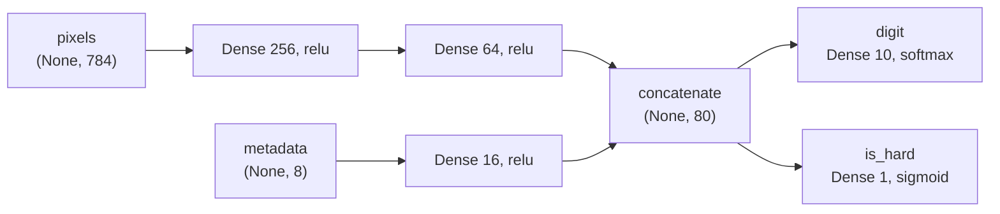

[🏠 📊 Course home](index.html)  &nbsp;|&nbsp;  [← Day 01](day01.html)  &nbsp;|&nbsp;  [Day 03 →](day03.html)  &nbsp;|&nbsp;  [📚 All mini-courses](../../mini-courses.html)

------------------------------------------------------------------------

# Day 2 — Keras Models Three Ways: Sequential, Functional, Subclassing

Yesterday you worked at the metal: raw tensors, `tf.Variable`s you created by hand, and a `GradientTape` you had to open yourself. That's the engine room. Today you climb one deck up and meet Keras's three ways of *packaging* variables and computation into a **model** — an object that owns its weights, knows its own architecture, and plugs directly into training, saving, and serving. We'll build the exact same MLP three times — as a `Sequential`, with the Functional API, and by subclassing `keras.Model` — and prove they're numerically the same species. Then we'll push the Functional API where the other two can't easily follow (multiple inputs, branching, two output heads), peek at how and *when* weights actually get created, and finish with dtype policies, the knob that gives you mixed-precision speed for free. If you know PyTorch: `Sequential` maps to `nn.Sequential`, subclassing maps to `nn.Module` — but the Functional API has no direct PyTorch equivalent, and it's the one that will surprise you.

::: {.callout-note appearance="simple"}
🎯 **Today you will:** build one MLP three ways and verify they match, wire a multi-input two-headed model with the Functional API, understand lazy weight creation and `build()`, read `model.summary()` and `plot_model()` fluently, control numeric precision with dtype policies
:::

## Layers are callables (and weights are lazy)

Before models, layers — because every Keras model, no matter how it's built, is just layers composed together. The single most important mental model: **a Keras layer is a callable object that creates its weights the first time you call it.**

```python
import numpy as np
import keras
from keras import layers

print(keras.__version__)          # 3.x — Keras 3, multi-backend
print(keras.backend.backend())    # "tensorflow"

dense = layers.Dense(units=256, activation="relu")
print(dense.weights)              # [] — nothing here yet!
```

```text
3.11.3
tensorflow
[]
```

That empty list is not a bug. A `Dense(256)` layer promises "256 output units," but the kernel matrix it needs is shaped `(input_dim, 256)` — and it hasn't seen an input yet, so it doesn't know `input_dim`. Keras waits. The first call fixes the input shape and triggers weight creation:

```python
x = np.random.rand(32, 784).astype("float32")   # a fake batch: 32 flattened 28×28 images
y = dense(x)                                     # first call → build happens HERE

print(y.shape)                                   # (32, 256)
for w in dense.weights:
    print(w.path, w.shape, w.dtype)
```

```text
(32, 256)
dense/kernel (784, 256) float32
dense/bias (256,) float32
```

Under the hood, that first call ran `dense.build(input_shape=(32, 784))`, which created two `Variable`s — exactly the kind you managed by hand yesterday, except now the layer owns them, tracks them, and will hand them to an optimizer for you. The computation is the one you already know:

$$y = \mathrm{relu}(xW + b), \qquad x \in \mathbb{R}^{32 \times 784},\ W \in \mathbb{R}^{784 \times 256},\ b \in \mathbb{R}^{256}$$

<svg viewBox="0 0 720 180" xmlns="http://www.w3.org/2000/svg" font-family="sans-serif" font-size="13">
  <!-- x -->
  <rect x="20" y="45" width="90" height="90" fill="#38bdf8" fill-opacity="0.35" stroke="currentColor" rx="6"/>
  <text x="65" y="95" text-anchor="middle" fill="currentColor" font-weight="bold">x</text>
  <text x="65" y="155" text-anchor="middle" fill="currentColor">(32, 784)</text>
  <text x="130" y="95" text-anchor="middle" fill="currentColor" font-size="18">@</text>
  <!-- W -->
  <rect x="150" y="30" width="110" height="120" fill="#6366f1" fill-opacity="0.35" stroke="currentColor" rx="6"/>
  <text x="205" y="95" text-anchor="middle" fill="currentColor" font-weight="bold">W  kernel</text>
  <text x="205" y="168" text-anchor="middle" fill="currentColor">(784, 256)</text>
  <text x="280" y="95" text-anchor="middle" fill="currentColor" font-size="18">+</text>
  <!-- b -->
  <rect x="300" y="75" width="90" height="26" fill="#f59e0b" fill-opacity="0.4" stroke="currentColor" rx="6"/>
  <text x="345" y="93" text-anchor="middle" fill="currentColor" font-weight="bold">b</text>
  <text x="345" y="120" text-anchor="middle" fill="currentColor">(256,)</text>
  <!-- relu arrow -->
  <line x1="400" y1="88" x2="470" y2="88" stroke="currentColor" stroke-width="1.5"/>
  <polygon points="470,83 480,88 470,93" fill="currentColor"/>
  <text x="437" y="78" text-anchor="middle" fill="currentColor" font-style="italic">relu</text>
  <!-- y -->
  <rect x="490" y="55" width="75" height="70" fill="#22c55e" fill-opacity="0.35" stroke="currentColor" rx="6"/>
  <text x="527" y="95" text-anchor="middle" fill="currentColor" font-weight="bold">y</text>
  <text x="527" y="145" text-anchor="middle" fill="currentColor">(32, 256)</text>
  <text x="620" y="70" text-anchor="middle" fill="currentColor" font-size="11">created lazily</text>
  <text x="620" y="86" text-anchor="middle" fill="currentColor" font-size="11">on first call</text>
  <path d="M 620 95 Q 560 130 265 150" stroke="currentColor" stroke-dasharray="4 3" fill="none"/>
</svg>

This is a genuine contrast with classic PyTorch: `nn.Linear(784, 256)` demands the input dimension up front (PyTorch's `nn.LazyLinear` exists precisely to imitate Keras's behavior). Lazy building is convenient — you rarely type input dims — but it has one consequence you must internalize: **a model that has never seen an input shape has no weights, no parameter count, and no `summary()`.** We'll hit that wall deliberately in the subclassing section.

One more thing while we're here — layers are callable on *symbolic* inputs too, not just concrete arrays. That single fact is what makes the Functional API possible. Hold that thought.

## Way 1: `Sequential` — the stack

If your model is a plain pipeline — one input, one output, layers applied in order like a stack of pancakes — `Sequential` is the shortest path:

```python
def make_sequential():
    return keras.Sequential(
        [
            keras.Input(shape=(784,)),
            layers.Dense(256, activation="relu"),
            layers.Dense(64, activation="relu"),
            layers.Dense(10, activation="softmax"),
        ],
        name="mlp_sequential",
    )

seq_model = make_sequential()
seq_model.summary()
```

```text
Model: "mlp_sequential"
┏━━━━━━━━━━━━━━━━━━━━━━━━━┳━━━━━━━━━━━━━━━━━━━━┳━━━━━━━━━━━┓
┃ Layer (type)            ┃ Output Shape       ┃   Param # ┃
┡━━━━━━━━━━━━━━━━━━━━━━━━━╇━━━━━━━━━━━━━━━━━━━━╇━━━━━━━━━━━┩
│ dense (Dense)           │ (None, 256)        │   200,960 │
│ dense_1 (Dense)         │ (None, 64)         │    16,448 │
│ dense_2 (Dense)         │ (None, 10)         │       650 │
└─────────────────────────┴────────────────────┴───────────┘
 Total params: 218,058 (851.79 KB)
 Trainable params: 218,058 (851.79 KB)
 Non-trainable params: 0 (0.00 B)
```

Read that table like a pro:

- **`(None, 256)`** — `None` is the batch dimension, deliberately unspecified. The model works for any batch size. You never bake the batch size into the architecture.
- **Param counts** are worth sanity-checking by hand at least once in your life: $784 \times 256 + 256 = 200{,}960$, then $256 \times 64 + 64 = 16{,}448$, then $64 \times 10 + 10 = 650$. Total $218{,}058$. If a summary's numbers ever surprise you, something about your shapes is not what you think.
- The summary printed *at all* because we put `keras.Input(shape=(784,))` first, which builds every layer immediately. Omit it and `Sequential` stays lazy — `summary()` would raise `ValueError: ... model has not yet been built` until the first call.

`Sequential` also behaves like a Python list, which is occasionally handy for surgery:

```python
seq_model.pop()                                   # remove the softmax head
seq_model.add(layers.Dense(10, activation="softmax"))  # put a fresh one back
print(len(seq_model.layers))                      # 3
```

**When `Sequential` shines:** the model is genuinely a linear stack and you want the least ceremony possible. **When it breaks:** the moment you need two inputs, two outputs, a skip connection, or a shared layer. It cannot express a graph — only a chain. Which brings us to the workhorse.

## Way 2: The Functional API — models as graphs

The Functional API is Keras's signature move and the thing PyTorch has no first-class analog for. The idea: create a **symbolic tensor** with `keras.Input`, call layers on it *as if it were data*, and let Keras record the graph of what-connects-to-what. At the end, you point `keras.Model` at the input and output tensors, and it clips out everything in between as a model.

```python
inputs = keras.Input(shape=(784,), name="pixels")   # symbolic: shape (None, 784), no data inside
h = layers.Dense(256, activation="relu")(inputs)    # layer called on a symbolic tensor
h = layers.Dense(64, activation="relu")(h)
outputs = layers.Dense(10, activation="softmax")(h)

fn_model = keras.Model(inputs=inputs, outputs=outputs, name="mlp_functional")
```

Nothing was computed in those four lines. `inputs` is a spec — "a float32 tensor of shape `(batch, 784)` will arrive here" — and each layer call did two things: built the layer's weights (shapes are known, so building happens immediately, unlike the truly-lazy direct call) and added a node to a graph. `fn_model` *is* that graph, and this buys you three concrete superpowers:

1. **Shape errors surface at construction time**, not at training time. Try `layers.Dense(64)(keras.Input(shape=(784,)))` after accidentally transposing something, and you get the error the moment you write the line — not two hours into an overnight run.
2. **The model is inspectable and sliceable.** You can make a new model out of any subgraph — `keras.Model(inputs, fn_model.layers[1].output)` gives you a feature extractor with zero copying. Day 8's transfer learning leans on this constantly.
3. **It serializes losslessly.** The graph is pure data, so `model.save()` can reconstruct it exactly, with no custom Python classes needed at load time.

The same-MLP-different-syntax version above is fine, but the Functional API only *earns its keep* when the topology stops being a chain. So let's build something `Sequential` flatly cannot: a model with **two inputs** (pixel data plus a small metadata vector — say, stroke-count features from a pen tablet) and **two outputs** (the digit classification, plus a binary "is this a hard example?" head used for routing).

```python
img_in  = keras.Input(shape=(784,), name="pixels")
meta_in = keras.Input(shape=(8,),   name="metadata")

# Branch 1: the image trunk (our familiar MLP body)
x = layers.Dense(256, activation="relu")(img_in)
x = layers.Dense(64, activation="relu")(x)

# Branch 2: a small tower for the metadata
m = layers.Dense(16, activation="relu")(meta_in)

# Merge the branches, then fan out into two heads
merged    = layers.concatenate([x, m])                              # (None, 64 + 16) = (None, 80)
digit_out = layers.Dense(10, activation="softmax", name="digit")(merged)
hard_out  = layers.Dense(1,  activation="sigmoid", name="is_hard")(merged)

two_headed = keras.Model(
    inputs=[img_in, meta_in],
    outputs=[digit_out, hard_out],
    name="two_headed_mlp",
)
```



Because inputs and outputs are *named*, compiling and fitting can address them by name — one loss per head, with weights to balance them:

```python
two_headed.compile(
    optimizer="adam",
    loss={
        "digit":   "sparse_categorical_crossentropy",
        "is_hard": "binary_crossentropy",
    },
    loss_weights={"digit": 1.0, "is_hard": 0.3},
    metrics={"digit": ["accuracy"]},
)

# Smoke-test with fake data — shapes are the contract:
n = 128
fake = {
    "pixels":   np.random.rand(n, 784).astype("float32"),
    "metadata": np.random.rand(n, 8).astype("float32"),
}
fake_y = {
    "digit":   np.random.randint(0, 10, size=(n,)),
    "is_hard": np.random.randint(0, 2,  size=(n, 1)).astype("float32"),
}
two_headed.fit(fake, fake_y, epochs=1, batch_size=32, verbose=1)
```

```text
4/4 ━━━━━━━━━━━━━━━━━━━━ 1s 12ms/step - digit_accuracy: 0.0997 - digit_loss: 2.3311
    - is_hard_loss: 0.7012 - loss: 2.5415
```

Random-guess accuracy on random data — exactly right for a smoke test. The point isn't the numbers; it's that a branching, two-loss model needed **zero** custom training code. Keras summed `1.0 * digit_loss + 0.3 * is_hard_loss` into that final `loss` and backpropagated through the whole graph.

One more Functional-API idiom you'll use constantly: **weight sharing**. A layer instance called twice is the *same* layer both times — same kernel, same bias, gradients accumulated from both call sites:

```python
shared = layers.Dense(64, activation="relu")
a = shared(keras.Input(shape=(784,), name="left"))
b = shared(keras.Input(shape=(784,), name="right"))   # same 784×64 kernel, reused
print(len(shared.weights))   # 2 — one kernel, one bias, no matter how many calls
```

If you wanted two *independent* towers, you'd instantiate two `Dense` layers. Instance identity is the sharing mechanism — there is no special "share" flag. (Today's exercise builds on exactly this.)

## Way 3: Subclassing `keras.Model` — full Python

The third way will feel like home to PyTorch users: subclass `keras.Model`, create layers in `__init__`, define the forward pass in `call()` (Keras's spelling of PyTorch's `forward()`):

```python
class MLP(keras.Model):
    def __init__(self, hidden_units=(256, 64), num_classes=10, **kwargs):
        super().__init__(**kwargs)
        self.hidden = [layers.Dense(u, activation="relu") for u in hidden_units]
        self.head = layers.Dense(num_classes, activation="softmax")

    def call(self, inputs, training=False):
        x = inputs
        for layer in self.hidden:
            x = layer(x)
        return self.head(x)

sub_model = MLP(name="mlp_subclassed")
```

Two details deserve a spotlight:

- **Attribute tracking.** Assigning layers to `self` (even inside a plain Python list, as here) is how Keras finds them. `sub_model.weights` will contain every variable of every tracked sublayer. Create a layer inside `call()` instead of `__init__` and you'd mint fresh weights *every forward pass* — a classic, silent, model-never-learns bug.
- **The `training` argument.** Layers like `Dropout` and `BatchNormalization` behave differently in training vs. inference. In `call()`, you receive `training` and should pass it down to any layer that cares: `self.dropout(x, training=training)`. Forgetting this is the subclassing footgun; the Sequential and Functional APIs plumb it through automatically.

Now, the wall I promised. This model has never seen an input, so — per the lazy-building rule from section one — it has no weights yet:

```python
try:
    sub_model.summary()
except ValueError as e:
    print("💥", e)
```

```text
💥 Undefined shapes are not supported with the `summary()` method. Build the model first ...
```

The fix is to give it a shape, either by calling it on real (or dummy) data or by calling `build()` explicitly:

```python
sub_model(np.zeros((1, 784), dtype="float32"))   # one dummy forward pass builds everything
# — or equivalently: sub_model.build(input_shape=(None, 784))
sub_model.summary()
```

```text
Model: "mlp_subclassed"
┏━━━━━━━━━━━━━━━━━━━━━━━━━┳━━━━━━━━━━━━━━━━━━━━┳━━━━━━━━━━━┓
┃ Layer (type)            ┃ Output Shape       ┃   Param # ┃
┡━━━━━━━━━━━━━━━━━━━━━━━━━╇━━━━━━━━━━━━━━━━━━━━╇━━━━━━━━━━━┩
│ dense_3 (Dense)         │ (None, 256)        │   200,960 │
│ dense_4 (Dense)         │ (None, 64)         │    16,448 │
│ dense_5 (Dense)         │ (None, 10)         │       650 │
└─────────────────────────┴────────────────────┴───────────┘
 Total params: 218,058 (851.79 KB)
```

Same 218,058 parameters. Same model, third costume. Let's prove all three are numerically identical by copying weights from one into another and comparing outputs:

```python
x = np.random.rand(4, 784).astype("float32")

sub_model.set_weights(fn_model.get_weights())   # weight lists line up layer-by-layer
np.testing.assert_allclose(
    fn_model.predict(x, verbose=0),
    sub_model.predict(x, verbose=0),
    rtol=1e-6,
)
print("functional == subclassed ✓")
```

```text
functional == subclassed ✓
```

`get_weights()`/`set_weights()` works here because the three builds create the same variables in the same order. Architecture and weights are separable — an idea that pays off again on Day 9 when we save and reload models.

The price of subclassing: the model is opaque Python. Keras can't plot its graph before it's traced, can't slice sub-models out of it, and saving it requires the class definition (plus `get_config()` for clean round-trips) to be importable at load time. The payoff: `call()` is arbitrary Python — loops with data-dependent lengths, conditionals on tensor values, stochastic depth, anything. **The professional default:** Functional for the architecture, subclassing only for the pieces that genuinely need dynamic behavior — and note the ways compose: a subclassed model can use a Functional model as a sublayer, and vice versa.

## Under the hood: `weights`, `build()`, and the dtype policy

Every layer and model exposes its variables three ways, and the distinction matters as soon as you freeze layers (Day 8) or add BatchNorm (Day 6):

```python
print(len(fn_model.weights))                # 6  — all variables (3 kernels + 3 biases)
print(len(fn_model.trainable_weights))      # 6  — what the optimizer updates
print(len(fn_model.non_trainable_weights))  # 0  — e.g. BatchNorm moving stats live here

fn_model.layers[1].trainable = False        # freeze the first Dense
print(len(fn_model.trainable_weights))      # 4
fn_model.layers[1].trainable = True         # unfreeze — back to 6
```

Yesterday you passed a hand-curated variable list to `tape.gradient(...)`. From now on, `model.trainable_weights` *is* that list, maintained for you — that's the whole handoff between Day 1 and Day 4's custom training loops.

Now, **dtype policy** — the part of the spec that sounds bureaucratic and is actually a free-lunch performance feature. Every layer has a policy with two dtypes:

- **variable dtype** — what the weights are *stored* in,
- **compute dtype** — what the forward math *runs* in.

The default policy is `"float32"` for both. On modern GPUs (and TPUs), setting the global policy to `"mixed_float16"` stores weights in float32 (for stable optimizer updates) but computes in float16 (Tensor Cores, roughly 1.5–3× faster, half the activation memory):

```python
keras.mixed_precision.set_global_policy("mixed_float16")

mp_model = keras.Sequential(
    [
        keras.Input(shape=(784,)),
        layers.Dense(256, activation="relu"),
        layers.Dense(64, activation="relu"),
        layers.Dense(10, activation="softmax", dtype="float32"),  # ← last layer stays float32!
    ],
    name="mlp_mixed",
)

first = mp_model.layers[0]
print(first.dtype_policy)      # <DTypePolicy "mixed_float16">
print(first.variable_dtype)    # float32  — storage
print(first.compute_dtype)     # float16  — math
print(mp_model.layers[-1].compute_dtype)  # float32 — we overrode the head

keras.mixed_precision.set_global_policy("float32")   # reset so the rest of the course is unaffected
```

<svg viewBox="0 0 720 210" xmlns="http://www.w3.org/2000/svg" font-family="sans-serif" font-size="12">
  <text x="360" y="20" text-anchor="middle" fill="currentColor" font-weight="bold" font-size="14">mixed_float16: one layer's forward pass</text>
  <!-- storage box -->
  <rect x="20" y="45" width="180" height="130" fill="#6366f1" fill-opacity="0.25" stroke="currentColor" rx="8"/>
  <text x="110" y="68" text-anchor="middle" fill="currentColor" font-weight="bold">weights (storage)</text>
  <rect x="45" y="85" width="130" height="30" fill="#6366f1" fill-opacity="0.45" stroke="currentColor" rx="4"/>
  <text x="110" y="105" text-anchor="middle" fill="currentColor">W, b — float32</text>
  <text x="110" y="150" text-anchor="middle" fill="currentColor" font-size="11">precise optimizer</text>
  <text x="110" y="164" text-anchor="middle" fill="currentColor" font-size="11">updates</text>
  <!-- cast arrow -->
  <line x1="200" y1="100" x2="270" y2="100" stroke="currentColor" stroke-width="1.5"/>
  <polygon points="270,95 280,100 270,105" fill="currentColor"/>
  <text x="238" y="90" text-anchor="middle" fill="currentColor" font-style="italic">cast ↓16</text>
  <!-- compute box -->
  <rect x="285" y="45" width="200" height="130" fill="#f59e0b" fill-opacity="0.25" stroke="currentColor" rx="8"/>
  <text x="385" y="68" text-anchor="middle" fill="currentColor" font-weight="bold">compute</text>
  <rect x="305" y="85" width="160" height="30" fill="#f59e0b" fill-opacity="0.45" stroke="currentColor" rx="4"/>
  <text x="385" y="105" text-anchor="middle" fill="currentColor">x @ W + b — float16</text>
  <text x="385" y="150" text-anchor="middle" fill="currentColor" font-size="11">Tensor Cores: ~2× faster,</text>
  <text x="385" y="164" text-anchor="middle" fill="currentColor" font-size="11">½ the activation memory</text>
  <!-- output arrow -->
  <line x1="485" y1="100" x2="545" y2="100" stroke="currentColor" stroke-width="1.5"/>
  <polygon points="545,95 555,100 545,105" fill="currentColor"/>
  <!-- head box -->
  <rect x="560" y="60" width="140" height="80" fill="#22c55e" fill-opacity="0.3" stroke="currentColor" rx="8"/>
  <text x="630" y="88" text-anchor="middle" fill="currentColor" font-weight="bold">softmax head</text>
  <text x="630" y="108" text-anchor="middle" fill="currentColor">float32</text>
  <text x="630" y="126" text-anchor="middle" fill="currentColor" font-size="11">(numeric safety)</text>
</svg>

The one rule you must respect: **keep the final softmax (and the loss) in float32.** float16 tops out around $6.5 \times 10^4$ and gets grainy near 0 and 1 — exactly where softmax probabilities and log-losses live. That's why we passed `dtype="float32"` to the last layer. The other classic mixed-precision concern — tiny gradients underflowing to zero — is handled by *loss scaling*, which Keras applies automatically inside `model.fit()`; when we write custom loops on Day 4, `keras.mixed_precision.LossScaleOptimizer` is the manual equivalent. For today, the takeaway is architectural: dtype is a *policy on layers*, set globally or per-layer, not something you scatter `tf.cast` calls around for.

## Choosing your weapon, and seeing what you built

The honest decision table:

| | `Sequential` | Functional API | Subclassing |
|---|---|---|---|
| Topology | single chain only | any DAG | anything, incl. dynamic |
| Multi-input / multi-output | ✗ | ✓ (its home turf) | ✓ (manual plumbing) |
| Shape errors caught | at build | **at construction** | at first call / runtime |
| `summary()` / `plot_model()` | ✓ | ✓ full graph | after build; graph opaque |
| Slice out sub-models | limited | ✓ trivially | ✗ |
| Serialization | perfect | perfect | needs class + `get_config()` |
| Control flow in forward pass | ✗ | ✗ (graph is static) | ✓ arbitrary Python |
| PyTorch analog | `nn.Sequential` | — (no real analog) | `nn.Module` |

Rule of thumb, in one line each: *Sequential* for pancake stacks, *Functional* as your default for anything real, *Subclassing* when the forward pass needs an `if` or a `while` on tensor values.

However you build, interrogate the result before training it. You've seen `summary()`; its graphical sibling draws the DAG to an image — invaluable for multi-branch models, where the summary table's linear listing hides the topology:

```python
keras.utils.plot_model(
    two_headed,
    to_file="two_headed.png",
    show_shapes=True,        # annotate every edge with its tensor shape
    show_layer_names=True,
    show_dtype=True,         # spot stray float16/float32 boundaries instantly
)
```

(`plot_model` needs `pip install pydot` plus the Graphviz system package; if that's a hassle in your environment, the mermaid diagram above is what the output looks like, minus the shape labels.) For quick programmatic inspection, no extra installs needed:

```python
for layer in two_headed.layers:
    print(f"{layer.name:>14}  {layer.__class__.__name__:<12} → {layer.output.shape}")
```

```text
        pixels  InputLayer   → (None, 784)
      metadata  InputLayer   → (None, 8)
       dense_6  Dense        → (None, 256)
       dense_8  Dense        → (None, 16)
       dense_7  Dense        → (None, 64)
   concatenate  Concatenate  → (None, 80)
         digit  Dense        → (None, 10)
       is_hard  Dense        → (None, 1)
```

A habit worth forming today: after building *any* model, run `summary()` and eyeball two things — the total parameter count (is it the order of magnitude you expected?) and the output shapes column (does the data narrow the way you intended?). Thirty seconds of reading here saves hours of debugging a model that was silently the wrong shape.

## 🧪 Your task

Build a **siamese digit comparator** with the Functional API: a model that takes *two* 784-dim inputs (`left` and `right`), pushes **both through the same shared encoder** (Dense 256 relu → Dense 64 relu — one set of weights, used twice), concatenates the two 64-dim embeddings, and ends in a single `Dense(1, activation="sigmoid", name="same_digit")` head predicting whether the two images show the same digit.

Then verify three things: (1) `model.summary()` shows the encoder's parameters **only once** (total should be 217,537 — work out why); (2) the two encoder call sites literally share weights (check `len(model.trainable_weights)`); (3) a forward pass on a fake batch returns shape `(batch, 1)` with values in $(0, 1)$.

*Hint:* instantiate each encoder `Dense` layer **once**, outside any loop over inputs, and call the same instances on both `left` and `right`. If your parameter count comes out near 435K, you built two encoders — that's the exact bug this exercise exists to inoculate you against.

<details><summary>Solution</summary>

```python
import numpy as np
import keras
from keras import layers

# --- Inputs: two images to compare ---
left  = keras.Input(shape=(784,), name="left")
right = keras.Input(shape=(784,), name="right")

# --- Shared encoder: instantiate ONCE, call TWICE ---
enc1 = layers.Dense(256, activation="relu", name="enc_dense_1")
enc2 = layers.Dense(64,  activation="relu", name="enc_dense_2")

def encode(x):
    return enc2(enc1(x))     # same layer objects → same weights on both paths

left_emb  = encode(left)     # (None, 64)
right_emb = encode(right)    # (None, 64) — through the SAME weights

# --- Compare ---
merged = layers.concatenate([left_emb, right_emb])            # (None, 128)
out = layers.Dense(1, activation="sigmoid", name="same_digit")(merged)

siamese = keras.Model(inputs=[left, right], outputs=out, name="siamese_mlp")
siamese.summary()

# (1) Parameter count: encoder counted once.
#     enc1: 784*256 + 256 = 200,960
#     enc2: 256*64  + 64  =  16,448
#     head: 128*1   + 1   =     129
#     total               = 217,537
assert siamese.count_params() == 217_537, siamese.count_params()

# (2) Weight sharing: 3 layers with weights → 3 kernels + 3 biases = 6 variables,
#     even though the encoder appears at two call sites.
assert len(siamese.trainable_weights) == 6

# ...and it's identity-level sharing, not copies:
assert enc1.kernel is siamese.get_layer("enc_dense_1").kernel

# (3) Forward pass sanity check.
batch = {
    "left":  np.random.rand(16, 784).astype("float32"),
    "right": np.random.rand(16, 784).astype("float32"),
}
p = siamese.predict(batch, verbose=0)
assert p.shape == (16, 1)
assert (p > 0).all() and (p < 1).all()

# Bonus sanity: identical pairs give identical embeddings, so the model is
# symmetric-in-weights by construction (not symmetric-in-arguments — order
# of concatenation still matters, which is fine for this task).
same = siamese.predict({"left": batch["left"], "right": batch["left"]}, verbose=0)
print("all checks passed ✓  sample outputs:", p[:3].ravel(), same[:3].ravel())
```

The count is 217,537 rather than "two encoders ≈ 435K" precisely because both branches route through the same six variables. If you had written `layers.Dense(256, activation="relu")(left)` and *another* `layers.Dense(256, activation="relu")(right)`, each call would have created a fresh layer with fresh weights — syntactically similar, semantically a completely different model.

</details>

## Key takeaways

- A Keras layer is a callable that **creates its weights lazily** on first call/build — which is why an unbuilt model has no `summary()`, and why you never type input dims twice.
- **Same MLP, three builds, identical weights and outputs** — the API choice is about ergonomics and topology, not capability of the resulting function.
- `Sequential` = single chain, least ceremony. **Functional = default for real work**: graphs built by calling layers on symbolic `keras.Input` tensors, with construction-time shape checking, multi-input/multi-output, and slicing for free. Subclassing = `nn.Module`-style full Python, for dynamic forward passes — at the cost of introspection and easy serialization.
- **Layer instance identity is the weight-sharing mechanism**: one instance called twice shares weights; two instances are independent. Most silent siamese/twin-tower bugs are exactly this.
- `model.weights` / `trainable_weights` / `non_trainable_weights` is the handoff from Day 1's hand-managed variables; `trainable = False` moves variables between the last two.
- **Dtype policy** separates storage (`variable_dtype`, float32) from math (`compute_dtype`, float16 under `mixed_float16`); keep the softmax head and loss in float32.
- Always read `summary()` (param count, output shapes) — and `plot_model()` for anything with branches — before you train.

Tomorrow: your models stop eating NumPy arrays from memory and start drinking from a firehose — `tf.data` pipelines that shuffle, batch, prefetch, and keep the GPU fed.

------------------------------------------------------------------------

[🏠 📊 Course home](index.html)  &nbsp;|&nbsp;  [← Day 01](day01.html)  &nbsp;|&nbsp;  [Day 03 →](day03.html)  &nbsp;|&nbsp;  [📚 All mini-courses](../../mini-courses.html)
