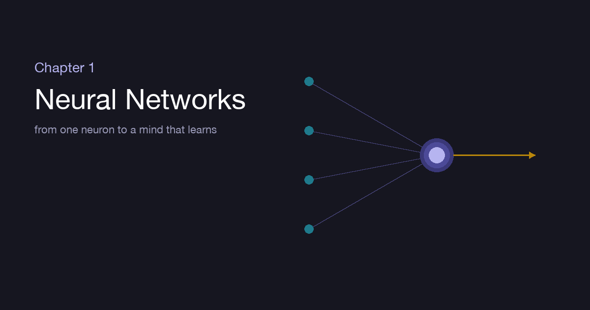
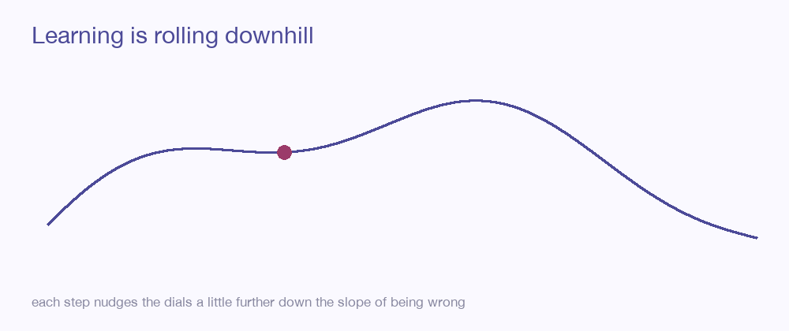

::: {.explainer-body}

{.xpl-fig}

::: {.xpl-lead}
There is an old way to make a computer obey, and a new way to make it learn. The old way is to hand it your rules, written out in full, and watch it follow them to the letter. The new way is stranger and softer: you hand it examples, and you let it find the rule itself. This chapter is the story of that second way — how a machine, given enough mistakes to learn from, slowly teaches itself to be right.
:::

## When the rules run out

For most of computing's life we wrote the rules by hand. *If the message says "you have won," call it spam.* The machine never argued; it just did as it was told. This works beautifully right up until the rules grow too tangled to write — and for a surprising number of the problems we actually care about, they were never writable at all.

Try this: write down, in plain instructions, how to tell a cat from a dog in a photograph — not in words like "whiskers," but in the only language the computer hears, the raw brightness of a million pixels. Go ahead. You will not finish. Nobody can. You *know* a cat the instant you see one, but that knowing lives in you as instinct, and instinct arrives without a manual.

Machine learning is the way around this wall. Instead of writing the rule, you write a program that *discovers* the rule from examples. Show it thousands of pictures already marked *cat* or *dog*, and it works out the pattern on its own. You never say what makes a cat a cat. You only bring the examples, and a method for turning examples into a rule.

::: {.xpl-key}
**The whole enterprise, in one line:** take a pile of examples and squeeze out of them a rule the computer can apply to things it has never seen.
:::

## A function with dials

So what *is* this rule, once we have it? It is always a **function** — a small machine that swallows an input and hands back an output. Pixels go in, the word *cat* comes out. The size of a house goes in, a price comes out. We write it `f(x)`: the answer the function gives for the input `x`.

What turns this from a mere function into something that *learns* is that ours has knobs inside it. Picture a black box with a few million little dials along its edge. Turn them one way and it calls every cat a dog. Turn them another and it starts getting the answer right. **Learning is nothing more than the search for the dial-settings that make the function behave.** We gather all those dials under one name — the parameters, written with the Greek letter **θ** — and say the function is `f(x; θ)`: its answer depends both on what you show it and on how its dials happen to be set.

Training, then, is the hunt for a good **θ**. Hold onto that sentence. Everything else in this chapter is in service of it.

## The neuron: a vote, weighted

Zoom all the way in, past the millions of dials, to the smallest working part. A single **neuron** does something almost embarrassingly simple. It takes its inputs, decides how much it cares about each one, adds up the result, and asks a yes-or-no-ish question about the total.

In numbers: each input `xᵢ` is multiplied by a **weight** `wᵢ` — the neuron's opinion of how much that input matters — and the weighted votes are summed, with one extra number `b` (the **bias**) that tilts the whole tally up or down:

> **z = w₁x₁ + w₂x₂ + … + wₙxₙ + b**

That sum is just a [dot product](../../ml-simplified.html) of weights and inputs, plus a nudge. You have met this before; you may not have known it was the atom of intelligence.

::: {.xpl-try}
**🎮 The neuron's sum is a dot product — drag the vectors**

:::

## The bend that makes it think

If a neuron only ever added things up, a whole stack of them would still, in the end, be doing addition — a straight line dressed in layers. Straight lines can only carve the world with a straight edge, and the world is not straight. So after the sum, the neuron passes its total through a small **bend** — an *activation function* — that lets it curve.

The most common bend is the gentlest possible: **ReLU**, which simply says *keep the number if it's positive, otherwise call it zero* — `max(0, z)`. It sounds too plain to matter. But that one kink, repeated across thousands of neurons, is what lets a network trace the wild, folded boundary between cat and dog instead of slicing the world with a single ruler.

::: {.callout-note}
Other bends exist — the S-shaped **sigmoid** that squashes any number into the range 0–1 (useful when you want a probability), and **tanh**, its cousin centred on zero. But the lesson is the same: *the sum gives reach, the bend gives shape.*
:::

## Layers: opinions stacked on opinions

One neuron sees one simple pattern. The power comes from stacking them. Put many neurons side by side and you have a **layer**, each neuron watching the same input but caring about different things. Feed that layer's outputs into another layer, and the second layer is no longer looking at raw pixels — it is looking at *what the first layer noticed*. Edges become corners; corners become eyes; eyes become faces. Depth is just opinion built on opinion until something like understanding emerges.

This forward march — input to first layer to second to the final answer — is the **forward pass**. It is the network thinking out loud, one layer at a time, with nothing yet learned, just computed.

## The slope of being wrong

A freshly built network is born clueless; its dials are set at random and its answers are noise. We need a way to *measure how wrong it is*, because you cannot improve what you cannot score. That measure is the **loss** — a single number that is large when the network is badly mistaken and small when it is close.

Predicting a number, like a price? Punish the gap, squared: the **mean squared error**. Choosing a category, like cat-or-dog? Punish confident wrongness with **cross-entropy**, which is merciless toward a network that is both certain and incorrect.

::: {.xpl-try}
**🎮 MSE vs Cross-Entropy — how each one punishes a wrong answer**

:::

Now picture the loss as a landscape. Every possible setting of the dials is a spot on the ground, and the height at that spot is how wrong the network is there. Training has a single, almost geological goal: **find the lowest valley.**

## Rolling downhill

We find the valley the way water does — by always heading downhill. At whatever spot the dials currently sit, we ask a calculus question: *if I nudge this dial a hair, does the loss go up or down, and how steeply?* The answer for every dial at once is the **gradient** — an arrow pointing in the direction of steepest *increase*. So we step the opposite way, a little, and the loss drops a little. Then we do it again. And again. This is **gradient descent**, and it is the heartbeat of all learning.

{.xpl-fig}

::: {.xpl-try}
**🎮 Gradient descent — press Run and watch it find the bottom**

:::

The size of each step is the **learning rate** — the single most temperamental dial of them all. Too small and the descent crawls for an age. Too large and the network leaps clean over the valley and clatters up the far wall, never settling. Much of the craft of training is the patience to choose it well.

::: {.xpl-key}
**Key idea:** A network learns by repeatedly asking "which way is downhill?" and taking one small step that way. Stack enough small steps and clueless becomes capable.
:::

## Backpropagation: blame, traced backwards

There is one problem left, and it is the deep one. A deep network has millions of dials buried across many layers. To take a step downhill we need to know how *each* of them affected the final mistake. How do you assign blame to a weight three layers from the output, whose influence was passed hand to hand through everything that came after?

The answer is **backpropagation**, and it is really just the [chain rule](../../ml-simplified.html) of calculus, applied with discipline. The network made its mistake at the end, so we start there and walk the blame *backward*: the final layer's share, then the layer before it, then the one before that — each layer multiplying the blame it received by how sensitive it was, and passing the rest down the line. By the time we reach the first layer, every single dial knows exactly how much it contributed to the error, and therefore exactly which way to turn. Forward to think; backward to learn.

## Optimizers: descending with wisdom

Plain gradient descent works, but it can be naive — it treats every step the same, stumbling in ravines and dawdling on plateaus. So we give it instincts. **Momentum** lets the descent build up speed like a ball rolling down a hill, carrying it through small bumps and flat stretches. **Adam** — today's workhorse — goes further, quietly giving each dial its own adaptive step size based on its recent history, so steady directions move boldly and jittery ones move with care. The destination is the same valley; the optimizer is just how cleverly you travel.

::: {.xpl-try}
**🎮 A bumpier landscape — try Run with momentum on**

:::

## The craft, not just the math

Knowing the machinery is not the same as training a good network — the rest is craft. You hold back some examples the network never trains on, so you can catch it **memorising** instead of **understanding** (a trap called overfitting, and the subject of a later chapter). You watch the validation loss and stop the moment it turns upward. You feed examples in small **batches** rather than all at once, because the gentle noise of small batches helps the descent shake free of bad valleys. None of this is in the equations. All of it is in the doing.

## Where we've arrived

Strip away the jargon and a neural network is one honest idea, repeated: a function with dials, a way to measure how wrong it is, and the patience to nudge those dials downhill until wrong becomes right. The neuron weighs and bends. The layers stack into understanding. The loss names the error. The gradient points home, and backpropagation tells every dial its share of the journey. That is the entire machine — and from this single loop, run at scale, comes everything that follows in this guide.

The chapters ahead build on this foundation: how networks *see* (convolutions), how they *remember* (sequences and attention), and how they *create*. But it all rests here, on a neuron that does little more than take a weighted vote and decide, gently, whether to fire.

## Going deeper

- [3Blue1Brown — Neural Networks (visual series)](https://www.3blue1brown.com/topics/neural-networks)
- [The ML Simplified reference on this site](../../ml-simplified.html) — every formula above, read as a plain table with a live demo.

::: {.xpl-nav}
[← Back to the Guide](../../ml-guide.html)
[Next: Chapter 2 →](../../ml-guide.html)
:::

*Inspired by the genre of long-form ML explainers (Arjun Virk, makingsoftware.com, 3Blue1Brown). Written from scratch in my own words.*

:::
