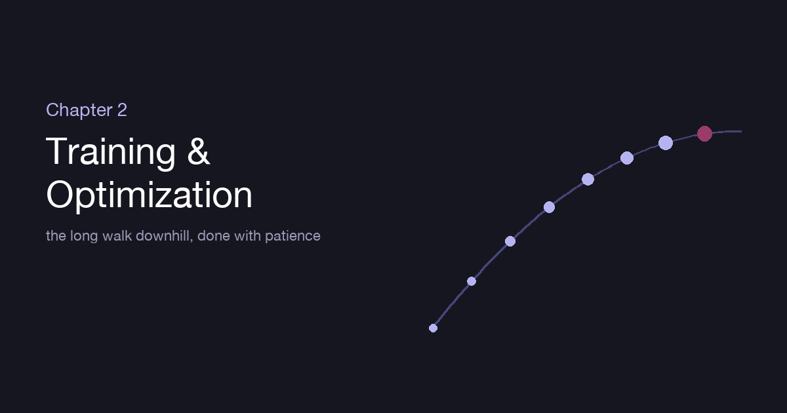
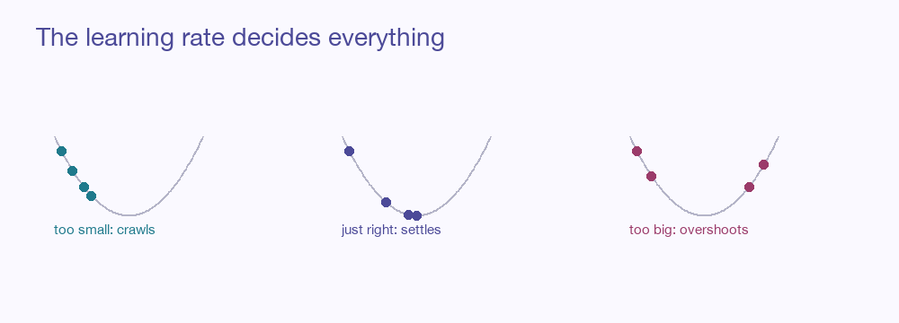

::: {.explainer-body}

{.xpl-fig}

::: {.xpl-lead}
In the last chapter we learned the single move that makes a network learn: find which way is downhill, take a small step, repeat. That move is true but lonely. Run it carelessly and the network crawls for a week, or leaps off a cliff, or settles smugly into the first shallow dip it finds. This chapter is about doing the walk *well* — the rhythm of it, the speed of it, and the quiet engineering that keeps a deep network upright on the way down.
:::

## The loop that does everything

Strip a training run to its bones and you find the same four beats, repeated millions of times:

> **show some examples → measure how wrong → find which way is downhill → take one small step**

That is the entire loop. Everything in this chapter is a refinement of one of those four beats — how many examples to show at once, how to measure, how to find the slope reliably, and how big a step to dare. Get the rhythm right and a clueless network becomes capable in hours. Get it wrong and it never arrives at all.

## Epochs and batches: how much to look at

You could show the network all your data, measure the total error, and take one perfect step. This is honest but glacial — one step per full pass through millions of examples. You could swing the other way and step after every *single* example: fast, but jittery, each step pulled in a slightly wrong direction by the quirks of one data point.

The sweet spot is the **mini-batch** — a small handful of examples (often 32 to a few hundred) averaged together before each step. Big enough to point roughly the right way, small enough to step often, and shaped perfectly for the parallel muscle of a GPU. One full pass through all your data is called an **epoch**, and training usually takes many of them.

::: {.xpl-key}
**Key idea:** The faint noise of a mini-batch is not a flaw — it is a feature. That little wobble helps the descent rattle out of shallow traps it would otherwise sit in forever.
:::

::: {.xpl-try}
**🎮 Watch the noise: a noisy (mini-batch-like) descent still finds the bottom**

:::

## The learning rate: the one dial that humbles everyone

Of all the choices in training, the **learning rate** — the size of each step — is the one that most often decides between a model that sings and a model that never works. It is small, it is innocent-looking, and it is merciless.

Set it too small and the descent inches along, technically improving, practically wasting your week. Set it too large and the network hurls itself across the valley, clatters up the opposite wall, bounces back, and bounces forever — the loss thrashing instead of settling. Somewhere between crawl and chaos is the rate that glides down and comes to rest.

{.xpl-fig}

::: {.xpl-try}
**🎮 Slide the learning rate yourself — feel where it crawls and where it overshoots**

:::

### Don't keep it fixed — schedule it

The wise move is to let the rate *change* over training. Start a touch slow (a **warmup**), so the network doesn't bolt while its dials are still random nonsense. Then move boldly through the broad middle. Then, as you near the valley floor, ease off — shrink the steps so you settle gently instead of skating past the bottom. A common shape is the **cosine schedule**, which glides the rate smoothly from high to near-zero.

::: {.xpl-try}
**🎮 The cosine schedule — fast, then gentle**

:::

## Optimizers: descending with instinct

Plain gradient descent is honest but naive. It treats every direction the same and every moment the same, so it stumbles in long narrow valleys and dawdles across flats. So we give the descent *instincts* — and these instincts are what we call optimizers.

**Momentum** is the first and most intuitive: instead of forgetting each step the moment it's taken, the descent remembers its recent direction and builds up speed, like a ball gathering pace downhill. Small bumps no longer stop it; flat stretches no longer bore it to a halt. It carries through.

**Adam** is the one almost everyone reaches for today. It keeps momentum's memory of *direction*, and adds a second memory — of how *bumpy* each dial's recent gradients have been — and uses it to give every dial its own personal step size. Steady, confident directions get to move boldly; jittery, uncertain ones tiptoe. It is robust, forgiving, and works on most problems with its default settings, which is exactly why it became the field's reflex.

**AdamW** is Adam corrected. It separates out the gentle "keep the dials small" pressure (weight decay, below) so that pressure actually does its job instead of getting tangled into the gradient. It is the standard for training large modern models.

::: {.xpl-try}
**🎮 A bumpy landscape — turn on momentum and press Run**

:::

## Weight decay: a vote for simplicity

Left alone, a network will happily grow some of its dials to enormous values to nail the training examples exactly — and a network with wild, oversized weights is a brittle one, memorising quirks instead of learning the shape of things. **Weight decay** adds a small, constant pressure pulling every weight gently back toward zero. The network can still use a large weight, but only if the data really insists. The result is a smoother, humbler model that generalises better. It is the mathematical form of *don't overcomplicate things unless you must.*

## The hazards of depth

Stack many layers and a new danger appears, born of the chain rule from Chapter 1. To send blame backward through a deep network, we *multiply* a long chain of numbers together. Multiply many small numbers and the product withers toward nothing — the **vanishing gradient**, where the earliest layers receive a signal so faint they barely learn at all. Multiply many large ones and it explodes toward infinity — the **exploding gradient**, where training detonates into nonsense.

Two quiet inventions tamed this and made truly deep learning possible:

- **Careful initialization.** Don't start the dials at just any random values — start them scaled so the signal neither shrinks nor swells as it passes through each layer. (The schemes called *Xavier* and *He* do exactly this.)
- **Normalization.** Between layers, gently re-center and re-scale the flowing numbers so they stay in a healthy range. *Batch* and *layer* normalization keep the signal from drifting toward the extremes, and let very deep networks train smoothly.

::: {.callout-note}
You can also simply **clip** a gradient that grows too large — cap its length before stepping. Crude, but it reliably stops the occasional explosion from wrecking an otherwise good run.
:::

## Knowing when to stop

Training is not a thing you run to completion like a download; it is a thing you stop at the right moment. Watch two numbers as you go: the error on the data the network trains on, and the error on a held-back set it never sees. Early on both fall together. But there comes a turn where the training error keeps dropping while the held-back error starts creeping *up* — the network has stopped learning the world and started memorising the textbook. **Early stopping** simply means: halt at that turn, and keep the version of the network from just before it went wrong.

::: {.xpl-key}
**Key idea:** The goal of training is not the lowest possible training error. It is the lowest error on data you haven't seen — and those two part ways exactly when memorising begins.
:::

## Where we've arrived

Chapter 1 gave us the single step. This chapter gave us the *journey*: feed the network in small batches for steady, GPU-friendly progress; choose a learning rate with care and let it ease off over time; lend the descent instincts through momentum and Adam; press gently toward simplicity with weight decay; keep the signal healthy through good initialization and normalization; and stop the moment generalisation peaks. None of it changes the destination — the lowest valley — but all of it changes whether you arrive there at all, and how soon.

With training understood, the next question is the one every honest practitioner must face: *how do you know your model is actually any good?* That is overfitting, evaluation, and the discipline of not fooling yourself — Chapter 3.

## Going deeper

- [An overview of gradient-descent optimizers — Sebastian Ruder](https://www.ruder.io/optimizing-gradient-descent/)
- [The ML Simplified reference on this site](../../ml-simplified.html) — every optimizer above, with a live demo.

::: {.xpl-nav}
[← Chapter 1](../01-neural-networks/)
[Back to the Guide →](../../ml-guide.html)
:::

*Written from scratch in my own words; part of an original ML guide.*

:::
