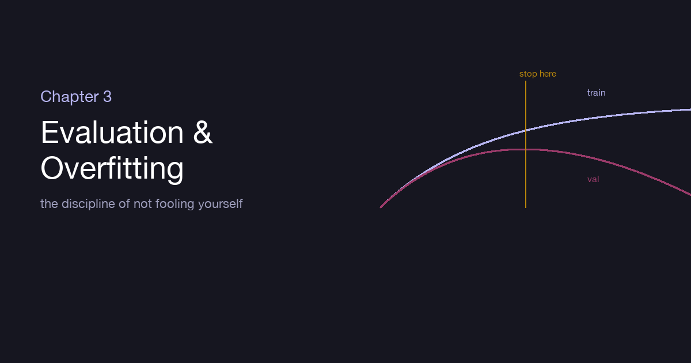
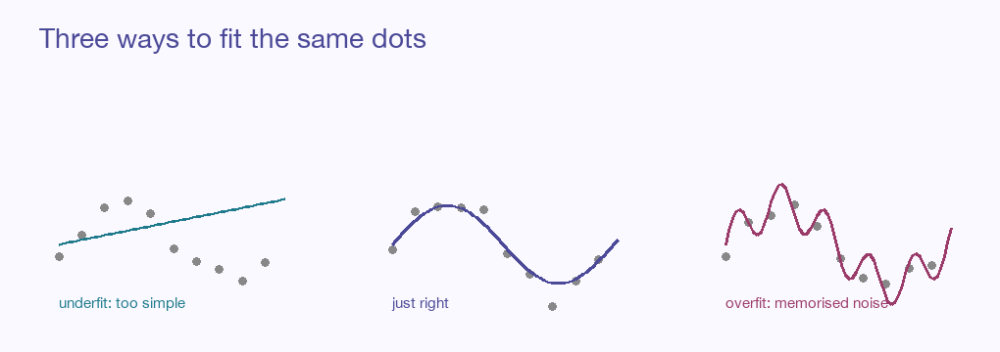

::: {.explainer-body}

{.xpl-fig}

::: {.xpl-lead}
A student who memorises last year's exam answers will ace last year's exam and fail this year's. A model is no different. The most seductive trap in all of machine learning is a network that performs beautifully on the data it learned from — and falls apart the moment it meets anything new. This chapter is about the one discipline that separates real learning from elaborate memorisation: the discipline of not fooling yourself.
:::

## The only score that counts

Here is the uncomfortable truth a beginner learns late and an expert never forgets: **how well your model does on its training data tells you almost nothing.** A model with enough capacity can simply memorise every example it was shown, achieving a perfect score while having learned no general rule whatsoever. It looks like genius and behaves like a parrot.

So before you train anything, you split your data. The **training set** is what the model learns from. A separate **test set** — examples the model never touches during training — is the only honest measure of whether it learned the *world* or just the *worksheet*. Often there's a third slice, the **validation set**, used along the way to make choices (which settings, when to stop) so that the test set stays truly untouched until the very end.

::: {.xpl-key}
**Key idea:** Performance on data you trained on is a mirror. Performance on data you didn't is a window. Only the window tells you anything about the future.
:::

## Underfitting and overfitting: the two ways to be wrong

Picture the same scatter of dots, and three attempts to draw the curve that explains them.

{.xpl-fig}

The first attempt is a straight line through a curved cloud — too simple to capture the real shape. It is wrong on the training data *and* wrong on new data. This is **underfitting**: the model lacks the capacity, or the training, to grasp the pattern at all.

The third attempt is a frantic, wiggling curve that passes exactly through every single dot, swerving to chase each one. On the training data it is flawless. On new data it is a disaster, because it learned the *noise* — the random jitter of these particular points — as if it were signal. This is **overfitting**: capacity spent memorising accidents instead of learning the rule.

The middle attempt — a smooth curve that follows the trend and ignores the jitter — is what we want. The whole art is landing there.

## The bias–variance tradeoff

There's a clean way to name these two failures. **Bias** is error from being too simple — the straight-line model is *biased* because it can't bend to the truth no matter how much data you give it. **Variance** is error from being too sensitive — the wiggling model has high *variance* because its shape lurches wildly depending on exactly which noisy points it saw.

Every model lives on a dial between them. Turn toward simplicity and bias rises; turn toward flexibility and variance rises. The sweet spot — the lowest total error on unseen data — sits in the middle, and finding it is much of the practical work of machine learning.

## Measuring honestly: beyond plain accuracy

"It's 95% accurate" sounds wonderful until you learn that 95% of the emails were not spam — at which point a model that blindly says "not spam" every time also scores 95%, while catching nothing. Accuracy alone lies, especially when classes are imbalanced. So we measure with more honest instruments:

- **Precision** — of the things the model flagged, how many were right? (Few false alarms.)
- **Recall** — of the things it should have flagged, how many did it catch? (Few misses.)
- **F1** — a single balance of the two, for when you care about both.

These two pull against each other: flag everything and recall is perfect but precision collapses; flag only the certain cases and precision soars but recall suffers. Where you set that balance is a real decision — a spam filter and a cancer screen want very different tradeoffs, because a miss and a false alarm cost wildly different things.

::: {.callout-note}
The **confusion matrix** lays the whole picture bare: true positives, false positives, true negatives, false negatives in one little grid. Every metric above is just a different way of reading it. The **ROC curve** and its **AUC** summarise how well the model separates the classes across every possible threshold.
:::

## Cross-validation: when data is precious

Splitting off a test set costs you data you could have learned from — painful when examples are few. **Cross-validation** is the clever workaround: slice the data into, say, five folds; train on four and test on the fifth; then rotate, so each fold gets its turn as the test set. Average the five scores and you get a far steadier estimate of true performance than any single split could give — and every example got to be both teacher and examiner.

## Regularization: a gentle pressure toward simplicity

If overfitting is a model overcomplicating itself, **regularization** is any pressure that nudges it back toward simplicity. We met one form in Chapter 2 — weight decay, the steady tug pulling weights toward zero. There are others, each lovely in its own way:

- **L2 (ridge)** shrinks all weights smoothly toward small values — no single input gets to dominate.
- **L1 (lasso)** pushes weights all the way to *exactly zero*, switching off inputs entirely — a built-in feature selector that leaves you a simpler, more interpretable model.
- **Dropout**, the most delightfully strange: during training, randomly switch off a fraction of neurons on each pass. The network can never lean too hard on any one neuron, because that neuron might vanish next step — so it learns redundant, robust representations instead of fragile memorised ones. It is teamwork enforced by random absence.

::: {.xpl-key}
**Key idea:** Regularization doesn't make a model smarter. It makes a model humbler — and a humbler model, it turns out, generalises better.
:::

## More data, the oldest cure

Before any clever technique, remember the simplest one: **more data**. Overfitting is a model finding patterns in too few examples; flood it with more and the accidental patterns wash out, leaving only the real ones. When you can't gather more, you can sometimes *invent* more — **data augmentation** rotates, crops, and flips your images, or paraphrases your text, multiplying examples and teaching the model what variations don't change the answer. A model that has seen a cat from a thousand angles stops memorising any one angle.

## Where we've arrived

This chapter was less about machinery and more about honesty. A model's training score is a flattering mirror; only unseen data tells the truth. Between the too-simple and the too-flexible lies the model worth having, and we find it by measuring with the right instruments, validating across folds, pressing gently toward simplicity with regularization, and feeding the network enough variety that it learns the world instead of the worksheet.

We now have a network, a way to train it, and a way to trust it. The next three chapters give that network *senses* — the architectures that let it see images (Chapter 4), read sequences (Chapter 5), and attend to what matters across a whole passage at once (Chapter 6).

## Going deeper

- [The Bias–Variance Tradeoff — StatQuest](https://www.youtube.com/watch?v=EuBBz3bI-aA)
- [The AI & ML Encyclopedia on this site](../../ai-ml-encyclopedia/ch12.html) — confusion matrix, ROC/AUC, regularization, with live demos.

::: {.xpl-nav}
[← Chapter 2](../02-training-optimization/)
[Back to the Guide →](../../ml-guide.html)
:::

*Written from scratch in my own words; part of an original ML guide.*

:::
