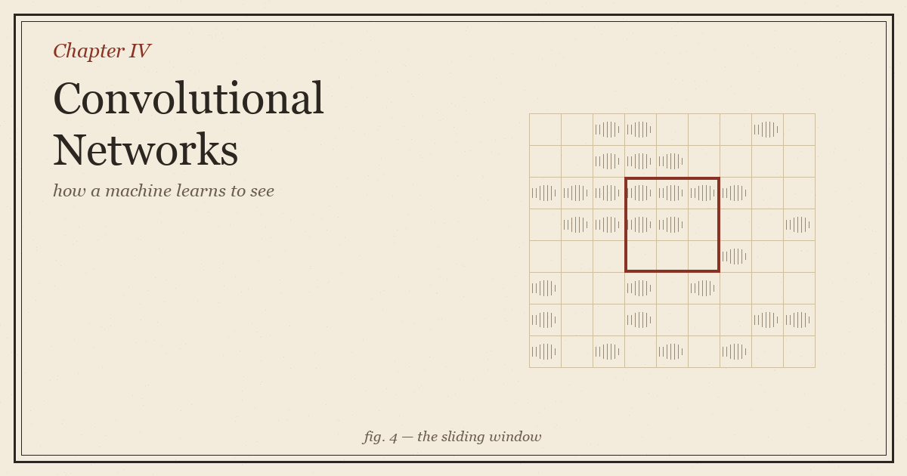
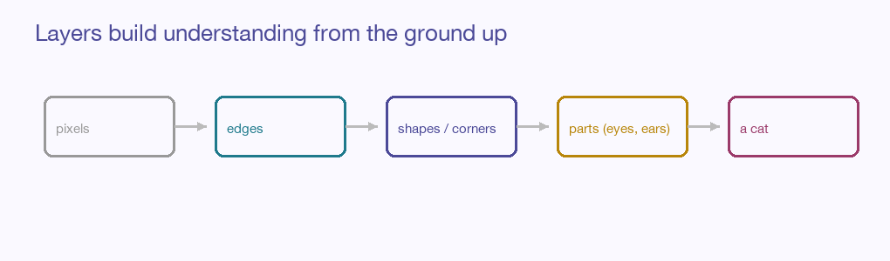

::: {.explainer-body}

{.xpl-fig}

::: {.xpl-lead}
A photograph, to a computer, is just a grid of numbers — the brightness of each pixel, side by side. The miracle is that from nothing but those numbers, a network can come to know a cat from a dog, a tumour from healthy tissue, a stop sign from the sky behind it. This chapter is about the architecture that made machines see: not by looking harder, but by looking *locally*, and the same way everywhere.
:::

## Why a plain network struggles with images

We could, in principle, flatten an image into one long list of pixels and feed it to the ordinary neural network of Chapter 1. It would technically work, and it would be a disaster. A modest photo has hundreds of thousands of pixels; connecting every one to every neuron in the first layer means billions of weights — slow, hungry, and prone to memorising.

Worse, it would be *blind to the obvious*. A cat in the top-left corner and the same cat in the bottom-right would look, to a flattened network, like two completely unrelated inputs — every pixel in a different slot. The network would have to learn "cat" all over again for every position. That is no way to see.

::: {.xpl-key}
**Key idea:** A good vision architecture should look at small patches, not whole images — and it should recognise a pattern wherever it appears, not just where it first saw it.
:::

## The filter: a small pattern-detector that slides

The central idea of a **convolutional network** is the **filter** (or *kernel*) — a tiny grid of weights, often just 3×3, that slides across the image one patch at a time. At each stop, it does the move you already know: multiply the patch's pixels by its weights, sum them up. That single number says *how strongly this little patch matches the pattern the filter is looking for.*

Slide the filter across the whole image and you get a new grid — a **feature map** — that lights up wherever the pattern appears. One filter might fire on vertical edges, another on a particular curve, another on a patch of texture. And here is the quiet genius: because the *same* filter slides everywhere, it detects its pattern in the top-left and the bottom-right with the identical handful of weights. The network learns "vertical edge" exactly once and applies it everywhere. This is **weight sharing**, and it is why convolutional networks are both small and position-blind in the best way.

::: {.callout-note}
Two small dials shape the slide. **Stride** is how far the filter jumps each step — a bigger stride covers ground faster and shrinks the output. **Padding** adds a border of zeros so the filter can reach the very edges without the image quietly shrinking layer after layer.
:::

## Pooling: keeping the gist, dropping the detail

After a convolution, we usually **pool** — shrink the feature map by summarising small neighbourhoods. **Max pooling**, the most common, keeps only the strongest response in each little region and throws the rest away. This does two good things at once: it makes the network cheaper (fewer numbers to carry forward), and it makes it *robust to small shifts* — a feature that moves a pixel or two still survives, because pooling only cares whether the pattern was present nearby, not exactly where. We trade precise location for sturdy recognition, which for seeing is the right trade.

## The hierarchy: edges become eyes become cats

Stack these convolution-and-pool blocks and something beautiful unfolds. The first layer, looking at raw pixels, can only find the simplest things — edges, blobs of colour. But the second layer doesn't look at pixels; it looks at *the first layer's findings*, and so it can combine edges into corners and curves. The third combines those into textures and parts — an eye, an ear, a wheel. The deepest layers assemble parts into whole objects.

{.xpl-fig}

Nobody designs this ladder. The network discovers it on its own, simply by being deep and being trained — each layer learning to speak in the vocabulary of the one below. Understanding, it turns out, is just abstraction stacked patiently on abstraction.

::: {.xpl-key}
**Key idea:** A CNN doesn't recognise a cat in one leap. It builds the cat from edges to parts to whole, one layer at a time — and learns the whole ladder from examples alone.
:::

## Under the hood, still the same machine

For all its visual magic, a convolutional network is still the network of the first three chapters. The filter's multiply-and-sum is a [dot product](../../ai-ml-encyclopedia/ch01.html). The bend after it is still ReLU. It still measures its error with a loss, still rolls downhill by gradient descent, still assigns blame by backpropagation. Convolution didn't replace the neural network — it *reshaped* it, swapping dense everything-to-everything connections for small, shared, sliding ones that fit the grid-like nature of images like a key in a lock.

::: {.xpl-try}
**🎮 The convolution's core move is still a weighted sum — a dot product**

:::

## Standing on giants: the famous architectures

The history of computer vision is a history of stacking these pieces ever more cleverly. **LeNet** read handwritten digits in the 1990s. **AlexNet** stunned the field in 2012 by winning an image contest by a mile, proving deep CNNs plus GPUs were the way. **VGG** showed that simply going deeper with tiny 3×3 filters worked remarkably well. And **ResNet** cracked the depth barrier with a deceptively simple trick — letting each block learn only the *change* it needed to make and adding it to its input (a "skip connection"), so gradients could flow cleanly through networks hundreds of layers deep without vanishing.

## Beyond classification

Once a network can see, it can do more than name a whole image. **Object detection** (YOLO, R-CNN) draws boxes around every object and labels each. **Segmentation** goes finer still, labelling every single pixel — this clump is road, this clump is pedestrian — the kind of seeing a self-driving car needs. And **transfer learning** lets you stand on a giant's shoulders: take a CNN already trained on millions of images, keep its hard-won early layers that know edges and textures, and retrain only the top for your own small task. The eyes are already built; you just teach them your particular world.

## Where we've arrived

A convolutional network sees by looking locally and sharing what it learns everywhere. Small filters slide across the image hunting for patterns; pooling keeps the gist and forgives small shifts; and depth stacks simple findings into rich understanding, edges climbing all the way to objects. Underneath, it is still weighted sums and downhill steps — only arranged to respect the shape of an image.

Images are grids in space. But much of the world arrives as a *sequence* in time — words in a sentence, prices over days, notes in a melody — where what came before changes the meaning of what comes next. Giving a network memory is the work of Chapter 5.

## Going deeper

- [CS231n — Convolutional Networks (Stanford)](https://cs231n.github.io/convolutional-networks/)
- [An Interactive Node-Link Visualization of CNNs — CNN Explainer](https://poloclub.github.io/cnn-explainer/)

::: {.xpl-nav}
[← Chapter 3](../03-evaluation-overfitting/)
[Back to the Guide →](../../ml-guide.html)
:::

*Written from scratch in my own words; part of an original ML guide.*

:::
