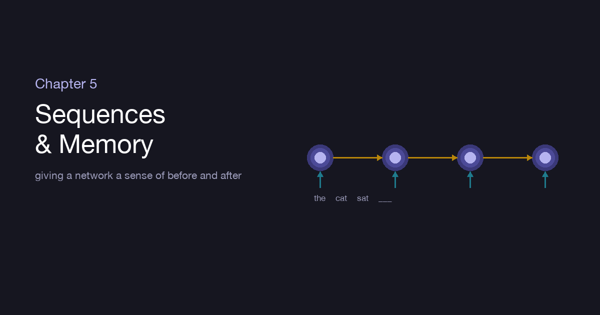
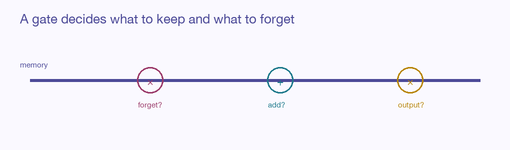

::: {.explainer-body}

{.xpl-fig}

::: {.xpl-lead}
"The cat sat on the ___." You finished that sentence before you finished reading it, because the words that came before told you what should come next. Meaning, in language and in time, is not in any single piece — it is in the order. The networks of the last chapter saw an image all at once, every pixel present together. But a sentence arrives one word at a time, and what came earlier changes everything. This chapter is about giving a network memory.
:::

## Why images and sentences need different machines

A convolutional network is built for things laid out in *space* — a grid where everything exists simultaneously. But a sentence, a melody, a stock price, a heartbeat — these unfold in *time*. They arrive in order, they vary in length, and crucially, each piece depends on what came before. "Bank" means one thing after "river" and another after "money." To understand the third word you must remember the first two.

A plain network has no such memory. Show it one word and it has already forgotten the last. We need an architecture that carries something forward — a thread of context that travels from each step to the next.

::: {.xpl-key}
**Key idea:** To understand a sequence, a network needs a memory — a running summary of everything it has seen so far, updated with each new piece.
:::

## The recurrent network: a loop through time

The **recurrent neural network** (RNN) answers this with one elegant move: it reads the sequence one step at a time, and at each step it keeps a **hidden state** — a small bundle of numbers that is its memory of the story so far. For each new input, it combines that input with its current memory to produce both an output *and* an updated memory to carry to the next step.

It is the same little network applied over and over, with the past threaded through it. Read "the," update memory. Read "cat," fold it into memory. Read "sat," and now the memory holds a compressed sense of "the cat sat" — enough to guess what follows. If you "unroll" the loop across the sentence, it looks like a chain of copies of one cell, each passing its memory hand to hand down the line.

::: {.callout-note}
The remarkable economy: it's *one* set of weights, reused at every time step — just as a CNN reused one filter across space, an RNN reuses one cell across time. Length stops mattering; the same machine handles three words or three hundred.
:::

## The problem: memory that fades

The simple RNN has a heartbreaking flaw. That thread of memory gets passed, and re-mixed, and re-passed at every step — and over a long sequence, the early signal washes out. By the time the network reaches the end of a long paragraph, the subject from the opening sentence has faded to almost nothing. This is the **vanishing gradient** from Chapter 2, wearing a new costume: blame (and memory) travelling back through many steps shrinks toward zero, so the network simply cannot learn long-range connections. It remembers the recent past vividly and the distant past not at all.

For "the cat sat on the ___," recent memory is enough. For "I grew up in France… *[forty words]* …so I speak fluent ___," you need to reach all the way back — and a plain RNN can't.

## The LSTM: a memory with gates

The fix, and one of the most beautiful ideas in the field, is the **Long Short-Term Memory** network — the LSTM. It adds to the running memory a set of small, learnable **gates** that decide, at each step, what to do with that memory.

{.xpl-fig}

Think of a conveyor belt of memory running straight through time, barely disturbed — and three gates leaning over it:

- A **forget gate** decides what to wipe from memory (the old subject, now that a new one arrived).
- An **input gate** decides what new information is worth writing onto the belt.
- An **output gate** decides what part of the memory to actually use right now.

Because the memory belt runs through with only gentle, gated edits — not a full re-mixing at every step — information can ride it across hundreds of steps without fading. The network *learns* what to remember and what to let go. "France," written onto the belt early, can survive untouched until "I speak fluent" finally reaches back for it and answers "French." The **GRU** is a streamlined cousin with fewer gates that often works just as well for less cost.

::: {.xpl-key}
**Key idea:** The LSTM doesn't just have memory — it has *control* over its memory. Learnable gates let it deliberately keep what matters and discard what doesn't, defeating the fade.
:::

## Reading both ways, and stacking deep

Two refinements squeeze more from the idea. A **bidirectional** RNN reads the sequence forward *and* backward, then combines both — because sometimes a word's meaning depends on what comes *after* it, not just before. And as with every architecture in this guide, you can **stack** recurrent layers, each reading the sequence of states produced by the one below, building richer understanding with depth.

## Sequence to sequence: in one language, out another

The real payoff is **encoder–decoder** architectures. One RNN (the *encoder*) reads an entire input sequence and compresses it into a memory — a single dense summary of its meaning. A second RNN (the *decoder*) takes that summary and unrolls it into a brand-new sequence: a translation, a summary, a reply. Read English, distil to meaning, emit French. This single shape powered the first wave of machine translation, summarisation, and chatbots.

But it had a bottleneck — *everything* the encoder read had to squeeze through one fixed-size memory. For a long sentence, that's like reading a whole paragraph and then translating it from a single sticky note. The decoder, reaching for a word, often wished it could glance back at the *specific* input words that mattered, instead of relying on one blurry summary.

That wish — *let me look back at the parts that matter* — is exactly what the next idea grants. It is called attention, and it changed everything.

## Where we've arrived

A recurrent network gives a model memory by threading a hidden state through time, reusing one cell at every step. Simple RNNs forget the distant past, so the LSTM adds gates — forget, input, output — that let the network deliberately keep what matters across long spans. Stacked and made bidirectional, wired into encoder–decoder pairs, these models gave machines their first real fluency with language and time.

And yet the bottleneck remained: one summary, holding everything. Chapter 6 is the story of the idea that broke it open — **attention**, and the Transformer it gave birth to.

## Going deeper

- [Understanding LSTM Networks — Christopher Olah](https://colah.github.io/posts/2015-08-Understanding-LSTMs/)
- [The Unreasonable Effectiveness of RNNs — Andrej Karpathy](https://karpathy.github.io/2015/05/21/rnn-effectiveness/)

::: {.xpl-nav}
[← Chapter 4](../04-cnns/)
[Back to the Guide →](../../ml-guide.html)
:::

*Written from scratch in my own words; part of an original ML guide.*

:::
