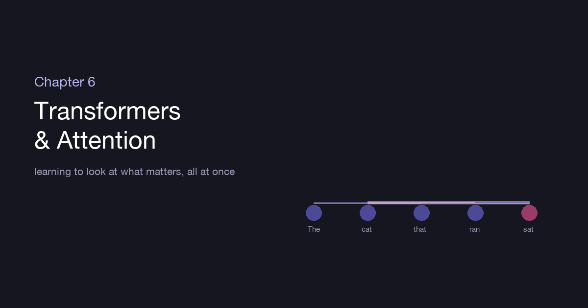
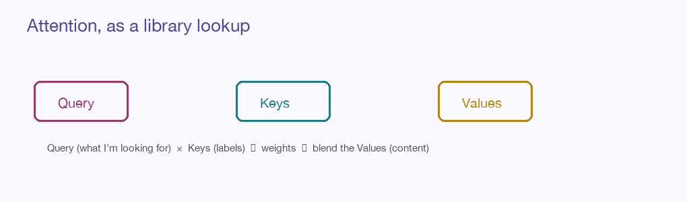

::: {.explainer-body}

{.xpl-fig}

::: {.xpl-lead}
The last chapter ended on a wish: a decoder, reaching for the next word, wishing it could glance back at the *specific* earlier words that mattered instead of leaning on one blurry summary. This chapter is the story of granting that wish — an idea so good it didn't just improve sequence models, it replaced them. Attention is how a network learns to look, at every moment, at exactly the parts that matter. And the architecture built entirely from it — the Transformer — is the engine under nearly every AI you've heard of.
:::

## The bottleneck that had to break

Recall the problem. A recurrent encoder read a whole sentence and crushed it into one fixed-size memory, which the decoder then had to work from. For a short phrase, fine. For a long passage, it was like being asked to translate a paragraph after glimpsing it once and keeping only a sticky note. The information was there; the channel to reach it was too narrow.

And recurrence carried a second, quieter cost: it was *sequential by nature*. Each step needed the memory from the step before, so you couldn't compute them together — you had to march through the sentence one word at a time. On modern hardware built to do thousands of things at once, that march was a waste.

::: {.xpl-key}
**Key idea:** What if, instead of squeezing everything through one memory and marching word by word, every word could look directly at every other word — all at the same time?
:::

## Attention: a weighted glance

**Attention** is that idea, and at heart it is simple. For each word, the network asks: *of all the other words here, which ones matter to me right now, and how much?* It then builds that word's new understanding as a **weighted blend** of the others — paying lots of attention to the relevant ones, little to the rest.

In "the cat that ran *sat*," the word "sat" needs to know *who* sat. It looks across the sentence, finds "cat" highly relevant, "ran" and "the" less so, and pulls mostly from "cat" to inform itself. No fixed summary, no fading memory — a direct, learned glance from any word to any other, however far apart.

## Queries, keys, and values

How does a word decide what's relevant? Through a mechanism that works like a library lookup. Each word produces three things:

{.xpl-fig}

- A **query** — what this word is looking for.
- A **key** — a label advertising what this word offers.
- A **value** — the actual content this word will hand over.

To figure out how much word A should attend to word B, you compare A's *query* against B's *key* — and that comparison is just a [dot product](../../ml-simplified.html), the same "how aligned are these?" measure from the very first chapter. High match, high attention. Those match-scores are softened into weights that sum to one, and the word's output becomes the weighted blend of everyone's *values*. Query finds, key matches, value delivers.

::: {.xpl-try}
**🎮 Attention scores are dot products of queries and keys — drag to feel "match"**

:::

## Many heads, many kinds of relevance

One attention computation learns one *kind* of relevance — maybe grammatical agreement. But language has many relationships at once: who-did-what, what-refers-to-what, tense, tone. So a Transformer runs **multiple attention "heads" in parallel**, each free to learn a different sort of connection, and merges their findings. One head might track subjects and verbs, another might link pronouns to the nouns they stand for. Together they see the sentence from many angles at once. This is **multi-head attention**, and it is where much of the richness lives.

## Order, restored

Attention has one curious blind spot: by looking at all words at once, it forgets their *order*. "Dog bites man" and "man bites dog" would look identical to pure attention — same words, same set. But order is meaning. So before the words enter, the Transformer stamps each with a **positional encoding** — a signature that marks where in the sequence it sits. Now attention can tell first from last, and "dog bites man" keeps its teeth in the right mouth.

::: {.callout-note}
The full Transformer block is attention followed by a small ordinary network, wrapped with the normalization and skip-connections from earlier chapters that keep deep stacks trainable. Stack dozens of these blocks and you have the body of a modern model.
:::

## Why this changed everything

The Transformer's two gifts were exactly the two wounds of recurrence. Because every word attends directly to every other, there is **no fading** — a connection across a hundred words is as easy as one across two. And because those attentions are computed all at once rather than marched through in order, training **parallelizes** beautifully across the very hardware built for it. Remove the sequential bottleneck and you can train on far more text, far faster — which is precisely what let models grow from millions of parameters to hundreds of billions.

That scaling is the whole story of the last few years. **BERT** read text in both directions to understand it deeply. The **GPT** family stacked Transformer decoders and learned to predict the next word over oceans of text, and discovered that a next-word predictor, made large enough, becomes something that can summarise, translate, reason, and converse. Every large language model you have used is, underneath, a tall stack of attention.

::: {.xpl-key}
**Key idea:** "Attention is all you need" turned out to be literally true — strip away recurrence entirely, build only from attention, and you get an architecture that both understands long contexts and scales to enormous size. That combination is what made modern AI.
:::

## Where we've arrived

Attention lets every element of a sequence look directly at every other and blend in what matters — queries seeking, keys matching, values delivering, all measured by the humble dot product. Multiple heads catch many kinds of relationship; positional encodings restore order; and because it all happens in parallel with no fading memory, the Transformer broke the bottleneck that held sequence models back. Made large, it became the foundation of the language-model era.

We have now built a network that can see and read and attend. The final chapter turns the machine around: instead of *recognising* the world, can it *create* — conjure an image that never existed, write a paragraph from nothing? That is generative modeling, and it is where we close.

## Going deeper

- [The Illustrated Transformer — Jay Alammar](https://jalammar.github.io/illustrated-transformer/)
- ["Attention Is All You Need" — Vaswani et al., 2017](https://arxiv.org/abs/1706.03762)

::: {.xpl-nav}
[← Chapter 5](../05-sequences-rnns/)
[Back to the Guide →](../../ml-guide.html)
:::

*Written from scratch in my own words; part of an original ML guide.*

:::
