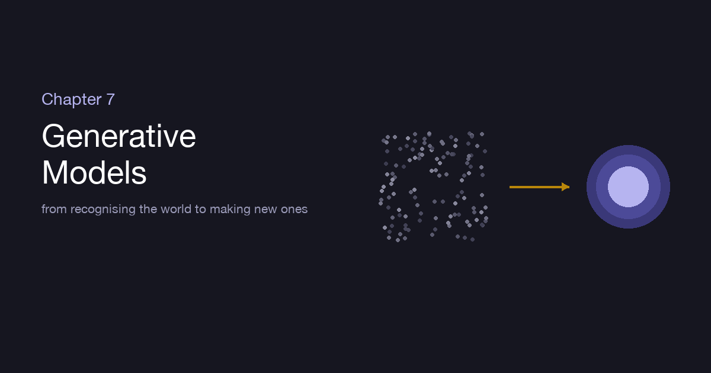
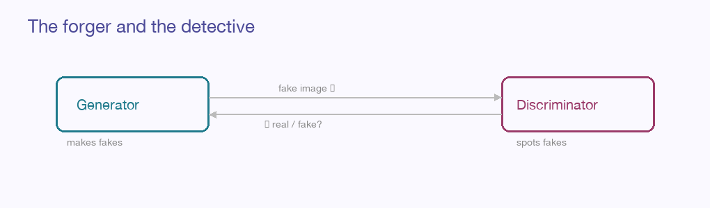

::: {.explainer-body}

{.xpl-fig}

::: {.xpl-lead}
Every chapter until now taught the machine to *recognise* — to look at the world and name what's there. This final chapter turns the machine around and asks the harder, stranger thing: not "what is this?" but "make me one that never existed." A face of no living person. A sentence no one has written. To create, a model can't just draw a line between cat and dog — it has to learn what cats *are*, deeply enough to dream new ones. This is generative modeling, and it is where the guide closes.
:::

## Two kinds of learning

There's a clean way to see the leap. Everything before this chapter was **discriminative** — the model learned the *boundary* between classes, enough to tell them apart. A generative model is more ambitious: it learns the *distribution* itself — the full shape of what real data looks like — so completely that it can sample brand-new points from inside it.

The difference is the difference between a critic and an artist. A critic only needs to judge. An artist needs to understand a thing well enough to produce a convincing new one. Generation demands the deeper grasp.

::: {.xpl-key}
**Key idea:** To generate convincingly, a model must learn not just where the line between things is, but what the things actually *are* — the whole landscape of the possible, dense where reality is common and empty where it isn't.
:::

## Autoencoders: learning by compressing

The gentlest doorway in is the **autoencoder**. Ask a network to do something that sounds pointless — take an image, squeeze it through a narrow middle, and rebuild the original on the other side. The trick is the squeeze. To reconstruct a face after forcing it through a bottleneck of just a few hundred numbers, the network must discover what *truly* matters about faces — pose, lighting, the essentials — and discard the rest. That compressed middle is a **latent space**: a small, dense map of meaning.

The **variational autoencoder** (VAE) makes this latent space smooth and well-organised — so that nearby points decode to similar images, and you can stroll through it. Pick a point you've never decoded, run it forward, and out comes a new face that never existed but plausibly could. Generation becomes a walk through a learned space of possibility.

## GANs: the forger and the detective

The idea that first made generated images breathtaking was a contest. A **Generative Adversarial Network** pits two networks against each other in a duel.

{.xpl-fig}

One, the **generator**, is a forger: it takes random noise and tries to paint a convincing fake. The other, the **discriminator**, is a detective: it's shown a mix of real images and the forger's fakes, and must call each one. They train together, locked in escalating rivalry. Every time the detective gets better at spotting fakes, the forger is forced to forge better; every time the forger improves, the detective must sharpen too. Push this arms race long enough and the generator produces images so convincing the detective can do no better than a coin flip — and those images are your output.

It's a beautiful, unstable dance — GANs are famously temperamental to train — but at their peak they gave us the first photorealistic faces of people who don't exist. **DCGAN** made it stable, **StyleGAN** made it stunning, **CycleGAN** learned to turn horses into zebras and summer into winter without ever being shown a matched pair.

## Diffusion: sculpting order from noise

The approach behind today's most striking image models is stranger and, in hindsight, deceptively simple. **Diffusion models** learn by *destruction first*. Take a real image and add a little noise, then a little more, and more, step by step, until it's pure static — every trace of the original gone. Now train a network to undo a single step of that: given a slightly noisy image, predict the slightly cleaner one beneath.

Master that one humble skill — *remove a little noise* — and you can generate from nothing. Start with a field of pure random static and apply the network over and over, each pass lifting away a little noise, and an image slowly *emerges* from the chaos like a photograph developing, or a sculptor freeing a shape from marble. Guide the process with a text prompt and the noise resolves into exactly what you asked for. This patient, step-by-step sculpting is what powers the image generators that startled the world.

::: {.xpl-key}
**Key idea:** Diffusion doesn't paint an image in one bold stroke. It learns the tiny act of cleaning noise, then repeats it dozens of times — and from that modest, repeated move, whole worlds appear.
:::

## The generative language model

And then there is the kind of generation you've spoken to. Recall from Chapter 6 the Transformer trained to do one plain thing: **predict the next word.** Show it "the cat sat on the," ask for what follows, nudge it toward "mat." Do this across a meaningful slice of everything humans have written, with a model large enough, and something unreasonable happens. A machine that only ever learned to guess the next word turns out to have absorbed grammar, facts, reasoning patterns, styles, the rhythm of argument — because predicting the next word *well enough*, over text that rich, secretly requires understanding all of it.

To generate, it simply predicts a word, appends it, and predicts again — each answer becoming part of the question for the next. One word at a time, a coherent paragraph assembles itself. That is the whole mechanism behind the large language models of this era: not a database of answers, but a next-word predictor so well-trained that fluent, useful language falls out of it.

::: {.callout-note}
This is why these models *generate* rather than *retrieve* — each word is freshly predicted in the context of all the words before it, including the ones the model itself just wrote. It is composing, not looking up.
:::

## The whole arc, in one breath

Step back and look at the journey. We began with a single neuron taking a weighted vote, and a function with dials we turned downhill until it stopped being wrong (**Ch. 1**). We learned to take that walk well — batches, learning rates, optimizers, the craft of training (**Ch. 2**) — and to do it *honestly*, measuring on unseen data and pressing toward simplicity so the model learned the world and not the worksheet (**Ch. 3**). Then we gave the network senses: eyes that see by looking locally and sharing what they learn (**Ch. 4**), memory that threads through time (**Ch. 5**), and attention that lets it look at everything that matters at once (**Ch. 6**). And here, at the end, we turned it from a recogniser into a maker (**Ch. 7**).

It is, remarkably, one idea the whole way down — a function with dials, a measure of being wrong, and the patience to descend. Everything else is arrangement: how you wire the neurons, what you show them, and what you ask them to become. From that single, stubborn loop comes vision, language, memory, and creation. That is machine learning — not magic, but something better: a simple thing, understood deeply, repeated at scale until it astonishes.

Thank you for reading to the end. Go build something.

## Going deeper

- [Lil'Log — What are Diffusion Models?](https://lilianweng.github.io/posts/2021-07-11-diffusion-models/)
- [The AI & ML Encyclopedia on this site](../../ai-ml-encyclopedia.html) — the math beneath all of it, with live interactive demos.

::: {.xpl-nav}
[← Chapter 6](../06-transformers/)
[Back to the Guide →](../../ml-guide.html)
:::

*Written from scratch in my own words; the closing chapter of an original ML guide.*

:::
