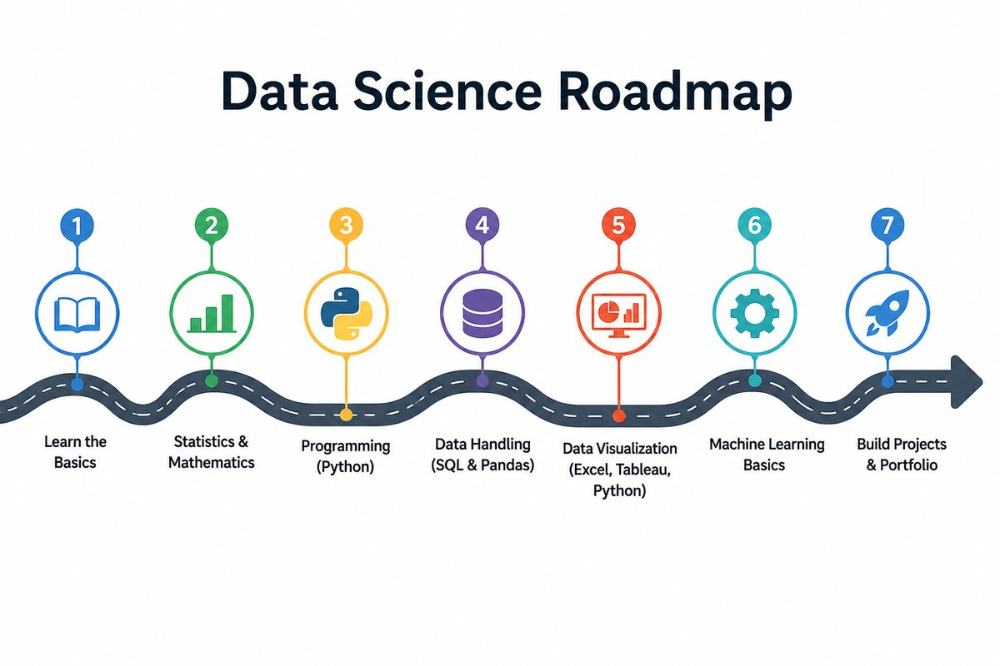

{fig-align="center" width="100%"}

## What it is

An open-source self-study course that walks from `print("hello")` through working transformers, diffusion models, RAG pipelines, and production LLM workflows. **31 deep-dive Jupyter notebooks**, every one runnable in Google Colab in one click, organised into six parts so concepts compound module to module.

The course is built around the principle that learning lands when you can **read it, run it, edit it, and re-run it**. Every concept arrives as runnable code first, with a short companion explanation of *why it works that way* — no videos to scrub through, no graded quizzes, no paywalls.

## Why I built it

Most "learn data science" tracks fail in one of two predictable ways:

- They split material across three or four separate paid courses (statistics, then Python, then ML, then "AI") that don't talk to each other and leave you patching gaps for months.
- Or they jump from `print("hello world")` straight to a Kaggle notebook with no in-between, leaving anyone who's not already comfortable in Python stranded.

This repo is the **in-between** — one continuous path, free, with the modern AI track that working ML engineers actually need (RAG, fine-tuning, MLOps, evals) included rather than punted to a separate "advanced" course.

## Course structure

| Part | Track | Modules |
|---|---|---|
| 1 | Python for Data Science | 01 → 05 |
| 2 | Data Visualization | 06 → 10 |
| 3 | Data Analysis & ML Foundations | 11 → 16 |
| 4 | Machine Learning & AI (deeper dive) | 17 → 22 |
| 5 | AI-Research Foundations | 23 → 25 |
| 6 | Practitioner Skills | 26 → 31 |

### Part 1 — Python for Data Science (M01-05)
Variables, data structures, OOP, file I/O, NumPy, Pandas, APIs, web scraping. The alphabet of every later module.

### Part 2 — Data Visualization (M06-10)
Matplotlib's object-oriented API, the seven core chart types, specialised viz (waffle, word cloud, Folium maps), animation and Plotly, and dashboards that tell one cohesive story.

### Part 3 — Data Analysis & ML Foundations (M11-16)
The universal data-science workflow — import → wrangle → explore → model → evaluate → communicate — built around a shared dataset (auto-mpg) so each module compounds on the last. The capstone (M16) deliberately switches to California Housing to prove the workflow generalises end-to-end.

### Part 4 — Machine Learning & AI (M17-22)
PyTorch fundamentals; the six core model archetypes (Linear, Logistic, K-Means, MLP, CNN, Transformer LM); self-attention implemented from scratch with `d_model = 2` so every matrix is hand-checkable; multi-head + causal attention; diffusion models on a 2D toy; time-series forecasting with ARIMA, Prophet, and LSTM.

### Part 5 — AI-Research Foundations (M23-25)
The math under every neural network (functions, derivatives, gradients, matrices, probability) integrated with the code, a deep PyTorch primer, a guided dissection of **DeepSeek-V3's actual inference code** (RMSNorm, RoPE, Multi-Latent Attention, Mixture-of-Experts), and worked fine-tuning examples — full fine-tuning, **LoRA**, **QLoRA**, and SFT with TRL.

### Part 6 — Practitioner Skills (M26-31)
The day-to-day skills working data scientists and ML engineers use but most courses skip:

- **SQL** — JOINs, CTEs, window functions, the SQL ↔ Pandas bridge
- **Tree-based models** — Random Forest, **XGBoost**, **LightGBM**, **SHAP** for interpretation
- **A/B testing** — proportion z-test, sample-size calc, Bonferroni / BH correction, the peeking trap
- **MLOps** — FastAPI, Docker, **MLflow**, drift monitoring with KS + PSI
- **RAG & vector search** — embeddings, Chroma, hybrid BM25 + vector, reranker, grounded answers
- **Prompt engineering & LLM eval** — few-shot, chain-of-thought, ReAct, structured outputs, LLM-as-judge

## What makes it different

|  | This course | Typical course |
|---|---|---|
| **Production architecture depth** | DeepSeek-V3 inference dissection | "Transformers exist" |
| **Math integrated with code** | Yes, in Module 23 | usually skipped or paywalled |
| **Practical skills (SQL, A/B, MLOps)** | Modules 26–29 | rarely covered |
| **Companion docs** | Line-by-line, colour-coded, ~30 pages each | None |
| **Cost** | Free, MIT-licensed | $40–300/month |

## Audience

- **Beginners** who want a structured path from "what is a variable" to a working ML model — without paying for a Coursera certificate.
- **Self-taught coders** filling gaps in Pandas, NumPy, and scikit-learn — and reaching beyond into PyTorch, transformers, and RAG.
- **Career-switchers** building a portfolio. The capstone (Module 16) and the production modules (M29-31) are portfolio-ready as-is.

## What you can do at the end

After the 31 modules you can:

- Write any Python program and load data from any source (CSV / Excel / JSON / SQL / API / scraped HTML).
- Clean, explore, visualise, and communicate findings on real datasets.
- Build classical ML models (regression, gradient boosting) AND modern AI models (transformers, diffusion).
- Read production LLM source code (DeepSeek, Llama, Mistral, Qwen) and recognise every architectural piece.
- Fine-tune any open-weight model on your own data with LoRA / QLoRA.
- Ship a model behind FastAPI + Docker with MLflow tracking.
- Build a working RAG pipeline with vector search and grounded answers.
- A/B-test prompts and evaluate LLMs scientifically.

That's effectively a 2026 ML-engineer career, built up step by step from `print('hello')`.

## How to use it

**Option A — Colab (zero install).** Click any Colab badge in the [README](https://github.com/kader-xai/data-science-roadmap), hit **File → Save a copy in Drive**, run the cells.

**Option B — Locally.**

```bash
git clone https://github.com/kader-xai/data-science-roadmap.git
cd data-science-roadmap
pip install jupyter numpy pandas scikit-learn torch transformers
jupyter notebook
```

## Tech stack

- **Language** — Python 3.10+
- **Core libraries** — NumPy, Pandas, scikit-learn, Matplotlib, Plotly
- **Deep learning** — PyTorch, Hugging Face Transformers, PEFT, TRL
- **Production track** — FastAPI, Docker, MLflow
- **Retrieval & LLM track** — Chroma, BM25, BGE embeddings, Ollama
- **Statistics & boosting** — SciPy, XGBoost, LightGBM, SHAP
- **Format** — Jupyter notebooks (one per module) + companion Markdown explanation docs

## Links

- 💻 **Repo:** [github.com/kader-xai/data-science-roadmap](https://github.com/kader-xai/data-science-roadmap)
- 🌐 **Live course site:** [kader-xai.github.io/data-science-roadmap](https://kader-xai.github.io/data-science-roadmap/)
- ▶️ **Start with Module 1 in Colab:** [open notebook](https://colab.research.google.com/github/kader-xai/data-science-roadmap/blob/main/module_01_python_basics.ipynb)
- 📝 **Blog write-up:** [Data Science Roadmap — From print('hello') to Production LLMs](../../blog/2025-09-01-data-science-roadmap/)
- 📦 **Related project:** [Employee Recall — LoRA + RAG](../2025-employee-recall/)
- 📜 **License:** MIT
